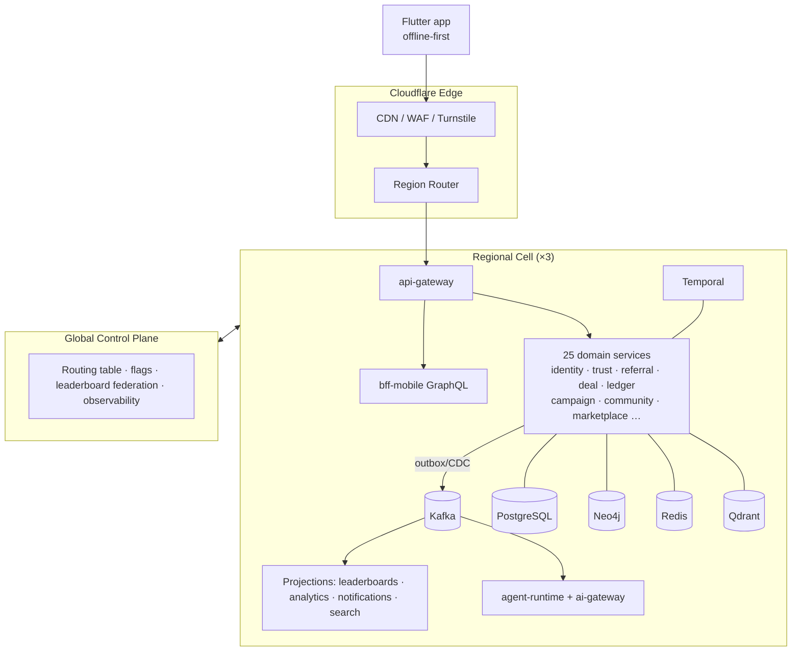

# TrustOS — Executive Design Overview

> **TrustOS: The AI Relationship Intelligence Platform.**
> The operating system for human relationships — designed for 100M users across 100 countries.

This document is the synthesis layer: the thesis, the hardest design problems and how the architecture answers them, the binding decisions, and the honest risk register. Everything here is expanded in the numbered documents (see `README.md` for the map). Canonical, binding decisions live in [`_shared-context.md`](_shared-context.md).

---

## 1. The Thesis

Every large social platform optimizes attention. Attention is abundant, adversarial, and monetized against the user. **Trust is scarce, compounding, and monetized *for* the user** — a trusted introduction converts at 10–30× a cold outreach, and referral-driven revenue is the lifeblood of the world's ~400M SMBs, almost none of whom have tooling for it beyond a WhatsApp group and a memory.

TrustOS makes the invisible asset — a person's relationship capital — **measurable (Digital Trust Index), navigable (the Trust Graph), and liquid (the Referral Marketplace and Deal Engine)**. AI is the labor layer: it maintains relationships, drafts outreach, spots matches, and tracks value exchange so the human only does the genuinely human part — showing up.

The wedge is deliberate: **structured referral communities (BNI-style chapters) in India first.** They already have the behavior (weekly referral exchange, tracked "thank-you for closed business"), they suffer the tooling gap most acutely, and India gives us WhatsApp-native users, GST-based business verification, and UPI-linked deal confirmation. We digitize an existing trust ritual before asking anyone to adopt a new one. From that beachhead: adjacent SMB networks → professional networkers globally → trust as portable infrastructure (the long game).

## 2. Where the Brief Was Challenged

A design team's first job is to attack its own brief. Four assumptions were materially revised:

1. **"Trust should never be manipulated" → trust must be *manipulation-resistant and contestable*.** A score that "never" moves wrongly is impossible; a score users can't appeal is a liability (and under GDPR/DPDP, algorithmic profiling demands contestability). The design answers with an append-only `trust_factor_ledger`, full factor-level explainability ("your score moved −12 because…"), graph-based collusion damping, rate-limited score movement, and a human appeal workflow. See `06-algorithms.md` §1 and the DPIA in `11-security-architecture.md`.

2. **E2E encryption vs. an AI that reads everything.** The brief demands both E2EE and AI analysis of communications — these are in direct tension. Resolution: true E2EE for user↔user DMs (excluded from server-side AI by default, opt-in consented processing only); transport + at-rest + field-level encryption everywhere else. Pretending otherwise would be security theater. See `11-security-architecture.md` §4.

3. **Gamification vs. trust integrity.** Coins, XP, and leaderboards create exactly the incentive gradients that corrupt reputation systems. The design firewalls them: gamification signals can influence at most the community-contribution component (10%) of DTI; business leaderboards count only ledger-verified value; no purchasable path touches trust. See `06-algorithms.md` §6.

4. **100 countries is a data-residency problem before it is a scaling problem.** Hence cell-based architecture with a home region per user from day one — retrofitting residency onto a global monolith at 10M users is a rewrite. See `02-system-architecture.md` §4.

## 3. The Five Hardest Problems & the Architecture's Answers

| Hard problem | Answer |
|---|---|
| **Trust that can't be gamed** | Multi-source score (9 weighted components, economically-verified signals weighted highest), Wilson smoothing, time decay, Neo4j GDS collusion detection, velocity caps, append-only factor ledger, shadow-scored weight changes |
| **Cold start / graph liquidity** | Import-first onboarding (value from *your own* contacts before any network exists), community-wedge GTM (import whole BNI-style chapters, not individuals), single-player AI utility (copilot, automations) that works at n=1 |
| **Cross-service consistency at 100M** | Event-driven core: transactional outbox + Debezium + Kafka, idempotent consumers, Temporal sagas for money/referral flows, event-sourced double-entry ledger as the single source of financial truth |
| **AI at consumer scale without ruinous cost** | Single `ai-gateway` choke point: model tiering (haiku-class for classification, sonnet-class default, deep reasoning only where it pays), semantic caching, per-feature budgets, prompt registry with eval gates |
| **One codebase, 100 countries** | Cells with data residency, PPP-adjusted pricing, prompt-level locale adaptation, per-country channel compliance (WhatsApp templates, DND, festival calendars) baked into the automation engine — not bolted on |

## 4. Architecture at a Glance

- **25 microservices** across 9 bounded contexts (canonical registry in `_shared-context.md` §2), database-per-service, gRPC internal, REST external, GraphQL BFF for mobile aggregate reads.
- **Event backbone:** Kafka + Protobuf + schema registry; every state change flows through the outbox; projections (leaderboards, trust, analytics, notifications) are consumers. No service touches another's database, ever.
- **Polyglot persistence, each store doing what it's for:** PostgreSQL (systems of record), Neo4j (the relationship graph — the system of *insight*), Qdrant (embeddings/RAG), Redis (leaderboards, sessions, limits), ClickHouse (analytics), Temporal (everything long-running).
- **AI-native:** 8 domain agents on a shared runtime (memory + tools + RAG + guardrails + feedback loops) behind one governed gateway; prompts are versioned, eval-gated deployable artifacts.
- **Mobile-first:** Flutter + Riverpod, offline-first with Drift and a per-entity-class conflict policy (never optimistic on money), feature-first Clean Architecture mirroring the backend's bounded contexts.
- **Zero-trust security:** OIDC + device-bound rotating tokens, Cerbos ABAC, envelope encryption with crypto-shredding for erasure, hash-chained audit logs, mTLS mesh.
- **Cell-based multi-region on EKS**, GitOps (ArgoCD) with canary rollouts, full OTel observability, SLO-driven operations.

## 5. Top Risks (Honest Register)

| # | Risk | Sev | Mitigation |
|---|---|---|---|
| 1 | Referral marketplace liquidity fails (campaigns without referrers, or vice versa) | Critical | Community-wedge GTM seeds both sides at once; single-player value independent of liquidity |
| 2 | Trust score causes social harm / reputational disputes / regulatory action | Critical | Explainability + appeals, no public shaming (bands not raw ranks publicly), DPIA, human review, conservative score velocity |
| 3 | WhatsApp platform dependency (policy change or ban kills the channel) | High | channel-service abstraction over 5 channels; owned channels (push, in-app, email) always first-class |
| 4 | AI cost blows unit economics at scale | High | Gateway budgets per feature, tiering, caching; cost model + levers in `12-devops-platform.md` §7 |
| 5 | Contact-import privacy backlash ("you uploaded my number without consent") | High | Purpose-limited processing, hashed matching, non-user contact data minimization, regional consent flows |
| 6 | Collusion farms industrialize trust manipulation | High | GDS ring detection, device/payment fingerprinting, economic verification weighting, red-team program |
| 7 | 25 services is too much surface for a small early team | Medium | Deployment-consolidation plan pre-1M users (documented merges in `03-backend-architecture.md`) without violating logical boundaries |
| 8 | Gamification degrades the "trusted professional" brand feel | Medium | Design language keeps trust surfaces calm/verified; game mechanics confined to community surfaces |

## 6. Deliverables Map

All 35 requested deliverables are covered across `01`–`14`; the index with per-deliverable pointers is in [`README.md`](README.md).
