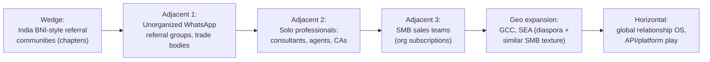
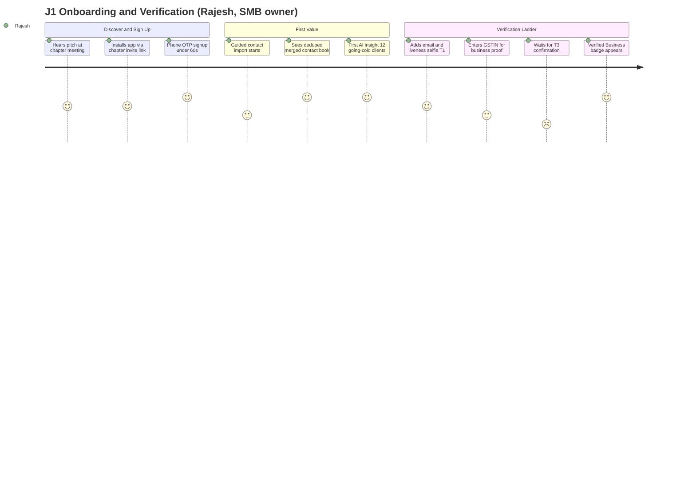
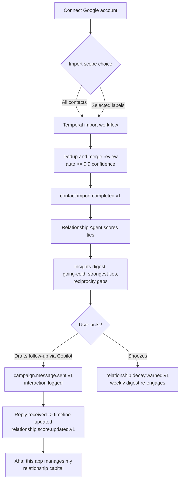
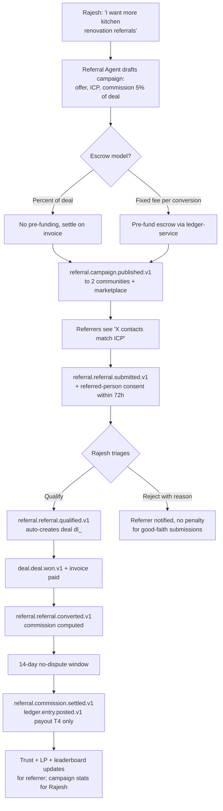
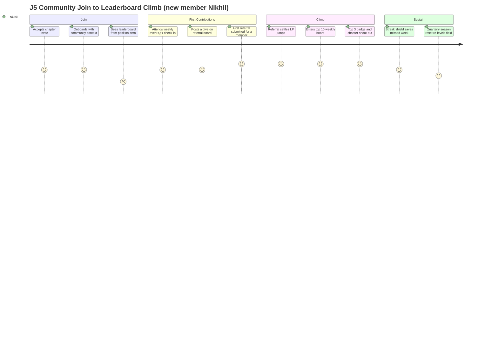
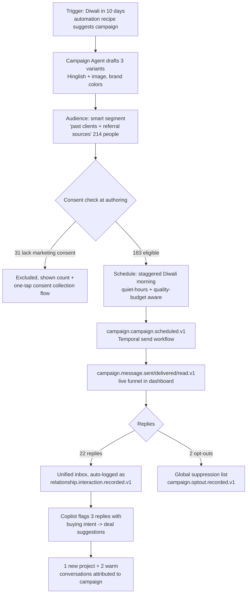
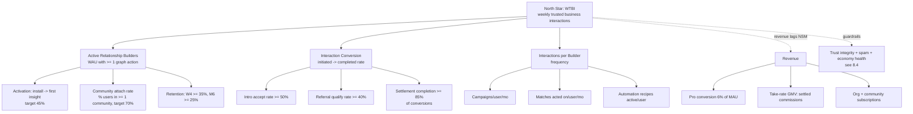
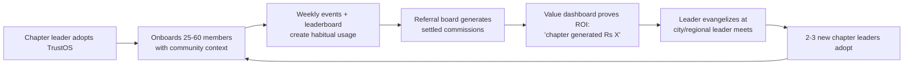

# TrustOS — Product Requirements Document (PRD)

| Field | Value |
|---|---|
| Document | `01-prd.md` |
| Status | Approved for architecture ( feeds `02-system-architecture.md`) |
| Owners | Principal PM (product), Growth PM (loops, monetization, metrics) |
| Binding inputs | `_brief.md` (requirements), `_shared-context.md` (canonical architecture, event taxonomy, DTI model) |
| Sibling docs | `02-system-architecture.md`, `05-data-architecture.md`, `04-api-design.md`, `11-security-architecture.md`, `06-algorithms.md`, `07-ai-architecture.md`, `09-mobile-architecture.md`, `12-devops-platform.md`, `12-devops-platform.md` |

---

## Table of Contents

1. [Vision, Positioning & Thesis (with Honest Critique)](#1-vision-positioning--thesis)
2. [Market & Competitive Landscape](#2-market--competitive-landscape)
3. [Personas & Jobs-to-be-Done](#3-personas--jobs-to-be-done)
4. [Module-by-Module Functional Requirements](#4-module-by-module-functional-requirements)
5. [User Journey Maps](#5-user-journey-maps)
6. [Business Rules Catalog](#6-business-rules-catalog)
7. [Monetization & Pricing](#7-monetization--pricing)
8. [North-Star Metric, Metric Tree & Growth Loops](#8-north-star-metric-metric-tree--growth-loops)
9. [Launch Phasing & Rollout](#9-launch-phasing--rollout)
10. [Top 10 Product Risks](#10-top-10-product-risks)
11. [Assumptions Register](#11-assumptions-register)

---

## 1. Vision, Positioning & Thesis

### 1.1 Vision

**TrustOS is the operating system for human relationships.** Where LinkedIn indexes *who you know* and CRMs index *what you sold*, TrustOS indexes — and actively grows — *who trusts you, how much, and what that trust is economically worth*.

The product thesis in one sentence: **business flows through trust, and trust today is invisible, unportable, and unmanaged. TrustOS makes it visible (Digital Trust Index), portable (verified identity + trust graph), and productive (referrals, intros, deals, communities).**

Positioning statement:

> For relationship-driven professionals and SMBs — starting with India's referral-community economy — TrustOS is the AI relationship intelligence platform that turns your network into measurable revenue, unlike LinkedIn (attention-optimized), CRMs (pipeline-only, no network), or offline networking groups (no data, no scale).

### 1.2 The "Operating System" Thesis, Decomposed

An OS provides: identity, resource management, a scheduler, an app ecosystem, and primitives others build on. TrustOS maps:

| OS concept | TrustOS analogue | Module(s) |
|---|---|---|
| Identity & permissions | Verified identity, trust tiers, RBAC/ABAC | 1 (Identity), Trust bands |
| Filesystem | Relationship graph + interaction timeline | 2 (Relationship Intelligence) |
| Scheduler | Automations, follow-ups, journeys | 15 (Automation Engine) |
| Inter-process communication | Intros, referrals, campaigns | 4, 5, 6 |
| Currency/resources | Coins, XP, commissions via `ledger-service` | 10, 12 |
| App ecosystem | Marketplace, communities, knowledge | 7, 8, 9 |
| Kernel telemetry | Analytics, DTI | 3, 14 |

### 1.3 Honest Critique — Weak Assumptions in the Brief, and Design Mitigations

The brief is ambitious and directionally right. A principal-level PRD must also say where it is fragile. We identified seven weak assumptions and designed around each:

**C1. Cold-start / network-effects chicken-and-egg.**
*Weak assumption:* "trust graph + referral marketplace" implies value only appears when many users exist. A marketplace with no counterparties and a trust score with no signals is a dead product on day 1.
*Mitigation (design principle P1 — single-player first):* Modules 2 (Relationship Intelligence), 6 (Campaign Engine), 13 (AI Copilot), and 15 (Automation) deliver value to a user with **zero** other TrustOS users: import contacts, get AI relationship insights, run WhatsApp/email campaigns, automate follow-ups. Network features (matching, referrals, leaderboards) unlock progressively as density appears. We seed density by onboarding **whole communities** (BNI-style chapters of 25–60 members) rather than individuals — every activation brings its own counterparties. Success criterion: a solo user must reach an "aha" (first AI relationship insight + first campaign sent) within 20 minutes with no other users present.

**C2. Trust-score social risk (the "social credit" problem).**
*Weak assumption:* a public 0–1000 score on humans is treated as purely positive. Public numeric scoring of people invites humiliation, discrimination, gaming-as-status, and regulatory attention (EU AI Act treats social scoring as high-risk/prohibited in some framings).
*Mitigation:* DTI is **private-by-default and business-context-scoped**. Others see only the **trust band** (Starter/Bronze/Silver/Gold/Platinum, per `_shared-context.md` §4), never the number, and only in business surfaces (marketplace listings, referral campaigns, intro cards) — never on general profiles unless the user opts in. DTI scores nothing about protected attributes, personal life, or content opinions; every factor is auditable via the `trust_factor_ledger` and users get a "why is my score X" explanation and an appeal path (BR-010–BR-016). DTI never gates access to *communication with your own contacts* — only to *platform-amplified reach*.

**C3. Referral marketplace liquidity.**
*Weak assumption:* businesses will post campaigns and referrers will show up. Two-sided marketplaces fail on liquidity, not features.
*Mitigation:* launch the marketplace **curated and community-anchored**: campaigns are first published *inside* communities (referral boards, Module 7) where members already exchange referrals offline — we digitize an existing behavior instead of creating a new one. Open cross-community marketplace unlocks per-city only after a liquidity gate (≥ 50 active campaigns AND ≥ 500 monthly referral submissions in that city; see §9). Category focus at launch: 8 high-referral-velocity SMB categories (insurance, real estate, CA/accounting, interior design, IT services, travel, wellness, legal).

**C4. WhatsApp platform dependency.**
*Weak assumption:* WhatsApp is treated as a free-forever, always-available channel. Reality: Meta controls pricing (per-conversation fees), template approval, and quality ratings; one policy change can kneecap the Campaign Engine.
*Mitigation:* `channel-service` is a **channel-agnostic abstraction** (WhatsApp Cloud API, SES email, SMS, LinkedIn, Telegram, plus in-app inbox as the owned channel of last resort). Every campaign is authored channel-neutral and rendered per channel. WhatsApp quality-rating is treated as a budgeted resource (quality budget system, BR-040–BR-043): sends throttle automatically when quality rating drops, protecting the sender number. Meta pricing changes are absorbed via pass-through channel fees, not eaten by our margin. Long-term hedge: in-app inbox + push become the default for user↔user messages so the highest-value flows (intros, referral updates) never depend on Meta.

**C5. "Trust rises AND falls" without user revolt.**
*Weak assumption:* users will accept score decreases. In practice, visible losses cause churn and support storms.
*Mitigation:* decay and penalties are smoothed (EWMA, 180-day half-life per shared context), pre-notified ("your responsiveness factor will decay next week — 2 pending intros await reply"), and always actionable (every decrease ships with a recovery suggestion from the Trust Agent). Fraud penalties are the only sharp drops, and those are deliberate.

**C6. 15 modules at once = unfocused product.**
*Weak assumption:* all 15 modules are equally important at launch. They are not; shipping all at parity guarantees mediocrity everywhere.
*Mitigation:* modules are tiered — **Core** (1,2,3,6,15: identity, relationship intelligence, trust, campaigns, automation), **Network** (4,5,7,12: networking, referrals, communities, deals), **Ecosystem** (8,9,10,11,13,14 progressively). All 15 are specified in this PRD (§4) because architecture must accommodate them (see `02-system-architecture.md`), but GA order follows §9 phasing.

**C7. AI cost at 100M users.**
*Weak assumption:* "AI-native everything" ignores unit economics. LLM calls on every interaction at 100M users is a nine-figure annual bill.
*Mitigation:* ai-gateway routes by task value: `claude-haiku-4-5` for classification/scoring hints, `claude-sonnet-5` default for generation, deep-reasoning models only for paid/high-value flows; aggressive caching of embeddings and generated templates; AI credits meter consumption into pricing (§7.5). Target: AI cost ≤ 12% of revenue at scale, measured per-feature via ai-gateway cost attribution.

### 1.4 Product Principles

1. **P1 Single-player first** — every module must produce value for a user alone; network value is compounding, not prerequisite.
2. **P2 Trust is earned, explained, and appealable** — no black-box judgments about humans.
3. **P3 Money is sacred** — anything of monetary value moves only through `ledger-service` double-entry; coins and cash never mix (BR-020s).
4. **P4 Communities are the atomic growth unit** — we acquire chapters, not individuals.
5. **P5 Own the relationship record, rent the channels** — channel adapters are replaceable; the graph is not.
6. **P6 India-first, globally architected** — cell-based residency from day 1 (`ap-south-1` primary), so expansion is configuration, not re-architecture.

---

## 2. Market & Competitive Landscape

### 2.1 Market Sizing (assumptions stated)

| Segment | Basis | Estimate |
|---|---|---|
| India MSMEs | ~64M registered MSMEs; assume 8% are relationship-driven services businesses with smartphone-native owners | ~5M near-term addressable businesses |
| Organized referral networking (India) | BNI India ~1,200+ chapters × ~40 members + LionsClub/Rotary/JITO/industry bodies + informal WhatsApp referral groups (est. 10× the organized number) | ~2.5–3M professionals in active referral communities |
| Global comparable (BNI worldwide) | ~11,000 chapters, ~325k members, self-reported ~$25B in member referral business/yr | validates that referral value per engaged member ≈ $75k/yr — the monetizable behavior exists |
| Serviceable revenue pool (India, 5 yr) | 1M paying users × blended $60/yr + org subs + take-rate | $150–250M ARR India alone (assumption-heavy; sensitivity in `12-devops-platform.md`) |

### 2.2 Competitive Map

| Player | What they own | Why they don't win this market | What we take |
|---|---|---|---|
| **BNI** (and clones) | Structured referral behavior, chapter trust rituals, ~$700–1,000/yr member fees | Offline-only, no data layer, no cross-chapter graph, aging demographics, no AI, capped by physical meetings | Their *behavior model* (givers-gain, referral slips, one-to-ones) digitized; their members as beachhead users. TrustOS is not anti-BNI — chapter leaders are a persona (§3.2) and BNI-style orgs are Organizations in our tenancy model |
| **LinkedIn** | Professional identity graph, recruiting, content feed | Optimizes attention/engagement, not trust/transactions; no referral economics; weak in India SMB (English-first, white-collar); InMail ≠ warm intro | The *transaction layer* LinkedIn never built: verified referrals, commissions, deal tracking |
| **HubSpot / Zoho CRM** | Pipeline management, org workflows | Single-tenant view of relationships (my CRM ≠ your CRM), no cross-company trust graph, no referral marketplace, heavy for SMB owner-operators | The network layer above CRM. We integrate (contact import from CRM, deal export) rather than replace at first |
| **Circle / Skool / Discord** | Community software, creator monetization | Content-and-course centric; no identity verification, no trust scoring, no referral/deal rails; communities monetize attention, not member-to-member business | Business communities where the point is *commerce between members*, with rails they lack |
| **Referral tools (ReferralCandy, Rewardful, PartnerStack)** | E-commerce/SaaS affiliate mechanics | Anonymous link-based attribution, no human trust layer, B2C bias, no community context | Human-to-human referral where the referrer's reputation is the product |
| **WhatsApp Business / Meta ecosystem** | The channel itself | A pipe, not a system of record; no graph, no trust, no attribution | We are the intelligence layer over the pipe (and hedge per C4) |

### 2.3 The Wedge and Expansion Path



**Why this wedge is defensible:**
1. **Behavioral moat** — referral communities already *do* the core loop weekly, offline, with paper slips. We digitize with 10× convenience instead of teaching a new behavior.
2. **Data moat** — every referral, intro, and settled commission is a labeled edge in a trust graph nobody else has. DTI accuracy compounds with volume (see `06-algorithms.md`).
3. **Multi-tenant network lock-in** — a user's DTI and referral history are portable across communities and employers; leaving TrustOS means abandoning earned reputation.
4. **Incumbent blind spots** — LinkedIn can't do money movement in India SMB (compliance, UPI-native payouts, GST verification); BNI can't do software; CRMs can't do cross-company graphs without solving identity, which is our Module 1.

---

## 3. Personas & Jobs-to-be-Done

### 3.1 Persona P1 — **Rajesh, SMB Owner (Interior Design, Pune)**

- 42, runs a 9-person firm, ₹2.4 Cr annual revenue, 70% of business from referrals. Lives in WhatsApp; CRM is a spiral notebook + Excel. BNI member for 4 years.
- **JTBD:** *When a project ends, I want my happy client's network to know about me, so my pipeline never depends on paid ads I don't understand.*
- Jobs: (a) stay top-of-mind with 300+ past clients without feeling spammy; (b) know which contacts are going cold; (c) track referrals given/received so reciprocity is fair; (d) prove credibility to strangers fast.
- Success metric for him: 2 extra qualified referrals/month. Willingness to pay: ₹500–1,500/mo if it visibly generates business.
- Anxieties: complex software, English-heavy UIs, being scored publicly and looking bad.

### 3.2 Persona P2 — **Meera, Chapter Leader (BNI-style community, Bengaluru)**

- 38, runs an insurance agency; volunteers as chapter president for a 45-member group. Spends 6 hrs/week on attendance sheets, referral-slip tallies, guest invites, and WhatsApp admin.
- **JTBD:** *When my chapter meets weekly, I want member contribution to be visible and celebrated automatically, so the chapter grows and retains without me doing clerical work.*
- Jobs: (a) automate attendance/referral/thank-you-for-business tracking; (b) leaderboards that make givers feel seen; (c) recruit and vet guests; (d) show the chapter's economic output to justify membership fees.
- She is the **key to community-led acquisition (P4)** — one convinced Meera = 45 activated users.

### 3.3 Persona P3 — **Arjun, Freelance Consultant (Marketing, Remote/Gurgaon)**

- 29, solo GTM consultant, income lumpy, all clients from 2nd-degree intros. LinkedIn creator (8k followers) but posts → likes → nothing.
- **JTBD:** *When I finish a client engagement, I want warm intros to lookalike clients, so I never face a zero-pipeline month.*
- Jobs: (a) convert content reputation into intros; (b) get matched to people worth meeting this week; (c) a portable trust profile that closes deals faster than a portfolio PDF; (d) light-weight deal tracking without buying a CRM.

### 3.4 Persona P4 — **Sana, Sales Professional (SaaS AE, Mumbai)**

- 31, carries ₹1.5 Cr quota, works a 4,000-contact book across jobs. Company CRM captures accounts, not *her* relationships.
- **JTBD:** *When I change jobs or territories, I want my personal relationship capital to move with me, so my ramp is weeks, not quarters.*
- Jobs: (a) personal relationship graph independent of employer CRM; (b) AI-suggested follow-ups and champion tracking; (c) find warm paths into target accounts through her network.
- Compliance nuance: employer data vs. personal contacts separation → drives our actor model (User vs. Organization principals) and export rules (BR-052).

### 3.5 Persona P5 — **Dev, Community Operator (Founder-community, 2,100 members, online-first)**

- 35, runs a paid founder community on Skool + WhatsApp + Airtable duct tape. Monetizes memberships; churns 4%/mo because "value is vibes."
- **JTBD:** *When members pay ₹15k/yr, I want provable member-to-member business value, so renewals sell themselves.*
- Jobs: (a) run events/discussions/knowledge hub in one place; (b) show "this community generated ₹X Cr in member deals"; (c) moderate at scale; (d) monetize via community marketplace and referral boards.

### 3.6 Persona P6 (secondary) — **Priya, Buyer-side User (HR manager, Hyderabad)**

- Consumes the network: needs a trustworthy CA/vendor/hire *this week*. Never posts.
- **JTBD:** *When I need a service provider, I want a shortlist ranked by trust from people like me, so I don't get burned by a stranger from a directory.*
- Matters because marketplaces need demand-side lurkers; her experience gates marketplace liquidity (C3).

---

## 4. Module-by-Module Functional Requirements

Conventions: user stories `US-<module>.<n>`; acceptance criteria are testable Gherkin-style; events use the canonical taxonomy from `_shared-context.md` §3 (extensions marked ⊕ and follow `<domain>.<aggregate>.<verb-past-tense>.v1`). Owning services per the Canonical Service Registry. Full API shapes in `04-api-design.md`; algorithms in `06-algorithms.md`.

### 4.0 Module Prioritization & Ownership Matrix

Per critique C6, modules are tiered. This matrix is the binding scope contract between this PRD and the roadmap; moving a module's GA phase requires product-council sign-off.

| # | Module | Tier | GA Phase (§9) | Owning services | Depends on modules |
|---|---|---|---|---|---|
| 1 | Identity Platform | Core | 0 | identity-service, profile-service | — |
| 2 | Relationship Intelligence | Core | 0 | contact-service, relationship-service | 1 |
| 3 | Trust Graph (DTI) | Core | 0 (shadow) → 1 (visible) | trust-service | 1, 2 |
| 4 | Networking Engine | Network | 1 | networking-service | 2, 3 |
| 5 | Referral Marketplace | Network | 1 (community-anchored) → 2 (open, per city gate) | referral-service, ledger-service | 1(T3), 3, 7, 12 |
| 6 | Campaign Engine | Core | 0 (WhatsApp+email) → 1 (full) | campaign-service, channel-service | 1, 2 |
| 7 | Micro Business Communities | Network | 0 (basic) → 1 (full) | community-service | 1 |
| 8 | Business Marketplace | Ecosystem | 2 | marketplace-service, ledger-service | 1(T2/T3), 3 |
| 9 | Knowledge Platform | Ecosystem | 2 | knowledge-service | 1, 7 |
| 10 | Rewards | Network | 1 | rewards-service, ledger-service | most emitters |
| 11 | Business League | Network | 1 | leaderboard-service | 5, 10, 12 |
| 12 | Deal Engine | Network | 1 | deal-service | 1, 5 |
| 13 | AI Copilot | Core (assistive from Phase 0) | 1 (GA) | agent-runtime, ai-gateway | 2, 3, 6 |
| 14 | Analytics | Ecosystem (internal from day 1; user-facing Phase 2) | 2 | analytics-service | all |
| 15 | Automation Engine | Core | 0 (recipes) → 1 (journeys) | automation-service | 2, 6 |

Rationale for the two most contested calls: (a) Copilot is *assistive inside other modules* from Phase 0 (campaign drafting, insights) but the conversational Copilot surface GAs in Phase 1 — the assistant is a capability before it is a destination. (b) Rewards/League land only in Phase 1 because gamification before there are trustworthy outcome events to reward would train volume behaviors we'd have to untrain (guardrail §8.4).

---

### 4.1 Module 1 — Identity Platform (`identity-service`, `profile-service`)

**Purpose:** progressive identity + verification ladder that makes every other module's signals trustworthy.

**Verification tiers (referenced platform-wide; unlocks in BR-030–BR-035):**

| Tier | Name | Requirements | Anchors DTI identity component at |
|---|---|---|---|
| T0 | Unverified | phone OTP only | ≤ 0.10 of the 0.15 identity weight × 0.2 |
| T1 | Verified Person | phone + email + liveness selfie | ×0.4 |
| T2 | Verified Professional | T1 + 1 social/domain proof (LinkedIn OAuth or work-domain email) | ×0.6 |
| T3 | Verified Business | T2 + GST/company-registry/domain DNS proof (org principal) | ×0.85 |
| T4 | KYC Complete | T3 + government-ID KYC (required for payouts) | ×1.0 |

**User stories**

- US-1.1 As a new user, I sign up with phone number + OTP in < 60 seconds so friction never kills intent.
- US-1.2 As Rajesh (P1), I verify my business via GSTIN so my listings and campaigns carry a "Verified Business" mark.
- US-1.3 As any user, I add devices with biometric unlock and can revoke a lost device remotely.
- US-1.4 As Sana (P4), I act "as myself" or "as my organization," with every write attributed (actor model).
- US-1.5 As a user in the EU (later phase), my data is stored in `eu-west-1` and I can exercise erasure.

**Acceptance criteria**

- AC-1.1 Given a valid Indian phone number, when OTP is confirmed, then a `usr_` UUIDv7 principal is created, `identity.user.registered.v1` is emitted, and the session issues an ES256 access JWT (15 min) + rotating refresh token — p95 signup < 60 s.
- AC-1.2 Given a GSTIN, when submitted, then a Temporal verification workflow validates against the GST API, matches legal name to the org profile (fuzzy ≥ 0.85), and on success emits `identity.business.verified.v1` and sets tier T3; on mismatch the workflow requests a document upload fallback; end-to-end p95 < 24 h.
- AC-1.3 Given a KYC flow, when the user completes ID + liveness, then `identity.kyc.completed.v1` is emitted and payout capability unlocks (BR-034); rejection reasons are shown verbatim with retry (max 3 attempts / 30 d).
- AC-1.4 Given refresh-token reuse is detected, then the whole token family is revoked, all sessions on that device invalidated, and the user notified within 60 s.
- AC-1.5 Given an erasure request, when confirmed, then per-user data keys are crypto-shredded within 72 h and downstream projections tombstoned (verified by audit job).

**Edge cases:** phone number recycling (dormant 12 mo + new-SIM signal → force re-verification); GSTIN shared across multiple org claims (first-verified holds; disputes to manual review with document proof); duplicate person across two phone numbers (merge flow with OTP proof of both); KYC for users without Aadhaar-ecosystem IDs (passport path); minors detected during KYC → account closed per BR-062.

**Non-goals:** social login as the only factor (phone is mandatory in launch geos); acting as a general OIDC IdP for third parties (post-Phase 4); web3/DID identity.

**Events:** emits `identity.user.registered.v1`, `identity.user.verified.v1`, `identity.business.verified.v1`, `identity.device.trusted.v1`, `identity.kyc.completed.v1`, ⊕`identity.tier.changed.v1`, ⊕`identity.erasure.completed.v1`. Consumes: none (root of the event graph).

---

### 4.2 Module 2 — Relationship Intelligence (`contact-service`, `relationship-service`)

**Purpose:** the single-player core (P1). Turn a messy contact book into a living relationship graph with timelines and AI scores.

**User stories**

- US-2.1 As Rajesh, I import Google + phone contacts and get a deduped, merged, enriched contact list in one flow.
- US-2.2 As Sana, I see a relationship timeline per contact (calls/meetings/messages/notes/deals) and log interactions in ≤ 2 taps.
- US-2.3 As Arjun, I get an AI relationship score (0–100, distinct from DTI — it scores *my* tie to *this* contact) with "going cold" alerts.
- US-2.4 As any user, when a contact of mine joins TrustOS, we're prompted (both sides) to connect, converting a private contact edge into a mutual graph edge.
- US-2.5 As Sana, I import a CSV/CRM export (HubSpot/Zoho mappings built-in) with field mapping preview.

**Acceptance criteria**

- AC-2.1 Given a Google import of ≤ 5,000 contacts, when started, then a Temporal workflow completes dedup/merge with p95 < 3 min, emits `contact.import.completed.v1` with counts `{imported, merged, skipped}`, and shows a review screen for merge candidates with confidence 0.6–0.9 (auto-merge only ≥ 0.9).
- AC-2.2 Given two contact records merged, then `contact.contacts.merged.v1` is emitted, all timeline items re-parent atomically, and an undo is available for 30 days.
- AC-2.3 Given an interaction is logged, then `relationship.interaction.recorded.v1` is emitted and the relationship score recomputes within 5 min (`relationship.score.updated.v1`), visible with factor explanation (recency, frequency, reciprocity, depth, channel diversity — see `06-algorithms.md`).
- AC-2.4 Given both parties confirm a connection, then `relationship.connection.established.v1` is emitted and a mutual edge is written to Neo4j; unilateral contact records stay private to the importer (never revealed to the contact).
- AC-2.5 Offline-first: given no connectivity, all reads of contacts/timeline work from Drift local store and queued writes sync when online, with conflict resolution last-writer-wins per field + full audit.

**Edge cases:** contact appears in 4 sources with conflicting names (source-priority + user tiebreak); shared office landlines matching 30 people (dedup blocks match on phone alone above cardinality 3); imported contact requests erasure under DPDP (contact-level suppression list — hash of phone/email — blocks re-import platform-wide); 100k-contact CSV abuse (hard cap 25k/import, rate limit 3 imports/day).

**Non-goals:** reading message *content* from WhatsApp/SMS inboxes (metadata + user-logged only — privacy line we do not cross); auto-scraping LinkedIn connections (ToS); being a full CRM replacement in Phase 1 (no custom objects/pipelines beyond deals).

**Events:** emits `contact.import.completed.v1`, `contact.contacts.merged.v1`, `relationship.interaction.recorded.v1`, `relationship.score.updated.v1`, `relationship.connection.established.v1`, ⊕`relationship.decay.warned.v1`. Consumes `identity.user.registered.v1` (contact↔user matching), `deal.*`, `campaign.message.replied.v1` (auto-log interactions).

---

### 4.3 Module 3 — Trust Graph / Digital Trust Index (`trust-service`)

**Purpose:** compute the DTI (0–1000) exactly per `_shared-context.md` §4 (weights, bands, anti-gaming invariants are canonical and not restated here); make it explainable, appealable, and manipulation-resistant.

**User stories**

- US-3.1 As any user, I see my DTI, band, per-component breakdown, 90-day trend, and top 3 actions to improve — private to me by default (C2).
- US-3.2 As Priya (P6), when evaluating a marketplace listing or referral campaign, I see the counterparty's **band + verified badges**, not their number.
- US-3.3 As a user, I vouch for someone I've done business with; vouches are weighted by my own band and damped transitively.
- US-3.4 As a user whose score dropped, I see exactly which factor moved and why, and can appeal factual errors.
- US-3.5 As the platform, dense reciprocal-vouch rings are detected and discounted automatically (Neo4j GDS, see `06-algorithms.md`).

**Acceptance criteria**

- AC-3.1 Given any DTI-affecting event, then a `trust.factor.recorded.v1` row lands in the append-only `trust_factor_ledger` and the streaming recompute emits `trust.score.updated.v1` within 10 min; nightly reconciliation corrects drift > 1 point.
- AC-3.2 Given a score view, then every component shows its current `sᵢ`, weight, and last 3 contributing events in human language ("Referral converted for Meera → +4.1").
- AC-3.3 Given a vouch from a Starter-band account < 30 days old, then its weight is ≤ 10% of a Gold-band vouch (small-sample + tenure damping).
- AC-3.4 Given collusion detection flags a cluster (`trust.anomaly.detected.v1`), then affected components are frozen pending review, the users are notified with a neutral message, and confirmed manipulation applies penalties per BR-015 — never silent score edits.
- AC-3.5 Appeals: given an appeal with evidence, then human review resolves within 5 business days; upheld appeals correct the ledger with a compensating entry (never deletion — auditability).

**Edge cases:** brand-new legitimate power-networker who trips velocity limits (limits scale with tier and tenure; T3+ gets 2× velocity allowance); user with one catastrophic dispute but years of good history (dispute impact caps at −120 points and decays with the 180 d half-life); two users mutually vouching once (fine) vs. rings of 8 (damped); deceased user (memorialize: freeze score, hide from matching).

**Non-goals:** public numeric score display (band-only externally, C2); using DTI for anything outside business contexts (no dating/renting/credit use — prohibited in ToS and API terms); real-time per-keystroke recompute.

**Events:** emits `trust.score.updated.v1`, `trust.factor.recorded.v1`, `trust.anomaly.detected.v1`, ⊕`trust.vouch.recorded.v1`, ⊕`trust.appeal.resolved.v1`. Consumes: `identity.*`, `referral.*`, `deal.*`, `relationship.*`, `community.*`, `knowledge.item.published.v1`, `marketplace.order.completed.v1` — the widest consumer in the system.

---

### 4.4 Module 4 — Networking Engine (`networking-service`)

**Purpose:** AI-recommended matches (meet / collaborate / partner / hire / mentor / invest) with an intro flow that respects both sides.

**User stories**

- US-4.1 As Arjun, I get ≤ 5 weekly match suggestions with a *reason* ("You both serve D2C brands; 2 mutuals; complementary services") and an intent tag.
- US-4.2 As a user, I request an intro through a mutual; the mutual gets a one-tap forwardable intro card (**double-opt-in**: the target accepts before identities/contacts are fully shared).
- US-4.3 As Meera, I run "chapter mixer" mode: the engine proposes one-to-one pairings for the week inside my community.
- US-4.4 As a user, I schedule a meeting from an accepted intro without leaving the app (calendar hold + reminder automation).
- US-4.5 As a user, I mark match feedback (met / not relevant / already know) that trains ranking (`ai.feedback.recorded.v1`).

**Acceptance criteria**

- AC-4.1 Given weekly batch matching, then `networking.match.suggested.v1` is emitted per suggestion with the reason payload; suggestion CTR and accept-rate are tracked per cohort; matches never repeat within 90 days unless context changes.
- AC-4.2 Given an intro request, then `networking.intro.requested.v1` → on target acceptance `networking.intro.accepted.v1`; if no response in 7 days, the request expires silently (no penalty to target — accepting intros must stay volitional).
- AC-4.3 Given an accepted intro, when a meeting is booked, then `networking.meeting.scheduled.v1` is emitted and a post-meeting outcome prompt fires (feeds relationship + trust consistency component: kept-meeting signal).
- AC-4.4 Matching latency: batch weekly for all; on-demand "find me someone for X" query returns in p95 < 4 s using Qdrant ANN + Neo4j path constraints.
- AC-4.5 Given either party blocks the other, then no future matches are generated between them and existing threads are closed.

**Edge cases:** intro brokered by a mutual who has low trust with one side (broker band shown on the card); target is overwhelmed (inbound intro cap: 10/week default, user-configurable; overflow queued); users in the same city but different languages (language preference is a hard matching filter); investor-intent matches (extra friction: both sides must declare intent to avoid unsolicited pitching).

**Non-goals:** open cold-DM (no messaging without connection/intro/community context — core anti-spam stance); dating-style swipe volume mechanics; auto-scheduling into calendars without explicit confirmation.

**Events:** emits `networking.match.suggested.v1`, `networking.intro.requested.v1`, `networking.intro.accepted.v1`, `networking.meeting.scheduled.v1`, ⊕`networking.intro.declined.v1`, ⊕`networking.meeting.completed.v1`. Consumes `relationship.connection.established.v1`, `trust.score.updated.v1`, `community.member.joined.v1`, profile/embedding updates.

---

### 4.5 Module 5 — Referral Marketplace (`referral-service`)

**Purpose:** businesses publish referral campaigns; referrers submit qualified referrals; attribution, lifecycle, and commissions handled end-to-end with escrowed settlement.

**Referral lifecycle (canonical):** `submitted → qualified → converted → settled` (with `rejected`/`expired`/`disputed` branches). Each transition maps to a canonical event.

**User stories**

- US-5.1 As Rajesh (T3 verified), I create a referral campaign (offer, commission model, qualification criteria, geography, capacity) and publish it to my communities and/or the open marketplace.
- US-5.2 As a referrer, I browse campaigns matched to my network ("12 of your contacts fit this campaign's ICP") and submit a referral with consent from the referred person.
- US-5.3 As Rajesh, I triage inbound referrals (qualify/reject with reason) and update stages; conversion requires a linked deal (Module 12) or a confirmed value + invoice.
- US-5.4 As a referrer, I track my referral pipeline and expected commissions in one ledger view.
- US-5.5 As either party, I can dispute a referral outcome ("it converted but wasn't marked") with an evidence flow.

**Acceptance criteria**

- AC-5.1 Given a campaign draft, when published, then `referral.campaign.published.v1` is emitted; publishing to open marketplace requires T3 + commission escrow pre-funding for fixed-fee campaigns (BR-071); community-only publishing allowed at T2.
- AC-5.2 Given a referral submission, then `referral.referral.submitted.v1` is emitted with `ref_` ID; the referred person receives a consent touch (WhatsApp/SMS) and non-consent within 72 h voids the referral (DPDP compliance, BR-064).
- AC-5.3 Given qualification, then `referral.referral.qualified.v1`; given conversion with verified value, then `referral.referral.converted.v1` with `{amount_minor, currency}`; commission calc runs per campaign model (fixed / % of deal / tiered) and posts a pending ledger entry.
- AC-5.4 Given the escrow release condition (buyer confirmation or 14-day no-dispute window post-conversion, BR-073), then `referral.commission.settled.v1` and `ledger.entry.posted.v1` fire atomically via the settlement Temporal workflow; payouts require T4 (KYC).
- AC-5.5 Referrer view: pipeline totals reconcile exactly with ledger-service (integer minor units); any mismatch page alerts on-call (money invariant P3).

**Edge cases:** referred person already in the business's contact list (attribution window rule BR-072: existing-contact-within-90-days → business may reject with that stated reason; referrer sees it); two referrers submit the same person (first-submitted wins if both within 24 h a tiebreak on evidence of prior consent); business ghosts a referral (auto-escalation at 14 d idle → campaign quality score drops → marketplace ranking penalty → chronic offenders lose publishing rights per BR-074); referral of oneself/immediate family (blocked by identity heuristics, penalized per BR-015 if detected post-hoc).

**Non-goals:** consumer coupon/affiliate-link mass mechanics (this is human-vouched referral, always name-to-name); lending/financing of pending commissions; cross-border payouts in Phase 1 (India rails only: UPI/IMPS).

**Events:** emits all `referral.*` canonical events + ⊕`referral.referral.rejected.v1`, ⊕`referral.dispute.opened.v1`, ⊕`referral.dispute.resolved.v1`. Consumes `deal.deal.won.v1`, `deal.invoice.paid.v1` (conversion proof), `identity.business.verified.v1`, `trust.score.updated.v1` (ranking).

---

### 4.6 Module 6 — Campaign Engine (`campaign-service`, `channel-service`)

**Purpose:** AI-authored, multi-channel (WhatsApp, Email, SMS, LinkedIn, Telegram, in-app), personalized outbound with scheduling and analytics — the single-player revenue driver for P1 users.

**User stories**

- US-6.1 As Rajesh, I describe intent ("Diwali greeting + subtle portfolio nudge to past clients") and the Campaign Agent drafts message variants + an image, in my language (Hinglish/Marathi supported at launch).
- US-6.2 As Rajesh, I pick an audience via smart segments ("clients inactive > 90 days", "referral sources", CSV, community members) with per-recipient personalization tokens.
- US-6.3 As a user, I schedule sends respecting per-channel windows and quiet hours; I see delivery/read/reply funnel per campaign.
- US-6.4 As Sana, replies route into a unified inbox and auto-log as interactions on the relationship timeline.
- US-6.5 As the platform, WhatsApp template approval, quality rating, and per-number throughput are managed invisibly (C4).

**Acceptance criteria**

- AC-6.1 Given a campaign is scheduled, then `campaign.campaign.scheduled.v1` fires and a Temporal send workflow fans out; per-message events `campaign.message.sent.v1 / delivered.v1 / read.v1 / replied.v1 / failed.v1` flow into ClickHouse funnels with p95 event-to-dashboard < 60 s.
- AC-6.2 Given recipient consent status is `absent` for a marketing category on WhatsApp, then the send is blocked at authoring time (not at send time) with a visible exclusion count and one-tap consent-collection alternative (BR-041).
- AC-6.3 Given channel failure (template rejected, number flagged), then the workflow falls back per the campaign's declared fallback chain (e.g., WhatsApp → SMS → in-app) only if the user enabled fallback; every fallback send is marked in analytics.
- AC-6.4 Given send volume, per-user daily caps by tier (BR-042: T1 200/day, T2 1,000, T3 5,000, org plans higher) enforced at `channel-service` with `RateLimit-*` headers surfaced in-app as a friendly budget meter.
- AC-6.5 AI drafts: 3 variants in p95 < 8 s; every generated asset passes guardrails (claims, prohibited categories, spam-pattern lint) before it can be scheduled; generation logged via `ai.generation.completed.v1` with cost attribution.

**Edge cases:** recipient replies STOP/unsubscribe in any language (multilingual opt-out detection; suppression list is global per business, cross-channel); duplicate recipient across segments (dedup at send, first segment wins for personalization); festival-day thundering herd (Diwali: pre-warm capacity, per-number smoothing, staggered scheduling suggestions when predicted congestion); timezone-spanning audiences (send-local-time option).

**Non-goals:** buying/renting contact lists (prohibited; imports must attest ownership); scraping-based enrichment for cold outreach; being an ESP for high-volume newsletters (cap 25k recipients/campaign — beyond that, integrate, don't compete).

**Events:** emits all `campaign.*` canonical events + ⊕`campaign.consent.recorded.v1`, ⊕`campaign.optout.recorded.v1`. Consumes `contact.import.completed.v1` (segments), `automation.run.started.v1` (automation-triggered campaigns), `ai.generation.completed.v1`.

---

### 4.7 Module 7 — Micro Business Communities (`community-service`)

**Purpose:** the growth atom (P4). Digital home for masterminds, chapters, industry/location groups — each with events, leaderboard, knowledge hub, marketplace shelf, discussions, referral board, and trust ranking.

**User stories**

- US-7.1 As Meera, I create a community with template presets ("Referral chapter", "Mastermind", "Industry guild"), roles (owner/moderator/member/guest), and joining rules (open / request / invite / paid).
- US-7.2 As a member, I see a community home: this week's event, referral board highlights, top discussions, leaderboard movement.
- US-7.3 As Meera, I run weekly events with RSVP, QR/geo check-in, and automatic attendance → consistency signals.
- US-7.4 As a member, I post asks/gives on the referral board; asks auto-match against member profiles and campaigns.
- US-7.5 As Dev (P5), I see a community value dashboard: member-to-member referrals, deals, revenue attributed, engagement — exportable for renewal pitches.
- US-7.6 As a moderator, I get AI-assisted moderation queues (spam/solicitation/harassment flags) with one-tap actions and an appeal path (BR-080s).

**Acceptance criteria**

- AC-7.1 Given a join approval, then `community.member.joined.v1` fires; member counts, feeds, and leaderboard eligibility update within 60 s.
- AC-7.2 Given event check-in (QR scan or geofence confirm), then `community.event.attended.v1` fires exactly once per member per event (idempotent by `evt_`+`usr_`).
- AC-7.3 Given a referral-board ask, then matching runs against member campaign/profile embeddings and notifies ≤ 10 best-fit members; ask author sees who was notified.
- AC-7.4 Community value dashboard reconciles with deal/ledger data ("₹ attributed" only counts settled/verified amounts — no vanity inflation).
- AC-7.5 Given a moderation action (remove post/mute/ban), then it's audit-logged with actor + reason; banned member's leaderboard entries for that community are frozen per BR-054.

**Edge cases:** community fork/schism (chapter splits: members belong to many communities; history stays with the community, personal DTI travels with the person); paid community refunds (pro-rata per BR-084); ghost communities (< 5 active members for 90 d → archived, discoverable-off); cross-posting spam across 20 communities (platform-level velocity cap + duplicate-content detection).

**Non-goals:** public content feed / follower graph (we are not a social network — no public virality surface at launch, C2 adjacent); community-to-community federation protocols (Phase 4+); livestream video hosting (embed integrations only; media via `media-service` for uploads).

**Events:** emits `community.member.joined.v1`, `community.post.created.v1`, `community.event.created.v1`, `community.event.attended.v1`, ⊕`community.member.left.v1`, ⊕`community.moderation.actioned.v1`, ⊕`community.ask.posted.v1`. Consumes `referral.campaign.published.v1` (referral boards), `rewards.*`, `leaderboard` reads.

---

### 4.8 Module 8 — Business Marketplace (`marketplace-service`)

**Purpose:** listings for services, products, courses, consulting, jobs, partnerships, events — discovery ranked by trust band + relevance, transactions with escrow for fixed-scope offers.

**User stories**

- US-8.1 As Rajesh, I publish a service listing with packages/pricing; my trust band and verified badges render on the card.
- US-8.2 As Priya (P6), I search "CA for startup, Hyderabad" and get results ranked by relevance × trust × warm-path ("2 people in your network have worked with this firm").
- US-8.3 As a buyer, I place an order on a fixed-scope offer with escrowed payment; funds release on delivery confirmation.
- US-8.4 As a seller, I manage offers, orders, and reviews; disputes follow the standard flow (BR-090s).
- US-8.5 As a community owner, I curate a community marketplace shelf (member listings only) with optional community fee share.

**Acceptance criteria**

- AC-8.1 Given a listing publish (requires T2; escrow-enabled offers require T3), then `marketplace.listing.published.v1` fires and OpenSearch indexes within 30 s.
- AC-8.2 Given an order on an escrow offer, then `marketplace.order.placed.v1` fires, payment captures into the escrow account (ledger-service sub-account), and a Temporal order workflow tracks milestones; completion emits `marketplace.order.completed.v1` and releases per BR-091.
- AC-8.3 Reviews: only verified transactors may review (order-linked); review text moderated; sellers may respond once.
- AC-8.4 Search relevance SLO: p95 < 300 ms; zero-result rate < 8% for launch categories (query expansion + category synonyms).
- AC-8.5 Warm-path computation (mutuals who transacted with the seller) resolves via Neo4j path query, cached 24 h, and never exposes *who* without those mutuals' visibility opt-in — only counts by default.

**Edge cases:** service scope creep dispute (escrow release rules only cover the listed scope; extras are off-platform risk, stated at order time); seller goes unresponsive mid-order (auto-refund path after 2× listed delivery SLA per BR-092); prohibited categories (financial advice/medical claims list; automated + human review); GST invoice requirements for B2B orders (invoice generation via deal-service integration).

**Non-goals:** physical-goods logistics (digital/services first; no shipping integration Phase 1–2); auctions; ad-slot selling in search results (ranking is never paid — trust integrity guardrail, §8.4).

**Events:** emits `marketplace.listing.published.v1`, `marketplace.order.placed.v1`, `marketplace.order.completed.v1`, ⊕`marketplace.order.disputed.v1`, ⊕`marketplace.review.published.v1`. Consumes `identity.business.verified.v1`, `trust.score.updated.v1` (rank), `ledger.entry.posted.v1` (payment state).

---

### 4.9 Module 9 — Knowledge Platform (`knowledge-service`)

**Purpose:** articles, videos, templates, prompt library, SOPs, playbooks, case studies — with consumption/endorsement signals feeding DTI's knowledge component (0.05) and the RAG corpus feeding agents.

**User stories**

- US-9.1 As Arjun, I publish a playbook ("GTM for D2C") to communities or platform-wide; endorsements from Gold+ users boost its ranking.
- US-9.2 As Rajesh, I consume bite-size content ("How to ask for a referral without cringing") surfaced contextually (e.g., before his first campaign).
- US-9.3 As a community owner, I maintain a community knowledge hub with pinned SOPs and a prompt library members reuse in the Campaign Engine.
- US-9.4 As any user, published knowledge becomes RAG-retrievable by agents *with attribution* when generating advice for others (opt-out available).

**Acceptance criteria**

- AC-9.1 Given a publish, then `knowledge.item.published.v1` fires, content is chunked/embedded into Qdrant (region-scoped collection) within 5 min, and appears in search.
- AC-9.2 Given ≥ 30 s dwell or explicit save, then `knowledge.item.consumed.v1` fires (dedup per user/item/day) — the DTI knowledge component uses *endorsed + consumed-by-others*, never raw self-publishing volume (anti-spam).
- AC-9.3 Templates/prompts are one-tap usable in campaign authoring; usage counts attribute back to the author (leaderboard + XP per BR-024).
- AC-9.4 Plagiarism/duplicate detection at publish (embedding similarity > 0.95 against corpus → flagged for review).

**Edge cases:** AI-generated spam content farms (rate limits + endorsement-gated DTI credit makes farming pointless); copyright takedown (DMCA-style flow, 72 h action SLA); knowledge in regional languages (embeddings are multilingual; UI filters by language).

**Non-goals:** long-form video hosting (embeds + short uploads ≤ 10 min via media-service); paid courses with DRM in Phase 1 (sell course access as marketplace listing; content gating simple); a public SEO content site (in-app first; SEO surfaces Phase 3).

**Events:** emits `knowledge.item.published.v1`, `knowledge.item.consumed.v1`, ⊕`knowledge.item.endorsed.v1`. Consumes `ai.generation.completed.v1` (draft assist), community context.

---

### 4.10 Module 10 — Rewards (`rewards-service` + `ledger-service` for coins)

**Purpose:** coins, XP, points, levels, badges, achievements, streaks — engineered to reinforce *trust-building behaviors*, never raw activity volume.

**Design stance:** XP = non-transferable progress (levels). Coins = closed-loop spendable currency (earned for high-value verified actions; spent on platform utilities: campaign credits, boosts, event tickets, marketplace fee offsets). **Coins are never redeemable for cash and are not purchasable in Phase 1** (BR-020s) — this keeps them outside payment/gambling regulation and prevents pay-to-win trust distortion.

**User stories**

- US-10.1 As a user, I earn XP for completing profile, verifying, connecting, and badges for milestones ("First Settled Referral", "10 Kept Meetings").
- US-10.2 As a user, I earn coins for *verified-outcome* actions (settled referral, completed intro→meeting, endorsed knowledge) and spend them on AI credits or campaign sends.
- US-10.3 As Meera, chapter members' streaks (weekly attendance) render in community views and feed the consistency DTI component.
- US-10.4 As a user, I see a rewards ledger of every earn/spend with reasons.

**Acceptance criteria**

- AC-10.1 Given a rewardable event, then `rewards.xp.awarded.v1` (and coin earns as `ledger.entry.posted.v1` on the coin book) fire idempotently (event_id dedup — double-award is a sev-2 bug).
- AC-10.2 Level-ups emit `rewards.level.up.v1`, badges `rewards.badge.unlocked.v1`; both trigger notification-service celebrations (rate-limited to avoid noise).
- AC-10.3 Coin earn rules and caps per BR-021–BR-025; daily earn cap enforced at rewards-service; all coin math in integer minor units through ledger-service.
- AC-10.4 Streak grace: one missed week per quarter auto-protected ("streak shield") — retention mechanic, prevents rage-churn on a single miss.

**Edge cases:** reward event arrives twice via at-least-once Kafka (idempotency by `event_id`); action later reversed (referral dispute upheld → compensating negative ledger entry, XP clawback only for fraud per BR-015); coin balance on account deletion (forfeited — stated in ToS; coins have no cash value).

**Non-goals:** cash-out or peer-to-peer coin transfers (money-laundering surface — hard no, BR-020); loot-box randomness (regulatory + brand risk); leaderboards ranked by coins (leaderboards rank outcomes, Module 11).

**Events:** emits `rewards.xp.awarded.v1`, `rewards.badge.unlocked.v1`, `rewards.level.up.v1`, ⊕`rewards.coins.spent.v1`. Consumes nearly everything: `referral.commission.settled.v1`, `networking.meeting.scheduled.v1`, `community.event.attended.v1`, `knowledge.item.endorsed.v1`, `identity.*` (verification milestones).

---

### 4.11 Module 11 — Business League (`leaderboard-service`)

**Purpose:** leaderboards across period (daily/weekly/monthly/quarterly/annual) × scope (global/country/city/industry/community/company), celebrating *business generated for others* — the cultural heart of givers-gain.

**Ranking currency:** **League Points (LP)** — a derived score weighting settled referrals given (5×), completed intros brokered (3×), meetings kept (1×), knowledge endorsed (1×), community contribution (1×). LP formula is public and versioned (see `06-algorithms.md`); LP ≠ DTI (LP is periodic and resets; DTI is longitudinal).

**User stories**

- US-11.1 As a member, I see my chapter's weekly leaderboard and my movement vs. last week.
- US-11.2 As Meera, top-3 weekly members are auto-celebrated in the community feed and the chapter's WhatsApp digest.
- US-11.3 As Arjun, I compete in the city-level "Consultants" industry league; quarterly winners get badges + marketplace ranking boost (BR-053).
- US-11.4 As any user, I can hide myself from public leaderboards (privacy) while keeping community-scope visibility.

**Acceptance criteria**

- AC-11.1 Rank reads p95 < 100 ms (Redis sorted sets); period rollover snapshots to PostgreSQL at period close with immutable results.
- AC-11.2 Given an LP-relevant event, rank updates within 60 s; ties broken by earlier achievement timestamp.
- AC-11.3 Eligibility enforced per BR-050–BR-055 (min tier T2 for public boards, min activity floor, fraud-frozen users excluded).
- AC-11.4 Season mechanics: quarterly seasons with soft reset (LP → 0, badges persist) — prevents insurmountable incumbents, keeps late joiners motivated.

**Edge cases:** period rollover during a settlement in flight (event timestamps decide the period, not processing time); leaderboard poisoning via fake settled referrals (LP only counts ledger-verified settlements — attack cost equals real money + fraud penalties); tiny scopes (< 10 eligible members → board renders as "milestones" view, not ranks, to avoid demotivating last place in a 4-person list).

**Non-goals:** global "richest user" boards (revenue amounts never shown on public boards — counts and points only); paid rank boosts (never — integrity guardrail).

**Events:** consumes `referral.commission.settled.v1`, `networking.meeting.scheduled.v1`, ⊕`networking.meeting.completed.v1`, `community.event.attended.v1`, `knowledge.item.endorsed.v1`, `rewards.*`. Emits ⊕`leaderboard.period.closed.v1`, ⊕`leaderboard.rank.achieved.v1` (top-3 achievements → notifications, rewards).

---

### 4.12 Module 12 — Deal Engine (`deal-service`)

**Purpose:** lightweight pipeline (intro → meeting → proposal → closure), invoices, revenue tracking — the verification backbone for referral conversion and DTI's transaction component.

**User stories**

- US-12.1 As Rajesh, a qualified referral auto-creates a deal (`dl_`) in my pipeline; I move stages in two taps from mobile.
- US-12.2 As Arjun, I track deal value, expected close, and next action; the Copilot nags me about stale deals.
- US-12.3 As a business, I issue a simple GST-compliant invoice from a won deal and mark payment received (UPI reference capture).
- US-12.4 As a referrer, deal progress on my referral is visible in *stage granularity only* (not amounts, unless the campaign is %-commission — then the converted amount is shown at settlement).

**Acceptance criteria**

- AC-12.1 Given deal creation, then `deal.deal.created.v1`; stage moves emit `deal.stage.changed.v1` with `{from, to}`; wins emit `deal.deal.won.v1` with value.
- AC-12.2 Given an invoice issue/payment, then `deal.invoice.issued.v1` / `deal.invoice.paid.v1`; paid invoices are the strongest conversion proof for referral settlement (BR-070) and the DTI transaction component (verified revenue).
- AC-12.3 Pipeline reads offline-capable (Drift); sync conflicts resolve field-level with audit.
- AC-12.4 Deal↔referral linkage is immutable once settlement starts (no re-pointing a deal to a different referral after money moves).

**Edge cases:** deal won but buyer pays off-platform in cash (self-attested wins carry lower DTI weight than invoice-verified — tiered evidence model); multi-referrer deal (commission splits per campaign rules BR-075, default first-attribution); deal reopened after won (allowed within 30 d with reason; triggers settlement hold if commission pending).

**Non-goals:** full CRM parity (no custom stages beyond a 7-stage template set, no workflow builder in deal-service — automation lives in Module 15); accounting software features (invoice basics only; integrate with Tally/Zoho Books Phase 3).

**Events:** emits all `deal.*` canonical events. Consumes `referral.referral.qualified.v1` (auto-create), `networking.meeting.scheduled.v1` (optional deal linkage).

---

### 4.13 Module 13 — AI Copilot (`agent-runtime`, `ai-gateway`)

**Purpose:** the 8 named agents (Relationship, Trust, Referral, Campaign, Community, Knowledge, Support, Networking) surfaced as one Copilot UX: generate messages/campaigns/images, predict referral likelihood, summarize meetings, analyze relationships, recommend follow-ups, predict CLV. Full agent architecture in `07-ai-architecture.md`.

**User stories**

- US-13.1 As Rajesh, I ask in Hinglish "is hafte kisko follow up karna chahiye?" and get a ranked follow-up list with drafted messages.
- US-13.2 As Sana, I paste/dictate meeting notes; the Copilot summarizes, extracts commitments, and offers to schedule follow-ups (Automation Engine handoff).
- US-13.3 As Arjun, the Referral Agent predicts which of my contacts are likeliest to convert for a given campaign, with reasons.
- US-13.4 As any user, every AI output has 👍/👎 + edit-capture feeding `ai.feedback.recorded.v1`.
- US-13.5 As the platform, agent actions that *do* things (send, schedule, post) always require explicit user confirmation (human-in-the-loop default; per-automation opt-out only for reversible actions).

**Acceptance criteria**

- AC-13.1 Copilot responses p95 < 6 s for chat, < 10 s for generation tasks; streaming UI.
- AC-13.2 Every call routed via ai-gateway with prompt-registry version, guardrail results, token cost attribution; `ai.generation.completed.v1` emitted with `{agent, prompt_version, cost_minor}`.
- AC-13.3 Agent memory: per-user memory scoped to the user (never leaks across users); RAG retrieval restricted to the caller's accessible corpus (own data + communities + public knowledge) enforced at retrieval time via Cerbos-checked filters.
- AC-13.4 Guardrails: no fabricated claims about real people ("X is trustworthy" statements must cite band/verified facts); no generation of mass-spam patterns; multilingual toxicity filters.
- AC-13.5 CLV/referral predictions display confidence bands and never render as certainties; predictions are decision-support, never auto-acting.

**Edge cases:** user asks Copilot about another user's trust score (answers band + public facts only, C2); hallucinated contact references (all entity mentions grounded via tool-verified lookups — ungrounded entities are stripped); prompt injection via imported contact notes / knowledge docs (retrieval content is sandboxed as data, instruction-hierarchy enforced at ai-gateway; injection evals in CI per `07-ai-architecture.md`); low-credit user mid-conversation (graceful degrade to haiku-tier with notice, BR-102).

**Non-goals:** fully autonomous outbound (no agent ever sends without a standing, scoped, revocable user grant); voice calling agents (Phase 4 exploration); training foundation models on user data (fine-tuning only on opted-in, anonymized feedback pairs).

**Events:** emits `ai.generation.completed.v1`, `ai.feedback.recorded.v1`. Consumes read models across services via tools (gRPC), never raw DB access.

---

### 4.14 Module 14 — Analytics (`analytics-service`)

**Purpose:** dashboards for business, relationship, trust, referral, revenue, campaign, community — one metric semantic layer so every surface agrees on numbers.

**User stories**

- US-14.1 As Rajesh, a "Business This Month" home card: referrals in/out, deals won, revenue attributed, trust trend — glanceable in 5 s.
- US-14.2 As Meera/Dev, community dashboards (engagement, member value, retention cohorts, referral flow Sankey).
- US-14.3 As Sana, campaign funnels and relationship-health distributions with drill-down.
- US-14.4 As the platform team, the same semantic layer powers internal metrics (§8) — one definition of "active", "settled", "converted" everywhere.

**Acceptance criteria**

- AC-14.1 Kafka → ClickHouse pipeline lag p95 < 60 s; dashboard queries p95 < 2 s.
- AC-14.2 Every user-facing metric maps to a versioned metric definition (dbt-style semantic registry documented in `12-devops-platform.md`); definitions render as tooltips in-app ("Settled = commission released from escrow").
- AC-14.3 Personal analytics are private; org analytics visible per org role; community analytics per community role (Cerbos policies).
- AC-14.4 Pseudonymized `user_id` in ClickHouse per shared-context PII rules; no raw phone/email ever lands in the analytics store.

**Edge cases:** late/out-of-order events (ClickHouse tables keyed on event time with 48 h re-aggregation window); currency mixing in revenue rollups (store minor units + currency, convert at display with dated FX, never store converted).

**Non-goals:** ad-hoc SQL for end users; selling aggregate data to third parties (never — trust brand); real-time (< 1 s) streaming dashboards.

**Events:** consumes the entire taxonomy. Emits none (terminal projection).

---

### 4.15 Module 15 — Automation Engine (`automation-service`)

**Purpose:** user-defined + system automations — birthdays, anniversaries, lead follow-up, customer journeys, drip campaigns, referral reminders, meeting reminders, festival greetings — all as Temporal workflows.

**User stories**

- US-15.1 As Rajesh, I enable recipe automations in one tap: "Birthday wishes (Hindi, with my signature)", "Follow up 3 days after any meeting", "Diwali greetings to all clients".
- US-15.2 As Sana, I build a simple journey: trigger (deal stage = proposal, idle 5 d) → wait → Copilot-drafted nudge → if no reply in 4 d → task for me.
- US-15.3 As a user, every automation run is visible in a run log (fired, skipped + why, failed + why) — no silent magic.
- US-15.4 As the platform, festival calendars (Indian regional + configurable) power seasonal recipes with locale awareness.

**Acceptance criteria**

- AC-15.1 Given a trigger fires, then `automation.run.started.v1` → steps execute via Temporal with per-step retries/backoff → `automation.run.completed.v1` with outcome enum `{completed, partial, skipped_consent, skipped_quiet_hours, failed}`.
- AC-15.2 All message-sending steps delegate to campaign/channel services and inherit every consent/cap rule (automations get no special sending powers — single enforcement point).
- AC-15.3 Recipe activation < 3 taps; every recipe shows a preview of exactly what will be sent to whom before enabling.
- AC-15.4 Kill switch: pausing an automation cancels in-flight waits within 60 s (Temporal cancellation), never mid-message.
- AC-15.5 Journey complexity caps: ≤ 20 steps, ≤ 90-day total duration, ≤ 3 nested branches (keeps mobile builder sane; org tier raises caps).

**Edge cases:** contact's birthday data wrong → embarrassing send (recipes default to "confirm batch weekly" digest for low-confidence data fields); automation storm (all users' Diwali automations fire same morning — pre-scheduled capacity + jittered windows); user churns with automations running (paused at subscription lapse per BR-101, deleted at erasure); loops (journey triggering itself — cycle detection at save time, hard-blocked).

**Non-goals:** arbitrary code execution / webhooks-in (Phase 3, org tier); cross-user automations (I cannot automate against someone else's data); a full Zapier competitor.

**Events:** emits `automation.run.started.v1`, `automation.run.completed.v1`, ⊕`automation.recipe.enabled.v1`. Consumes triggers across taxonomy (`deal.stage.changed.v1`, `relationship.decay.warned.v1`, calendar/timer signals).

---

## 5. User Journey Maps

Six end-to-end journeys with emotional beats (1–5 journey scores) and drop-off risks. Funnel numbers are launch targets (assumptions from comparable onboarding benchmarks; validate in `12-devops-platform.md`).

### 5.1 Journey J1 — Onboarding & Verification (Rajesh, P1)



**Narrative:** Rajesh joins because his chapter joined (P4 — invite link carries community context, so his home screen is his chapter, not an empty feed). The high point must arrive **before** any verification ask: the going-cold insight at minute ~8 is the designed aha. GST verification is deferred to a moment of motivation (he tries to publish a campaign and hits the T3 gate with a clear "why").

**Emotional beats:** curiosity → mild import anxiety ("will it spam my contacts?" — we show a "we never message anyone without your explicit send" pledge on the import screen) → delight (clean contact book) → impatience (GST wait) → pride (badge).

**Drop-off risks & countermeasures:** (1) Import permission scare — 25% predicted abandonment; countermeasure: pledge copy + skip-and-do-later path that still shows sample insights on 20 manually added contacts. (2) GST wait > 24 h kills momentum — countermeasure: T3 is non-blocking for everything except publishing; progress notifications. (3) OTP delivery failure on some carriers — countermeasure: missed-call verification fallback. Target: install → T1 ≥ 55%, install → first insight ≥ 45%.

### 5.2 Journey J2 — Contact Import → First Relationship Insights (Sana, P4)



**Narrative:** Sana's 4,000 contacts are her career. The merge-review step is where trust in the product is won or lost — we auto-merge only at ≥ 0.9 confidence and make review swipeable (keep/merge), 10 candidates max in the first session. The insight digest deliberately leads with *strongest ties* (positive) before *going-cold* (actionable guilt).

**Emotional beats:** control anxiety at scope choice (4→3) → satisfaction at clean data (5) → mild guilt at going-cold list (3) → agency when Copilot drafts the message in her voice (5).

**Drop-off risks:** merge review fatigue (cap first-session review at 10; rest trickle weekly); insight quality on sparse data (< 50 contacts → show network-building suggestions instead of pretending to score); Google OAuth scope fear (granular scopes, contacts-readonly only).

### 5.3 Journey J3 — Match → Intro → Meeting → Deal (Arjun, P3)

```mermaid
flowchart TD
    A[networking.match.suggested.v1<br/>Weekly match: D2C founder Kavya] --> B{Arjun requests intro}
    B --> C[Mutual (Meera) gets intro card]
    C --> D{Meera forwards?}
    D -->|Yes| E[networking.intro.requested.v1<br/>Kavya sees double-opt-in card]
    D -->|No / 7d expiry| F[Silent expiry, no penalty,<br/>alternate path suggested]
    E --> G{Kavya accepts}
    G -->|Yes| H[networking.intro.accepted.v1<br/>chat opens, meeting scheduler]
    G -->|No| I[Polite decline, Arjun sees<br/>generic 'not now']
    H --> J[networking.meeting.scheduled.v1<br/>reminders via automation]
    J --> K[Meeting happens, kept-meeting<br/>signal -> DTI consistency]
    K --> L[Copilot: summarize + next steps]
    L --> M[deal.deal.created.v1 ... deal.deal.won.v1]
    M --> N[Meera earns broker LP + coins<br/>trust.factor.recorded.v1 for all three]
```

**Narrative:** the flagship network journey. Every party gains: Arjun gets pipeline, Kavya gets a vetted vendor, Meera earns broker credit (LP, coins, DTI relationship-quality signal) — brokering intros must be *rewarding*, or the graph stays dormant.

**Emotional beats:** hope at match (4) → vulnerability at asking (3) → anticipation during double-opt-in wait (3) → excitement at acceptance (5) → satisfaction at won deal + visible credit to Meera (5).

**Drop-off risks:** broker inertia (Meera's forward is ONE tap with pre-drafted context); double-opt-in wait feels like rejection (set expectation: "most intros get answered in 2 days"; alternate-path suggestions on expiry); post-meeting logging friction (Copilot prompts with one-tap outcomes). Target: match→intro-request 15%, request→accepted 50%, accepted→meeting 60%.

### 5.4 Journey J4 — Creating & Running a Referral Campaign (Rajesh, P1)



**Narrative:** Rajesh's first campaign is agent-drafted end-to-end — he edits, he doesn't compose. Community-first publishing (C3) means his chapter sees it at the next weekly meeting; the app becomes the digital referral slip.

**Emotional beats:** ambition (4) → commission anxiety ("5%? is that normal?" — agent shows category benchmarks) (3) → thrill at first submission notification (5) → diligence during triage (4) → payday moment when settlement notifications fire for his referrer, publicly celebrated in the chapter (5).

**Drop-off risks:** commission-setting paralysis (benchmarks + recommended defaults per category); triage neglect → referrer resentment (14-day idle auto-escalation, BR-074, plus push nudges at day 3/7); consent friction on referred persons (pre-written consent message templates in the referred person's language).

### 5.5 Journey J5 — Joining a Community → Climbing the Leaderboard (new chapter member, P1/P3 blend)



**Narrative:** the leaderboard is the chapter's social heartbeat. Position-zero must not demoralize: new members see a "first 3 contributions" quest instead of rank #44/45. Weekly celebration in the chapter digest (auto-generated for Meera) is the retention ritual — recognition in front of peers is the real reward; coins are secondary.

**Emotional beats:** belonging (4) → intimidation at established board (2 — the designed low point, softened by quests) → competence via first give (4–5) → status at top-3 (5) → mild deflation at season reset (3 — softened by persistent badges and "season champion" permanence).

**Drop-off risks:** invisible-newcomer effect (quests + "rookie of the month" board scoped to < 90 d members); LP misunderstanding ("why did attending 4 events not beat one settled referral?" — public formula, in-context explainers); leaderboard-driven spam referrals (LP counts only *settled* referrals — quality-gated by real money, BR-051).

### 5.6 Journey J6 — Business Owner Runs a WhatsApp Campaign (Rajesh, P1)



**Narrative:** the recurring single-player money loop. Everything hard (copywriting, image, compliance, WhatsApp template pre-approval, send-time optimization) is invisible; Rajesh's job is a 3-minute review-and-approve. The attribution card afterwards ("this campaign → 1 project worth ₹3.2L") is what he shows other chapter members — J6 is our word-of-mouth generator.

**Emotional beats:** festive intent (4) → relief at drafted content (5) → brief compliance annoyance at exclusions (3 — reframed as "protecting your WhatsApp number's health") → live-funnel dopamine (5) → attributed-revenue pride (5).

**Drop-off risks:** template rejection by Meta close to festival (pre-approve template library 3 weeks before major festivals); over-sending temptation → quality-rating crash (quality budget meter + hard tier caps, BR-042); "it feels like spam" brand fear (preview exactly-as-recipient-sees; default personalization tokens; send-from-owner tone, never corporate blast).

### 5.7 Journey Instrumentation Rollup

Every journey step above maps to canonical events, so funnels are measurable from day 1 without added instrumentation work (analytics pipeline per Module 14). Launch targets, owners, and the leading counter-metric we watch for each journey:

| Journey | Primary funnel (target) | Leading indicator | Counter-metric (what we must NOT break) |
|---|---|---|---|
| J1 Onboarding & verification | install → T1 ≥ 55%; install → first insight ≥ 45% | OTP success rate ≥ 97% | Contact-import permission grant rate (scare copy regressions show here first) |
| J2 Import → insights | import start → digest viewed ≥ 80% | auto-merge precision ≥ 98% | Merge-undo rate < 2% (bad merges destroy trust in the product) |
| J3 Match → intro → deal | match → intro request 15%; request → accept 50%; accept → meeting 60% | broker forward rate ≥ 65% | Intro decline+ignore < 50% (guardrail §8.4) |
| J4 Referral campaign | publish → first submission ≤ 7 days for 60% of campaigns | ICP-match notification CTR | Referral rejection rate < 40% (higher = mis-targeted campaigns burning referrer goodwill) |
| J5 Community → leaderboard | join → first contribution ≤ 14 days for 50% | weekly event check-in rate ≥ 60% | New-member W4 retention gap vs. tenured members < 15 pts |
| J6 WhatsApp campaign | draft → scheduled ≥ 70%; scheduled → completed ≥ 98% | reply rate ≥ 8% | Opt-out rate < 0.5%/campaign; number health (BR-043) |

---

## 6. Business Rules Catalog

Numbered, testable, and binding. Each rule cites its enforcing service. Amounts in INR for launch; regional variants via pricing config (§7).

### 6.1 Trust Score Governance (BR-001 – BR-016)

- **BR-001** DTI is computed exclusively by `trust-service` per the canonical model (`_shared-context.md` §4). No other service may write trust values.
- **BR-002** Numeric DTI is visible only to its owner. Other principals see the band only, and only on business surfaces (marketplace, referral campaigns, intro cards). Enforced at BFF + Cerbos policy.
- **BR-003** Every DTI change must be traceable to `trust_factor_ledger` entries; ledger entries are append-only; corrections are compensating entries.
- **BR-004** Behavioral components decay with 180-day half-life; identity/verification components do not decay while proofs remain valid (GST re-check annually; lapsed proof → component re-anchors within 7 days).
- **BR-005** New accounts start at DTI 100 (Starter) and cannot exceed 449 (Bronze cap) during their first 30 days regardless of activity (anti-burst).
- **BR-006** A single counterparty may contribute at most 10% of any user's referral-performance component in a rolling 90 days (concentration cap; anti-collusion).
- **BR-007** Vouch weight = f(voucher band, tenure, prior interaction evidence); vouches without any interaction history carry zero weight. Max 5 outbound vouches/user/month.
- **BR-008** Velocity limits: trust-raising events counted toward DTI are capped per day per component; excess events are recorded but weight-deferred (smoothed over 14 days).
- **BR-009** `trust.anomaly.detected.v1` with confidence ≥ 0.8 freezes affected components pending review (max freeze 14 days); confidence < 0.8 shadow-flags for observation only.
- **BR-010** Users can appeal any factor entry; appeals resolve ≤ 5 business days; upheld appeals post compensating entries and are excluded from anomaly training data.
- **BR-011** Confirmed manipulation: first offense −150 points + 90-day freeze of the gamed component; second offense → account restriction (no marketplace/referral publishing 180 days); third → permanent ban of monetization capabilities.
- **BR-012** DTI may never be used as input to pricing of subscriptions (no "pay more because less trusted") — regulatory + fairness stance.
- **BR-013** Score decreases > 25 points in a week trigger a proactive explanation notification before the user discovers it organically.
- **BR-014** Deceased/memorialized accounts: DTI frozen, excluded from matching and boards.
- **BR-015** Fraud-derived XP/coins/LP are clawed back via compensating entries when the underlying trust event is invalidated.
- **BR-016** DTI API access for third parties (Phase 4): band-only, user-consented per request, rate-limited, prohibited-use terms (no credit/insurance/employment/housing screening).

### 6.2 Referral Commission Rules (BR-070 – BR-079)

- **BR-070** Conversion evidence tiers: (a) paid invoice via deal-service = full evidence; (b) deal marked won + buyer confirmation touch = 0.8 weight for DTI, full commission; (c) self-attested only = commission per campaign terms but reduced trust weight. Campaigns declare minimum evidence tier at creation.
- **BR-071** Fixed-fee campaigns must pre-fund escrow ≥ 3× fixed fee or declared capacity, whichever is lower. %-of-deal campaigns settle from invoice-linked payments; publisher must maintain payment method on file.
- **BR-072** Attribution window: a referred person who was an existing contact of the business (interaction within 90 days pre-submission) may be rejected as "existing relationship" — the stated reason is shown to the referrer and counted in campaign fairness stats.
- **BR-073** Settlement: commission releases after buyer/business confirmation OR a 14-day no-dispute window post-conversion. Disputes pause the clock.
- **BR-074** Business SLA: referrals idle (no triage) 14 days auto-escalate → campaign quality score −1 tier; 3 escalations in 90 days → campaign delisted; repeat → publishing suspension 90 days.
- **BR-075** Multi-referrer conflicts: first valid submission wins; duplicate within 24 h with independent consent evidence → split 70/30 (first/second). Campaign owners may override to equal split before qualification only.
- **BR-076** Platform take-rate: 5% of settled commission (launch; §7.3), deducted at settlement, itemized on the ledger statement. Community-anchored campaigns may route an additional 2% community share if the community owner enabled it (disclosed to all parties at publish).
- **BR-077** Payouts require T4 (KYC). Sub-threshold balances (< ₹500) roll forward; balances expire never; payout rails UPI/IMPS in Phase 1–2.
- **BR-078** Referral of self, spouse/immediate family, or own-org employees to one's own campaign is prohibited; detected instances void commission and apply BR-011.
- **BR-079** Commission clawback: if the underlying invoice is refunded within 60 days of settlement, a clawback entry posts against the referrer's future earnings (never a direct debit of bank accounts); business absorbs beyond-60-day refunds.

### 6.3 Coin Economy Rules (BR-020 – BR-027)

- **BR-020** Coins are closed-loop: not purchasable (Phase 1–2), not transferable peer-to-peer, not redeemable for cash or cash-equivalents, forfeited on account deletion. No exceptions.
- **BR-021** Earn events (verified outcomes only): settled referral given (500), intro brokered → completed meeting (150), kept meeting (25), knowledge item endorsed by Gold+ (50), community event attended (10), verification milestones (T1 100 / T3 300 / T4 500, one-time).
- **BR-022** Daily earn cap: 1,000 coins; monthly cap: 10,000. Capped earns are lost, not deferred (predictable economy sizing).
- **BR-023** Spend sinks: AI credits top-up (100 coins = 20 credits), campaign send quota boosts, community event tickets (owner opt-in), marketplace fee offset (max 50% of fee), profile boost in matching (max 1 active).
- **BR-024** Knowledge-usage royalty: when a user's template/prompt is used by others ≥ 10× in a month, author earns 100 coins (cap 500/mo).
- **BR-025** Coin issuance is budgeted: monthly platform issuance target ≤ 1.5× monthly sink volume, tuned quarterly; imbalance > 2× triggers earn-rate review (economy health metric, §8.4).
- **BR-026** All coin movements are `ledger-service` double-entry on a dedicated coin book, separate from cash books; a coin↔cash conversion entry is structurally impossible (no bridging account exists).
- **BR-027** Promotional coin grants (marketing) come from a capped quarterly promo pool (≤ 10% of quarterly issuance) with expiry dates (90 days).

### 6.4 Leaderboard Eligibility (BR-050 – BR-055)

- **BR-050** Public-scope boards (city/industry/country/global) require tier ≥ T2 and account age ≥ 30 days. Community boards require community membership in good standing only.
- **BR-051** LP counts settled referrals only (ledger-verified), completed meetings only (both-party confirmed or kept-calendar signal), endorsed knowledge only. Raw activity (posts, messages) never earns LP.
- **BR-052** Org-scope boards ("company leagues") include only members who joined the org principal voluntarily; personal LP earned before joining an org is never claimable by the org; on org exit the user's personal boards are unaffected (relationship capital portability — persona P4 promise).
- **BR-053** Quarterly season top-3 in a scope earn: permanent season badge, 2,000/1,000/500 coins, and a 30-day marketplace ranking boost (+1 band-equivalent, capped, disclosed in ranking explainer).
- **BR-054** Users under anomaly freeze (BR-009) or moderation ban are excluded from boards for the freeze/ban duration; their historical snapshots remain (no history rewriting).
- **BR-055** Scopes with < 10 eligible members render as milestone views, not ranked lists.

### 6.5 Community Moderation (BR-080 – BR-086)

- **BR-080** Every community must have ≥ 1 owner and, above 100 members, ≥ 2 moderators. Ownerless communities (owner account deleted) auto-promote the senior-most moderator or archive after 30 days.
- **BR-081** Three-strike default policy (configurable stricter, never looser): strike 1 content removal + notice; strike 2 7-day mute; strike 3 community ban. Platform-level violations (fraud, harassment, illegal content) bypass strikes → platform trust & safety.
- **BR-082** AI moderation flags (spam/solicitation/harassment classifiers) queue for human moderator action; auto-removal only for confidence ≥ 0.97 illegal-content categories, always with appeal.
- **BR-083** Moderation actions are audit-logged (`community.moderation.actioned.v1`) with actor, reason code, and content hash; appeal path to community owner, then platform T&S for platform-policy issues.
- **BR-084** Paid communities: refunds pro-rata on ban-by-community (not on voluntary exit); dispute via platform if owner refuses (marketplace dispute machinery reused).
- **BR-085** Community owners may not access members' private data (contacts, DTI numbers, personal analytics) — only community-scope activity.
- **BR-086** Referral boards inside communities inherit all referral rules (BR-070s); community owners cannot exempt members from consent or settlement rules.

### 6.6 Verification Tiers & Unlocks (BR-030 – BR-035)

- **BR-030** T0 (phone-only) may: browse, join open communities, import ≤ 500 contacts, receive intros. May not: send campaigns, publish anything, submit referrals.
- **BR-031** T1 (verified person) unlocks: campaign sends (cap 200/day), referral submission, community posting, marketplace purchasing.
- **BR-032** T2 (verified professional) unlocks: public leaderboards, marketplace listing (non-escrow), community creation, campaign cap 1,000/day, intro brokering credit.
- **BR-033** T3 (verified business) unlocks: referral campaign publishing, escrow-enabled marketplace offers, org principal features, campaign cap 5,000/day, API access (org plans).
- **BR-034** T4 (KYC) unlocks: payouts (commissions, marketplace earnings). T4 is required only to *receive money*, never to participate.
- **BR-035** Tier downgrades (expired/revoked proofs) freeze the associated unlocks after a 14-day grace window with notifications; in-flight escrows and settlements complete under the old tier's obligations.

### 6.7 Channel & Campaign Conduct (BR-040 – BR-046)

- **BR-040** All outbound messages flow through `channel-service`; no service or automation may reach a channel adapter directly (single enforcement point for consent, caps, and quality budgets).
- **BR-041** Consent classes per recipient per business: `transactional`, `relationship` (1:1 replies, intro flows), `marketing`. Marketing sends require recorded consent (`campaign.consent.recorded.v1`) on consent-regulated channels (WhatsApp, SMS); exclusions are computed and displayed at authoring time, never discovered at send time.
- **BR-042** Daily send caps by tier: T1 200, T2 1,000, T3 5,000; org plans per contract (ceiling 25,000/day/org). Caps are per actor principal and channel-aggregate; automation-originated sends count against the same cap.
- **BR-043** WhatsApp quality budget: each sending number carries a health score derived from Meta quality rating + block/report telemetry; when health drops below "Medium," `channel-service` automatically halves pacing, pauses non-transactional sends at "Low," and rotates eligible traffic to fallback channels only where the user enabled fallback (AC-6.3).
- **BR-044** Quiet hours: default 21:00–09:00 recipient-local for marketing sends; user-configurable narrower, never wider. Transactional messages (OTPs, escrow notices, consent touches) are exempt.
- **BR-045** Frequency cap: max 4 marketing messages per recipient per business per 30 days across all channels combined; authoring UI shows per-recipient headroom.
- **BR-046** Channel fee pass-through (WhatsApp conversation fees, SMS) is displayed pre-send with an estimated cost; sends that would exceed the user's prepaid channel balance are blocked at scheduling, not mid-campaign.

### 6.8 Marketplace Escrow & Disputes (BR-090 – BR-096)

- **BR-090** Escrow-enabled offers: buyer payment captures to a ledger escrow sub-account at order; platform fee (§7.4) is computed at capture, charged at release.
- **BR-091** Release triggers: buyer confirmation, or auto-release 7 days after seller marks delivered with no buyer dispute. Multi-milestone offers release per milestone.
- **BR-092** Seller unresponsive > 2× listed delivery SLA → buyer may cancel for full refund; seller's marketplace quality score decremented.
- **BR-093** Dispute flow: open (evidence from both sides, 5 days) → platform resolution (5 business days) → outcomes: full refund / partial (split by milestone evidence) / release to seller. Resolution decisions are logged and feed both parties' transaction-history DTI component (dispute *outcomes*, not dispute *filing*, affect trust — filing a dispute is never penalized).
- **BR-094** Dispute rate > 5% of orders in 90 days → seller listing review; > 10% → escrow-offer suspension.
- **BR-095** Off-platform settlement solicitation ("pay me directly to avoid fees") in order chats is detected (classifier) and warned once, then listing-suspended (marketplace integrity; also protects buyers who lose escrow protection).
- **BR-096** Refund rails: refunds return via the original payment instrument; escrow funds are never converted to coins.

### 6.9 Data, Consent & Platform Conduct (BR-060 – BR-064, BR-100 – BR-102)

- **BR-060** Contact data imported by a user is private to that user; the platform never notifies, messages, or reveals imported-contact existence to anyone, including the contact, except during a user-initiated send or connection flow.
- **BR-061** Global suppression: any person may opt out of all TrustOS-originated messages via any message's opt-out; suppression is keyed on hashed phone/email, platform-wide, permanent unless self-reversed.
- **BR-062** Minimum age 18 (business platform); detected minors are closed with data deletion.
- **BR-063** Cross-border: user data lives in the home-region cell; global control-plane data limited to non-PII routing metadata (per `_shared-context.md` multi-region invariant).
- **BR-064** Referred-person consent (72 h, US-5.2/AC-5.2) is mandatory in DPDP-scope regions and default-on everywhere.
- **BR-100** Subscription lapse: paid features freeze to free tier; data is never held hostage (export always available); automations pause (not delete) for 90 days.
- **BR-101** Paused/lapsed automations notify the user weekly for 4 weeks, then monthly.
- **BR-102** AI credit exhaustion degrades to the cheap-model tier with notice; safety-relevant AI (moderation, fraud) never degrades and is never billed to users.

---

## 7. Monetization & Pricing

### 7.1 Principles

1. **Charge for leverage, not access** — the graph, basic relationship management, and community membership are free (network density is the asset); AI leverage, sending scale, org tooling, and money movement are paid.
2. **Take-rate only on realized value** — we take a cut when commission *settles*, never on submission (aligns us with liquidity, C3).
3. **PPP-adjusted regional price cards** — one global SKU sheet, four price bands.
4. **Never sell ranking or trust** (BR-012, §8.4 guardrails) — monetization must not corrupt the integrity asset.

### 7.2 Consumer/Professional Tiers (per user, monthly, Band A = India pricing)

| Capability | Free | **Pro** ₹499/mo (₹4,990/yr) | **Pro+** ₹1,299/mo |
|---|---|---|---|
| Contacts & relationship graph | ≤ 2,000 contacts | 25,000 | 25,000 |
| AI credits/mo (Copilot, generation) | 30 | 300 | 1,000 |
| Campaign sends/mo (channel fees separate) | 200 | 3,000 | 10,000 |
| Automations active | 2 recipes | 10 + journey builder | 25 + advanced journeys |
| Networking matches | 3/week | 10/week + on-demand search | Unlimited on-demand |
| Analytics | Basic cards | Full dashboards | Cohorts + exports |
| Referral participation | ✅ (earning is never paywalled) | ✅ | ✅ |
| Marketplace listings | 1 | 5 | 15 |
| Priority support | — | — | ✅ |

Assumption: Pro conversion 6% of MAU by month 18 (comparable: prosumer SaaS in India 3–8%); Pro+ = 15% of Pro.

### 7.3 Organization & Community Subscriptions (Band A)

| Plan | Price | Includes |
|---|---|---|
| **Org Starter** | ₹2,999/mo | 5 seats, org profile + verification, shared pipeline, org campaign quota 15k/mo, org analytics |
| **Org Growth** | ₹9,999/mo | 25 seats, API access, CRM sync, journey caps raised, dedicated WhatsApp number management |
| **Community Pro** (for Meera/Dev) | ₹1,999/mo per community | Advanced moderation, value dashboard + exports, paid-membership billing (platform fee 5% of membership fees), event tooling, referral-board analytics |
| **Enterprise/Federation** (BNI-style multi-chapter orgs) | Custom, ₹1.5L+/yr | Multi-community admin, white-label options, SSO, data residency addenda |

### 7.4 Transaction Fees

| Stream | Rate | Rule anchor |
|---|---|---|
| Referral take-rate | **5%** of settled commission (4% for Pro+ referrers) | BR-076 |
| Marketplace escrow orders | **6%** of order value (min ₹49); non-escrow lead-gen listings free | BR-090 |
| Community paid memberships | 5% of membership fees billed through platform | Community Pro |
| Payout processing | At-cost pass-through (UPI ≈ free; IMPS slab) | BR-077 |
| Channel fees (WhatsApp conversations, SMS) | Pass-through + 10% handling | C4 mitigation |

### 7.5 AI Credits

1 credit ≈ one standard generation (message variant set) — internally metered as model-cost units via ai-gateway cost attribution. Top-ups: ₹199/200 credits (Band A). Heavy reasoning (deal analysis, CLV reports) = 3–5 credits, disclosed pre-run. Coins can buy small credit top-ups (BR-023) — engagement subsidizes light AI use, cash pays for heavy use. Target gross margin on credits ≥ 70% (C7).

### 7.6 Regional Price Bands (PPP-adjusted)

| Band | Example countries | Multiplier vs Band A | Pro equivalent |
|---|---|---|---|
| A | India, Bangladesh, Indonesia, Nigeria, Vietnam | 1.0× | ₹499 (~$6) |
| B | UAE, Saudi, Malaysia, Thailand, Mexico, Brazil | 2.0× | ~$12 |
| C | Singapore, UK, EU, Japan, ANZ | 3.3× | ~$20 |
| D | US, Canada, Switzerland | 4.0× | ~$24 |

Enforcement: price band binds to the account's home region (residency cell + payment-instrument country match); mismatch > threshold flags for review (VPN arbitrage control). Take-rates are globally uniform (percentage self-adjusts to local value).

### 7.7 Revenue Mix Target (Year 3, India + Phase-2 geos)

Subscriptions 55% · referral take-rate 20% · marketplace fees 12% · AI credits 8% · channel handling 5%. Rationale: subscription-heavy early (predictable), transaction revenue compounds with graph density and should overtake subscriptions by Year 5 — the long-term thesis is GMV-indexed.

### 7.8 Unit Economics Illustration (Band A, Month-18 steady state — assumptions stated)

Blended per-MAU monthly view; all figures assumption-tagged and revisited quarterly in `12-devops-platform.md`:

| Line | Value | Basis |
|---|---|---|
| ARPU — subscriptions | ₹34 | 6% Pro @ ₹499 + 0.9% Pro+ @ ₹1,299 + org/community allocation |
| ARPU — referral take-rate | ₹11 | 0.35 settled referrals/MAU/yr × avg commission ₹7,500 × 5% ÷ 12 |
| ARPU — marketplace + credits + channel | ₹9 | ramping from near-zero at launch |
| **Blended ARPU** | **₹54 (~$0.65)** | |
| Variable cost/MAU | ₹19 | infra ₹6 (cell-based, ClickHouse/Neo4j amortized) + AI ₹7 (post-routing mix, C7) + channel/payment ₹4 + support ₹2 |
| **Contribution margin** | **~65%** | before CAC |
| Blended CAC | ₹95 | community-led: chapter activation cost ÷ members activated (70% of installs); paid ≤ 20% of mix |
| **CAC payback** | **~2.7 months contribution-basis** | vs. < 12-month Phase 4 gate — headroom for quality bar increases |

Sensitivity honesty: the model breaks if community-led share of acquisition falls below ~50% (CAC roughly triples on paid channels) or if settled-referral frequency lands below 0.2/MAU/yr — both are named guardrail reviews, not silent assumptions.

---

## 8. North-Star Metric, Metric Tree & Growth Loops

### 8.1 North-Star Metric

**WTBI — Weekly Trusted Business Interactions**: count of *completed, verified, two-party* business interactions per week — settled referrals, completed intros (accepted + met), escrowed orders completed, deal stages advanced with counterparty confirmation, kept meetings.

Why WTBI: it is the product's mission in metric form (trust → business), two-sided (can't be gamed solo), and every module either creates WTBI or feeds a component of it. Revenue is a lagging function of WTBI (take-rate + upgrades). Anti-vanity: raw messages, posts, and matches are explicitly *not* WTBI.

Targets: 10k WTBI/week at month 12 (≈ 40k MAU, 0.25 WTBI/MAU/wk), 150k/week at month 24.

### 8.2 Metric Tree



### 8.3 Growth Loops (explicit)

**Loop G1 — Community activation loop (primary, P4):**



Loop constant target: each activated community yields 0.4 new communities/quarter (measured; word-of-mouth K within communities ≈ 1 by design since whole chapters join).

**Loop G2 — Referral consent-exposure loop (viral, compliant):** referral submitted → referred person gets a consent touch carrying the referrer's name and a TrustOS-branded trust card → 8–12% of referred persons install ("someone staked their reputation on me — what is this?") → new users import contacts → more referable inventory → more campaigns fulfilled → more referrals. Every referral is a warm, personal, consented exposure — the anti-spam viral loop.

**Loop G3 — Campaign attribution loop (single-player → network):** user runs campaign → attributed revenue card → shares card in chapter/WhatsApp status (one-tap share asset, watermarked) → peers ask "what app is that?" → installs → those users run campaigns. Also feeds G1 (campaign senders join communities to get referral inventory).

**Loop G4 — Data/AI compounding loop (defensive):** more WTBI → richer trust-labeled graph → better matching and referral predictions (`06-algorithms.md` model evals) → higher intro-accept and referral-conversion rates → more WTBI. This loop is the moat, not user-visible.

### 8.4 Guardrail Metrics

| Guardrail | Threshold | Response |
|---|---|---|
| Trust integrity: % DTI points from later-invalidated events | < 0.5% monthly | > threshold → tighten velocity caps (BR-008), retrain anomaly models |
| Collusion detection precision (manual audit of flags) | ≥ 80% precision, recall reviewed quarterly | drift → model review before any threshold loosening |
| Spam rate: recipient-reported spam per 1,000 campaign messages | < 1.5 | > threshold → sender-tier caps tighten globally; worst-decile senders throttled |
| WhatsApp aggregate quality rating (portfolio of numbers) | ≥ 95% numbers in "High/Medium" | degradation → global send-pacing reduction (C4) |
| Intro decline+ignore rate | < 50% | rising → matching precision bar raised, volume lowered (never boost volume to hit WTBI) |
| Coin economy: issuance/sink ratio | ≤ 1.5× | > 2× → earn-rate review (BR-025) |
| Dispute rate (referral + marketplace) | < 3% of settlements/orders | > 5% → category-level review, evidence-tier requirements raised |
| AI cost ratio | ≤ 12% of revenue | breach → routing mix shifts, credit pricing review (C7) |

Anti-Goodhart clause: WTBI component mix is reviewed monthly; any component growing > 3× faster than the others triggers an integrity audit of that component before it is celebrated.

### 8.5 Canonical Lifecycle Definitions & Experimentation Standards

To keep every dashboard and experiment honest, the lifecycle states below are the *only* sanctioned definitions (implemented once in the analytics semantic layer, Module 14; formal SQL in `12-devops-platform.md`):

| State | Definition | Notes |
|---|---|---|
| **Installed** | App opened at least once post-install | Not a success state; never reported as "users" externally |
| **Activated** | Completed T1 verification AND experienced first insight (viewed relationship digest) AND performed 1 graph action within 7 days | Three-condition AND — single-condition "activation" inflates |
| **Active (WAU/MAU)** | ≥ 1 *intentional* action in window (send, log, triage, RSVP, post, Copilot task). Passive opens and notification views do not count | Deliberately stricter than industry norm; our WAU is comparable to others' "core WAU" |
| **Builder** | Active AND ≥ 1 graph-affecting action/week (metric-tree node A) | The population WTBI is normalized against |
| **Dormant** | No intentional action 28 days | Enters resurrection automations (Module 15 system recipes — subject to its own consent rules) |
| **Resurrected** | Dormant → Active | Tracked separately; resurrected users excluded from new-cohort retention curves |
| **Churned (paid)** | Subscription lapsed > 30 days | Distinct from dormancy; a free-tier active user is not churned |

**Experimentation standards (binding for any launch that touches §4 requirements):**

1. Every experiment pre-registers: hypothesis, primary metric (must map to the §8.2 tree), minimum detectable effect, and the §8.4 guardrails it could plausibly harm. No peeking-based ship calls; sequential testing where early stopping is needed.
2. Community-clustered randomization is the default for anything social (leaderboards, referral boards, celebration mechanics) — user-level randomization inside a 45-member chapter contaminates both arms.
3. Trust-affecting changes (anything altering DTI inputs, BR-001–BR-016 behavior) never A/B test on live scores; they run in shadow-scoring mode with offline comparison first (same discipline as the Phase 0 DTI gate, AS-11).
4. Guardrail breach during an experiment auto-pauses the treatment via feature flag (OpenFeature kill switch per `_shared-context.md` §5) — human review before resume.
5. Minimum instrumentation bar for any new feature at code review: emits its domain events per §4, registers metric definitions before GA, and appears in the funnel of at least one §5 journey or a newly documented one.

---

## 9. Launch Phasing & Rollout

Data-residency-aware, cell-based (per `_shared-context.md`): each phase's countries map to a home cell; no phase begins until its cell passes residency compliance review (`11-security-architecture.md`).

### Phase 0 — Private Alpha (Months 0–4) · India · `ap-south-1`

- Scope: Modules 1, 2, 3 (shadow-mode DTI — computed, not shown), 6 (WhatsApp + email only), 15 (recipes only). 10 hand-held communities in Pune + Bengaluru (~400 users).
- Success criteria: install→first-insight ≥ 40%; W4 retention ≥ 30%; ≥ 60% of members attend an app-checked-in event; qualitative: 8/10 chapter leaders would "be very disappointed" losing it (Sean Ellis on leaders, not members).
- Exit gate: DTI shadow scores sanity-reviewed against community leaders' ground-truth trust rankings (rank correlation ρ ≥ 0.6).

### Phase 1 — India Launch (Months 5–12) · `ap-south-1`

- Scope adds: 4 (matching), 5 (community-anchored referrals + settlements), 7 (full communities), 10, 11, 12, 13 (Copilot GA), DTI visible (band externally per BR-002). Cities: Pune, Bengaluru, Mumbai, Ahmedabad, Hyderabad, Delhi-NCR.
- Monetization on: Pro, Community Pro, referral take-rate.
- Success criteria: 40k MAU; 300 active communities; WTBI 10k/wk; ≥ ₹5 Cr cumulative settled referral GMV; Pro conversion ≥ 4%; spam guardrail green 3 consecutive months.
- Open marketplace (Module 8 full escrow + cross-community referral marketplace) unlocks **per city** at the C3 liquidity gate (≥ 50 active campaigns AND ≥ 500 monthly submissions in-city).

### Phase 2 — India Depth + Gulf Bridge (Months 13–20) · `ap-south-1` (+ UAE data assessment)

- Scope adds: 8 (marketplace GA), 9 (knowledge), 14 (full analytics), Org plans, vernacular UI (Hindi, Marathi, Gujarati, Tamil, Telugu, Kannada).
- Geo: 20 Indian cities + UAE (Indian-diaspora business communities — same texture, Band B pricing). UAE data hosted in `ap-south-1` initially with contractual disclosure; move to a `me-central` cell if regulation or enterprise demand requires (decision checkpoint month 16).
- Success: 250k MAU; WTBI 150k/wk; take-rate revenue ≥ 15% of total; NRR ≥ 105% on orgs.

### Phase 3 — SEA + Data-Residency Expansion (Months 21–30) · adds cells per need

- Geo: Indonesia, Singapore, Malaysia, Philippines, Thailand (SEA cell evaluation: Singapore-region cell for SEA data preferences), plus Saudi/Qatar.
- Product: LinkedIn + Telegram channels GA, CRM integrations (HubSpot/Zoho two-way), Enterprise/Federation plan, marketplace physical-goods pilot.
- Success: 1M MAU; 3 healthy cells; ≥ 25% of revenue outside India; loop G1 constant ≥ 0.4 replicated in 2 non-India markets (the *real* internationalization test — community loop portability, not downloads).

### Phase 4 — EU/US + Platform (Months 31–48) · `eu-west-1`, `us-east-1`

- GDPR-complete EU entry (erasure, DPO, DPIAs pre-cleared per `11-security-architecture.md`); US entry targeting immigrant-entrepreneur and BNI-adjacent networks first (same wedge, new soil).
- Platform play: DTI band API (BR-016), public integrations, developer program.
- Success: 5M MAU; WTBI 2M/wk; EU AI Act conformity review passed for trust scoring (high-risk-system documentation); Series-scale unit economics: blended CAC payback < 12 months, contribution-margin positive.

Kill/pivot criteria (honesty per brief's output standard): if Phase 1 misses WTBI or retention by > 50% at month 12, we do not expand — we narrow to the best-performing module pair (most likely 2+6: relationship intelligence + campaigns) and rebuild the wedge from there.

---

## 10. Top 10 Product Risks

| # | Risk | Sev. | Likelihood | Mitigation (anchors) |
|---|---|---|---|---|
| R1 | **Marketplace liquidity failure** — campaigns without referrers or vice versa | Critical | High | Community-anchored launch, city liquidity gates, 8-category focus, take-rate only on settlement (C3, §9 Phase 1) |
| R2 | **WhatsApp policy/pricing shock** degrades Campaign Engine economics or capability | Critical | Medium | Channel abstraction + fallback chains, quality budgets (BR-043), owned in-app channel for high-value flows, fee pass-through (C4, BR-040–BR-046) |
| R3 | **Trust-score backlash** — press/regulator frames DTI as social credit | Critical | Medium | Band-only external visibility, business-context scoping, auditability + appeals, prohibited-use terms, EU AI Act conformity work in Phase 4 (C2, BR-002/010/016) |
| R4 | **Collusion/gaming at scale** — referral rings inflate trust and drain rewards | High | High | Money-gated LP (settled only), Neo4j GDS collusion damping, concentration caps, velocity limits, clawbacks (BR-006/008/011/015; `06-algorithms.md`) |
| R5 | **Spam culture** — campaign tools turn the platform into a spam cannon, destroying the trust brand | High | High | Consent-at-authoring, tier-gated caps, global suppression, spam guardrail with automatic tightening (BR-030s/061, §8.4) |
| R6 | **Cold-start stall** — single-player value insufficient, communities don't activate | High | Medium | P1 single-player aha < 20 min, chapter-first acquisition with leader persona, Phase 0 Sean-Ellis gate on leaders (C1, §9) |
| R7 | **Payments/regulatory (India)** — escrow and payouts trip PA/PG licensing, DPDP enforcement shifts | High | Medium | Licensed payment-aggregator partner for escrow (not self-custody) until our own license; consent architecture default-on; counsel review per phase (BR-064, `11-security-architecture.md`) |
| R8 | **AI unit-economics blowout** at scale | Medium | Medium | Model-tier routing, credits metering, 70% credit margin target, ≤ 12% cost-ratio guardrail with routing levers (C7, §7.5) |
| R9 | **Incumbent response** — LinkedIn/Meta ships referral features; BNI bans third-party apps | Medium | Medium | Speed + India-SMB depth (vernacular, GST, UPI) that incumbents underserve; be indispensable to chapter leaders so orgs adopt rather than ban; portability promise makes user lock-in ours, not theirs (§2.3) |
| R10 | **15-module sprawl** — team ships everything, masters nothing; quality craters | Medium | High | Tiered module GA (C6), phase-gated scope, kill/pivot criteria at Phase 1, PRD non-goals enforced in roadmap reviews (§9) |

Risk review cadence: monthly product-risk council; R1–R5 have named DRIs and dashboard tiles from day 1 (`12-devops-platform.md`).

---

## 11. Assumptions Register

Every load-bearing number in this PRD, with its confidence and the checkpoint where reality replaces the assumption. This section exists so no estimate silently hardens into fact.

| ID | Assumption | Value used | Confidence | Validation checkpoint |
|---|---|---|---|---|
| AS-01 | India professionals in active referral communities | 2.5–3M | Medium (BNI public counts + informal-group multiplier estimate) | Phase 0 market interviews; city-by-city census during Phase 1 sales |
| AS-02 | Referral value per engaged member | ≈ $75k/yr (BNI self-reported analog) | Low-Medium (self-reported source) | Measured settled GMV per active referrer, Phase 1 month 9 |
| AS-03 | Install → first-insight activation | 45% | Medium (comparable contact-utility app benchmarks) | Phase 0 cohort data, month 3 |
| AS-04 | W4 retention | ≥ 35% at Phase 1 | Medium | Phase 0 exit gate uses ≥ 30%; re-baseline at Phase 1 |
| AS-05 | Pro conversion of MAU | 6% by month 18 | Medium (India prosumer SaaS 3–8%) | Pricing test at Phase 1 month 8 (2-cell price experiment) |
| AS-06 | Settled referrals per MAU | 0.35/yr | Low (no direct comparable) | The single most-watched number in the model; monthly review from first settlement onward |
| AS-07 | Community loop constant | 0.4 new communities/quarter per activated community | Low | Measured from Phase 1 chapter referral tracking |
| AS-08 | Referred-person install rate from consent touch | 8–12% | Low-Medium | A/B on consent-touch card design, Phase 1 |
| AS-09 | AI variable cost per MAU | ₹7/mo post-routing | Medium (ai-gateway cost model, `07-ai-architecture.md`) | Weekly cost-attribution dashboard from Phase 0 |
| AS-10 | WhatsApp conversation pricing stability | ±30% over 24 months | Low (Meta-controlled) | Quarterly channel-economics review; triggers §7.4 pass-through repricing |
| AS-11 | DTI ↔ ground-truth trust rank correlation | ρ ≥ 0.6 achievable in shadow mode | Medium | Phase 0 exit gate (hard gate — DTI does not go visible below it) |
| AS-12 | Liquidity gate thresholds (50 campaigns / 500 submissions per city) | Set by analogy to services-marketplace cold-start literature | Low-Medium | Recalibrated after first two cities cross the gate |

Change control: this PRD is versioned in git alongside `02-system-architecture.md`; material changes to §4 requirements, §6 rules, or §9 gates require a recorded decision (ADR-style) and a version bump in the header table.

---

## Appendix A — Glossary (canonical terms used across sibling docs)

| Term | Definition | Defined in |
|---|---|---|
| **DTI** | Digital Trust Index, 0–1000, per-user longitudinal trust score; band-only externally (BR-002) | `_shared-context.md` §4, PRD §4.3 |
| **Trust band** | Starter / Bronze / Silver / Gold / Platinum ranges over DTI | `_shared-context.md` §4 |
| **Relationship score** | 0–100 score of *one user's tie to one contact*; private, directional; distinct from DTI | PRD §4.2, `06-algorithms.md` |
| **LP (League Points)** | Periodic, resetting leaderboard currency weighting verified giving behaviors; ≠ DTI, ≠ XP | PRD §4.11 |
| **XP / Coins** | XP: non-transferable progress. Coins: closed-loop spendable currency, never cash-convertible (BR-020) | PRD §4.10 |
| **WTBI** | North-star: Weekly Trusted Business Interactions (completed, verified, two-party) | PRD §8.1 |
| **Verification tiers T0–T4** | Progressive identity ladder gating capabilities (BR-030–BR-035) | PRD §4.1 |
| **Referral lifecycle** | `submitted → qualified → converted → settled` (+ rejected/expired/disputed) | PRD §4.5 |
| **Settlement** | Escrow release of commission after confirmation or 14-day no-dispute window (BR-073) | PRD §6.2 |
| **Community-anchored campaign** | Referral campaign published inside communities before/instead of the open marketplace (C3 mitigation) | PRD §4.5, §9 |
| **Liquidity gate** | Per-city threshold (≥ 50 active campaigns AND ≥ 500 monthly submissions) unlocking the open marketplace | PRD §2.3-C3, §9 Phase 1 |
| **Quality budget** | Per-WhatsApp-number health score driving automatic send pacing (BR-043) | PRD §6.7 |
| **Consent classes** | `transactional` / `relationship` / `marketing` per recipient per business (BR-041) | PRD §6.7 |
| **Actor model** | Every write attributed `actor_type` + `actor_id` (User / Organization / Community principal) | `_shared-context.md` §1 |
| **Builder** | WAU with ≥ 1 graph-affecting action/week; WTBI normalization population | PRD §8.5 |
| **Recipe / Journey** | One-tap prebuilt automation vs. user-composed multi-step Temporal workflow | PRD §4.15 |

---

*End of PRD. Architecture realization: `02-system-architecture.md`. Data model: `05-data-architecture.md`. Trust/matching math: `06-algorithms.md`. Agent designs: `07-ai-architecture.md`. Metric instrumentation: `12-devops-platform.md` (observability) and PRD §8 (definitions).*
