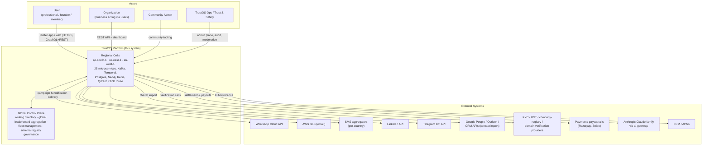
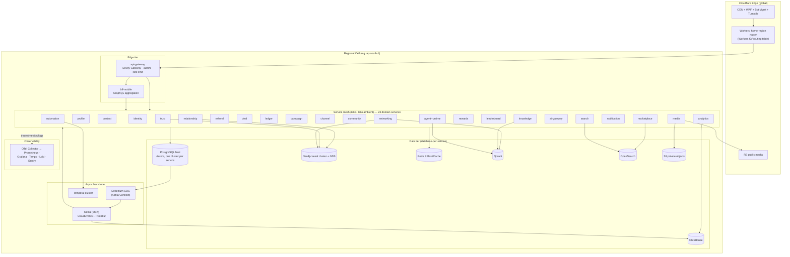
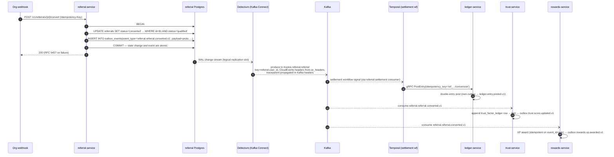
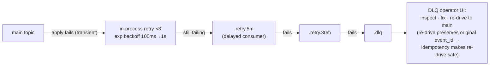
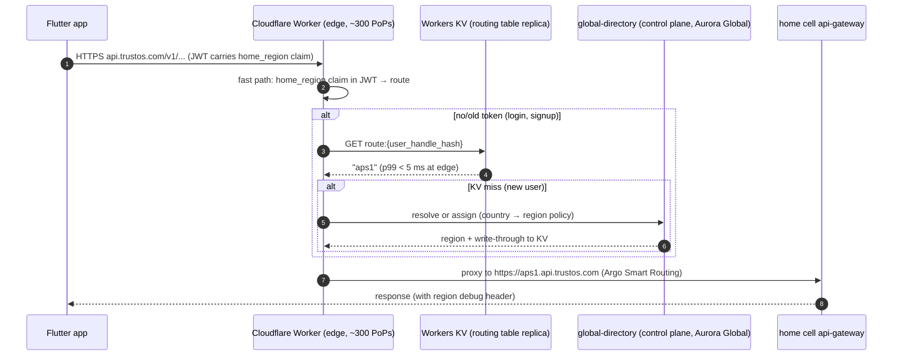
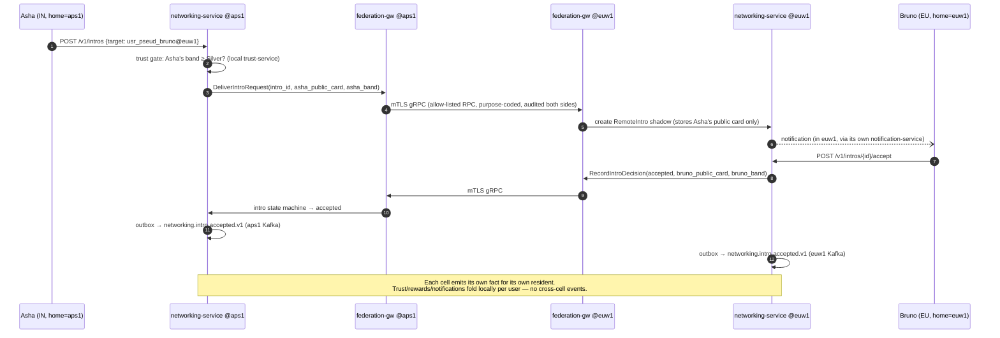
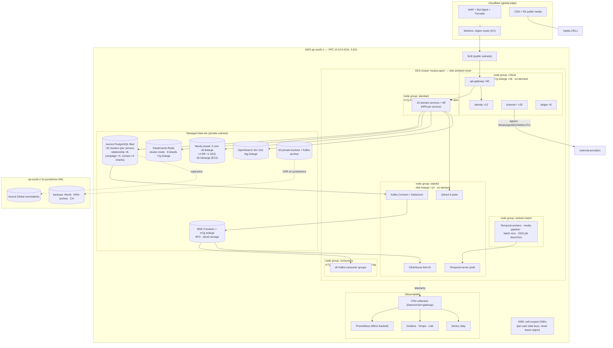
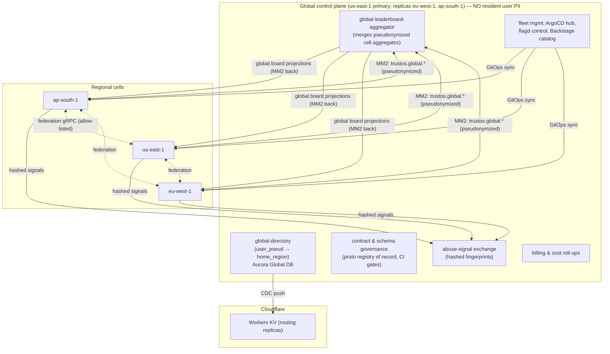

# 02 — System Architecture

> **TrustOS — AI Relationship Intelligence Platform.**
> Complete system architecture: C4 context/containers, the 25-service microservice architecture, deep event architecture, cell-based multi-region design, capacity model, resilience patterns, and infrastructure diagrams.
>
> **Binding inputs:** `_brief.md`, `_shared-context.md`. This document extends — never contradicts — those files.
> **Siblings:** service-internal design in `03-backend-architecture.md`; schemas/DDL and storage details in `05-data-architecture.md`; cluster/CI-CD/runbook detail in `12-devops-platform.md`; scoring math in `06-algorithms.md`.

**Status:** Accepted · **Owners:** Platform Architecture Group · **Scale target:** 100M registered users, 100 countries, 20M DAU.

---

## Table of Contents

1. [Platform Overview — C4 Context & Containers](#1-platform-overview--c4-context--containers)
2. [Microservice Architecture — 25 Services](#2-microservice-architecture)
3. [Event Architecture](#3-event-architecture)
4. [Cell-Based Multi-Region Architecture](#4-cell-based-multi-region-architecture)
5. [Capacity Model — 1M / 10M / 100M](#5-capacity-model)
6. [Resilience Patterns](#6-resilience-patterns)
7. [Infrastructure Diagrams](#7-infrastructure-diagrams)
8. [Trade-off Log](#8-trade-off-log)

---

## 1. Platform Overview — C4 Context & Containers

### 1.1 System Context (C4 Level 1)

TrustOS sits between people/businesses and their communication + commerce channels, and converts raw interaction exhaust into a trust graph, referrals, and economic value.



**Context notes**

- Every write into the platform carries the **actor model** (`actor_type` + `actor_id`) so a user acting "as" an org is first-class, not an afterthought (see `_shared-context.md` §1).
- All channel egress (WhatsApp/SES/SMS/LinkedIn/Telegram) is isolated behind `channel-service` — external quality/rate regimes (esp. WhatsApp quality tiers) must never leak into campaign logic.
- The **global control plane never holds resident PII**; it holds routing pointers, pseudonymized aggregates, and fleet metadata (§4).

### 1.2 Container Diagram (C4 Level 2) — one cell



**Container notes**

- **Sync path:** client → Cloudflare → home-cell `api-gateway` → REST (external) or GraphQL via `bff-mobile`; service-to-service is **gRPC** through the mesh.
- **Async path:** every state change is committed with an **outbox row**; Debezium tails WAL and publishes to Kafka. No service produces domain events directly from application code (§3.3).
- **No service ever reads or writes another service's database** — enforced by IAM: each service's IRSA role can only reach its own Aurora cluster (shared-context §3 invariant, mechanically enforced).

### 1.3 Anchor walkthrough — cold app open → home dashboard

To make the container diagram concrete, the platform's most common request, with the latency budget spent at each hop (p99 targets; SLO table in Appendix A):

1. **Flutter app** renders instantly from **Drift** (offline-first — last-synced dashboard), then fires `dashboard_v3` persisted GraphQL query + `/v1/sync/delta`.
2. **Cloudflare Worker** routes by the `home_region` JWT claim (0 lookups, ~1 ms) → aps1 NLB.
3. **api-gateway** (Envoy): JWT signature + expiry check against cached JWKS, token-bucket check in Redis pipeline (~3 ms), forwards to `bff-mobile`.
4. **bff-mobile** fans out in parallel (400 ms per-call budget, bulkheaded per downstream):
   - `profile-service` → Redis-cached profile card (~5 ms)
   - `trust-service` → cached DTI + band (~5 ms)
   - `networking-service` → precomputed recommendations page (~10 ms)
   - `leaderboard-service` → ZREVRANGE neighborhood (~5 ms)
   - `notification-service` → unread inbox head (~10 ms)
   - `community-service` → feed cache page (~15 ms)
   - `relationship-service` → "follow-ups due" (Postgres, ~40 ms)
5. Assembly + serialization (~10 ms) → **p99 ≈ 250–400 ms end-to-end**; any sub-tree that misses its budget returns null and the app keeps that card from Drift with a stale badge (§6.4 L6 behavior, per-request).
6. The request emits zero domain events (pure read); the client fires `track` events (screen view) which take the analytics firehose path — sampled first under load (§6.4 L1).

Every number above recurs in the capacity model (§5.2) and the degradation matrix (§6.4) — the read path is engineered to be **cache-dominant, projection-fed, and shed-friendly**, so the write/event machinery (§3) is where correctness lives.

---

## 2. Microservice Architecture

### 2.1 Domain grouping

| Domain | Services |
|---|---|
| **Edge & Experience** | api-gateway, bff-mobile |
| **Identity & Profile** | identity-service, profile-service |
| **Relationship Intelligence** | contact-service, relationship-service, trust-service, networking-service |
| **Value & Commerce** | referral-service, deal-service, ledger-service, marketplace-service |
| **Engagement & Messaging** | campaign-service, channel-service, notification-service |
| **Community & Content** | community-service, knowledge-service, search-service, media-service |
| **Gamification** | rewards-service, leaderboard-service |
| **AI Plane** | ai-gateway, agent-runtime |
| **Platform Horizontals** | automation-service, analytics-service |

Conventions for the per-service blocks below:

- **QPS figures** are peak, at 100M registered / 20M DAU, for the largest cell (ap-south-1, ~60% of traffic). Derivation in §5.
- **Deployment unit:** one container image per service, deployed as an EKS `Deployment` (or `StatefulSet` where noted) behind a mesh virtual service, HPA-scaled, one Argo Rollouts canary per service (see `12-devops-platform.md`).
- **Events** use the canonical taxonomy from `_shared-context.md` §3; events marked *(ext)* are extensions consistent with the naming grammar.

---

### 2.2 Edge & Experience

#### 1. `api-gateway`

- **Responsibilities:** TLS termination inside the cell, JWT validation (ES256, JWKS from identity-service), coarse authZ (route-level), token-bucket rate limiting (per-user/org/IP tiers, Redis-backed), request normalization, `Idempotency-Key` capture, RFC 9457 error shaping, OpenAPI 3.1 contract enforcement for `/v1/*`.
- **Public API surface:** none of its own; it fronts all public REST and the GraphQL endpoint.
- **Events:** publishes none; consumes none. Emits access telemetry to OTel → analytics via a lightweight tap (not domain events).
- **Data owned:** none. Redis (shared rate-limit + idempotency keyspace, logically namespaced `gw:*`).
- **Scaling:** stateless. Peak **~82k QPS** (all ingress in ap-south-1). ~40 Envoy pods at 2k QPS/pod with headroom.
- **Failure modes / blast radius:** total outage = cell outage for API traffic (blast radius: whole cell) — mitigated by ≥3-AZ spread, PodDisruptionBudget, over-provisioned 2×. Redis rate-limit outage degrades to **fail-open with local in-memory token buckets** (availability over strict limits).
- **Deployment unit:** Envoy Gateway (CRD-configured) + a thin Go external-authz filter; DaemonSet-free, plain Deployment.

#### 2. `bff-mobile`

- **Responsibilities:** GraphQL schema for the Flutter app; aggregates dashboard/feed/profile screens from downstream gRPC calls; per-screen persisted queries only (no arbitrary client queries in prod); response shaping for offline-first Drift sync (delta cursors).
- **Public API surface:** `POST /v1/graphql` (persisted query IDs), `GET /v1/sync/delta` (sync engine pull).
- **Events:** none published (read-side only). Consumes nothing from Kafka — it reads services' own read models synchronously.
- **Data owned:** none (per-query response cache in Redis, TTL ≤ 30 s, keyed by user + query hash).
- **Scaling:** stateless. **~45k QPS** (mobile reads dominate). Latency budget: p99 ≤ 400 ms including fan-out (§6.5).
- **Failure modes:** downstream fan-out amplification — one slow service can eat its thread budget → per-downstream bulkheads + partial-response degradation (GraphQL nullable sub-trees render as "stale/unavailable" cards; the app shows cached Drift data).
- **Deployment unit:** Python 3.12 / FastAPI + strawberry-graphql; Deployment, HPA on concurrency.

---

### 2.3 Identity & Profile

#### 3. `identity-service`

- **Responsibilities:** registration, OIDC login, session/device registry, MFA, biometric-gated key attestation, refresh-token rotation + reuse detection, KYC orchestration (Temporal), business verification (GST/company/domain), social verification, device trust scoring.
- **Public API surface:** `/v1/auth/*` (register, login, token, logout), `/v1/devices/*`, `/v1/verification/*` (KYC, business, social), `/.well-known/jwks.json`.
- **Events published:** `identity.user.registered.v1`, `identity.user.verified.v1`, `identity.business.verified.v1`, `identity.device.trusted.v1`, `identity.kyc.completed.v1`.
- **Events consumed:** `trust.anomaly.detected.v1` (step-up auth for risky accounts).
- **Data owned:** PostgreSQL `identity` cluster — users(auth), credentials, sessions, devices, verification_cases, per-user data keys (envelope, KMS). Field-level AES-256-GCM for phone/email/KYC docs.
- **Scaling:** stateless service, stateful store. Token issuance+validation offloaded to gateway (JWKS); residual **~6k QPS** (logins, refreshes ~1/15min/active session, verification). Postgres writes modest (~800 TPS peak).
- **Failure modes / blast radius:** the platform's most critical service — if token *refresh* fails, existing 15-min JWTs keep working (grace window), so blast radius is "no new logins," not "everyone out." JWKS cached at gateway 10 min. KYC provider outages are absorbed by Temporal retries (hours-long backoff), user sees "pending."
- **Deployment unit:** FastAPI Deployment + Temporal workers (separate Deployment `identity-workers`).

#### 4. `profile-service`

- **Responsibilities:** user & org profiles, skills, industries, preferences, profile completeness scoring, public profile cards (the residency-safe projection used cross-region, §4.4).
- **Public API surface:** `/v1/users/{id}/profile`, `/v1/orgs/{id}/profile`, `/v1/me/preferences`, profile search delegated to search-service.
- **Events published:** `profile.user.updated.v1` *(ext)*, `profile.org.updated.v1` *(ext)*.
- **Events consumed:** `identity.user.registered.v1` (bootstrap empty profile), `identity.business.verified.v1` (verified badges), `trust.score.updated.v1` (denormalized DTI band on the profile card).
- **Data owned:** PostgreSQL `profile` cluster; hot profile cards cached in Redis (`prof:{usr_id}`, TTL 5 min, event-invalidated).
- **Scaling:** stateless. **~18k QPS** reads (every screen shows profile cards) — 95% served from Redis; ~150 TPS writes.
- **Failure modes:** cache stampede on invalidation storms → request coalescing (singleflight) + stale-while-revalidate. Outage degrades UI decoration, not core flows.
- **Deployment unit:** FastAPI Deployment.

---

### 2.4 Relationship Intelligence

#### 5. `contact-service`

- **Responsibilities:** contact import (Google People, Outlook, phone upload, CSV, CRM connectors) as Temporal workflows; dedup & merge (deterministic + probabilistic matching); enrichment; consent/provenance tracking per contact (DPDP/GDPR: imported contact data is the *importer's* data with lawful-basis records).
- **Public API surface:** `/v1/contacts` (CRUD, cursor-paginated), `/v1/contacts/imports` (start/status), `/v1/contacts/merge-candidates`, `/v1/contacts/{id}/merge`.
- **Events published:** `contact.import.completed.v1`, `contact.contacts.merged.v1`.
- **Events consumed:** `identity.user.registered.v1` (invite-graph linking: newly registered user matched to existing imported contacts → connection suggestions).
- **Data owned:** PostgreSQL `contact` cluster — contacts, import_jobs, merge_decisions, provenance. Largest row-count Postgres estate after relationship (avg 800 contacts/importing user).
- **Scaling:** import bursts are Temporal-buffered (worker pool caps concurrent external API fan-out per provider). Steady **~3k QPS**; import bursts up to 50k contacts/sec write throughput absorbed via batched COPY. Sharding trigger: >2 TB or >5k sustained TPS → hash-shard by `owner_user_id` (§5.4).
- **Failure modes:** provider OAuth breakage (Google API quota) → per-provider bulkhead + circuit breaker; import jobs pause, never lose progress (Temporal). Bad-dedup blast radius contained by merge being **reversible** (merge_decisions keeps pre-images).
- **Deployment unit:** FastAPI Deployment + `contact-import-workers` Temporal worker Deployment.

#### 6. `relationship-service`

- **Responsibilities:** relationship records (user↔user, user↔contact, user↔org), interaction timeline (meetings, messages, notes, calls), relationship score (recency/frequency/reciprocity/depth — model in `06-algorithms.md`), dual-write of graph edges to Neo4j **via its own outbox consumers** (Postgres = source of truth, Neo4j = projection).
- **Public API surface:** `/v1/relationships`, `/v1/relationships/{id}/timeline`, `/v1/interactions` (record), `/v1/relationships/{id}/score`.
- **Events published:** `relationship.interaction.recorded.v1`, `relationship.score.updated.v1`, `relationship.connection.established.v1`.
- **Events consumed:** `contact.contacts.merged.v1` (re-key relationships), `networking.meeting.scheduled.v1` + `community.event.attended.v1` + `campaign.message.replied.v1` (auto-recorded interactions), `deal.deal.won.v1` (relationship milestone).
- **Data owned:** PostgreSQL `relationship` cluster (time-partitioned `interactions`, hash-sharded at scale — the platform's biggest OLTP table, §5.4) + the Neo4j `(:User)-[:RELATES_TO]->(:User)` projection it alone writes.
- **Scaling:** **~12k QPS** reads, **~4k TPS** interaction writes peak. First service to shard: 8-way by `user_id` at 100M (math in §5.4).
- **Failure modes:** Neo4j projection lag (consumer backlog) degrades graph-derived features (recs, collusion checks) but never the timeline. Blast radius of an outage: timelines and scores stale; trust-service keeps last-known relationship inputs.
- **Deployment unit:** FastAPI Deployment + `relationship-projector` consumer Deployment (Kafka → Neo4j).

#### 7. `trust-service`

- **Responsibilities:** Digital Trust Index (0–1000) per shared-context §4: streaming factor ingestion → `trust_factor_ledger` (append-only, event-sourced), DTI projection with the canonical 9-component weighted model, nightly full reconciliation, anti-gaming (velocity limits, Wilson smoothing, Neo4j GDS collusion damping), vouch management, trust-band assignment, explainability API ("why is my score X").
- **Public API surface:** `/v1/users/{id}/trust` (score + band + component breakdown), `/v1/users/{id}/trust/history`, `/v1/vouches` (create/revoke), internal gRPC `GetTrustFactors` for underwriting-style consumers.
- **Events published:** `trust.score.updated.v1`, `trust.factor.recorded.v1`, `trust.anomaly.detected.v1`.
- **Events consumed:** virtually everything that carries trust signal — `identity.*.verified.v1`, `identity.kyc.completed.v1`, `referral.referral.converted.v1`, `referral.commission.settled.v1`, `deal.deal.won.v1`, `deal.invoice.paid.v1`, `ledger.entry.posted.v1`, `relationship.score.updated.v1`, `community.event.attended.v1`, `community.post.created.v1`, `knowledge.item.published.v1`, `knowledge.item.consumed.v1`, `campaign.message.replied.v1`, `ai.feedback.recorded.v1`.
- **Data owned:** PostgreSQL `trust` cluster — `trust_factor_ledger` (append-only; the *only* event-sourced aggregate outside ledger-service, §3.11), `trust_scores` (projection), vouch records; Neo4j vouch-graph projection for GDS.
- **Scaling:** consumer-driven, **~15k factor events/sec** peak ingest; score reads **~8k QPS** (cached, event-invalidated). Ordering matters: partition key = subject `user_id` so factor application is serialized per user (§3.9).
- **Failure modes:** consumer lag → stale scores (acceptable; DTI is eventually consistent by design, nightly reconciliation is the safety net). A bad weight deploy is recoverable because factors are replayable (§3.8) — scores are a pure fold over the factor ledger.
- **Deployment unit:** `trust-api` Deployment + `trust-factor-consumers` Deployment + `trust-reconciler` CronJob + `trust-gds` scheduled GDS jobs.

#### 8. `networking-service`

- **Responsibilities:** match recommendations (meet/collaborate/partner/hire/mentor/invest) combining Neo4j path/structure features + Qdrant embedding similarity + trust gates; intro orchestration (request → double-opt-in → scheduled meeting); recommendation feedback loop.
- **Public API surface:** `/v1/recommendations` (per-intent), `/v1/intros` (request/accept/decline), `/v1/intros/{id}/schedule`.
- **Events published:** `networking.match.suggested.v1`, `networking.intro.requested.v1`, `networking.intro.accepted.v1`, `networking.meeting.scheduled.v1`.
- **Events consumed:** `profile.user.updated.v1` (re-embed), `relationship.connection.established.v1`, `trust.score.updated.v1` (gates), `ai.feedback.recorded.v1` (ranking feedback).
- **Data owned:** Neo4j read access to its own recommendation-feature projections; Qdrant collection `people_embeddings_{region}`; small Postgres store for intro state machines.
- **Scaling:** recommendation generation is **precomputed** (nightly batch + event-triggered refresh for active users), served from cache: **~10k QPS** reads, cheap. Online scoring only for cold users.
- **Failure modes:** THE canonical "degrade first" service — on overload or Neo4j/Qdrant trouble it serves yesterday's cached recs, flagged `stale: true` (§6.4). Never blocks intro accept/decline (Postgres state machine is independent).
- **Deployment unit:** FastAPI Deployment + `networking-batch` scheduled jobs (Argo Workflows via Temporal).

---

### 2.5 Value & Commerce

#### 9. `referral-service`

- **Responsibilities:** referral campaign definition (by orgs), referral lifecycle (submitted → qualified → converted), attribution (links, codes, channel-message provenance), commission calculation (rules engine), settlement initiation via Temporal → ledger-service.
- **Public API surface:** `/v1/referral-campaigns` (org CRUD + publish), `/v1/referrals` (submit/track), `/v1/referrals/{id}/qualify|convert` (org attestation + webhook ingestion), `/v1/referral-campaigns/{id}/stats`.
- **Events published:** `referral.campaign.published.v1`, `referral.referral.submitted.v1`, `referral.referral.qualified.v1`, `referral.referral.converted.v1`, `referral.commission.settled.v1`.
- **Events consumed:** `deal.deal.won.v1` + `deal.invoice.paid.v1` (auto-conversion attribution), `campaign.message.replied.v1` (attribution touchpoints), `trust.anomaly.detected.v1` (hold settlements for flagged users).
- **Data owned:** PostgreSQL `referral` cluster — campaigns, referrals, attribution_touchpoints, commission_rules, settlement_instructions.
- **Scaling:** **~2k QPS**; conversions are low-frequency/high-value. Settlement is a Temporal workflow: qualify → anti-fraud gate (trust-service gRPC) → ledger posting → payout instruction — hours-to-days long, durable.
- **Failure modes:** *money-adjacent*: double-settlement prevented by idempotent ledger postings keyed on `referral_id + milestone` (§3.10); attribution disputes resolved from the append-only touchpoint log. Outage blast radius: referral submission down, but campaign *delivery* (campaign/channel services) unaffected.
- **Deployment unit:** FastAPI Deployment + `referral-settlement-workers` Temporal Deployment.

#### 10. `deal-service`

- **Responsibilities:** pipeline tracking (intro → meeting → proposal → closure), invoices, revenue capture (self-reported + verified via payment webhooks), win/loss analytics inputs, commission triggers to referral-service via events.
- **Public API surface:** `/v1/deals` (CRUD + stage transitions), `/v1/deals/{id}/invoices`, `/v1/invoices/{id}/mark-paid` (webhook + manual).
- **Events published:** `deal.deal.created.v1`, `deal.stage.changed.v1`, `deal.deal.won.v1`, `deal.invoice.issued.v1`, `deal.invoice.paid.v1`.
- **Events consumed:** `networking.intro.accepted.v1`, `networking.meeting.scheduled.v1` (auto-create pipeline entries), `marketplace.order.completed.v1` (deal linkage).
- **Data owned:** PostgreSQL `deal` cluster — deals, stages, invoices (money = integer minor units + ISO 4217, per invariant).
- **Scaling:** **~1.5k QPS**. Modest store; monthly time-partitioned invoices.
- **Failure modes:** stage-transition races (two org members updating) → optimistic concurrency (`version` column, 409 on conflict). Invoice "paid" is only trusted from payment-rail webhooks or org-admin attestation, both audit-logged.
- **Deployment unit:** FastAPI Deployment.

#### 11. `ledger-service`

- **Responsibilities:** double-entry ledger for **all** value movement: commissions, coins, payouts, escrow. Append-only, **event-sourced** (the entries ARE the source of truth; balances are projections, §3.11). Payout orchestration via Temporal to payment rails. Period close + invariant checks (Σ debits = Σ credits, per currency, always).
- **Public API surface:** internal gRPC only — `PostEntry` (idempotent), `GetBalance`, `GetStatement`; REST read-only `/v1/me/wallet` proxied for users.
- **Events published:** `ledger.entry.posted.v1`, `ledger.payout.completed.v1`.
- **Events consumed:** none directly — postings arrive as *commands* over gRPC from referral-service, rewards-service, marketplace-service (deliberate: money movement is a synchronous, idempotent command with an actor + reason, not a fire-and-forget event; the *fact* of posting is then published).
- **Data owned:** PostgreSQL `ledger` cluster — `ledger_entries` (append-only, monthly partitions, no UPDATE/DELETE grants — enforced at the DB role level), `accounts`, `balances` (projection), `payout_instructions`.
- **Scaling:** **~1k TPS** postings peak (coins from rewards dominate). Single-writer-per-account serialization via `SELECT ... FOR UPDATE` on account rows inside the posting transaction; hot system accounts (platform fee account) use sub-account sharding (16 sub-accounts, summed on read).
- **Failure modes:** *smallest acceptable blast radius on the platform*. Postings are idempotent on `(source_service, idempotency_key)`; retries safe. If ledger is down, callers' Temporal workflows park and retry — coins/commissions arrive late, never wrong. Balances projection can be rebuilt from entries.
- **Deployment unit:** FastAPI/gRPC Deployment + `ledger-payout-workers` Temporal Deployment. PITR + cross-region (in-jurisdiction) replica; RPO ≤ 5 min.

#### 12. `marketplace-service`

- **Responsibilities:** listings (services/products/courses/jobs/partnerships/events), offers, orders, order state machine, escrow hooks into ledger-service, OpenSearch indexing of listings.
- **Public API surface:** `/v1/listings` (CRUD/publish), `/v1/listings/search` (delegates to search-service), `/v1/offers`, `/v1/orders` (+ state transitions).
- **Events published:** `marketplace.listing.published.v1`, `marketplace.order.placed.v1`, `marketplace.order.completed.v1`.
- **Events consumed:** `trust.score.updated.v1` (listing rank inputs, seller gates), `ledger.entry.posted.v1` (escrow release confirmations).
- **Data owned:** PostgreSQL `marketplace` cluster + its OpenSearch index (`listings_{region}`) maintained by its own indexing consumer.
- **Scaling:** **~4k QPS** browse (mostly search-service), ~200 TPS order writes.
- **Failure modes:** search index lag = stale listings in search (tolerable, minutes); order state machine is Postgres-transactional so payment/escrow correctness doesn't depend on OpenSearch at all.
- **Deployment unit:** FastAPI Deployment + `marketplace-indexer` consumer Deployment.

---

### 2.6 Engagement & Messaging

#### 13. `campaign-service`

- **Responsibilities:** multi-channel campaign authoring (AI-assisted via agent-runtime), audience resolution (segments over contacts/relationships), personalization (per-recipient template rendering with AI variants), scheduling (Temporal), send orchestration → channel-service, campaign analytics read models.
- **Public API surface:** `/v1/campaigns` (CRUD), `/v1/campaigns/{id}/audience/preview`, `/v1/campaigns/{id}/schedule|pause|cancel`, `/v1/campaigns/{id}/stats`.
- **Events published:** `campaign.campaign.scheduled.v1`, `campaign.message.sent.v1`, `campaign.message.delivered.v1`, `campaign.message.read.v1`, `campaign.message.replied.v1`, `campaign.message.failed.v1` (delivery/read/reply facts are recorded by campaign-service from channel-service webhook events — campaign owns the message aggregate).
- **Events consumed:** `automation.run.started.v1` (automation-triggered sends), `contact.import.completed.v1` (audience refresh).
- **Data owned:** PostgreSQL `campaign` cluster — campaigns, audience_snapshots, messages (time-partitioned; 2nd-largest table), per-campaign stats projections.
- **Scaling:** send bursts are the platform's largest write storms: a 1M-recipient campaign = 1M message rows + 1M channel commands. Temporal workflow fans out in **rate-aware batches** (channel-service advertises per-channel budgets); sustained **~5k msg/s** per cell egress ceiling (§5.3).
- **Failure modes:** the classic risk is **duplicate sends** — prevented by per-recipient idempotency (`campaign_id + contact_id` unique) and Temporal's exactly-once workflow semantics for the orchestration (activities idempotent). Channel throttling back-pressures the workflow, never drops.
- **Deployment unit:** FastAPI Deployment + `campaign-send-workers` Temporal Deployment.

#### 14. `channel-service`

- **Responsibilities:** channel adapters (WhatsApp Cloud API, SES email, SMS aggregators, LinkedIn, Telegram): outbound delivery with per-channel/per-sender rate & quality management (WhatsApp quality-tier state machine), template registration, inbound webhook ingestion (delivery receipts, replies, opt-outs), suppression lists, per-country routing (SMS).
- **Public API surface:** internal gRPC `SendMessage` (idempotent, returns accepted/queued), `RegisterTemplate`; public webhook endpoints `/v1/webhooks/{channel}` (signature-verified).
- **Events published:** `channel.delivery.receipted.v1` *(ext)*, `channel.inbound.received.v1` *(ext)*, `channel.optout.recorded.v1` *(ext)* — campaign-service consumes these to emit the canonical `campaign.message.*` facts.
- **Events consumed:** none (command-driven via gRPC; decouples from campaign semantics).
- **Data owned:** PostgreSQL `channel` cluster (sender identities, templates, suppression, webhook dedup) + Redis (per-sender token buckets, quality scores).
- **Scaling:** stateless workers + Redis budgets. **~5k msg/s** egress, **~8k/s** webhook ingress peak (delivery receipts cluster).
- **Failure modes:** *the* bulkhead showcase — WhatsApp ban/quality-drop on one sender must not affect email; per-channel worker pools, budgets, and circuit breakers are fully isolated. Webhook replays deduped on provider message ID. Blast radius of total outage: sends queue (Kafka/Temporal), receipts delayed; nothing lost.
- **Deployment unit:** one Deployment per adapter (`channel-whatsapp`, `channel-email`, `channel-sms`, `channel-linkedin`, `channel-telegram`) + shared `channel-webhook` Deployment — independent scaling and failure isolation per channel.

#### 15. `notification-service`

- **Responsibilities:** push (FCM/APNs), in-app inbox, digests (daily/weekly rollups), preference center (per-category opt-in/out, quiet hours in user TZ), notification templating & localization (100 countries → i18n catalog).
- **Public API surface:** `/v1/me/notifications` (inbox, cursor), `/v1/me/notification-preferences`.
- **Events consumed:** the wide funnel — `networking.match.suggested.v1`, `networking.intro.requested.v1`, `referral.referral.converted.v1`, `rewards.badge.unlocked.v1`, `rewards.level.up.v1`, `community.post.created.v1` (followed threads), `trust.score.updated.v1` (band changes only), `campaign.message.replied.v1`, etc.
- **Events published:** `notification.message.dispatched.v1` *(ext)* (for analytics funnel).
- **Data owned:** PostgreSQL `notification` cluster (inbox, preferences, device tokens) + Redis (recent-inbox cache, digest accumulation buffers).
- **Scaling:** **~20k events/s** consumed peak → collapsed/deduped/preference-filtered to ~6k pushes/s. Inbox reads ~9k QPS.
- **Failure modes:** overload → digest instead of realtime (accumulate, flush later) — a deliberate degradation lever (§6.4). FCM/APNs outage: pushes drop to inbox-only; nothing user-visible breaks.
- **Deployment unit:** `notification-api` + `notification-fanout` consumer Deployment + `notification-digester` CronJob.

---

### 2.7 Community & Content

#### 16. `community-service`

- **Responsibilities:** communities (masterminds/industry/location/private/referral groups), membership + roles (Cerbos-checked), discussions, community events (+ attendance), referral boards, per-community knowledge-hub and marketplace *links* (content lives in knowledge/marketplace services; community owns the association), community trust ranking inputs.
- **Public API surface:** `/v1/communities` (+ join/leave/roles), `/v1/communities/{id}/posts`, `/v1/communities/{id}/events` (+ RSVP/attendance), `/v1/communities/{id}/referral-board`.
- **Events published:** `community.member.joined.v1`, `community.post.created.v1`, `community.event.created.v1`, `community.event.attended.v1`.
- **Events consumed:** `identity.user.registered.v1` (onboarding community suggestions), `trust.score.updated.v1` (community trust rankings), `referral.campaign.published.v1` (referral-board fan-in).
- **Data owned:** PostgreSQL `community` cluster — communities, memberships, posts (time-partitioned), events, rsvps.
- **Scaling:** **~14k QPS** reads (feeds), ~1.2k TPS writes. Feed = CQRS projection per community (materialized recent-posts cache in Redis).
- **Failure modes:** hot communities (100k members, viral post) → per-community fan-out caps + feed pagination from cache; moderation actions are synchronous and never queue-delayed (safety).
- **Deployment unit:** FastAPI Deployment + `community-feed-projector` consumer Deployment.

#### 17. `knowledge-service`

- **Responsibilities:** articles, videos (metadata; binaries in media-service), templates, prompt library, SOPs, playbooks, case studies; versioning; endorsements; consumption tracking; **RAG corpus ownership** — chunking + embedding pipeline into Qdrant for agent-runtime retrieval.
- **Public API surface:** `/v1/knowledge/items` (CRUD/publish/versions), `/v1/knowledge/items/{id}/endorse`, `/v1/knowledge/collections`.
- **Events published:** `knowledge.item.published.v1`, `knowledge.item.consumed.v1`.
- **Events consumed:** `media.file.available.v1` *(ext)* (attach transcoded video), `ai.generation.completed.v1` (AI-drafted content provenance tagging).
- **Data owned:** PostgreSQL `knowledge` cluster + Qdrant collection `knowledge_chunks_{region}` (per-collection multitenancy per invariant).
- **Scaling:** **~6k QPS** reads; embedding pipeline ~50 items/s burst (Kafka-buffered).
- **Failure modes:** embedding backlog = stale RAG (agents answer from older corpus — flagged in agent context); content reads are plain Postgres + CDN, robust.
- **Deployment unit:** FastAPI Deployment + `knowledge-embedder` consumer Deployment.

#### 18. `search-service`

- **Responsibilities:** unified search API (people, listings, knowledge, communities) over OpenSearch; owns index schemas/analyzers (per-language, 100 countries); indexing consumers per source topic; query-time trust-aware ranking (DTI band boost); typo tolerance, synonyms, per-region index sets.
- **Public API surface:** `/v1/search?type=people|listings|knowledge|communities&q=` (cursor-paginated).
- **Events consumed:** `profile.user.updated.v1`, `marketplace.listing.published.v1`, `knowledge.item.published.v1`, `community.*` — each mapped to index upserts.
- **Events published:** none.
- **Data owned:** OpenSearch domain (indexes are rebuildable projections — source of truth stays in owning services).
- **Scaling:** **~7k QPS** queries; indexing ~3k docs/s peak. OpenSearch: 3 masters + 12 data nodes (r6g.2xlarge) at 100M in ap-south-1.
- **Failure modes:** deliberately a **soft dependency**: search down → app hides search box, everything else works. Index corruption → rebuild by replaying compacted topics (§3.8).
- **Deployment unit:** `search-api` Deployment + `search-indexer` consumer Deployment (one consumer group per index).

#### 19. `media-service`

- **Responsibilities:** signed-URL uploads (S3 multipart), virus scan (ClamAV lambda-style workers), image transforms + video transcode (Temporal-orchestrated MediaConvert), CDN URL issuance (public → Cloudflare R2, private → S3 presigned), EXIF stripping, content-safety hooks.
- **Public API surface:** `/v1/media/uploads` (initiate/complete), `/v1/media/{id}` (metadata + URLs).
- **Events published:** `media.file.available.v1` *(ext)*, `media.file.rejected.v1` *(ext)* (scan failures).
- **Events consumed:** none.
- **Data owned:** S3 buckets (private, per-region — residency), R2 (public), PostgreSQL `media` metadata.
- **Scaling:** **~1.2k uploads/s** peak (campaign images, community posts); bytes ~2 TB/day at 100M (§5.6). Transcode fully async.
- **Failure modes:** scan-queue backlog → uploads visible to owner only ("processing") until cleared; CDN issues fall back to S3 presigned (slower, works).
- **Deployment unit:** FastAPI Deployment + `media-pipeline-workers` Temporal Deployment.

---

### 2.8 Gamification

#### 20. `rewards-service`

- **Responsibilities:** XP rules engine (event → XP mapping, versioned rulesets), levels, badges, achievements, streaks; **coins are ledger postings** (rewards computes the award, ledger-service moves the value — rewards never stores balances).
- **Public API surface:** `/v1/me/rewards` (XP, level, badges, streaks), `/v1/badges/catalog`.
- **Events published:** `rewards.xp.awarded.v1`, `rewards.badge.unlocked.v1`, `rewards.level.up.v1`.
- **Events consumed:** broad — `referral.referral.converted.v1`, `deal.deal.won.v1`, `community.event.attended.v1`, `community.post.created.v1`, `knowledge.item.published.v1`, `networking.intro.accepted.v1`, `contact.import.completed.v1`, etc., each mapped through the ruleset.
- **Data owned:** PostgreSQL `rewards` cluster — xp_awards (append-only), badge_grants, streak_states, rulesets.
- **Scaling:** **~18k events/s** consumed peak; awards are idempotent on `(event_id, rule_id)` so replay-safe.
- **Failure modes:** consumer lag → XP arrives late (users notice; SLO: p99 award latency < 60 s). Rule bugs → replayable: void + recompute from consumed events (append-only awards, compensating entries).
- **Deployment unit:** `rewards-api` + `rewards-rules-consumer` Deployments.

#### 21. `leaderboard-service`

- **Responsibilities:** all leaderboards — period (daily/weekly/monthly/quarterly/annual) × scope (global/country/city/industry/community/company) — as Redis sorted sets, fed by event consumers; period close snapshots to Postgres; rank queries + "neighborhood" views (you ± 5); global scopes via cross-region aggregation (§4.4).
- **Public API surface:** `/v1/leaderboards/{period}/{scope}` (+ `?around=me`), `/v1/leaderboards/{...}/history`.
- **Events consumed:** `rewards.xp.awarded.v1` (primary score currency), `trust.score.updated.v1` (trust leaderboards), `referral.referral.converted.v1`, `deal.deal.won.v1` (business leaderboards).
- **Events published:** `leaderboard.period.closed.v1` *(ext)* (snapshot facts for rewards/analytics).
- **Data owned:** Redis (ZSETs, keyspace `lb:{period}:{scope}:{scope_id}`) + PostgreSQL `leaderboard` snapshots.
- **Scaling:** ZINCRBY at ~18k/s fan-in (one event may touch 5–7 boards → ~100k Redis ops/s, pipelined); reads ~12k QPS. Redis sizing in §5.5.
- **Failure modes:** Redis loss → rebuild boards for the open period by replaying `rewards.xp.awarded.v1` from period start (§3.8); closed periods safe in Postgres. Freezing leaderboards is degradation lever #2 (§6.4).
- **Deployment unit:** `leaderboard-api` + `leaderboard-consumer` Deployments + `leaderboard-closer` CronJob.

---

### 2.9 AI Plane

#### 22. `ai-gateway`

- **Responsibilities:** single choke point for all LLM traffic: model routing (claude-sonnet-5 default, claude-haiku-4-5 cheap/fast classification, claude-fable-5/opus deep reasoning), prompt registry (versioned, evaluated), guardrails (input/output filters, PII redaction before egress, jailbreak checks), evals (shadow + canary prompt versions), cost metering + per-feature budgets, provider failover, response caching (semantic + exact).
- **Public API surface:** internal gRPC only — `Generate`, `Embed`, `Classify`; no direct public exposure.
- **Events published:** `ai.generation.completed.v1` (tokens, cost, latency, prompt version, feature attribution).
- **Events consumed:** `ai.feedback.recorded.v1` (eval loops).
- **Data owned:** PostgreSQL `ai` cluster (prompt registry, eval runs, cost ledger by feature/org) + Redis (response cache, budget counters).
- **Scaling:** **~1.5k generations/s** peak at 100M (§5 assumption: 8% of DAU trigger ≥1 generation/day + system agents). Queue-based admission when provider TPM limits near — back-pressure to callers with `Retry-After`.
- **Failure modes:** provider outage → route to secondary model tier with capability downgrade flag; budget exhaustion → feature-level shedding (recs prompts first, user-facing copilot last). Guardrail bypass risk mitigated: **no service may call Anthropic directly** — egress NetworkPolicy allows LLM APIs only from ai-gateway pods.
- **Deployment unit:** gRPC Deployment; HPA on in-flight generations.

#### 23. `agent-runtime`

- **Responsibilities:** the 8 named agents (Relationship, Trust, Referral, Campaign, Community, Knowledge, Support, Networking) — each with memory (per-user conversational + long-term in Postgres/Qdrant), tools (gRPC clients to domain services, allow-listed per agent), reasoning loops, RAG (Qdrant retrieval from knowledge corpus), prompt templates (from ai-gateway registry), guardrails, feedback capture.
- **Public API surface:** `/v1/agents/{agent}/converse` (SSE streaming), `/v1/agents/{agent}/tasks` (async agent tasks → Temporal).
- **Events published:** `ai.feedback.recorded.v1`.
- **Events consumed:** `contact.import.completed.v1`, `networking.match.suggested.v1`, `deal.stage.changed.v1` etc. — proactive-agent triggers (e.g., Relationship agent drafts follow-ups after meetings).
- **Data owned:** PostgreSQL `agent` cluster (conversations, memories, tool-call audit log) + Qdrant `agent_memory_{region}`.
- **Scaling:** **~800 concurrent conversations** peak per cell; long-running agent tasks on Temporal. All inference through ai-gateway (cost + guardrail inheritance).
- **Failure modes:** tool-call failures degrade to "I can't do X right now" (agent stays up); runaway loops capped (max steps, token budget per task); every tool call is audit-logged with actor propagation — agents act *as the user*, so Cerbos authorizes each tool call with the user's principal.
- **Deployment unit:** `agent-api` Deployment (SSE) + `agent-task-workers` Temporal Deployment.

---

### 2.10 Platform Horizontals

#### 24. `automation-service`

- **Responsibilities:** user-defined + system automations (birthday/anniversary greetings, lead follow-up, drip campaigns, customer journeys, referral reminders, meeting reminders, festival greetings — per-country festival calendars) compiled to **Temporal workflows**; trigger evaluation (schedule, event, condition); run history.
- **Public API surface:** `/v1/automations` (CRUD from a constrained recipe DSL — trigger/condition/action JSON, versioned), `/v1/automations/{id}/runs`.
- **Events published:** `automation.run.started.v1`, `automation.run.completed.v1`.
- **Events consumed:** trigger sources — `relationship.interaction.recorded.v1` (follow-up timers), `networking.meeting.scheduled.v1` (reminders), `contact.import.completed.v1` (journey enrollment), plus cron-style Temporal schedules for date-based triggers.
- **Data owned:** PostgreSQL `automation` cluster (definitions, run log) + Temporal (execution state).
- **Scaling:** at 100M: ~40M active automations; date-based triggers batched by (date, region, hour) — birthday wave = up to ~160k runs/day just for birthdays; Temporal handles **~2k workflow starts/s** burst per cell (§5 sizing).
- **Failure modes:** action failures retried with per-action budgets; poisoned definitions quarantined (auto-pause after N consecutive failed runs); Temporal outage stops *new* runs but loses nothing (durable state).
- **Deployment unit:** FastAPI Deployment + `automation-workers` Temporal Deployment (dedicated task queues per action class).

#### 25. `analytics-service`

- **Responsibilities:** event ingestion → ClickHouse (Kafka → materialized pipeline), metric definitions (semantic layer: one definition of "conversion", "active", "revenue"), dashboard APIs (business/relationship/trust/referral/revenue/campaign/community), org-facing analytics exports, pseudonymization boundary (only `user_pseud_id` enters ClickHouse, per PII invariant).
- **Public API surface:** `/v1/analytics/dashboards/{name}`, `/v1/analytics/query` (constrained metric DSL, org-scoped), `/v1/track` (client behavioral events, via gateway, Turnstile-protected).
- **Events consumed:** **everything** — all `trustos.*` topics via a ClickHouse Kafka-engine pipeline + the client `track` firehose.
- **Events published:** none.
- **Data owned:** ClickHouse cluster (raw events 90 d hot → S3-tiered; aggregates 5 y).
- **Scaling:** **~100k events/s** peak ingest per large cell (§5.3); ClickHouse: 6 shards × 2 replicas (r6id.4xlarge) in ap-south-1 at 100M.
- **Failure modes:** completely off the critical path — ingestion lag or ClickHouse downtime affects dashboards only. Ingest is the **first thing sampled** under Kafka pressure (§6.4).
- **Deployment unit:** `analytics-api` Deployment + ClickHouse (operator-managed StatefulSet) + Kafka-engine materialized views.

---

### 2.11 Service interaction diagram

Primary synchronous (gRPC/REST, solid) and event (Kafka, dashed) interactions. Event edges show the dominant flows only — the full pub/sub matrix is in the per-service blocks above.

```mermaid
graph LR
    subgraph Edge
        GW["api-gateway"]
        BFF["bff-mobile"]
    end

    subgraph Identity
        IDS["identity"]
        PRS["profile"]
    end

    subgraph RelIntel["Relationship Intelligence"]
        CTS["contact"]
        RLS["relationship"]
        TRS["trust"]
        NWS["networking"]
    end

    subgraph Value["Value & Commerce"]
        RFS["referral"]
        DLS["deal"]
        LGS["ledger"]
        MKS["marketplace"]
    end

    subgraph Engage["Engagement"]
        CPS["campaign"]
        CHS["channel"]
        NTS["notification"]
    end

    subgraph Content["Community & Content"]
        CMS["community"]
        KNS["knowledge"]
        SRS["search"]
        MDS["media"]
    end

    subgraph Game["Gamification"]
        RWS["rewards"]
        LBS["leaderboard"]
    end

    subgraph AI["AI Plane"]
        AIG["ai-gateway"]
        AGR["agent-runtime"]
    end

    subgraph Horiz["Horizontals"]
        AUS["automation"]
        ANS["analytics"]
    end

    GW --> BFF
    GW --> IDS & PRS & CTS & RLS & TRS & NWS & RFS & DLS & MKS & CPS & CMS & KNS & SRS & MDS & AGR & AUS & ANS & NTS
    BFF --> PRS & RLS & TRS & NWS & CMS & LBS & NTS & RWS

    RFS -->|gRPC PostEntry| LGS
    RWS -->|gRPC PostEntry| LGS
    MKS -->|gRPC PostEntry| LGS
    CPS -->|gRPC SendMessage| CHS
    AGR -->|gRPC Generate| AIG
    NWS -->|gRPC Generate| AIG
    CPS -->|gRPC Generate| AIG
    AGR -->|tool calls| RLS & TRS & RFS & CPS & CMS & KNS & NWS
    NWS -->|gRPC GetTrust| TRS

    IDS -. identity.* .-> TRS & PRS & CTS & CMS
    CTS -. contact.* .-> RLS & AGR & AUS
    RLS -. relationship.* .-> TRS & NWS & AUS
    TRS -. trust.* .-> PRS & NWS & MKS & LBS & IDS & RFS
    NWS -. networking.* .-> DLS & RLS & NTS & RWS
    RFS -. referral.* .-> TRS & RWS & LBS & NTS
    DLS -. deal.* .-> RFS & TRS & RWS & LBS
    LGS -. ledger.* .-> TRS & MKS
    CHS -. channel.* .-> CPS
    CPS -. campaign.* .-> RLS & TRS & RFS & ANS
    CMS -. community.* .-> TRS & RWS & NTS & SRS
    KNS -. knowledge.* .-> TRS & SRS & RWS
    MKS -. marketplace.* .-> DLS & SRS
    RWS -. rewards.* .-> LBS & NTS
    AUS -. automation.* .-> CPS
```

Reading the graph: **trust-service and rewards-service are the platform's biggest event fan-in points**; **ledger-service is command-only**; **channel-service and ai-gateway are the only external egress points** (besides contact import and KYC in their owning services). This is deliberate — see the trade-off log (§8, D-07).

---

## 3. Event Architecture

### 3.1 Principles (restating the binding invariants, then extending)

1. Kafka everywhere; **CloudEvents 1.0** envelope, **Protobuf** payloads, Confluent Schema Registry.
2. Every state change leaves the owning service **only** via transactional outbox + Debezium CDC.
3. **At-least-once delivery**; every consumer idempotent via `event_id` dedup.
4. Topic naming `trustos.<domain>.<aggregate>`; event types `<domain>.<aggregate>.<verb-past-tense>.v<N>`; partition key = aggregate ID.
5. Kafka clusters are **per-cell** — no global Kafka. Cross-region movement is explicit, allow-listed MirrorMaker 2 replication of pseudonymized aggregate topics only (§4.4).

### 3.2 Cluster topology per region

```mermaid
graph TB
    subgraph Cell_ap_south_1["ap-south-1 cell"]
        subgraph MSK["MSK cluster 'trustos-core' — 9 brokers, 3 AZs"]
            B1["brokers 1-3 (AZ-a)"]
            B2["brokers 4-6 (AZ-b)"]
            B3["brokers 7-9 (AZ-c)"]
        end
        SR["Schema Registry (Confluent CE, 3 pods, backed by _schemas topic)"]
        KC["Kafka Connect cluster<br/>Debezium source connectors (1 per service DB)<br/>+ S3 sink (archive) + MM2"]
        MSK --- SR
        MSK --- KC
    end
    subgraph Global["Other cells"]
        MM2A["us-east-1 MSK"]
        MM2B["eu-west-1 MSK"]
    end
    KC -.MM2: trustos.global.* aggregates only.-> MM2A
    KC -.MM2: trustos.global.* aggregates only.-> MM2B
```

**Cluster spec (ap-south-1 at 100M — sizing math in §5.3):**

| Property | Value |
|---|---|
| Brokers | 9 × `kafka.m7g.4xlarge` (16 vCPU, 64 GiB), 3 AZs |
| Storage | EBS gp3, 12 TiB/broker provisioned, tiered storage ON (hot 3 d local, warm → S3) |
| Replication | RF=3, `min.insync.replicas=2`, producers `acks=all` |
| Retention | Domain topics 7 d (+ compacted state topics ∞); analytics firehose 3 d (ClickHouse is the archive); archive-everything S3 sink for replay (§3.8) |
| Quotas | Per-service-principal produce/fetch quotas (a runaway service cannot starve the cluster) |
| Security | mTLS (mesh certs), per-service ACLs: a service may write only `trustos.<its-domain>.*` |

One logical cluster per cell (not per domain): at our scale (< ~200 MB/s in per cell) a single well-quota'd cluster is operationally far cheaper than federated clusters; the isolation risks are handled by quotas + ACLs. Revisit if any single domain exceeds ~40% of cluster throughput (see D-06, §8).

### 3.3 Topic & partition strategy, with sizing math

**Partition count formula:** `partitions = max( ceil(peak_msgs_per_s / 1500), ceil(peak_MB_per_s / 8), consumer_parallelism_target )`, rounded up to a multiple of 6 (divides evenly across 3 AZs, and gives headroom for consumer-group balance). 1,500 msg/s and 8 MB/s per partition are conservative per-partition budgets that keep p99 broker latency < 20 ms on m7g.

Hot topics in ap-south-1 at 100M (peaks from §5):

| Topic | Peak msgs/s | Avg size | Partitions | Rationale |
|---|---|---|---|---|
| `trustos.analytics.track` | 100,000 | 350 B | 96 | firehose; keyed by `user_pseud_id`; consumers: ClickHouse pipeline only |
| `trustos.campaign.message` | 15,000 | 600 B | 24 | sends + receipts; key `campaign_id` (send batches stay together) → per-recipient facts keyed `message_id` |
| `trustos.relationship.interaction` | 12,000 | 500 B | 24 | key `user_id` (owner) — per-user ordering for score folds |
| `trustos.trust.factor` | 15,000 | 400 B | 24 | key = subject `user_id` — **ordering-critical** (§3.9) |
| `trustos.rewards.xp` | 18,000 | 300 B | 24 | key `user_id`; leaderboard + notification consumers |
| `trustos.community.post` | 4,000 | 700 B | 12 | key `community_id` — per-community feed ordering |
| `trustos.identity.user` | 500 | 600 B | 12 | low volume, high consumer count; compacted twin topic `...user.state` for bootstrap |
| `trustos.ledger.entry` | 1,200 | 450 B | 12 | key `account_id`; **ordering-critical** |
| `trustos.channel.receipt` | 8,000 | 400 B | 12 | key `message_id` |
| everything else (~30 topics) | < 2,000 ea | — | 6–12 | default 6, grow via keyed-repartition procedure |

Total ≈ **60 topics, ~450 partitions, ~1,350 replicas** — comfortably < 4,000-partitions-per-broker guidance at 9 brokers.

**Compacted state topics.** For aggregates whose *latest state* is broadly needed (user, profile card, trust score, org), we maintain a compacted twin (`trustos.trust.score.state`, key `user_id`, cleanup.policy=compact). New consumers bootstrap from the compacted topic instead of replaying 7 days of deltas.

### 3.4 Transactional outbox + Debezium CDC — end-to-end

Every service schema includes (full DDL in `05-data-architecture.md`):

```sql
CREATE TABLE outbox_events (
    id              UUID PRIMARY KEY,                 -- UUIDv7 = event_id
    aggregate_type  TEXT        NOT NULL,             -- 'referral'
    aggregate_id    UUID        NOT NULL,             -- partition key
    event_type      TEXT        NOT NULL,             -- 'referral.referral.converted.v1'
    payload         BYTEA       NOT NULL,             -- serialized Protobuf
    ce_headers      JSONB       NOT NULL,             -- CloudEvents attrs: source, subject, traceparent, actor_type, actor_id
    created_at      TIMESTAMPTZ NOT NULL DEFAULT now()
);
-- No consumers read this table. Debezium tails WAL; rows are deleted by a
-- retention job after 24h (Debezium has already shipped them from the WAL).
```

Walkthrough — referral conversion → commission → trust → rewards:



Why this shape, precisely:

- **No dual write, ever.** The business row and the outbox row commit in one transaction; Debezium's WAL position is the single delivery cursor. Crash anywhere → either both happened or neither.
- **Debezium delivery is at-least-once** (connector restart may re-ship) → consumer idempotency (§3.7) is mandatory, which we needed anyway.
- **Per-service connector**, one replication slot per service DB. Slot lag is a first-class alert (slot retention risk on the primary: alert at 5 GiB WAL retained, page at 20 GiB).
- **Ordering:** WAL order per Postgres primary → Debezium preserves per-key order → Kafka preserves per-partition order. Since partition key = aggregate ID, we get **per-aggregate total order end to end**, which is the exact guarantee trust folds and ledger projections need (§3.9).

### 3.5 Schema evolution — Protobuf + Schema Registry

- Registry compatibility mode: **FULL_TRANSITIVE** on all domain subjects (`trustos.<domain>.<aggregate>-value`). Producers registering an incompatible schema fail CI, not runtime (schema check is a GitHub Actions gate in the `platform` monorepo, where all protos live under `contracts/`).
- **Allowed within a version (v1 → v1'):** add optional fields (new field numbers), add enum values (consumers must handle unknowns), deprecate-but-keep fields. **Forbidden:** renumbering, changing types, repurposing field numbers (reserve removed numbers forever), semantic changes to an existing field.
- **Breaking change = new event version**: `referral.referral.converted.v2` is a *new subject on the same topic* (event-type header discriminates). Producers **dual-publish v1 + v2 for ≥ 90 days**; consumer migration tracked in the registry's consumer manifest; v1 retired only when consumer lag on v1 is provably zero across all groups.
- CloudEvents envelope attributes are frozen (spec-owned); our extension attributes (`actor_type`, `actor_id`, `home_region`, `schema_ref`) are additive-only.
- Registry is per-cell with the `_schemas` topic mirrored to a global archive; subjects are identical across cells (schema governance is a control-plane concern, deployment is regional).

**Concrete contract example** (lives in `contracts/trustos/referral/v1/events.proto` in the platform monorepo):

```protobuf
syntax = "proto3";
package trustos.referral.v1;

import "trustos/common/v1/types.proto";   // Money, ActorRef, annotations

// referral.referral.converted.v1
message ReferralConverted {
  string referral_id            = 1;  // ref_… UUIDv7
  string campaign_id            = 2;  // cmp_…
  string referrer_user_id       = 3;  // usr_… (partition key)
  string referred_contact_id    = 4;
  trustos.common.v1.Money deal_value = 5;   // integer minor units + ISO 4217
  trustos.common.v1.Money commission  = 6;
  string attribution_model      = 7;  // "last_touch" | "position_based"
  int64  converted_at_unix_ms   = 8;
  // field 9 reserved — removed 'channel_hint' in v1.3; never reuse
  reserved 9;
  reserved "channel_hint";
}
```

Wire form: CloudEvents 1.0 **binary content mode** — envelope attributes travel as Kafka headers, payload is the raw Protobuf bytes:

```text
Kafka record
  key      : 018f6a3e-... (referrer_user_id, UUIDv7 bytes)
  headers  : ce_id=018f6a3e-9d21-7c3a-...   ce_type=referral.referral.converted.v1
             ce_source=/aps1/referral-service  ce_subject=ref_018f6a3e...
             ce_time=2026-07-07T14:03:22.114Z  content-type=application/protobuf
             traceparent=00-4bf9...-01         actor_type=user  actor_id=usr_018e...
             home_region=aps1                  schema_ref=trustos.referral.referral-value/7
  value    : <ReferralConverted protobuf bytes>
```

### 3.6 Consumer group design

- **One consumer group per (service, purpose):** e.g. `trust-factor-fold`, `search-index-listings`, `notification-fanout`, `clickhouse-ingest`. Never share groups across purposes — independent lag, independent replay.
- Group instances = partition count of the hottest subscribed topic (max parallelism), scaled down by HPA on **consumer lag** (KEDA `kafka` scaler: target lag 5,000 msgs, min replicas 2).
- **Static membership** (`group.instance.id` = pod ordinal) + cooperative-sticky assignor → rolling deploys don't trigger stop-the-world rebalances.
- Offsets committed **only after** the idempotent apply transaction commits (§3.7); `enable.auto.commit=false` everywhere.
- Poison handling: per §3.7's retry tiers, never block the partition > 30 s on one message.

**Consumer group registry** (the operationally significant groups; each row is a KEDA-scaled Deployment with its own lag SLO and dashboard):

| Group | Subscribes | Projects into | Staleness SLO | Ordering-sensitive |
|---|---|---|---|---|
| `trust-factor-fold` | identity/referral/deal/ledger/relationship/community/knowledge/campaign facts | `trust_factor_ledger` → `trust_scores` | 60 s | **yes** (per user) |
| `rewards-rules` | 12 fact topics (§2.8) | `xp_awards`, badge grants | 60 s | no (idempotent per event) |
| `leaderboard-fanin` | `rewards.xp`, `trust.score`, `referral.*`, `deal.*` | Redis ZSETs | 10 s | no (ZINCRBY commutes) |
| `notification-fanout` | ~15 topics | inbox + push dispatch | 30 s | no |
| `search-index-people` / `-listings` / `-knowledge` / `-communities` | profile / marketplace / knowledge / community topics | OpenSearch indexes | 2 min | no (versioned upserts) |
| `relationship-projector` | own outbox-fed topic | Neo4j edge projection | 2 min | yes (per relationship) |
| `campaign-lifecycle` | `channel.receipt`, `channel.inbound` | `messages` state, campaign stats | 30 s | per message (max-state upsert) |
| `community-feed-projector` | `community.post` | Redis feed caches | 10 s | yes (per community) |
| `marketplace-indexer` | own listings topic | OpenSearch | 2 min | no |
| `knowledge-embedder` | `knowledge.item` | Qdrant chunks | 10 min | no |
| `clickhouse-ingest` | **all** `trustos.*` + track firehose | ClickHouse | 5 min | no |
| `automation-triggers` | interaction/meeting/import topics | Temporal workflow signals | 60 s | no |
| `identity-risk` | `trust.anomaly` | step-up auth flags | 60 s | no |

Every group above also implicitly owns its `.retry.5m`, `.retry.30m`, and `.dlq` companions (§3.7).

### 3.7 Idempotent consumer pattern + DLQ/retry tiers

The canonical apply loop (Python 3.12, `confluent-kafka`, SQLAlchemy 2 async — full version in `03-backend-architecture.md`):

```python
# consumers/base.py — canonical idempotent apply (sketch; error handling elided)
PROCESSED_DDL = """
CREATE TABLE processed_events (
    consumer_group TEXT NOT NULL,
    event_id       UUID NOT NULL,        -- CloudEvents id == outbox UUIDv7
    processed_at   TIMESTAMPTZ NOT NULL DEFAULT now(),
    PRIMARY KEY (consumer_group, event_id)
);  -- partitioned by processed_at month; 35-day retention (>> max replay window)
"""

async def handle(msg: Message, session: AsyncSession) -> None:
    event = decode_cloudevent(msg)               # protobuf via schema registry

    # Fast path: Redis dedup filter (cheap, best-effort — NOT the correctness layer)
    if await redis.get(f"dedup:{GROUP}:{event.id}"):
        return

    async with session.begin():                  # single local transaction:
        inserted = await session.execute(
            insert(processed_events)
            .values(consumer_group=GROUP, event_id=event.id)
            .on_conflict_do_nothing()
        )
        if inserted.rowcount == 0:               # already applied — exactly-once *effect*
            return
        await apply_projection(event, session)   # e.g. fold trust factor into score row
        stage_outbox_if_any(event, session)      # consumers that emit, emit via their own outbox

    await redis.set(f"dedup:{GROUP}:{event.id}", 1, ex=86_400)
    consumer.commit(msg)                          # offset commit strictly after DB commit
```

The correctness core is the **unique-key insert in the same transaction as the projection write** — Redis is only a hot-path filter. This turns at-least-once delivery into exactly-once *processing effects* without Kafka transactions.

**Retry tiers + DLQ:**



- Retry topics carry the full original record + failure metadata headers (`x-failure-class`, `x-attempt`, `x-first-failed-at`). Delayed consumption via pause-until-due (header timestamp), not sleep-in-handler.
- **Non-transient failures** (deserialization, schema-unknown, invariant violation) skip tiers → straight to DLQ + Sentry + page if rate > 0.01% of topic volume.
- DLQ re-drive is a standard ops action (`12-devops-platform.md` runbook) and is always safe because every consumer is idempotent on `event_id`.

### 3.8 Event replay & backfill procedure

Replay classes:

1. **Short replay (≤ 7 d, within Kafka retention):** reset the consumer group offset (`kafka-consumer-groups --reset-offsets --to-datetime`) on a **cloned group** (`<group>.replay-YYYYMMDD`) writing to the same projection — safe because applies are idempotent; the clone avoids disturbing live lag metrics. Used for: bug-window reprocessing, leaderboard rebuild for open period.
2. **Deep backfill (> 7 d):** every topic is archived by the S3 sink connector (Parquet, partitioned by topic/date). A Temporal backfill workflow streams S3 → a dedicated `trustos.<domain>.<aggregate>.backfill` topic → same consumer code, separate group, rate-limited (produce quota) so backfill never starves live traffic. Projection writes go to a **shadow table**, then an atomic swap (`ALTER TABLE ... RENAME`) — used for search-index rebuilds and DTI recomputation after weight changes.
3. **State bootstrap:** new consumers needing current state (not history) read the compacted `.state` twin topic from offset 0, then join the live topic.

Rules: replays are **flag-gated change tickets**; side-effecting consumers (notification fan-out, channel sends) run replays with `side_effects=suppressed` (the processed-events dedup plus an explicit replay header ensures no user gets 2019's birthday greeting again).

### 3.9 Ordering guarantees — where they matter

| Flow | Guarantee needed | Mechanism |
|---|---|---|
| **Trust score** (factor fold per user) | Per-user total order of factors | key = subject `user_id`; single partition per user; single-threaded apply per key in consumer; nightly reconciliation catches any residue |
| **Ledger** (entries per account) | Per-account order; balance never transiently negative from reorder | posting is *synchronous* single-writer per account in ledger-service (DB row lock) — Kafka only carries the *fact*; projections keyed `account_id` fold in order |
| Relationship timeline | Per-relationship append order | key `user_id`; timeline is time-sorted on read anyway (belt + suspenders) |
| Community feed | Per-community post order | key `community_id` |
| Campaign message lifecycle (sent→delivered→read) | Per-message order | key `message_id` for receipt facts; consumers tolerate read-before-delivered (upsert max-state) |
| Leaderboards, analytics, notifications, search | **None** — commutative or last-write-wins | any key; correctness by idempotency/monotonic upserts |

Design stance: **only pay for ordering where the fold is non-commutative** (trust, ledger). Everything else is designed to be commutative so partitioning stays free to optimize for balance.

### 3.10 Exactly-once boundaries

- **DB → Kafka:** effectively-once via outbox + Debezium (at-least-once ship + immutable `event_id`).
- **Kafka → DB projections:** exactly-once *effects* via the idempotent-apply transaction (§3.7). We deliberately do **not** use Kafka EOS/transactions here — the sink is Postgres, so Kafka transactions can't span the boundary anyway.
- **Kafka → Kafka stream processing:** the only place Kafka transactions (`processing.guarantee=exactly_once_v2`) are used — the analytics enrichment stream (track events → sessionized/enriched topic → ClickHouse). Contained, stateless-ish, and worth EOS to avoid double-counting metrics.
- **Commands that move money:** never events. gRPC `PostEntry` with caller-supplied idempotency key; Temporal retries the command until acknowledged. Exactly-once here = idempotent receiver + durable retrier, the only pattern that survives crashes on either side.

### 3.11 CQRS & event sourcing — where and where not

**CQRS read-model projections (pattern):** owning service writes normalized OLTP; consumers project into read-optimized stores — leaderboard ZSETs, trust score row, profile cards in Redis, search indexes, ClickHouse aggregates, community feed caches, campaign stats. All projections are **rebuildable** (§3.8) and declare a staleness SLO (leaderboards 10 s, search 2 min, analytics 5 min, trust 60 s).

**Event sourcing IS used (2 places only):**

1. **`ledger-service` / `ledger_entries`** — double-entry demands an immutable journal; the journal *is* the domain. Balances/statements are folds. Auditability, replayable corrections (reversing entries, never edits), regulatory posture — all natural fits.
2. **`trust-service` / `trust_factor_ledger`** — the DTI must be **explainable, auditable, and recomputable under new weights** (shared-context §4). Append-only factors + pure fold gives us: score explanation for free, anti-gaming forensics, and safe algorithm iteration (replay factors under v2 weights in shadow).

**Deliberately NOT event-sourced (everything else), because:**

- GDPR/DPDP **right-to-erasure** vs immutable per-user history is a real conflict; crypto-shredding works but poisons replay for shredded users — acceptable for two audited financial-grade logs, operationally toxic across 23 services.
- ES turns every product iteration into a schema-versioning + upcaster exercise; with 25 services and fast-moving domains (profiles, communities, campaigns), CRUD + outbox gives 90% of the audit value (every change still emits an event) at 20% of the complexity.
- Rebuild-from-events at 100M-user volumes is an operational liability where the aggregate count is huge (billions of interactions) — snapshotting infra would dwarf the benefit.

*(See D-05 in the trade-off log.)*

---

## 4. Cell-Based Multi-Region Architecture

### 4.1 Cell anatomy

A **cell** = one fully self-sufficient regional deployment: EKS cluster (multi-AZ), the full 25-service fleet, its own Postgres fleet, Neo4j causal cluster, Redis, Qdrant, OpenSearch, ClickHouse, MSK, Temporal, and observability stack. **A cell can serve its resident users with zero dependency on any other cell or on the control plane** (static stability: the control plane being down must not take user traffic down).

Launch cells (binding): `ap-south-1` (primary — India), `us-east-1`, `eu-west-1`. Each cell has an **in-jurisdiction DR pairing** (§4.5): ap-south-1 ↔ ap-south-2 (Hyderabad), eu-west-1 ↔ eu-central-1, us-east-1 ↔ us-west-2 — so disaster recovery never violates residency.

Users get a **home region** at signup (from declared country + legal residency rules); *all* their primary data lives only there. Cells scale **within** a region by sharding data stores (§5.4), not by adding sub-cells, until a cell exceeds ~80M resident users — then we split by country into a new cell in the same jurisdiction (the routing layer makes this a data-migration project, not an architecture change).

### 4.2 User → home-region routing



- **Source of truth:** `global-directory` — a tiny control-plane service on Aurora Global Database (Postgres) holding `user_pseud → home_region` (pseudonymous key, **no PII in the control plane**). CDC pushes changes to Workers KV (global propagation ≤ 60 s — fine, because home region changes are rare, explicit migrations).
- **Fast path:** the `home_region` claim inside the access JWT means the edge usually routes with **zero lookups**; KV is for token-less flows (login, deep links); the directory service is the cold-miss/assignment path only.
- Wrong-cell arrivals (stale token during a migration) get `307` + region hint from the gateway, which knows current residency from identity-service.

### 4.3 What is global vs regional

| Plane | Lives | Contents |
|---|---|---|
| **Regional data plane** (×3) | each cell | all user data, all 25 services, Kafka, Temporal, all state |
| **Global control plane** (us-east-1 primary + replicas, no user PII) | small dedicated account | global-directory (routing), global leaderboard aggregator, schema/contract governance, fleet config (ArgoCD hub, flagd control), abuse-signal exchange (hashed), billing roll-ups |
| **Edge (global)** | Cloudflare | CDN, WAF, Workers router, R2 public media, Turnstile |

### 4.4 Cross-region flows

**Global leaderboards.** Each cell's leaderboard-service publishes per-period **pseudonymized score aggregates** (`user_pseud`, score, country, board keys — no names/PII) to `trustos.global.leaderboard-agg`, mirrored by MM2 to the control plane. The global aggregator merges into global ZSETs; results (top-N + rank bands) are mirrored *back* to each cell as a read-only projection. Display names hydrate **in-cell at render time** for users the viewer may see, via the public profile card (which every user consented to expose globally). Staleness SLO for global boards: 60 s.

**Cross-region intros (user in India ↔ user in EU).** Primary data never moves. The intro state machine lives in the **requester's** cell; the counterpart is represented by a `RemoteParty` pointer (`user_pseud@euw1`). Accept/decline flows call the counterpart's cell over **inter-cell gRPC federation** (mTLS, private inter-region links, allow-listed RPCs: `GetPublicProfileCard`, `DeliverIntroRequest`, `RecordIntroDecision`). Each side stores only its own user's data + the counterpart's *public card projection* (fields the counterpart marked globally visible — the residency-safe projection owned by profile-service). Trust checks evaluate in each user's own cell; only the resulting **band** (not factors) crosses the wire.



If the federation link is down, cross-region intros queue in the requester's cell (Temporal retries with hour-scale backoff); intra-region features are untouched — the link is a **soft dependency by construction**.

**Abuse/anti-gaming exchange.** Collusion rings spanning regions: cells exchange *hashed* device/graph fingerprints via the control plane; Neo4j GDS runs per-cell with imported hashed foreign signals. No raw foreign PII lands in any cell.

### 4.5 Data-residency enforcement (not just policy — mechanism)

1. **Network:** cell VPCs have no peering to other cells' data subnets; inter-cell traffic only via the federation gateway (allow-listed gRPC) and MM2 (allow-listed topics). Egress NetworkPolicies deny cross-region S3/DB endpoints.
2. **Topic allow-list:** MM2 replicates **only** `trustos.global.*` topics; CI checks that no PII-bearing proto field (annotated `(trustos.pii) = true` in the contract) appears in any `trustos.global.*` schema — a build-time gate, enforced in the `platform` monorepo.
3. **Keys:** per-user data keys (envelope encryption) are created in the home region's KMS and **never leave it** — even a mis-replicated ciphertext is unreadable elsewhere. Right-to-erasure = crypto-shred in one place.
4. **Audit:** the federation gateway logs every cross-cell RPC with purpose codes; DPO-facing reports generated from these logs.

### 4.6 Region failover story

| Failure | Behavior | RTO / RPO |
|---|---|---|
| AZ loss | Invisible: every tier is 3-AZ (EKS, MSK RF3/minISR2, Aurora multi-AZ, Redis/Neo4j replicas across AZs) | 0 / 0 |
| Cell control-plane loss (ArgoCD, flagd hub) | Cells are statically stable: last-known config keeps serving; no deploys/flag changes until restored | user-invisible |
| Whole-cell outage (region down) | Users of *that cell* are down for writes — this is the accepted trade of residency + home-region (D-01). Cloudflare serves an offline shell + the Flutter app runs on Drift offline cache (read your own data, queue writes). Other cells 100% unaffected (bulkhead by design) | see next row |
| Declared regional disaster | Promote in-jurisdiction DR pair: Aurora Global secondary (ap-south-2) promoted (RPO < 1 s storage-level), Neo4j restored from continuous backup (RPO ≤ 15 min), Redis rebuilt from events/snapshots (leaderboards replayed §3.8), MSK from tiered-storage snapshots + S3 archive (accepting up to 15 min of event-tail loss → nightly reconciliations true-up trust/rewards), Temporal from its Aurora persistence replica. DNS/Worker routing flips `aps1 → aps2` | **RTO ≤ 60 min, RPO ≤ 15 min (ledger ≤ 5 min via sync-ish replica)** |

We explicitly rejected active-active per user (multi-master writes across regions) — see D-01.

---

## 5. Capacity Model

### 5.1 Assumptions (stated, so the arithmetic is checkable)

| Assumption | 1M | 10M | 100M |
|---|---|---|---|
| DAU ratio (registered→daily) | 25% → 250k | 22% → 2.2M | 20% → 20M |
| Regional split (IN/US+row/EU) | 80/15/5 | 70/20/10 | 60/25/15 |
| Sessions per DAU per day | 3.5 | 3.5 | 3.5 |
| API requests per session (incl. GraphQL fan-out counted once at gateway) | 60 | 60 | 60 |
| Peak-to-average factor (evening spike, IST) | 2.5× | 2.8× | 2.8× |
| Behavioral (track) events per DAU/day | 250 | 250 | 250 |
| Domain events per DAU/day (all services, incl. fan-out emissions) | 60 | 60 | 60 |
| Campaign messages sent per day (platform-wide) | 0.5M | 8M | 50M |
| Interactions recorded per DAU/day | 8 | 8 | 8 |

### 5.2 Gateway QPS

`daily requests = DAU × sessions × req/session`; `avg QPS = daily/86,400`; `peak = avg × peak factor`.

| Scale | Daily requests | Avg QPS | Peak QPS (global) | Peak QPS ap-south-1 |
|---|---|---|---|---|
| 1M | 250k × 210 = **52.5M** | 608 | **~1,700** | ~1,400 |
| 10M | 2.2M × 210 = **462M** | 5,347 | **~15,000** | ~10,500 |
| 100M | 20M × 210 = **4.2B** | 48,611 | **~136,000** | **~82,000** |

Envoy at ~2k QPS/pod (with ext-authz) → ap-south-1 needs ~41 gateway pods at 100M; run 60 for headroom (spread 3 AZs).

### 5.3 Kafka msgs/sec (ap-south-1, peak)

- Track firehose: `20M × 0.6 × 250 / 86,400 × 2.8 ≈ 97k msg/s` → **~100k/s**.
- Domain events: `20M × 0.6 × 60 / 86,400 × 2.8 ≈ 23k/s`, plus campaign send-day bursts (50M × 60% × 3 lifecycle events, concentrated in business hours) ≈ +12k/s → **~35k/s**.
- Total ≈ **135k msg/s in**, avg 400 B → **~54 MB/s in**, ×3 replication ≈ 162 MB/s intra-cluster, consumers ~×4 fan-out reads ≈ 220 MB/s out. 9 × m7g.4xlarge (each comfortable at ~60 MB/s in / 120 out with headroom) → ~50% utilization at peak. 10M scale: 3 brokers. 1M: 3 brokers (floor for RF3).

### 5.4 PostgreSQL sizing & sharding triggers

Per-service Aurora clusters; representative growth (ap-south-1, 100M):

| Store | Row driver | Rows/year | Bytes/row | Growth/yr |
|---|---|---|---|---|
| relationship.interactions | 12M DAU × 8/day | **35B** | ~300 B | **~10.5 TB/yr** |
| campaign.messages | 30M sends/day (IN share) | 11B | ~350 B | ~3.8 TB/yr |
| trust.trust_factor_ledger | 15k/s peak ≈ 5k/s avg | 158B×0.4→~6B (dedup/agg’d factors) | ~250 B | ~1.5 TB/yr |
| contact.contacts | 800/importing user, one-time-ish | 20B total | ~500 B | ~10 TB total |
| everything else combined | — | — | — | ~6 TB/yr |

**Sharding triggers (policy):** shard a service DB when *any* of: sustained writes > 5k TPS on one primary; table working set no longer fits (buffer-cache hit < 99%); single table > 2 TB *after* time-partition pruning; vacuum can't keep up (dead-tuple ratio alarms). **Mechanism:** application-level hash sharding by owner `user_id` (16 logical shards → N physical clusters, shard map in config, UUIDv7 keys make resharding order-safe), NOT Citus (D-02). At 100M, only **relationship (8-way)**, **campaign (4-way)** and **contact (4-way)** shard in ap-south-1; at 10M nothing shards (partitioning suffices); at 1M every service is a single db.r6g.xlarge.

### 5.5 Neo4j, Redis, ClickHouse (ap-south-1 at 100M)

**Neo4j:** 60M user nodes + ~120 relationship edges avg (post-dedup, mutual) = **7.2B edges**. Store math: 7.2B × (34 B rel record + ~40 B props) ≈ 530 GB + nodes/props/indexes ≈ **~1.6 TB store**. Hot working set (active users' 2-hop neighborhoods) ~25% → 400 GB page cache target → causal cluster **3 cores × r6i.8xlarge (256 GiB)** + **4 read replicas** (recs, pathfinding) + **1 GDS analytics replica r6i.16xlarge (512 GiB)** for collusion detection jobs. 10M: 3 × r6i.2xlarge + 1 replica. 1M: 3 × r6i.xlarge.

**Redis (cluster mode, per keyspace):** sessions 12M × 2 KB = 24 GB; leaderboard ZSETs: 36M ranked users × avg 4 boards × ~100 B ≈ 15 GB (+scoped boards ≈ 25 GB total); hot profile cards 10M × 1.5 KB = 15 GB; rate-limit + budget counters ~6 GB; idempotency keys (24 h): ~250M mutating req/day × 30% carrying keys × 150 B ≈ 11 GB; dedup filters ~8 GB; caches (bff, recs) ~25 GB → **~115 GB + 50% headroom → 8 shards × r7g.2xlarge (16 GiB usable each × replicas)**. 10M: 3 shards r7g.xlarge. 1M: 1 shard + replica.

**ClickHouse:** 100k/s peak ≈ 40k/s avg ≈ 3.5B events/day IN; ~120 B/event compressed (10× ratio) ≈ **420 GB/day raw** → 90-day hot ≈ 38 TB → **6 shards × 2 replicas, r6id.4xlarge (NVMe)**, older → S3-tiered MergeTree. Aggregates add ~5%.

**Temporal:** automation + campaigns + imports ≈ 45M workflow executions/day IN, burst 2k starts/s → Temporal on EKS (8 history, 4 matching, 4 frontend, 6 worker pods) over its own Aurora cluster (4 shards ×1024 Temporal shards).

### 5.6 Storage growth per year (all cells, 100M)

| Store | Growth/yr |
|---|---|
| Postgres fleet (all services, all cells) | ~35 TB/yr hot (13-mo retention on the big tables, then ClickHouse/S3) |
| ClickHouse hot (90 d, all cells) | steady-state ~60 TB + S3 tier ~250 TB/yr |
| S3/R2 media (1.2k uploads/s peak ≈ 30M objects/day × avg 70 KB post-transcode) | **~750 TB/yr** (lifecycle: IA at 90 d, Glacier at 1 y) |
| Kafka S3 archive (Parquet, compressed) | ~40 TB/yr |
| Neo4j | +0.4 TB/yr store |

### 5.7 Growth staging — same architecture, three footprints

The architecture is **scale-invariant**: nothing in §§1–4 changes between 1M and 100M — only replica counts, shard counts, and which cells exist. This is the point of deciding for 100M up front: growth is a capacity exercise, not a redesign.

| Dimension | 1M users (launch) | 10M | 100M |
|---|---|---|---|
| Cells | ap-south-1 only (EU/US users legally servable from IN at this size? **No** — GDPR users get eu-west-1 from day one, but it runs the "small" footprint) | aps1 + euw1 full, use1 small | 3 full cells + DR pairs |
| EKS nodes (aps1) | 12 (all node groups collapsed to 2: critical+everything) | ~45 | ~120 (per §7.1) |
| Gateway pods | 3 | 12 | 60 |
| Aurora | 21 × db.r6g.xlarge single-AZ-writer+1 replica | 21 × r6g.2xlarge multi-AZ | fleet per §5.4, 3 services sharded |
| MSK | 3 × m7g.large | 3 × m7g.2xlarge | 9 × m7g.4xlarge |
| Neo4j | 3 × r6i.xlarge (no separate GDS node — jobs run off-peak on a core) | 3 × r6i.2xlarge + 1 RR | per §5.5 |
| Redis | 1 shard + replica | 3 shards r7g.xlarge | 8 shards r7g.2xlarge |
| ClickHouse | 1 shard × 2 replicas | 2 × 2 | 6 × 2 |
| Monthly infra (order of magnitude) | ~$45k | ~$220k | ~$1.6M |

Two deliberate anti-economies at small scale: (a) **all 25 services deploy from day one** — merging services "to save pods" recreates the monolith we'd have to re-split (pods are cheap; boundaries are expensive); (b) **the outbox/Debezium/registry machinery runs at 1M too** — retrofitting eventing discipline at 10M is how platforms die.

---

## 6. Resilience Patterns

### 6.1 Circuit breakers

- **Mesh-level (Istio):** outlier detection on every gRPC route — eject endpoint on 5 consecutive 5xx, 30 s baseline ejection; global per-destination breaker: max pending 100, max requests 1,000.
- **App-level (critical seams):** explicit breakers (half-open probes, per-dependency state in-process) around: channel providers (per-sender!), Anthropic API (per-model), KYC providers, payment rails, Neo4j from networking-service, Qdrant from agent-runtime. Breaker state exported as metrics + drives the degradation matrix (§6.4).
- Breakers **fail to a defined fallback**, never to an error page, wherever §6.4 defines one.

### 6.2 Bulkheads

- **Per-channel worker pools** in channel-service (a WhatsApp meltdown can't starve email).
- **Per-downstream connection pools + semaphores in bff-mobile** (one slow service can't consume the GraphQL fan-out budget; its sub-tree nulls out instead).
- **Kafka client quotas per service principal**; **Temporal task queues per action class** (a stuck automation action class doesn't block campaign sends); **CPU/memory-isolated node groups** (§7.1) so batch/GDS/analytics never steal from the latency-sensitive tier; **PriorityClasses**: `critical` (gateway, identity, ledger, channel-webhook) > `standard` > `batch` (evictable).

### 6.3 Back-pressure & load shedding

- **Edge admission:** token buckets per user/org/IP; on cell stress (gateway p99 or downstream breaker density crossing thresholds) the gateway sheds by **request class**: `analytics.track` sampled first → low-priority reads (recs, leaderboards) get `429 + Retry-After` → mutations always admitted last-to-shed. Flutter app honors `Retry-After` with jitter and queues writes in Drift.
- **Kafka as the shock absorber:** producers (via outbox) never block on consumers; consumer lag SLOs + KEDA scale-out absorb spikes; if lag exceeds the staleness SLO, the owning read model flags itself stale (§6.4) rather than pretending.
- **Temporal as the flow regulator:** all bulk fan-outs (campaign sends, imports, automation waves) run through rate-configured activities pulling from budgets advertised by the receiving service — the fast producer waits, the slow consumer is never overrun.
- **LLM admission:** ai-gateway queues with per-feature budgets; over-budget features degrade per §6.4 before user-facing copilot does.

### 6.4 Graceful degradation matrix (what degrades first)

Ordered shedding — level N is triggered before N+1; each level is flag-gated (OpenFeature) and auto-triggered by SLO burn rate:

| Level | Shed / degrade | User impact | Never affected |
|---|---|---|---|
| 1 | Analytics `track` sampling 100%→10%; ClickHouse ingest lag allowed | none visible | |
| 2 | Recommendations & agent *proactive* tasks → cached/stale (`stale: true` badge); embedding pipelines paused | recs a day old | |
| 3 | Leaderboards frozen (last snapshot); XP award latency SLO relaxed to 10 min | ranks stale | |
| 4 | Search → reduced (no personalization, smaller indexes); knowledge RAG → older corpus | poorer results | |
| 5 | Notifications: realtime → digest accumulation; non-critical pushes dropped | delayed notifications | |
| 6 | GraphQL partial responses (profile decoration, trust badges nulled); feed page size halved | sparser screens | |
| 7 | Campaign send throughput halved (schedules stretch); new automation runs deferred | sends late | |
| — | **Load-shed floor — protected at all costs:** | | auth/token refresh, message *delivery* (channel egress + webhooks), ledger postings, referral conversion capture, intro accept/decline, moderation actions |

The ordering encodes the product's soul: **trust facts and money must never be lost; decoration and discovery may always go stale.**

### 6.5 Timeout & retry budgets

Rule: **timeouts shrink as you go deeper** (a callee's deadline < caller's remaining budget; deadline propagation via gRPC `grpc-timeout` from the gateway's initial budget).

| Hop | Timeout | Retries |
|---|---|---|
| Client → edge | 30 s hard (SSE/streams exempt) | app-level, idempotent only |
| Gateway → service (REST) | 5 s default; 10 s imports/uploads | 0 (client owns retry) |
| bff → downstream gRPC (parallel fan-out) | 400 ms per call, 1 retry on `UNAVAILABLE` (hedged at 250 ms for read-only) | retry budget: ≤ 10% of calls per window; budget exhausted → no retries (prevents retry storms) |
| service → service gRPC | 1 s p99 budget; money paths 3 s | idempotent reads: 1 retry + jitter; writes: 0 (Temporal owns write retries) |
| service → Postgres | statement_timeout 500 ms OLTP / 5 s reports | 0 |
| service → Redis | 50 ms | 1 |
| service → Neo4j/Qdrant/OpenSearch | 800 ms | 0 (fallback per §6.4) |
| Temporal activities | per-activity `start_to_close` (2 s–10 min), exp backoff to 1 h, unlimited for money settlement | Temporal-managed |
| ai-gateway → LLM | 60 s streaming first-token 10 s | 1 retry on connect-fail only, then failover model |

### 6.6 Failure scenario walkthroughs (how the patterns compose)

**Scenario A — Neo4j core member loss during evening peak (aps1).**
Raft re-elects a leader in < 10 s; writes (relationship-projector only) pause and buffer in Kafka (consumer lag rises — no data loss, no user impact since Neo4j is a projection). Read replicas keep serving recommendations. If a second core is lost (no quorum): writes stop entirely; `relationship-projector` lag alarms; networking-service breakers open on live-graph queries → §6.4 L2 (cached recs, `stale: true`). Trust GDS jobs skip a cycle. Timeline, trust scores, money: all unaffected — Postgres is the source of truth everywhere. Recovery: restore member from backup, catch up, replay projector lag. **User-visible blast radius: stale recommendations for the incident duration.**

**Scenario B — Debezium replication slot lag runaway (referral DB).**
A stuck Connect task stops consuming the slot → Postgres retains WAL. Alert at 5 GiB retained; auto-remediation restarts the task; page at 20 GiB; at 50 GiB the runbook (see `12-devops-platform.md`) allows dropping + recreating the slot with a **snapshot-less restart from the last committed LSN** — Debezium re-ships a window of already-shipped changes, which is safe because every consumer dedups on `event_id` (§3.7). Meanwhile: referral *API* is fully healthy (outbox writes are just inserts); only downstream projections (trust factors, rewards, notifications) lag. **This is the payoff of at-least-once + idempotency: the recovery action is boring.**

**Scenario C — MSK broker loss (1 of 9).**
Partitions with leaders on the dead broker fail over to ISR followers (< 30 s, `min.insync.replicas=2` still satisfiable with RF3). Producers (`acks=all`) see brief latency, no loss. Under-replicated-partition alarm until the replacement broker rebuilds. If a full AZ is lost (3 brokers): still N-1 ISR everywhere; throughput headroom (50% peak utilization, §5.3) absorbs the rebalanced load. No application-level action at all.

**Scenario D — WhatsApp quality-tier drop on a major sender.**
channel-whatsapp's quality monitor detects tier drop via webhook → per-sender token bucket shrinks automatically → campaign-service's send workflows back-pressure (Temporal activities wait on budget) → campaign ETAs stretch (§6.4 L7 behavior, scoped to one channel). Email/SMS unaffected (per-adapter Deployments, D-13). Org dashboards show "WhatsApp throttled — quality recovery in progress." No duplicate or dropped messages.

**Scenario E — trust-service consumer bug deployed (factors misapplied for 3 h).**
Argo Rollouts canary catches most cases via factor-application error-rate analysis; assume it slipped through. Because `trust_factor_ledger` is event-sourced and the fold is pure: fix the bug → run the §3.8 short-replay on a cloned group into shadow score table → verify → atomic swap. Nightly reconciliation would have bounded the damage anyway. **No apology emails, no manual score surgery.**

---

## 7. Infrastructure Diagrams

### 7.1 One region cell — full stack (ap-south-1 at 100M)



Node-group isolation is a bulkhead (§6.2): `critical` never shares nodes with spot or batch; consumers ride spot aggressively because lag-tolerant; stateful pods pin to NVMe nodes with PDBs and no spot.

### 7.2 Global control plane



Static-stability rule: every arrow *from* the control plane is **push-based config/projections cached in-cell** — cells keep serving indefinitely if the control plane disappears (deploys and global boards freeze; user traffic doesn't).

---

## 8. Trade-off Log

| # | Decision | Alternatives considered | Why this way |
|---|---|---|---|
| **D-01** | **Home-region cells (write-single-region per user) + federation**, not active-active multi-master | (a) Global active-active (CRDTs/Spanner-style); (b) single global region + CDN | Residency (DPDP/GDPR) demands data pinning anyway; active-active buys latency we don't need (users interact mostly intra-market) at the price of conflict resolution across 25 services + Neo4j — a permanent complexity tax. Failover handled by in-jurisdiction DR pairs. Cost: cross-region intros need federation RPCs (rare, tolerable). |
| **D-02** | **App-level hash sharding (16 logical shards) for hot Postgres services**, not Citus | (a) Citus/distributed PG; (b) Vitess-style middleware; (c) let Aurora scale vertically forever | Only 3 of 21 Postgres services ever need sharding, and their access is cleanly owner-keyed (`user_id`) with no cross-shard transactions. Citus adds a coordinator SPOF-ish layer, extension lock-in on Aurora (unsupported → self-managed PG fleet), and distributed-query semantics we'd then have to forbid anyway. Logical→physical shard maps + UUIDv7 give cheap resharding. Revisit if cross-shard queries become a product need. |
| **D-03** | **Istio (ambient mode)** for the mesh, not Linkerd | Linkerd (simpler, lighter); no mesh (SDK-level mTLS) | We need Envoy at the edge regardless (Envoy Gateway) — one dataplane vocabulary end-to-end; ambient mode removes the sidecar tax that used to favor Linkerd; richer traffic policy (per-route outlier detection, wasm filters for CloudEvents header propagation). Linkerd rejected for weaker L7 policy + a second proxy technology to operate. |
| **D-04** | **GraphQL as BFF only** (persisted queries), not federated GraphQL platform-wide | Apollo Federation across services; REST-only | Federation makes every domain team run a GraphQL subgraph and couples them through a supergraph schema — heavy governance for exactly one consumer (the app). BFF keeps GraphQL a *presentation* concern; services stay gRPC/REST. Persisted queries kill the arbitrary-query DoS/perf risk. |
| **D-05** | **Event sourcing only for `ledger_entries` + `trust_factor_ledger`**; CRUD+outbox elsewhere | ES everywhere ("event-native platform"); ES nowhere (audit tables) | The two chosen aggregates *are* journals by nature (money, trust forensics) and need replay-under-new-rules. Elsewhere, ES's erasure conflict (GDPR), upcaster burden across 25 fast-moving services, and rebuild costs at 100M outweigh benefits — outbox already gives an event per change for integration/audit. |
| **D-06** | **One MSK cluster per cell** with quotas/ACLs, not per-domain clusters; **MSK over self-managed Strimzi** | Strimzi on EKS (cheaper at the margin, more control); Confluent Cloud (fastest, priciest); multiple clusters per cell | At ≤ 200 MB/s per cell, one cluster with per-principal quotas isolates well; N clusters multiply connect/registry/monitoring estates. MSK trades some tunability for zero broker ops across ≥ 6 clusters (3 cells + DR) — our SRE budget is better spent on consumers. Confluent Cloud rejected on egress cost + data-residency contractual friction; revisit for cluster linking if MM2 pains grow. |
| **D-07** | **Money moves by synchronous idempotent command (gRPC) into ledger-service; events carry only facts** | Choreography: ledger consumes `referral.commission.settled` etc. and posts autonomously | A posting needs an authenticated actor, a reason code, and an immediate accept/reject (insufficient escrow, frozen account). Fire-and-forget events would force ledger to publish failure events and every caller to run sagas for the common case. Temporal + idempotent command = simpler, auditable, still fully decoupled in deployment. |
| **D-08** | **Protobuf + Confluent Schema Registry (FULL_TRANSITIVE)**, not Avro or JSON Schema | Avro (Kafka-native lineage); JSON Schema (human-readable) | One IDL across gRPC *and* events (shared `contracts/` in the platform monorepo) — no dual-maintenance of Avro + proto. Proto's reserved-field discipline + registry compatibility gates give equivalent safety; binary size beats JSON ~5× on the firehose. |
| **D-09** | **Debezium CDC outbox**, not app-level Kafka producers (even transactional ones) | (a) Produce-then-commit / commit-then-produce with retries; (b) Kafka transactions from the app; (c) polling publisher on the outbox table | (a) is a dual-write — loses or duplicates on crash boundaries; (b) Kafka tx can't span the Postgres commit, so it doesn't solve atomicity, and adds producer complexity to 25 services; (c) polling adds latency + DB load and reorders under concurrency. WAL-tailing gives atomic, ordered, low-latency shipping with zero app code. Cost: Connect cluster + slot monitoring — centralized, one team owns it. |
| **D-10** | **Redis ZSET leaderboards with Postgres period snapshots**, not ClickHouse-computed ranks | ClickHouse materialized ranking; Postgres-only with indexes | Rank + neighborhood queries at 12k QPS need O(log N) reads — ZSETs are exactly this. ClickHouse ranks are batch-ish (staleness + heavy point queries); Postgres rank windows melt at 36M rows per board. Redis volatility is neutralized by rebuild-from-events (§3.8) + snapshots. |
| **D-11** | **Temporal for all multi-step orchestration**, not Kafka-choreographed sagas or Celery | Celery/queues + state tables; AWS Step Functions; pure event choreography | Choreographed sagas across KYC/settlement/imports turn business logic into distributed spaghetti with hand-rolled timeout/compensation state machines. Temporal gives durable timers (birthday automations at 100M!), versioned workflow code, and per-activity retries. Step Functions rejected: JSON DSL at our logic complexity + no on-EKS data-plane locality. Mandated by shared context; logged here for the *why*. |
| **D-12** | **Neo4j causal cluster + GDS per cell**, not Postgres-graph or Neptune | (a) Postgres recursive CTEs/pgRouting; (b) Amazon Neptune; (c) TigerGraph | 2–4-hop traversals + community/collusion detection (GDS Louvain/WCC/node-sim) are the trust moat; CTEs at 7B edges are hopeless, and we'd hand-roll every algorithm. Neptune lacks an equivalent of GDS's algorithm library depth and Cypher maturity (openCypher subset). Cost: JVM cluster ops — contained to one team, per §5.5 sizing. Mandated stack; the *variant* (causal cluster + separate GDS replica) is the decision here. |
| **D-13** | **Per-adapter Deployments for channel-service** (5 deployables in one bounded context) | Single channel-service deployment with internal pools | WhatsApp quality-tier incidents are existential for deliverability; kernel-level isolation (separate pods/HPA/breakers per channel) beats in-process bulkheads when a provider SDK misbehaves (memory leaks, blocking I/O). Slight deploy overhead; same repo, same context, one owner team. |
| **D-14** | **Anthropic-only egress via ai-gateway with NetworkPolicy enforcement** | Let agent-runtime/services call LLM APIs directly with a shared SDK | Central guardrails/cost metering/eval routing are only real if bypass is *impossible*, not discouraged. One choke point also makes model migration (e.g., claude-sonnet-5 → successor) a config change, not a 25-service rollout. |

### 8.1 Revisit triggers (decisions are cheap until these fire)

| Decision | Revisit when |
|---|---|
| D-01 home-region | a product feature requires low-latency *writes* between users in different regions (none identified today) |
| D-02 app-level sharding | any service needs cross-shard transactions or > 64 physical shards |
| D-06 single MSK cluster/cell | any domain sustains > 40% of cluster throughput, or MM2 operational pain justifies Confluent cluster linking |
| D-05 ES scope | a third aggregate demonstrates ledger-grade replay/audit needs (candidate: campaign consent trail) |
| D-10 Redis leaderboards | board membership > 150M per scope (memory) — move tail ranks to ClickHouse, keep top-100k in Redis |
| Cell split threshold (§4.1) | any cell approaches 80M resident users → country-level cell split project |

---

## Appendix A — SLO summary (cell-level, steady state)

| SLI | Target |
|---|---|
| Gateway availability (5xx-free) | 99.95% monthly |
| GraphQL dashboard p99 | ≤ 400 ms |
| Auth token refresh p99 | ≤ 150 ms |
| Interaction record → visible in timeline | ≤ 2 s p99 |
| Trust factor → score update | ≤ 60 s p99 (reconciled nightly) |
| XP award latency | ≤ 60 s p99 |
| Leaderboard staleness | ≤ 10 s (frozen under §6.4 L3) |
| Campaign send accuracy | 0 duplicates (hard invariant), schedule skew ≤ 5 min under load |
| Ledger posting durability | RPO ≤ 5 min under regional disaster; 0 under AZ loss |
| Event delivery (outbox → consumer effect) | ≤ 5 s p95 per hop |

Alert policy, error budgets, and burn-rate automation (which trigger the §6.4 degradation ladder) are specified in `12-devops-platform.md`.

## Appendix B — Topic catalog (per cell)

Per the naming grammar `trustos.<domain>.<aggregate>`; partitions from the §3.3 formula; retention 7 d unless noted; `.state` = compacted twin exists.

| Topic | Key | Parts | Notes |
|---|---|---|---|
| `trustos.identity.user` | user_id | 12 | `.state` twin; widest consumer set |
| `trustos.identity.device` | user_id | 6 | |
| `trustos.identity.verification` | user_id | 6 | KYC + business + social facts |
| `trustos.profile.user` | user_id | 12 | `.state` twin (public card bootstrap) |
| `trustos.profile.org` | org_id | 6 | `.state` twin |
| `trustos.contact.import` | owner user_id | 12 | |
| `trustos.contact.contact` | owner user_id | 12 | merges |
| `trustos.relationship.interaction` | user_id | 24 | biggest OLTP-derived topic |
| `trustos.relationship.connection` | user_id | 12 | |
| `trustos.relationship.score` | user_id | 12 | |
| `trustos.trust.factor` | subject user_id | 24 | **ordering-critical** |
| `trustos.trust.score` | user_id | 12 | `.state` twin |
| `trustos.trust.anomaly` | user_id | 6 | consumed by identity-risk, referral holds |
| `trustos.networking.match` | user_id | 12 | |
| `trustos.networking.intro` | intro_id | 6 | |
| `trustos.referral.campaign` | campaign_id | 6 | |
| `trustos.referral.referral` | referrer user_id | 12 | |
| `trustos.deal.deal` | deal_id | 6 | |
| `trustos.deal.invoice` | deal_id | 6 | |
| `trustos.ledger.entry` | account_id | 12 | **ordering-critical**; 30 d retention |
| `trustos.ledger.payout` | account_id | 6 | |
| `trustos.campaign.campaign` | campaign_id | 6 | |
| `trustos.campaign.message` | message_id (facts) / campaign_id (batch) | 24 | |
| `trustos.channel.receipt` | message_id | 12 | ext taxonomy §2.6 |
| `trustos.channel.inbound` | sender identity | 6 | |
| `trustos.community.community` | community_id | 6 | |
| `trustos.community.post` | community_id | 12 | per-community order |
| `trustos.community.event` | community_id | 6 | |
| `trustos.marketplace.listing` | listing_id | 6 | |
| `trustos.marketplace.order` | order_id | 6 | |
| `trustos.knowledge.item` | item_id | 6 | |
| `trustos.rewards.xp` | user_id | 24 | |
| `trustos.rewards.badge` | user_id | 6 | |
| `trustos.leaderboard.period` | board key | 6 | ext: period-close facts |
| `trustos.automation.run` | automation_id | 12 | |
| `trustos.ai.generation` | feature key | 12 | cost analytics |
| `trustos.ai.feedback` | user_id | 6 | |
| `trustos.notification.dispatch` | user_id | 12 | ext |
| `trustos.media.file` | media_id | 6 | ext |
| `trustos.analytics.track` | user_pseud_id | 96 | 3 d retention; ClickHouse-only consumer |
| `trustos.global.leaderboard-agg` | board key | 6 | **MM2-replicated**; pseudonymized only |
| `trustos.global.abuse-signal` | fingerprint hash | 6 | **MM2-replicated**; hashed only |
| per-group `.retry.5m` / `.retry.30m` / `.dlq` | inherits | 6 | ~40 companion topics |

---

*End of 02-system-architecture.md. Service-internal layering, API contracts, and code-level standards continue in `03-backend-architecture.md`; storage schemas and data lifecycle in `05-data-architecture.md`.*
