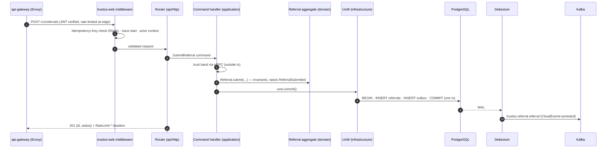

# 03 — Backend Architecture & Complete Folder Structure

> Conforms to `_shared-context.md` (binding). Siblings: `05-data-architecture.md` (schemas), `04-api-design.md` (endpoint catalog & sequence diagrams), `06-algorithms.md` (DTI math), `13-testing-performance.md` (test strategy details).

This document defines **how every TrustOS backend service is built internally**: the canonical Clean Architecture layout in the `platform` monorepo, the DDD tactical patterns with real Python 3.12 code, the shared `libs/` layer, worker topology (Kafka consumers + Temporal), the testing seams the architecture creates, and the trade-offs we accepted.

The exemplar throughout is **`referral-service`** (service #9 in the registry): it has a real aggregate lifecycle, money, a cross-service saga, and a projection — everything the other 24 services need in one place. Every service copies this shape; none deviates without an ADR.

---

## 1. The `platform` Monorepo

Polyrepo-lite per `_shared-context.md` §5: one backend monorepo (`platform`), plus `mobile` and `infra` repos. Inside `platform`, **each service is independently deployable** (own Dockerfile, own pipeline, own DB) but shares contracts and libraries by path — no internal package registry to babysit, atomic cross-service contract changes, one `uv` workspace.

### 1.1 Top level

```
platform/
├── pyproject.toml                  # uv workspace root: members = ["libs/*", "services/*"]
├── uv.lock                         # single lockfile — one resolved dependency universe
├── ruff.toml                       # shared lint config (services may only tighten)
├── mypy.ini                        # strict mode, per-package overrides
├── justfile                        # dev entrypoints: just test referral-service, just proto-gen
├── .github/
│   └── workflows/
│       ├── ci-service.yml          # reusable: path-filtered per-service test+build+push
│       ├── ci-libs.yml             # libs change → test all dependent services (dependency graph via uv)
│       └── contracts.yml           # buf lint/breaking, spectral lint, schema-registry publish
│
├── contracts/                      # ── the only things services may share at runtime ──
│   ├── proto/
│   │   ├── buf.yaml                # buf lint + breaking-change gates (FILE level)
│   │   ├── buf.gen.yaml            # python + pyi + grpc stubs → contracts/gen/python
│   │   └── trustos/
│   │       ├── events/v1/          # CloudEvents payloads (Protobuf), one file per domain
│   │       │   ├── identity.proto          # UserRegistered, UserVerified, DeviceTrusted, KycCompleted
│   │       │   ├── referral.proto          # ReferralSubmitted, ReferralQualified, ReferralConverted, CommissionSettled
│   │       │   ├── trust.proto             # ScoreUpdated, FactorRecorded, AnomalyDetected
│   │       │   ├── relationship.proto      # InteractionRecorded, ScoreUpdated, ConnectionEstablished
│   │       │   ├── campaign.proto          # MessageSent/Delivered/Read/Replied/Failed
│   │       │   ├── ledger.proto            # EntryPosted, PayoutCompleted
│   │       │   ├── rewards.proto           # XpAwarded, BadgeUnlocked, LevelUp
│   │       │   └── ... (one per event-taxonomy domain)
│   │       ├── rpc/v1/             # internal gRPC service definitions
│   │       │   ├── trust.proto             # TrustService.GetScore, GetBand (hot path, cached)
│   │       │   ├── ledger.proto            # LedgerService.PostEntry, HoldEscrow, ReleaseEscrow
│   │       │   ├── identity.proto          # IdentityService.IntrospectActor
│   │       │   └── ...
│   │       └── common/v1/
│   │           ├── money.proto             # Money {int64 amount_minor; string currency}
│   │           ├── actor.proto             # Actor {actor_type; actor_id} — on every write
│   │           └── ids.proto
│   ├── gen/python/                 # committed generated code (reviewable diffs, no codegen at install)
│   ├── openapi/                    # spec-first REST (see 04-api-design.md §6)
│   │   ├── referral.v1.yaml
│   │   ├── identity.v1.yaml
│   │   └── ...
│   ├── graphql/
│   │   └── bff-mobile.graphql      # BFF SDL — single owner: bff-mobile team
│   └── asyncapi/
│       └── trustos-events.yaml     # human-readable event catalog, generated from proto annotations
│
├── libs/                           # shared Python libraries (§4) — NO business logic, ever
│   ├── trustos-core/               # ids (uuid7 + prefixes), Money, clock, Result, domain-event base
│   ├── trustos-web/                # FastAPI: problem-details, idempotency middleware, pagination, request context
│   ├── trustos-kafka/              # producer (outbox-relay client), idempotent consumer, CloudEvents codec
│   ├── trustos-persistence/        # AsyncSession factory, UnitOfWork base, outbox table + writer, repo helpers
│   ├── trustos-otel/               # tracer/meter/log setup, Kafka header propagation, FastAPI+SQLAlchemy+grpc instrumentors
│   ├── trustos-authz/              # Cerbos client, principal builder, @authorize decorator, scope models
│   ├── trustos-temporal/           # worker bootstrap, interceptors (otel, DI), sandbox-safe converters
│   └── trustos-testing/            # factories, testcontainers fixtures, contract-test harness, fake clock/bus
│
├── services/
│   ├── referral-service/           # ★ fully expanded in §1.2
│   ├── identity-service/
│   ├── profile-service/
│   ├── contact-service/
│   ├── relationship-service/
│   ├── trust-service/
│   ├── networking-service/
│   ├── deal-service/
│   ├── ledger-service/
│   ├── campaign-service/
│   ├── channel-service/
│   ├── community-service/
│   ├── marketplace-service/
│   ├── knowledge-service/
│   ├── rewards-service/
│   ├── leaderboard-service/
│   ├── automation-service/
│   ├── ai-gateway/
│   ├── agent-runtime/
│   ├── notification-service/
│   ├── analytics-service/
│   ├── search-service/
│   ├── media-service/
│   └── bff-mobile/                 # GraphQL (strawberry) — reads only, no DB
│
└── tools/
    ├── outbox-relay/               # Debezium connector configs + smoke tests (CDC per _shared-context §1)
    ├── scaffold/                   # `just new-service <name>` — stamps the canonical layout
    └── dev/                        # docker-compose.dev.yaml: PG, Redis, Kafka(redpanda), Temporal, Cerbos, Qdrant
```

Rules enforced in CI (import-linter contracts):

1. `services/*` may import `libs/*` and `contracts/gen/*` — **never another service**.
2. `libs/*` may import `trustos-core` and third-party only — never a service, never another lib except core.
3. Within a service, dependencies point inward: `api → application → domain`; `infrastructure` implements `domain`/`application` ports and is only referenced by the composition root (`di.py`).

### 1.2 `referral-service` — the canonical exemplar, file by file

```
services/referral-service/
├── pyproject.toml                  # [project] name="referral-service"; deps: fastapi, sqlalchemy[asyncio],
│                                   #   asyncpg, pydantic-settings, dishka, temporalio, grpcio,
│                                   #   trustos-{core,web,kafka,persistence,otel,authz,temporal}
├── Dockerfile                      # distroless python:3.12; uv sync --frozen; non-root; SOURCE_DATE_EPOCH
├── alembic.ini
├── alembic/
│   └── versions/
│       ├── 0001_campaigns_referrals.py     # campaigns, referrals, referral_events tables
│       ├── 0002_outbox.py                  # outbox table (libs/trustos-persistence DDL helper)
│       ├── 0003_processed_events.py        # consumer-side dedup table
│       └── 0004_referral_summary_proj.py   # read-model projection table
│
├── src/referral_service/
│   ├── __init__.py
│   ├── main.py                     # HTTP entrypoint: create_app() — FastAPI + dishka + middleware
│   ├── settings.py                 # pydantic-settings (§2.8)
│   ├── di.py                       # composition root — dishka providers (§2.7)
│   │
│   ├── api/                        # ── delivery layer: translate the outside world ──
│   │   ├── __init__.py
│   │   ├── http/
│   │   │   ├── __init__.py
│   │   │   ├── routers/
│   │   │   │   ├── campaigns.py            # /v1/referral-campaigns CRUD + publish
│   │   │   │   ├── referrals.py            # /v1/referrals submit/get/list/track (§2.6)
│   │   │   │   └── internal.py             # /internal/healthz, /internal/readyz
│   │   │   ├── schemas/
│   │   │   │   ├── campaigns.py            # Pydantic request/response DTOs (camelCase aliases)
│   │   │   │   └── referrals.py
│   │   │   └── dependencies.py             # CurrentActor, IdempotencyKey extractors
│   │   ├── grpc_/
│   │   │   ├── __init__.py
│   │   │   └── referral_servicer.py        # internal gRPC: GetReferralStats (for trust-service factors)
│   │   └── consumers/                      # Kafka event handlers = another delivery mechanism
│   │       ├── __init__.py
│   │       ├── deal_events.py              # deal.deal.won.v1 → ConvertReferral command
│   │       └── identity_events.py          # identity.user.registered.v1 → attribute referred signups
│   │
│   ├── application/                # ── use cases: orchestration, transactions, no domain rules ──
│   │   ├── __init__.py
│   │   ├── commands/
│   │   │   ├── __init__.py
│   │   │   ├── create_campaign.py
│   │   │   ├── publish_campaign.py
│   │   │   ├── submit_referral.py          # §2.5 — the exemplar command handler
│   │   │   ├── qualify_referral.py
│   │   │   ├── convert_referral.py
│   │   │   └── reject_referral.py
│   │   ├── queries/
│   │   │   ├── __init__.py
│   │   │   ├── get_referral.py
│   │   │   ├── list_referrals.py           # cursor pagination over projection
│   │   │   └── get_campaign_stats.py       # §2.6 — reads referral_summary projection
│   │   ├── ports/                          # interfaces owned by application, impl in infrastructure
│   │   │   ├── __init__.py
│   │   │   ├── unit_of_work.py             # UnitOfWork Protocol (§2.4)
│   │   │   ├── trust_gateway.py            # TrustGateway Protocol (gRPC to trust-service)
│   │   │   └── settlement_scheduler.py     # SettlementScheduler Protocol (starts Temporal workflow)
│   │   └── errors.py                       # ApplicationError hierarchy → Problem Details mapping
│   │
│   ├── domain/                     # ── pure business rules: stdlib + trustos-core only ──
│   │   ├── __init__.py
│   │   ├── model/
│   │   │   ├── __init__.py
│   │   │   ├── referral.py                 # Referral aggregate root (§2.2)
│   │   │   ├── campaign.py                 # ReferralCampaign aggregate root
│   │   │   └── value_objects.py            # Money re-export, TrustBand, CommissionScheme (§2.1)
│   │   ├── events.py                       # domain events raised by aggregates (§2.3)
│   │   ├── repositories.py                 # ReferralRepository / CampaignRepository Protocols (§2.4)
│   │   ├── services/
│   │   │   ├── __init__.py
│   │   │   └── commission_policy.py        # pure fn: compute commission from scheme + deal value
│   │   └── errors.py                       # DomainError hierarchy (invariant violations)
│   │
│   ├── infrastructure/             # ── adapters: DB, Kafka, gRPC clients, Temporal ──
│   │   ├── __init__.py
│   │   ├── db/
│   │   │   ├── __init__.py
│   │   │   ├── tables.py                   # SQLAlchemy Core Table objects (imperative mapping)
│   │   │   ├── mapping.py                  # aggregate ↔ row mappers (no ORM classes in domain)
│   │   │   ├── referral_repository.py      # SqlAlchemyReferralRepository (§2.4)
│   │   │   ├── campaign_repository.py
│   │   │   └── unit_of_work.py             # SqlAlchemyUnitOfWork + outbox write (§2.4)
│   │   ├── projections/
│   │   │   ├── __init__.py
│   │   │   └── referral_summary.py         # consumes own events → referral_summary table
│   │   ├── gateways/
│   │   │   ├── __init__.py
│   │   │   └── trust_grpc.py               # TrustGateway impl over contracts/gen rpc stubs
│   │   ├── temporal/
│   │   │   ├── __init__.py
│   │   │   ├── workflows.py                # ReferralSettlementWorkflow (§5.2)
│   │   │   ├── activities.py               # settlement activities (§5.2)
│   │   │   └── scheduler.py                # SettlementScheduler impl (start_workflow)
│   │   └── kafka/
│   │       ├── __init__.py
│   │       └── event_serde.py              # domain event → CloudEvents+protobuf (via trustos-kafka)
│   │
│   └── entrypoints/                # each = one k8s Deployment (§5.1)
│       ├── http_api.py                     # uvicorn main:create_app
│       ├── grpc_api.py                     # grpc.aio server
│       ├── consumer_worker.py              # trustos-kafka ConsumerApp: deal/identity consumers + projection
│       └── temporal_worker.py              # temporal worker: settlement workflows + activities
│
└── tests/
    ├── unit/                       # domain + application; zero I/O; fake UoW/gateways from trustos-testing
    │   ├── domain/test_referral_lifecycle.py
    │   ├── domain/test_commission_policy.py
    │   └── application/test_submit_referral.py
    ├── integration/                # testcontainers: PG + Redpanda; real repos, real outbox
    │   ├── test_referral_repository.py
    │   ├── test_outbox_roundtrip.py
    │   └── test_settlement_workflow.py     # Temporal test env (time-skipping)
    └── contract/
        ├── test_openapi_conformance.py     # schemathesis against contracts/openapi/referral.v1.yaml
        └── test_event_schemas.py           # published events validate against registry schemas
```

Every other service is this tree with different nouns. `bff-mobile` drops `domain/` and `infrastructure/db/` (it owns no data); `ledger-service` adds `domain/model/posting_rules.py` and is append-only; `agent-runtime` adds `domain/agents/` with the 8 named agents.

---

## 2. DDD Tactical Patterns — Real Code

All code below is Python 3.12, mypy-strict-clean, and consistent with `_shared-context.md`: UUIDv7 prefixed IDs, integer minor-unit money, actor model on writes, outbox on every state change.

### 2.1 Value objects — `domain/model/value_objects.py` (+ `libs/trustos-core`)

Money lives in `trustos-core` because ledger, deals, marketplace, and referrals all need the identical type. Frozen dataclasses with `slots` — cheap, hashable, no Pydantic in the domain layer (domain stays framework-free; Pydantic belongs to the API and settings edges).

```python
# libs/trustos-core/src/trustos_core/money.py
from __future__ import annotations

from dataclasses import dataclass
from enum import StrEnum
from typing import Self


class Currency(StrEnum):
    INR = "INR"
    USD = "USD"
    EUR = "EUR"
    AED = "AED"
    SGD = "SGD"
    # extended per launch country; ISO 4217 only


@dataclass(frozen=True, slots=True)
class Money:
    """Integer minor units + ISO 4217. Never floats (shared-context §1)."""

    amount_minor: int
    currency: Currency

    def __post_init__(self) -> None:
        if self.amount_minor < 0:
            raise ValueError("Money is non-negative; direction is a ledger concern")

    def __add__(self, other: Self) -> Money:
        self._assert_same_currency(other)
        return Money(self.amount_minor + other.amount_minor, self.currency)

    def __sub__(self, other: Self) -> Money:
        self._assert_same_currency(other)
        if other.amount_minor > self.amount_minor:
            raise ValueError("Money subtraction would go negative")
        return Money(self.amount_minor - other.amount_minor, self.currency)

    def percentage(self, basis_points: int) -> Money:
        """Commission math in basis points; round half-even like a bank."""
        if not 0 <= basis_points <= 10_000:
            raise ValueError("basis points must be within [0, 10000]")
        # integer math: floor of (amount * bps + 5000) / 10000 == round-half-up on minor units
        return Money((self.amount_minor * basis_points + 5_000) // 10_000, self.currency)

    def _assert_same_currency(self, other: Money) -> None:
        if self.currency is not other.currency:
            raise CurrencyMismatchError(self.currency, other.currency)

    @classmethod
    def zero(cls, currency: Currency) -> Money:
        return cls(0, currency)


class CurrencyMismatchError(ValueError):
    def __init__(self, a: Currency, b: Currency) -> None:
        super().__init__(f"currency mismatch: {a} vs {b}")
```

```python
# services/referral-service/src/referral_service/domain/model/value_objects.py
from __future__ import annotations

from dataclasses import dataclass
from enum import StrEnum

from trustos_core.money import Currency, Money  # noqa: F401  (re-exported for the domain)


class TrustBand(StrEnum):
    """Bands per shared-context §4. Ordered; comparisons use _rank."""

    STARTER = "starter"      # 0–249
    BRONZE = "bronze"        # 250–449
    SILVER = "silver"        # 450–649
    GOLD = "gold"            # 650–849
    PLATINUM = "platinum"    # 850–1000

    @classmethod
    def from_score(cls, dti: int) -> TrustBand:
        if not 0 <= dti <= 1000:
            raise ValueError(f"DTI out of range: {dti}")
        for band, floor in ((cls.PLATINUM, 850), (cls.GOLD, 650), (cls.SILVER, 450), (cls.BRONZE, 250)):
            if dti >= floor:
                return band
        return cls.STARTER

    @property
    def _rank(self) -> int:
        return list(type(self)).index(self)

    def __ge__(self, other: TrustBand) -> bool:  # type: ignore[override]
        return self._rank >= other._rank


@dataclass(frozen=True, slots=True)
class CommissionScheme:
    """How a campaign pays. Exactly one of fixed / rate is set."""

    fixed: Money | None
    rate_basis_points: int | None  # of verified deal value
    min_referrer_band: TrustBand   # anti-gaming: gate high-value campaigns

    def __post_init__(self) -> None:
        if (self.fixed is None) == (self.rate_basis_points is None):
            raise ValueError("exactly one of fixed or rate_basis_points must be set")

    def commission_for(self, deal_value: Money | None) -> Money:
        if self.fixed is not None:
            return self.fixed
        if deal_value is None:
            raise ValueError("rate-based scheme requires a verified deal value")
        assert self.rate_basis_points is not None
        return deal_value.percentage(self.rate_basis_points)
```

### 2.2 Aggregate root — `domain/model/referral.py`

The aggregate is the **only** consistency boundary: one referral == one transaction. State machine enforced in the aggregate, never in handlers or SQL. Events are collected on the instance and drained by the Unit of Work into the outbox — the aggregate never talks to Kafka.

```python
# src/referral_service/domain/model/referral.py
from __future__ import annotations

from dataclasses import dataclass, field
from datetime import UTC, datetime
from enum import StrEnum
from uuid import UUID

from trustos_core.ids import prefixed_uuid7  # -> "ref_018f..." (uuid7, time-ordered)
from trustos_core.events import DomainEvent

from referral_service.domain.errors import InvalidReferralTransition, ReferralWindowClosed
from referral_service.domain.events import (
    ReferralConverted,
    ReferralQualified,
    ReferralRejected,
    ReferralSubmitted,
)
from referral_service.domain.model.value_objects import CommissionScheme, Money, TrustBand


class ReferralStatus(StrEnum):
    SUBMITTED = "submitted"
    QUALIFIED = "qualified"      # prospect verified real & in-scope
    CONVERTED = "converted"      # linked deal won → commission computable
    SETTLED = "settled"          # ledger posted (set by settlement saga, §5.2)
    REJECTED = "rejected"


_ALLOWED: dict[ReferralStatus, frozenset[ReferralStatus]] = {
    ReferralStatus.SUBMITTED: frozenset({ReferralStatus.QUALIFIED, ReferralStatus.REJECTED}),
    ReferralStatus.QUALIFIED: frozenset({ReferralStatus.CONVERTED, ReferralStatus.REJECTED}),
    ReferralStatus.CONVERTED: frozenset({ReferralStatus.SETTLED}),
    ReferralStatus.SETTLED: frozenset(),
    ReferralStatus.REJECTED: frozenset(),
}


@dataclass
class Referral:
    """Aggregate root. Invariants:
    - transitions only along _ALLOWED
    - a referral converts at most once, settles at most once
    - commission derives from the campaign scheme captured AT SUBMISSION (schemes may change later)
    - self-referrals are structurally impossible (checked at construction)
    """

    id: str                                   # "ref_..."
    campaign_id: str                          # "cmp_..."
    referrer_id: str                          # "usr_..."
    prospect_contact_id: str                  # contact-service ref, PII stays there
    org_id: str                               # campaign owner "org_..."
    scheme_snapshot: CommissionScheme
    status: ReferralStatus
    submitted_at: datetime
    version: int = 0                          # optimistic concurrency (see repository)
    converted_deal_id: str | None = None
    commission: Money | None = None
    _events: list[DomainEvent] = field(default_factory=list, repr=False)

    # ---- factory --------------------------------------------------------

    @classmethod
    def submit(
        cls,
        *,
        campaign_id: str,
        referrer_id: str,
        referrer_band: TrustBand,
        prospect_contact_id: str,
        prospect_owner_id: str,
        org_id: str,
        scheme: CommissionScheme,
        campaign_open: bool,
        now: datetime,
    ) -> Referral:
        if not campaign_open:
            raise ReferralWindowClosed(campaign_id)
        if referrer_id == prospect_owner_id:
            raise InvalidReferralTransition("self-referral is not allowed")
        if not referrer_band >= scheme.min_referrer_band:
            raise InvalidReferralTransition(
                f"campaign requires trust band >= {scheme.min_referrer_band}, referrer is {referrer_band}"
            )
        referral = cls(
            id=prefixed_uuid7("ref"),
            campaign_id=campaign_id,
            referrer_id=referrer_id,
            prospect_contact_id=prospect_contact_id,
            org_id=org_id,
            scheme_snapshot=scheme,
            status=ReferralStatus.SUBMITTED,
            submitted_at=now,
        )
        referral._raise(
            ReferralSubmitted(
                referral_id=referral.id,
                campaign_id=campaign_id,
                referrer_id=referrer_id,
                org_id=org_id,
                occurred_at=now,
            )
        )
        return referral

    # ---- behaviour ------------------------------------------------------

    def qualify(self, *, qualified_by: str, now: datetime) -> None:
        self._transition(ReferralStatus.QUALIFIED)
        self._raise(ReferralQualified(referral_id=self.id, referrer_id=self.referrer_id,
                                      campaign_id=self.campaign_id, qualified_by=qualified_by,
                                      occurred_at=now))

    def convert(self, *, deal_id: str, deal_value: Money | None, now: datetime) -> None:
        self._transition(ReferralStatus.CONVERTED)
        self.converted_deal_id = deal_id
        self.commission = self.scheme_snapshot.commission_for(deal_value)
        self._raise(ReferralConverted(referral_id=self.id, referrer_id=self.referrer_id,
                                      campaign_id=self.campaign_id, deal_id=deal_id,
                                      commission_minor=self.commission.amount_minor,
                                      commission_currency=self.commission.currency,
                                      occurred_at=now))

    def mark_settled(self, *, now: datetime) -> None:
        """Terminal transition, invoked only by the settlement saga after ledger posting."""
        self._transition(ReferralStatus.SETTLED)
        # trust.referral factor + rewards.xp are driven by referral.commission.settled.v1,
        # which the saga's final activity emits through the ledger outbox (§5.2).

    def reject(self, *, reason: str, now: datetime) -> None:
        self._transition(ReferralStatus.REJECTED)
        self._raise(ReferralRejected(referral_id=self.id, referrer_id=self.referrer_id,
                                     campaign_id=self.campaign_id, reason=reason, occurred_at=now))

    # ---- plumbing -------------------------------------------------------

    def _transition(self, to: ReferralStatus) -> None:
        if to not in _ALLOWED[self.status]:
            raise InvalidReferralTransition(f"{self.status} -> {to} not allowed for {self.id}")
        self.status = to

    def _raise(self, event: DomainEvent) -> None:
        self._events.append(event)

    def collect_events(self) -> list[DomainEvent]:
        events, self._events = self._events, []
        return events
```

### 2.3 Domain events — `domain/events.py`

Domain events are frozen, past-tense, aggregate-scoped facts. They map 1:1 to the Kafka taxonomy (`referral.referral.submitted.v1` etc.) but the domain layer knows nothing about Kafka, CloudEvents, or protobuf — `infrastructure/kafka/event_serde.py` owns that translation.

```python
# src/referral_service/domain/events.py
from __future__ import annotations

from dataclasses import dataclass, field
from datetime import datetime
from uuid import UUID, uuid4

from trustos_core.money import Currency


@dataclass(frozen=True, slots=True, kw_only=True)
class DomainEvent:  # actually lives in trustos_core.events; shown here for completeness
    event_id: UUID = field(default_factory=uuid4)
    occurred_at: datetime


@dataclass(frozen=True, slots=True, kw_only=True)
class ReferralSubmitted(DomainEvent):
    referral_id: str
    campaign_id: str
    referrer_id: str
    org_id: str
    # wire: topic trustos.referral.referral, type referral.referral.submitted.v1


@dataclass(frozen=True, slots=True, kw_only=True)
class ReferralQualified(DomainEvent):
    referral_id: str
    campaign_id: str
    referrer_id: str
    qualified_by: str            # actor id — org member or system rule


@dataclass(frozen=True, slots=True, kw_only=True)
class ReferralConverted(DomainEvent):
    referral_id: str
    campaign_id: str
    referrer_id: str
    deal_id: str
    commission_minor: int
    commission_currency: Currency


@dataclass(frozen=True, slots=True, kw_only=True)
class ReferralRejected(DomainEvent):
    referral_id: str
    campaign_id: str
    referrer_id: str
    reason: str
```

The serde (registered per event class) produces the CloudEvents envelope with protobuf payloads from `contracts/gen/python/trustos/events/v1/referral_pb2.py`, sets `partition key = referrer_id` (ordering per shared-context §3 is per-aggregate; referrer is the aggregate whose downstream projections care about order), and stamps `traceparent` into Kafka headers.

### 2.4 Repository (domain port) + SQLAlchemy implementation + Unit of Work with outbox

Domain owns the interface; infrastructure owns SQLAlchemy. We use **imperative (Core Table) mapping**, not declarative ORM classes, so the aggregate stays a plain dataclass with no metaclass magic and no lazy-loading surprises.

```python
# src/referral_service/domain/repositories.py
from __future__ import annotations

from typing import Protocol

from referral_service.domain.model.referral import Referral


class ReferralRepository(Protocol):
    async def get(self, referral_id: str) -> Referral | None: ...
    async def get_for_update(self, referral_id: str) -> Referral | None: ...
    async def find_open_by_prospect(self, campaign_id: str, prospect_contact_id: str) -> Referral | None: ...
    def add(self, referral: Referral) -> None: ...
    # NB: no save()/update() — UoW flushes tracked aggregates; no delete — referrals are never erased
```

```python
# src/referral_service/infrastructure/db/tables.py
import sqlalchemy as sa

metadata = sa.MetaData(schema="referral")

referrals = sa.Table(
    "referrals", metadata,
    sa.Column("id", sa.Text, primary_key=True),                    # "ref_<uuid7>"
    sa.Column("campaign_id", sa.Text, nullable=False, index=True),
    sa.Column("referrer_id", sa.Text, nullable=False, index=True),
    sa.Column("prospect_contact_id", sa.Text, nullable=False),
    sa.Column("org_id", sa.Text, nullable=False, index=True),
    sa.Column("status", sa.Text, nullable=False),
    sa.Column("scheme_snapshot", sa.dialects.postgresql.JSONB, nullable=False),
    sa.Column("converted_deal_id", sa.Text),
    sa.Column("commission_minor", sa.BigInteger),
    sa.Column("commission_currency", sa.Text),
    sa.Column("submitted_at", sa.TIMESTAMP(timezone=True), nullable=False),
    sa.Column("version", sa.Integer, nullable=False, server_default="0"),
    sa.UniqueConstraint("campaign_id", "prospect_contact_id", name="uq_one_open_referral_per_prospect"),
)

# outbox DDL comes from trustos_persistence.outbox.make_outbox_table(metadata)
```

```python
# src/referral_service/infrastructure/db/referral_repository.py
from __future__ import annotations

import sqlalchemy as sa
from sqlalchemy.ext.asyncio import AsyncSession

from referral_service.domain.model.referral import Referral
from referral_service.infrastructure.db import tables
from referral_service.infrastructure.db.mapping import referral_from_row, referral_to_row


class SqlAlchemyReferralRepository:
    """Implements domain ReferralRepository. Tracks loaded/added aggregates for the UoW."""

    def __init__(self, session: AsyncSession) -> None:
        self._session = session
        self.seen: dict[str, tuple[Referral, int]] = {}   # id -> (aggregate, loaded_version)

    async def get(self, referral_id: str) -> Referral | None:
        return await self._load(sa.select(tables.referrals).where(tables.referrals.c.id == referral_id))

    async def get_for_update(self, referral_id: str) -> Referral | None:
        stmt = (sa.select(tables.referrals)
                .where(tables.referrals.c.id == referral_id)
                .with_for_update())
        return await self._load(stmt)

    async def find_open_by_prospect(self, campaign_id: str, prospect_contact_id: str) -> Referral | None:
        stmt = sa.select(tables.referrals).where(
            tables.referrals.c.campaign_id == campaign_id,
            tables.referrals.c.prospect_contact_id == prospect_contact_id,
            tables.referrals.c.status.notin_(("rejected",)),
        )
        return await self._load(stmt)

    def add(self, referral: Referral) -> None:
        self.seen[referral.id] = (referral, -1)           # -1 => INSERT on flush

    async def flush(self) -> None:
        """Called by the UoW inside the transaction. Optimistic concurrency via version."""
        for referral, loaded_version in self.seen.values():
            row = referral_to_row(referral)
            if loaded_version == -1:
                await self._session.execute(sa.insert(tables.referrals).values(**row))
            else:
                row["version"] = loaded_version + 1
                result = await self._session.execute(
                    sa.update(tables.referrals)
                    .where(tables.referrals.c.id == referral.id,
                           tables.referrals.c.version == loaded_version)
                    .values(**row)
                )
                if result.rowcount != 1:
                    raise StaleAggregateError(referral.id)

    async def _load(self, stmt: sa.Select) -> Referral | None:
        row = (await self._session.execute(stmt)).mappings().one_or_none()
        if row is None:
            return None
        referral = referral_from_row(row)
        self.seen[referral.id] = (referral, row["version"])
        return referral


class StaleAggregateError(Exception):
    """Concurrent write lost the optimistic-lock race; handlers retry the command."""
```

The Unit of Work is where the **transactional outbox** happens — the single most important correctness mechanism in the platform (shared-context §1: outbox + Debezium CDC for every state change). Aggregate rows and outbox rows commit in **one** Postgres transaction; Debezium tails the WAL and publishes to Kafka. No dual-write, no lost events.

```python
# src/referral_service/infrastructure/db/unit_of_work.py
from __future__ import annotations

from types import TracebackType

from sqlalchemy.ext.asyncio import AsyncSession, async_sessionmaker

from trustos_persistence.outbox import OutboxWriter          # serializes DomainEvent → CloudEvents/protobuf row
from referral_service.infrastructure.db.referral_repository import SqlAlchemyReferralRepository
from referral_service.infrastructure.db.campaign_repository import SqlAlchemyCampaignRepository


class SqlAlchemyUnitOfWork:
    """Implements application.ports.unit_of_work.UnitOfWork.

    Contract: exactly-once state+events atomically, or nothing.
      async with uow:
          ... mutate aggregates via uow.referrals / uow.campaigns ...
          await uow.commit()
    """

    def __init__(self, session_factory: async_sessionmaker[AsyncSession], outbox: OutboxWriter) -> None:
        self._session_factory = session_factory
        self._outbox = outbox

    async def __aenter__(self) -> "SqlAlchemyUnitOfWork":
        self._session = self._session_factory()
        self.referrals = SqlAlchemyReferralRepository(self._session)
        self.campaigns = SqlAlchemyCampaignRepository(self._session)
        return self

    async def commit(self) -> None:
        await self.referrals.flush()
        await self.campaigns.flush()
        events = [e for repo in (self.referrals, self.campaigns)
                  for agg, _ in repo.seen.values()
                  for e in agg.collect_events()]
        if events:
            # INSERT INTO referral.outbox (id, topic, key, type, payload, headers, created_at)
            await self._outbox.write(self._session, events)
        await self._session.commit()

    async def rollback(self) -> None:
        await self._session.rollback()

    async def __aexit__(self, exc_type: type[BaseException] | None,
                        exc: BaseException | None, tb: TracebackType | None) -> None:
        try:
            if exc_type is not None:
                await self.rollback()
        finally:
            await self._session.close()
```

**Why Debezium CDC over a poller:** a polling relay adds 100–500 ms latency and a `SELECT ... FOR UPDATE SKIP LOCKED` hot loop on every service DB; Debezium reads the WAL with near-zero DB load, preserves commit order, and is one connector config per service (managed in `tools/outbox-relay/`). Alternative rejected: Kafka transactions from the app (dual-write window remains on crash between DB commit and Kafka send).

### 2.5 Application command handler (CQRS command side)

Handlers are thin: load, invoke aggregate, commit, kick off follow-on process. All I/O behind ports. The handler is what unit tests exercise with fakes.

```python
# src/referral_service/application/commands/submit_referral.py
from __future__ import annotations

from dataclasses import dataclass
from datetime import UTC, datetime

from referral_service.application.errors import CampaignNotFound, DuplicateReferral
from referral_service.application.ports.trust_gateway import TrustGateway
from referral_service.application.ports.unit_of_work import UnitOfWork
from referral_service.domain.model.referral import Referral
from referral_service.domain.model.value_objects import TrustBand


@dataclass(frozen=True, slots=True)
class SubmitReferral:
    """Command DTO. actor_* per shared-context tenancy model."""
    campaign_id: str
    prospect_contact_id: str
    prospect_owner_id: str
    actor_type: str          # "user" — referrals are personal even when campaign is org-owned
    actor_id: str            # referrer "usr_..."


@dataclass(frozen=True, slots=True)
class SubmitReferralResult:
    referral_id: str
    status: str


class SubmitReferralHandler:
    def __init__(self, uow: UnitOfWork, trust: TrustGateway) -> None:
        self._uow = uow
        self._trust = trust

    async def handle(self, cmd: SubmitReferral) -> SubmitReferralResult:
        # cross-service read BEFORE the transaction (never hold a DB tx across a network call)
        band: TrustBand = await self._trust.get_band(cmd.actor_id)

        async with self._uow as uow:
            campaign = await uow.campaigns.get(cmd.campaign_id)
            if campaign is None:
                raise CampaignNotFound(cmd.campaign_id)

            existing = await uow.referrals.find_open_by_prospect(cmd.campaign_id, cmd.prospect_contact_id)
            if existing is not None:
                raise DuplicateReferral(existing.id)   # 409 + existing id in Problem Details

            referral = Referral.submit(
                campaign_id=campaign.id,
                referrer_id=cmd.actor_id,
                referrer_band=band,
                prospect_contact_id=cmd.prospect_contact_id,
                prospect_owner_id=cmd.prospect_owner_id,
                org_id=campaign.org_id,
                scheme=campaign.scheme,
                campaign_open=campaign.is_open(now=datetime.now(UTC)),
                now=datetime.now(UTC),
            )
            uow.referrals.add(referral)
            await uow.commit()   # referral row + outbox(referral.referral.submitted.v1) atomically

        return SubmitReferralResult(referral_id=referral.id, status=referral.status)
```

The race the unique constraint closes: two concurrent submits for the same prospect both pass `find_open_by_prospect`; the second `commit()` violates `uq_one_open_referral_per_prospect` and the handler maps it to `DuplicateReferral`. Belt (check) and braces (constraint).

### 2.6 Query handler (CQRS read side) reading a projection

Queries **never** touch aggregates or the UoW. They read denormalized projection tables maintained by the service's own consumer (`infrastructure/projections/referral_summary.py`, fed by its own events — same pattern external consumers use). This keeps the write model narrow and lets reads scale independently (read replicas).

```python
# src/referral_service/application/queries/get_campaign_stats.py
from __future__ import annotations

from dataclasses import dataclass

import sqlalchemy as sa
from sqlalchemy.ext.asyncio import AsyncSession


@dataclass(frozen=True, slots=True)
class CampaignStats:
    campaign_id: str
    submitted: int
    qualified: int
    converted: int
    settled: int
    conversion_rate: float           # Wilson-smoothed by trust-service; this is the raw rate
    commission_paid_minor: int
    commission_currency: str | None


class GetCampaignStatsHandler:
    """Reads referral.referral_summary — one row per campaign, updated by the projection consumer."""

    def __init__(self, session: AsyncSession) -> None:
        self._session = session

    async def handle(self, campaign_id: str, org_id: str) -> CampaignStats | None:
        stmt = sa.text("""
            SELECT campaign_id, submitted, qualified, converted, settled,
                   CASE WHEN qualified = 0 THEN 0.0
                        ELSE converted::float / qualified END AS conversion_rate,
                   commission_paid_minor, commission_currency
            FROM referral.referral_summary
            WHERE campaign_id = :campaign_id AND org_id = :org_id
        """)
        row = (await self._session.execute(stmt, {"campaign_id": campaign_id, "org_id": org_id})) \
            .mappings().one_or_none()
        return CampaignStats(**row) if row else None
```

### 2.7 Composition root — `di.py` with **dishka**

**Choice: dishka.** Justification: (a) real scopes — `APP` (engines, Kafka producer, settings) vs `REQUEST` (session, UoW, handlers) — which FastAPI's `Depends` fakes badly and hand-rolled providers reimplement poorly; (b) framework-agnostic: the **same container** wires FastAPI routers, gRPC servicers, Kafka consumers, and Temporal activities — with `Depends` we'd hand-roll DI for the three non-HTTP entrypoints anyway; (c) validates the graph at container build, so a missing provider fails at startup, not on the first request; (d) zero global state, trivially overridable in tests. Alternatives rejected: FastAPI `Depends` (HTTP-only, no true app scope), `dependency-injector` (heavy declarative containers, weaker typing), hand-rolled (becomes an unowned mini-framework by service #5).

```python
# src/referral_service/di.py
from __future__ import annotations

from dishka import Provider, Scope, make_async_container, provide
from sqlalchemy.ext.asyncio import AsyncEngine, AsyncSession, async_sessionmaker, create_async_engine
from temporalio.client import Client as TemporalClient

from trustos_authz.client import CerbosClient
from trustos_persistence.outbox import OutboxWriter
from referral_service.application.commands.submit_referral import SubmitReferralHandler
from referral_service.application.ports.trust_gateway import TrustGateway
from referral_service.application.ports.unit_of_work import UnitOfWork
from referral_service.application.queries.get_campaign_stats import GetCampaignStatsHandler
from referral_service.infrastructure.db.unit_of_work import SqlAlchemyUnitOfWork
from referral_service.infrastructure.gateways.trust_grpc import GrpcTrustGateway
from referral_service.settings import Settings


class AppProvider(Provider):
    scope = Scope.APP

    @provide
    def settings(self) -> Settings:
        return Settings()

    @provide
    def engine(self, settings: Settings) -> AsyncEngine:
        return create_async_engine(str(settings.database_url), pool_size=settings.db_pool_size,
                                   pool_pre_ping=True)

    @provide
    def session_factory(self, engine: AsyncEngine) -> async_sessionmaker[AsyncSession]:
        return async_sessionmaker(engine, expire_on_commit=False)

    @provide
    def outbox_writer(self, settings: Settings) -> OutboxWriter:
        return OutboxWriter(source=f"//trustos/{settings.service_name}", schema="referral")

    @provide
    async def temporal(self, settings: Settings) -> TemporalClient:
        return await TemporalClient.connect(settings.temporal_address, namespace=settings.temporal_namespace)

    @provide
    def cerbos(self, settings: Settings) -> CerbosClient:
        return CerbosClient(settings.cerbos_address)   # sidecar, plaintext localhost


class RequestProvider(Provider):
    scope = Scope.REQUEST

    @provide
    def uow(self, sf: async_sessionmaker[AsyncSession], outbox: OutboxWriter) -> UnitOfWork:
        return SqlAlchemyUnitOfWork(sf, outbox)

    @provide
    def trust_gateway(self, settings: Settings) -> TrustGateway:
        return GrpcTrustGateway(settings.trust_grpc_address)   # channel pooled at APP scope internally

    @provide
    async def session(self, sf: async_sessionmaker[AsyncSession]) -> AsyncSession:
        async with sf() as session:                            # read-only session for queries
            yield session

    submit_referral = provide(SubmitReferralHandler)
    campaign_stats = provide(GetCampaignStatsHandler)


def build_container():
    return make_async_container(AppProvider(), RequestProvider())
```

```python
# src/referral_service/api/http/routers/referrals.py
from __future__ import annotations

from dishka.integrations.fastapi import DishkaRoute, FromDishka
from fastapi import APIRouter, status

from trustos_web.context import CurrentActor           # extracted from gateway-verified JWT claims
from referral_service.application.commands.submit_referral import (
    SubmitReferral, SubmitReferralHandler,
)
from referral_service.api.http.schemas.referrals import SubmitReferralRequest, ReferralResponse

router = APIRouter(prefix="/v1/referrals", tags=["referrals"], route_class=DishkaRoute)


@router.post("", status_code=status.HTTP_201_CREATED, response_model=ReferralResponse)
async def submit_referral(
    body: SubmitReferralRequest,
    actor: CurrentActor,                                # Annotated dependency; enforces actor model
    handler: FromDishka[SubmitReferralHandler],
) -> ReferralResponse:
    """Idempotency, authz (Cerbos `referral:submit`), rate limiting and Problem Details
    are middleware from trustos-web / trustos-authz — routers stay one call deep."""
    result = await handler.handle(SubmitReferral(
        campaign_id=body.campaign_id,
        prospect_contact_id=body.prospect_contact_id,
        prospect_owner_id=body.prospect_owner_id,
        actor_type=actor.actor_type,
        actor_id=actor.actor_id,
    ))
    return ReferralResponse(id=result.referral_id, status=result.status)
```

```python
# src/referral_service/main.py
from contextlib import asynccontextmanager

from dishka.integrations.fastapi import setup_dishka
from fastapi import FastAPI

from trustos_otel.setup import init_telemetry
from trustos_web.errors import install_problem_details
from trustos_web.idempotency import IdempotencyMiddleware
from referral_service.api.http.routers import campaigns, internal, referrals
from referral_service.di import build_container
from referral_service.settings import Settings


def create_app() -> FastAPI:
    settings = Settings()
    init_telemetry(service_name=settings.service_name, otlp_endpoint=str(settings.otlp_endpoint))

    @asynccontextmanager
    async def lifespan(app: FastAPI):
        yield
        await app.state.dishka_container.close()

    app = FastAPI(title="referral-service", version="1.0.0", lifespan=lifespan,
                  openapi_url=None)          # spec-first: served spec is contracts/openapi/referral.v1.yaml
    setup_dishka(build_container(), app)
    install_problem_details(app)             # RFC 9457 handlers (§4.2)
    app.add_middleware(IdempotencyMiddleware, redis_url=str(settings.redis_url))
    app.include_router(referrals.router)
    app.include_router(campaigns.router)
    app.include_router(internal.router)
    return app
```

### 2.8 Settings — pydantic-settings

```python
# src/referral_service/settings.py
from pydantic import PostgresDsn, RedisDsn, AnyHttpUrl, Field, SecretStr
from pydantic_settings import BaseSettings, SettingsConfigDict


class Settings(BaseSettings):
    """12-factor: env vars only in k8s; .env for local dev. Secrets via External Secrets
    Operator → env; SecretStr keeps them out of repr/logs."""

    model_config = SettingsConfigDict(env_prefix="REFERRAL_", env_file=".env", frozen=True)

    service_name: str = "referral-service"
    environment: str = Field(pattern="^(local|dev|staging|prod)$", default="local")
    region: str = "ap-south-1"                       # cell identity (shared-context §1)

    database_url: PostgresDsn                        # postgresql+asyncpg://...
    db_pool_size: int = 10
    redis_url: RedisDsn
    kafka_bootstrap: str = "kafka:9092"
    schema_registry_url: AnyHttpUrl
    temporal_address: str = "temporal-frontend:7233"
    temporal_namespace: str = "referral"
    trust_grpc_address: str = "trust-service:50051"
    cerbos_address: str = "localhost:3593"           # sidecar
    otlp_endpoint: AnyHttpUrl = "http://otel-collector:4318"  # type: ignore[assignment]

    kafka_sasl_password: SecretStr | None = None
```

---

## 3. Request Lifecycle (write path)



Read path skips application/domain write machinery entirely: router → query handler → projection table (or Redis for hot reads). CQRS here means **separated models**, not separated databases — until a service proves it needs a physically separate read store (leaderboard-service already does: Redis sorted sets).

---

## 4. Cross-Cutting Libraries (`libs/`)

| Library | Contents | Notes |
|---|---|---|
| `trustos-core` | `prefixed_uuid7()`, `Money`, `Clock` protocol + `SystemClock`/`FakeClock`, `DomainEvent`, `Result[T, E]` | zero third-party deps |
| `trustos-web` | Problem Details (RFC 9457) exception handlers + error catalog types, `IdempotencyMiddleware` (§4.1), cursor pagination codec (`encode_cursor`/`decode_cursor`, HMAC-signed opaque base64), `CurrentActor` request context, camelCase alias base model | FastAPI-coupled by design |
| `trustos-kafka` | CloudEvents 1.0 codec (protobuf payloads, Schema Registry), `ConsumerApp` idempotent consumer runtime (§4.2), DLQ conventions (`<topic>.dlq`), trace-context header propagation | aiokafka underneath |
| `trustos-persistence` | `make_outbox_table()`, `OutboxWriter`, UoW base helpers, `processed_events` dedup table DDL | |
| `trustos-otel` | one-call `init_telemetry()`: OTLP exporters, FastAPI/SQLAlchemy/aiokafka/grpc-aio auto-instrumentation, log correlation (trace_id in every log line), Sentry init | |
| `trustos-authz` | `CerbosClient`, `Principal` builder (user/org/community roles + ABAC attrs like trust band, region), `@authorize(action, resource)` decorator for handlers | Cerbos sidecar per pod |
| `trustos-temporal` | worker bootstrap with dishka activity injection, otel interceptor, pydantic payload converter | |
| `trustos-testing` | testcontainers fixtures (PG, Redis, Redpanda, Temporal, Cerbos), `FakeUnitOfWork`, `InMemoryBus`, factories (polyfactory), schemathesis/pact harness | dev-dependency only |

The two most interesting, in full:

### 4.1 Idempotency middleware (`trustos-web`)

Semantics (shared-context §5: `Idempotency-Key`, 24 h in Redis): first request **reserves** the key and stores a fingerprint of the request body; concurrent duplicates get `409` with `retry-after`; completed duplicates **replay the stored response**; same key + different body is a client bug → `422 idempotency-key-reuse`.

```python
# libs/trustos-web/src/trustos_web/idempotency.py
from __future__ import annotations

import hashlib
import json

import redis.asyncio as redis
from starlette.middleware.base import BaseHTTPMiddleware, RequestResponseEndpoint
from starlette.requests import Request
from starlette.responses import JSONResponse, Response

_TTL = 24 * 3600
_MUTATING = frozenset({"POST", "PATCH", "PUT", "DELETE"})


class IdempotencyMiddleware(BaseHTTPMiddleware):
    def __init__(self, app, redis_url: str) -> None:
        super().__init__(app)
        self._redis = redis.from_url(redis_url, decode_responses=True)

    async def dispatch(self, request: Request, call_next: RequestResponseEndpoint) -> Response:
        key = request.headers.get("Idempotency-Key")
        if request.method not in _MUTATING or key is None:
            return await call_next(request)

        actor = request.headers.get("x-actor-id", "anon")            # set by gateway from JWT
        body = await request.body()
        fingerprint = hashlib.sha256(body + request.url.path.encode()).hexdigest()
        rkey = f"idem:{actor}:{key}"

        # atomically reserve: {state: in_flight, fp: ...}
        reserved = await self._redis.set(
            rkey, json.dumps({"state": "in_flight", "fp": fingerprint}), nx=True, ex=_TTL
        )
        if not reserved:
            stored = json.loads(await self._redis.get(rkey) or "{}")
            if stored.get("fp") != fingerprint:
                return _problem(422, "idempotency-key-reuse",
                                "Idempotency-Key was already used with a different request body")
            if stored.get("state") == "in_flight":
                return _problem(409, "request-in-flight",
                                "An identical request is being processed", retry_after=1)
            return Response(content=stored["body"], status_code=stored["status"],
                            headers={**stored["headers"], "Idempotency-Replayed": "true"})

        response = await call_next(request)
        if response.status_code < 500:                                # never replay transient failures
            body_bytes = b"".join([chunk async for chunk in response.body_iterator])
            await self._redis.set(rkey, json.dumps({
                "state": "done", "fp": fingerprint, "status": response.status_code,
                "headers": {"content-type": response.headers.get("content-type", "application/json")},
                "body": body_bytes.decode(),
            }), ex=_TTL)
            return Response(content=body_bytes, status_code=response.status_code,
                            headers=dict(response.headers))
        await self._redis.delete(rkey)                                # allow retry after 5xx
        return response


def _problem(status: int, slug: str, detail: str, retry_after: int | None = None) -> JSONResponse:
    headers = {"Retry-After": str(retry_after)} if retry_after else {}
    return JSONResponse(
        {"type": f"https://api.trustos.com/problems/{slug}", "title": slug.replace("-", " "),
         "status": status, "detail": detail},
        status_code=status, media_type="application/problem+json", headers=headers,
    )
```

### 4.2 Idempotent Kafka consumer (`trustos-kafka`)

At-least-once delivery (shared-context §3) means every consumer must dedup by `event_id`. The wrapper makes the **dedup record and the handler's DB writes share one transaction** — the only way "processed exactly once" is actually true.

```python
# libs/trustos-kafka/src/trustos_kafka/consumer.py
from __future__ import annotations

import logging
from collections.abc import Awaitable, Callable
from typing import Any

import sqlalchemy as sa
from aiokafka import AIOKafkaConsumer, ConsumerRecord
from sqlalchemy.ext.asyncio import AsyncSession, async_sessionmaker

from trustos_kafka.cloudevents import decode_cloudevent, CloudEvent
from trustos_otel.propagation import context_from_kafka_headers

log = logging.getLogger(__name__)

Handler = Callable[[CloudEvent, AsyncSession], Awaitable[None]]


class ConsumerApp:
    """Register handlers by CloudEvents `type`; runtime guarantees:
    - per-event dedup via processed_events(event_id) inside the handler's transaction
    - poison messages → <topic>.dlq after max_attempts, offset committed (no head-of-line blocking)
    - trace context restored from Kafka headers
    Offsets are committed AFTER the DB transaction commits: crash between them = redelivery,
    which dedup absorbs. At-least-once + idempotent handler = effectively-once.
    """

    def __init__(self, *, bootstrap: str, group_id: str,
                 session_factory: async_sessionmaker[AsyncSession],
                 dlq_producer: "Producer", max_attempts: int = 5) -> None:
        self._handlers: dict[str, Handler] = {}
        self._topics: set[str] = set()
        self._sf = session_factory
        self._dlq = dlq_producer
        self._max_attempts = max_attempts
        self._consumer = AIOKafkaConsumer(
            bootstrap_servers=bootstrap, group_id=group_id,
            enable_auto_commit=False, isolation_level="read_committed",
        )

    def on(self, topic: str, event_type: str) -> Callable[[Handler], Handler]:
        def register(fn: Handler) -> Handler:
            self._handlers[event_type] = fn
            self._topics.add(topic)
            return fn
        return register

    async def run(self) -> None:
        self._consumer.subscribe(list(self._topics))
        await self._consumer.start()
        try:
            async for record in self._consumer:
                await self._process(record)
                await self._consumer.commit()
        finally:
            await self._consumer.stop()

    async def _process(self, record: ConsumerRecord) -> None:
        event = decode_cloudevent(record)                      # envelope + protobuf payload
        handler = self._handlers.get(event.type)
        if handler is None:
            return                                             # not ours; topic carries multiple types
        with context_from_kafka_headers(record.headers):       # resume trace
            for attempt in range(1, self._max_attempts + 1):
                try:
                    async with self._sf() as session, session.begin():
                        claimed = await session.execute(sa.text(
                            "INSERT INTO processed_events (event_id, consumer_group) "
                            "VALUES (:eid, :grp) ON CONFLICT DO NOTHING"
                        ), {"eid": str(event.id), "grp": self._consumer._group_id})
                        if claimed.rowcount == 0:
                            log.info("duplicate event skipped", extra={"event_id": str(event.id)})
                            return
                        await handler(event, session)          # handler writes share this tx
                    return
                except Exception:
                    log.exception("handler failed", extra={"event_id": str(event.id), "attempt": attempt})
                    if attempt == self._max_attempts:
                        await self._dlq.send(f"{record.topic}.dlq", record)   # alert on dlq depth
                        return
```

Usage in referral-service (`api/consumers/deal_events.py`):

```python
@consumer_app.on(topic="trustos.deal.deal", event_type="deal.deal.won.v1")
async def on_deal_won(event: CloudEvent, session: AsyncSession) -> None:
    payload = DealWon()                       # contracts/gen protobuf
    payload.ParseFromString(event.data)
    if not payload.referral_id:
        return
    await convert_referral(session, referral_id=payload.referral_id,
                           deal_id=payload.deal_id,
                           deal_value=Money(payload.value.amount_minor, Currency(payload.value.currency)))
    # conversion starts the settlement saga — see §5.2
```

---

## 5. Background Workers & Temporal

### 5.1 Worker process topology (per service)

Each service ships **one image, multiple entrypoints**, each its own k8s Deployment with independent HPA — API latency never competes with consumer lag or workflow throughput:

| Deployment | Entrypoint | Scaling signal |
|---|---|---|
| `referral-api` | `entrypoints/http_api.py` | RPS / p99 latency (HPA on custom metric) |
| `referral-grpc` | `entrypoints/grpc_api.py` | RPS (only if the service serves internal RPC) |
| `referral-consumer` | `entrypoints/consumer_worker.py` | Kafka lag (KEDA `kafka` scaler) |
| `referral-temporal-worker` | `entrypoints/temporal_worker.py` | Temporal task-queue backlog (KEDA) |

Temporal namespaces are per-bounded-context (`referral`, `automation`, `contact-import`, `campaign-send`, `kyc`), task queues per workflow family (`referral-settlement`). Which services actually run Temporal workers: identity (KYC), contact (import), referral (settlement), campaign (sends), automation (all user journeys), marketplace (order fulfilment). Everything else uses Kafka consumers only.

Rule of thumb (extends shared-context §1 "Workflows"): **Kafka consumer** for single-step reactions to facts; **Temporal** the moment a process has ≥2 steps that must all happen, needs timers/retries measured in hours, or needs compensation.

### 5.2 Real workflow: referral settlement saga

Triggered on `ReferralConverted`. Steps: re-qualify (fraud gate) → hold escrow → settle commission after the dispute window → award XP → mark settled; compensation releases escrow and reverts the referral. Temporal gives us durable timers (7-day dispute window), automatic retries with backoff, and a queryable saga state — hand-rolling this over Kafka means building a state machine, a scheduler, and a dead-process reaper ourselves.

```python
# src/referral_service/infrastructure/temporal/workflows.py
from __future__ import annotations

from dataclasses import dataclass
from datetime import timedelta

from temporalio import workflow
from temporalio.common import RetryPolicy
from temporalio.exceptions import ActivityError

with workflow.unsafe.imports_passed_through():
    from referral_service.infrastructure.temporal.activities import (
        AwardXpInput, HoldEscrowInput, ReleaseEscrowInput, SettleCommissionInput,
        award_referrer_xp, fraud_check, hold_escrow, mark_referral_settled,
        release_escrow, settle_commission,
    )

_RETRY = RetryPolicy(
    initial_interval=timedelta(seconds=2),
    backoff_coefficient=2.0,
    maximum_interval=timedelta(minutes=5),
    maximum_attempts=8,
    non_retryable_error_types=["FraudSuspected", "InsufficientCampaignBudget"],
)


@dataclass
class SettlementInput:
    referral_id: str
    campaign_id: str
    org_id: str
    referrer_id: str
    commission_minor: int
    currency: str
    dispute_window: timedelta = timedelta(days=7)


@workflow.defn
class ReferralSettlementWorkflow:
    """workflow_id = f"settle-{referral_id}" → duplicate ReferralConverted events
    collapse into one execution (WorkflowIDReusePolicy.REJECT_DUPLICATE)."""

    def __init__(self) -> None:
        self._disputed = False
        self._state = "started"

    @workflow.signal
    def dispute_raised(self, reason: str) -> None:
        self._disputed = True

    @workflow.query
    def state(self) -> str:
        return self._state

    @workflow.run
    async def run(self, inp: SettlementInput) -> str:
        opts = {"start_to_close_timeout": timedelta(seconds=30), "retry_policy": _RETRY}

        # 1. fraud gate — collusion/velocity checks via trust-service (Neo4j GDS signals)
        self._state = "fraud_check"
        await workflow.execute_activity(fraud_check, inp.referral_id, **opts)

        # 2. hold escrow: org campaign budget → escrow account (ledger-service gRPC, double-entry)
        self._state = "escrow_held"
        escrow_id: str = await workflow.execute_activity(
            hold_escrow,
            HoldEscrowInput(org_id=inp.org_id, campaign_id=inp.campaign_id,
                            referral_id=inp.referral_id,
                            amount_minor=inp.commission_minor, currency=inp.currency),
            **opts,
        )

        try:
            # 3. durable dispute window — dispute signal cancels settlement
            self._state = "dispute_window"
            await workflow.wait_condition(lambda: self._disputed, timeout=inp.dispute_window)
            # condition met ⇒ disputed within the window
            raise ApplicationErrorDisputed(inp.referral_id)
        except TimeoutError:
            pass  # window elapsed with no dispute — the happy path

        try:
            # 4. settle: escrow → referrer payable (idempotency_key = workflow id on ledger call)
            self._state = "settling"
            await workflow.execute_activity(
                settle_commission,
                SettleCommissionInput(escrow_id=escrow_id, referrer_id=inp.referrer_id,
                                      referral_id=inp.referral_id),
                **opts,
            )
            # 5. award XP (rewards-service) — best-effort within the saga, still retried
            await workflow.execute_activity(
                award_referrer_xp,
                AwardXpInput(referrer_id=inp.referrer_id, reason="referral_settled",
                             referral_id=inp.referral_id),
                **opts,
            )
            # 6. flip aggregate to SETTLED; its outbox emits referral.commission.settled.v1
            self._state = "settled"
            await workflow.execute_activity(mark_referral_settled, inp.referral_id, **opts)
            return "settled"

        except (ActivityError, ApplicationErrorDisputed):
            # ---- compensation ----
            self._state = "compensating"
            await workflow.execute_activity(
                release_escrow,
                ReleaseEscrowInput(escrow_id=escrow_id, referral_id=inp.referral_id,
                                   reason="disputed" if self._disputed else "settlement_failed"),
                start_to_close_timeout=timedelta(seconds=30),
                retry_policy=RetryPolicy(maximum_attempts=0),   # unlimited — must succeed
            )
            self._state = "compensated"
            return "compensated"


class ApplicationErrorDisputed(Exception):
    def __init__(self, referral_id: str) -> None:
        super().__init__(f"referral {referral_id} disputed during settlement window")
```

```python
# src/referral_service/infrastructure/temporal/activities.py (excerpt)
from dataclasses import dataclass

from temporalio import activity

from trustos_core.money import Currency, Money


@dataclass
class HoldEscrowInput:
    org_id: str
    campaign_id: str
    referral_id: str
    amount_minor: int
    currency: str


@activity.defn
async def hold_escrow(inp: HoldEscrowInput) -> str:
    """Calls ledger-service gRPC HoldEscrow. Idempotent server-side via
    idempotency_key = f"escrow-{inp.referral_id}" — retries can't double-hold."""
    ledger = activity_deps().ledger_client            # dishka-injected via trustos-temporal interceptor
    resp = await ledger.hold_escrow(
        debit_account=f"org:{inp.org_id}:campaign_budget:{inp.campaign_id}",
        credit_account=f"escrow:referral:{inp.referral_id}",
        amount=Money(inp.amount_minor, Currency(inp.currency)),
        idempotency_key=f"escrow-{inp.referral_id}",
    )
    if resp.insufficient_funds:
        raise InsufficientCampaignBudget(inp.campaign_id)   # non-retryable → compensation
    return resp.escrow_id
```

Design notes: activities are the **only** place with I/O; each is individually idempotent (ledger idempotency keys, aggregate state machine rejects double `mark_settled`). The saga emits no Kafka events itself — state changes flow through each service's own outbox, so downstream consumers (trust, analytics, notifications, leaderboards) see the same `referral.commission.settled.v1` regardless of how it was reached. Full cross-service sequence diagram: `04-api-design.md` §5.4.

---

## 6. Testing Seams (summary — details in `13-testing-performance.md`)

The layout exists to make these five boundaries cheap:

1. **Domain unit tests** — aggregates/VOs/policies are pure dataclasses + `Clock`: no mocks, no I/O, sub-millisecond. `test_referral_lifecycle.py` walks every `_ALLOWED` transition and every forbidden one.
2. **Application unit tests** — handlers take `UnitOfWork`/`TrustGateway` **Protocols**; `trustos-testing` ships `FakeUnitOfWork` (in-memory repos + captured outbox events). Asserting "committed once, emitted `ReferralSubmitted`" needs zero infrastructure.
3. **Infrastructure integration tests** — real Postgres/Redpanda via testcontainers: repository round-trips, optimistic-lock races, outbox row shape vs registry schema, consumer dedup under duplicate delivery.
4. **Contract tests** — REST: schemathesis against `contracts/openapi/*.yaml` (the spec is the source of truth, §`04-api-design.md` §6); events: every produced payload must deserialize with the *previous* registered schema version (buf breaking + registry compat = FULL_TRANSITIVE); gRPC: buf breaking gates.
5. **Workflow tests** — `temporalio.testing.WorkflowEnvironment` with time-skipping: the 7-day dispute window runs in milliseconds; compensation paths asserted by failing injected activity fakes.

The DI container is the seam for all of it: tests build the same `RequestProvider` graph with fakes swapped in — no monkeypatching, ever.

---

## 7. Trade-offs & Decisions

### 7.1 Modular monolith first?

**Mandate says microservices from day one** (`_brief.md`: "microservices … independently deployable"), and we comply: 25 services as registered. But the honest engineering position, recorded here so nobody rediscovers it in an incident review: at <1M users, ~10 of these earn their operational overhead; the rest are **bounded contexts that could share a process**. Internal consensus on safe pre-1M merges, if we were ever allowed to consolidate:

| Merge candidate | Into | Why safe | Why they must re-split later |
|---|---|---|---|
| `profile-service` | `identity-service` | same team, same auth context, profile reads always follow auth | profile becomes read-heavy public data; identity is regulated (KYC) — different compliance blast radius |
| `rewards-service` + `leaderboard-service` | one `gamification` service | both are pure event consumers over the same events | leaderboard is Redis-bound and read-hot; rewards touches ledger |
| `campaign-service` + `channel-service` | one messaging service | campaign without channels is inert | channel adapters need isolation: WhatsApp quality-rating incidents must not redeploy campaign logic |
| `search-service` | consumers inside owning services | it's indexing pipelines + one query API | unified cross-domain ranking needs a real owner |
| `deal-service` | `referral-service` | tightly coupled lifecycles pre-marketplace | deals outgrow referrals (CRM territory) |

What we do **not** compromise even at day one: `ledger-service` stays separate (money invariants, append-only, audited), `ai-gateway` stays separate (cost control + provider isolation), `identity-service` stays separate (security blast radius). Mitigation for the overhead we accepted: the scaffold tool + shared libs make a service cost ~1 day to stand up, and the platform team owns the paved road.

### 7.2 Sync gRPC vs event choreography — the guidance

| Use **sync gRPC** when… | Use **events** when… |
|---|---|
| the caller cannot proceed without the answer (trust band gate at referral submit) | the fact is useful to parties the producer shouldn't know about (`referral.commission.settled.v1` → trust, rewards, analytics, notifications) |
| the data is small, hot, cacheable (trust band: 5 min Redis TTL at the caller) | eventual consistency is acceptable (seconds) |
| a human is waiting on the request path | the reaction is a projection/notification/score update |
| — | ≥2 services must react (fan-out over RPC = distributed monolith) |

Hard rules: (a) **no sync call chains deeper than 2** (gateway → service → one dependency) — deeper means you've drawn a boundary wrong; (b) every sync client ships timeout + circuit breaker + fallback (referral submit falls back to the **caller's cached band, else STARTER** — fail-closed for high-value campaigns, degrade for open ones); (c) orchestration for *processes* is Temporal, not RPC chains and not event ping-pong (the settlement saga is the canonical example: choreographed events for facts, orchestrated activities for the process).

### 7.3 Anti-corruption layer for CRM imports

`contact-service` imports from Google/Outlook/phone/CSV/**CRMs** (HubSpot, Zoho, Salesforce). CRM models are chaotic (custom fields, duplicate semantics, provider-specific lifecycles) and **must not leak inward**. The ACL lives in `contact-service/infrastructure/acl/`:

```
infrastructure/acl/
├── ports.py                # ContactSource Protocol: fetch_page(cursor) -> list[ExternalContactRecord]
├── hubspot/translator.py   # HubSpot property soup → CanonicalContact
├── zoho/translator.py
├── salesforce/translator.py
└── canonical.py            # CanonicalContact: the ONE shape the domain ever sees
```

Rules: translators are pure functions (`ExternalContactRecord → CanonicalContact | TranslationRejected`), rejects go to a review queue rather than corrupting the graph, provider quirks (Salesforce 18-char IDs, HubSpot association types) die inside the translator, and the domain's dedup/merge logic operates only on `CanonicalContact`. The same pattern applies to `channel-service` (WhatsApp Cloud API webhook payloads → canonical `DeliveryStatus`) — any external vocabulary gets a translator at the infrastructure edge. Import orchestration (paging, rate limits, resume) is a Temporal workflow — sequence diagram in `04-api-design.md` §5.3.

### 7.4 Smaller decisions worth recording

- **Imperative SQLAlchemy mapping over declarative ORM:** aggregates stay framework-free dataclasses; costs us a hand-written mapper per aggregate (~40 lines), buys us domain purity and no lazy-load N+1 in the write path. Rejected: SQLModel (couples Pydantic to persistence).
- **Committed generated proto code** (`contracts/gen/`): reviewable contract diffs, no codegen toolchain needed to run a service; costs repo size. Rejected: publish-to-registry (version skew between services in one repo).
- **CQRS without event sourcing everywhere:** only `ledger-service` is event-sourced (append-only postings are the domain). Referral state + `referral_events` audit table gives explainability without ES replay complexity. Rejected: platform-wide ES (operational cost, team ramp, snapshotting burden — not justified outside money and trust-factor ledgers, per shared-context "event sourcing where useful").
- **One consumer group per service per concern**, offsets committed post-transaction; DLQ + alert on depth > 0 rather than infinite retry (poison messages must never block a partition).
