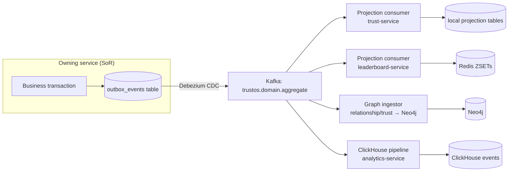
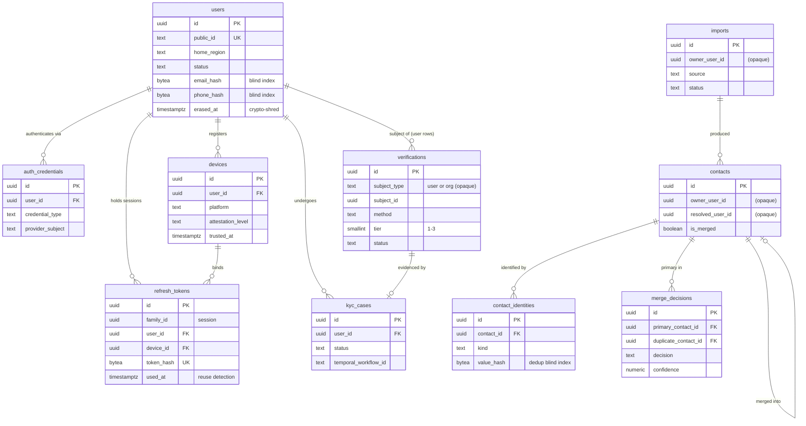
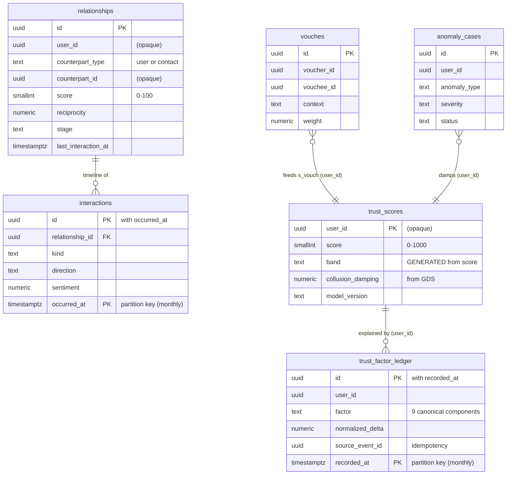
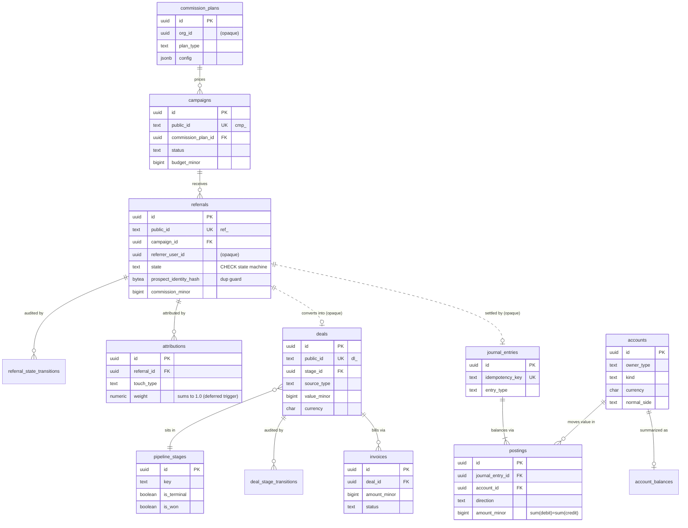
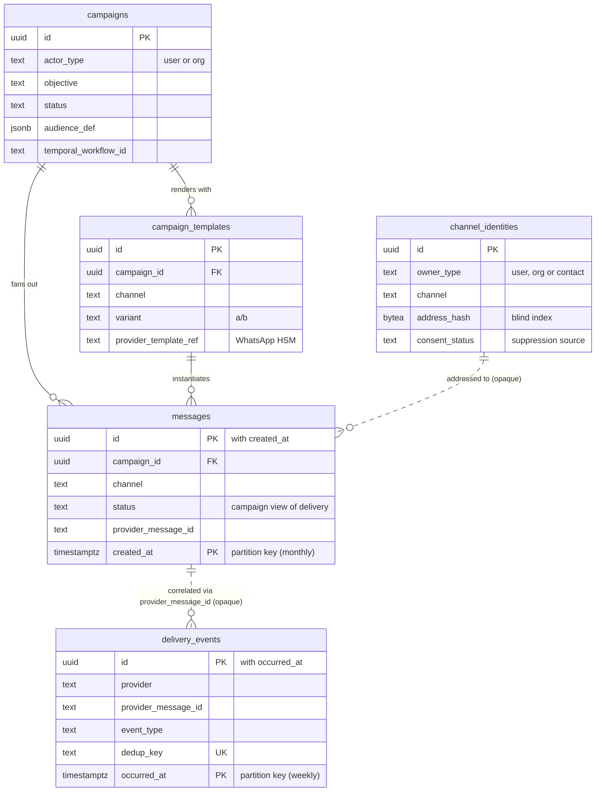
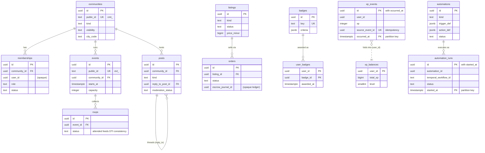
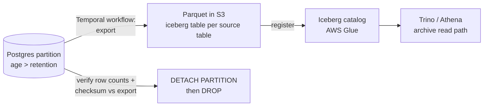

# 05 — Data Architecture

> **Scope:** Database design, schemas (real DDL), ER diagrams, migration strategy, graph database design (Neo4j), vector database design (Qdrant), analytics store (ClickHouse), Redis structures, and data lifecycle/residency.
> **Conforms to:** `_shared-context.md` (binding). Service topology in `02-system-architecture.md`; scoring math in `06-algorithms.md`; key management and threat model in `11-security-architecture.md`; backup/PITR runbooks in `12-devops-platform.md`.

---

## Table of Contents

1. [Data Ownership Map](#1-data-ownership-map)
2. [Platform-Wide Storage Conventions](#2-platform-wide-storage-conventions)
3. [PostgreSQL Schemas — DDL per Service](#3-postgresql-schemas--ddl-per-service)
4. [ER Diagrams](#4-er-diagrams)
5. [Scaling Strategy per Store](#5-scaling-strategy-per-store)
6. [Migration Strategy](#6-migration-strategy)
7. [Neo4j Graph Design](#7-neo4j-graph-design)
8. [Vector Database Design (Qdrant)](#8-vector-database-design-qdrant)
9. [ClickHouse Analytics Schema](#9-clickhouse-analytics-schema)
10. [Redis Data Structures](#10-redis-data-structures)
11. [Data Lifecycle & Residency](#11-data-lifecycle--residency)

---

## 1. Data Ownership Map

### 1.1 Database-per-service assignments

Every service owns its stores exclusively. **No service ever opens a connection to another service's database** — the only sanctioned cross-service data flows are (a) gRPC calls to the owning service, (b) Kafka events consumed into local projections, (c) the GraphQL BFF composing reads from service APIs.

| Service | System of Record (SoR) | Derived / projection stores it also owns |
|---|---|---|
| identity-service | PostgreSQL `identity` | Redis (session cache, token-reuse bloom) |
| profile-service | PostgreSQL `profile` | Qdrant `profile_embeddings` (writes via outbox consumer), OpenSearch people index (via search-service consumer) |
| contact-service | PostgreSQL `contact` | — |
| relationship-service | PostgreSQL `relationship` | Neo4j `:KNOWS` edges (projection — Postgres is SoR) |
| trust-service | PostgreSQL `trust` | Neo4j `:VOUCHES_FOR` edges + GDS-derived damping factors |
| networking-service | — (stateless over Neo4j + Qdrant reads) | PostgreSQL `networking` for intro requests & suggestion feedback |
| referral-service | PostgreSQL `referral` | — |
| deal-service | PostgreSQL `deal` | — |
| ledger-service | PostgreSQL `ledger` (append-only, event-sourced) | — |
| campaign-service | PostgreSQL `campaign` | — |
| channel-service | PostgreSQL `channel` + Redis (send-rate windows) | — |
| community-service | PostgreSQL `community` | Neo4j `:MEMBER_OF` projection |
| marketplace-service | PostgreSQL `marketplace` | OpenSearch listings index |
| knowledge-service | PostgreSQL `knowledge` | Qdrant `knowledge_chunks` |
| rewards-service | PostgreSQL `rewards` | — |
| leaderboard-service | Redis ZSETs (live) | PostgreSQL `leaderboard` (period-close snapshots) |
| automation-service | PostgreSQL `automation` + Temporal (execution state) | — |
| ai-gateway / agent-runtime | PostgreSQL `ai` (prompt registry, eval runs, cost meter, agent memory index) | Qdrant `message_style`, agent memory collections |
| notification-service | PostgreSQL `notification` + Redis (inbox hot cache) | — |
| analytics-service | ClickHouse `analytics` | — |

### 1.2 How cross-service read models are built



Rules for projections:

1. **Source of truth stays put.** A projection is always rebuildable from the event stream (Kafka retention 7 d hot + outbox archive in S3/Iceberg, indefinitely). Losing a projection is an ops incident, not data loss.
2. **Idempotent apply.** Every consumer dedups on `event_id` (Redis SETNX, 48 h TTL) and applies version-guarded upserts (`WHERE projected_version < :event_version`).
3. **Consumer-group-per-projection.** One Kafka consumer group per (service, projection) pair so rebuilds (reset offsets) never disturb sibling projections.
4. **Denormalize freely, never join across services.** e.g. referral-service keeps a local `referrer_snapshot` (display name, trust band at submission time) copied from the event payload rather than calling identity/trust at read time.

### 1.3 "No shared database" enforcement (not just convention)

| Layer | Mechanism |
|---|---|
| Network | Each service's RDS/Aurora cluster sits in its own security group; only that service's pods (via pod-level security-group attachment on EKS) can reach port 5432. |
| Credentials | Per-service DB roles issued by Vault dynamic secrets, TTL 24 h; role name = service name; no human or cross-service role has DML on another DB. |
| Schema-level | Each service's role owns exactly one database; `REVOKE CONNECT ON DATABASE x FROM PUBLIC;` in every bootstrap migration. |
| CI | A `contracts-lint` GitHub Action greps service code for foreign DSNs / SQLAlchemy engines pointing at non-owned databases and fails the build. |
| Runtime | pgAudit logs every connection's `application_name`; alert on any `application_name` not matching the DB owner service. |

*Alternative considered:* one physical Postgres cluster with schema-per-service (cheaper at low scale). Rejected: it invites cross-schema joins, couples failure domains and upgrade windows, and blocks per-service sharding later. We accept the higher instance count; small services share an Aurora Serverless v2 pool per cell but still get separate databases + roles + security groups.

---

## 2. Platform-Wide Storage Conventions

### 2.1 Standard column kit

Every table (unless stated otherwise) carries:

```sql
id          uuid        PRIMARY KEY DEFAULT uuid_generate_v7(),
created_at  timestamptz NOT NULL DEFAULT now(),
updated_at  timestamptz NOT NULL DEFAULT now()   -- maintained by trigger
```

- **UUIDv7 everywhere** (time-ordered → right-leaning B-tree appends, no random-page splits). PostgreSQL 16 has no native generator, so every database installs this function in migration `0001`:

```sql
CREATE EXTENSION IF NOT EXISTS pgcrypto;

-- RFC 9562 UUIDv7: 48-bit unix-millis + version/variant bits over random tail
CREATE OR REPLACE FUNCTION uuid_generate_v7()
RETURNS uuid
LANGUAGE sql VOLATILE PARALLEL SAFE
AS $$
  SELECT encode(
    set_bit(
      set_bit(
        overlay(uuid_send(gen_random_uuid())
                PLACING substring(int8send((extract(epoch FROM clock_timestamp()) * 1000)::bigint) FROM 3)
                FROM 1 FOR 6),
        52, 1),
      53, 1),
    'hex')::uuid;
$$;
```

- **Public IDs** (`usr_`, `org_`, `cmt_`, `ref_`, `cmp_`, `dl_`, `evt_` + base62 of the UUID) are generated in the application layer and stored as `public_id text NOT NULL UNIQUE` on externally-visible aggregates only. Internal FKs always use the raw `uuid`.
- **Money:** `amount_minor bigint` + `currency char(3)` (ISO 4217). `CHECK (amount_minor >= 0)` except on ledger postings where sign is encoded by `direction`.
- **Actor stamping:** every mutating table on multi-principal aggregates carries `actor_type text CHECK (actor_type IN ('user','org','system'))` and `actor_id uuid`.
- **Cross-service references are opaque.** A `user_id uuid` column in referral-service has **no FK** — FKs exist only within a service boundary. This is called out per-schema below.
- **PII columns** are stored as `*_enc bytea` (AES-256-GCM ciphertext, envelope-encrypted; see §11) plus `*_hash bytea` (HMAC-SHA-256 blind index with a per-purpose key) when equality lookup is required. Plaintext email/phone never touches disk.

### 2.2 `updated_at` trigger (installed once per database)

```sql
CREATE OR REPLACE FUNCTION touch_updated_at()
RETURNS trigger LANGUAGE plpgsql AS $$
BEGIN
  NEW.updated_at := now();
  RETURN NEW;
END $$;
-- Applied per table:
-- CREATE TRIGGER <table>_touch BEFORE UPDATE ON <table>
--   FOR EACH ROW EXECUTE FUNCTION touch_updated_at();
```

### 2.3 Transactional outbox (identical in every service database)

```sql
CREATE TABLE outbox_events (
    id             uuid        PRIMARY KEY DEFAULT uuid_generate_v7(),
    aggregate_type text        NOT NULL,           -- 'user', 'referral', ...
    aggregate_id   uuid        NOT NULL,           -- Kafka partition key
    event_type     text        NOT NULL,           -- 'identity.user.registered.v1'
    payload        bytea       NOT NULL,           -- Protobuf, schema-registry ID prefixed
    headers        jsonb       NOT NULL DEFAULT '{}'::jsonb,  -- traceparent, actor
    created_at     timestamptz NOT NULL DEFAULT now()
);
-- Debezium tails the WAL for this table (no polling). A retention job deletes
-- rows older than 72 h AFTER the archive sink has committed them to S3/Iceberg.
CREATE INDEX outbox_events_created_at_idx ON outbox_events (created_at);
```

Writes to a business table and its outbox row happen in **one local transaction** — this is the platform's exactly-once-ish backbone (at-least-once delivery + idempotent consumers, per `_shared-context.md` §1).

### 2.4 Append-only enforcement helper

```sql
CREATE OR REPLACE FUNCTION forbid_change()
RETURNS trigger LANGUAGE plpgsql AS $$
BEGIN
  RAISE EXCEPTION '% is append-only (attempted %)', TG_TABLE_NAME, TG_OP
        USING ERRCODE = 'raise_exception';
END $$;
```

Applied to `trust_factor_ledger`, `journal_entries`, `postings`, `xp_events`, `referral_state_transitions`, `deal_stage_transitions`, `merge_decisions`. Belt-and-braces: the service's DB role also gets `REVOKE UPDATE, DELETE` on those tables; only the migration role can alter them.

### 2.5 Partitioning policy (summary — details per schema)

| Table | Method | Key | Granularity | Why |
|---|---|---|---|---|
| relationship.interactions | RANGE | `occurred_at` | monthly | Unbounded time-series; hot window = last 90 d; archival by partition-drop |
| trust.trust_factor_ledger | RANGE | `recorded_at` | monthly | Append-only audit stream; nightly recompute scans recent months only |
| campaign.messages | RANGE | `created_at` | monthly | Billions of rows/yr; campaign analytics query recent windows |
| channel.delivery_events | RANGE | `occurred_at` | **weekly** | Highest write rate in the platform (per-message multi-event) |
| rewards.xp_events | RANGE | `occurred_at` | monthly | Same as ledger; balances live in a projection |
| automation.automation_runs | RANGE | `started_at` | monthly | High volume, cold after completion |
| community.posts | none (yet) | — | — | ~low-billions ceiling; revisit at >500 GB (see §5.4) |

Partition creation is automated by **pg_partman** (`premake = 3`), monitored by an alert if fewer than 2 future partitions exist. Every RANGE-partitioned table also has a `DEFAULT` partition as a safety net, alarmed if it ever receives a row.

*Alternative considered:* HASH partitioning on `user_id` for these tables. Rejected at the single-node stage: it doesn't help archival (old data spread across all partitions) and doesn't reduce index height for time-window queries. Hash-based distribution happens one level up, at the **shard** level (§5.2), where it belongs.

---

## 3. PostgreSQL Schemas — DDL per Service

All DDL below is PostgreSQL 16, tested syntax. Per Clean Architecture, these live in each service's `infrastructure/db/migrations/` as Alembic revisions; shown here consolidated. `updated_at` triggers and `outbox_events` (§2.3) exist in every database and are not repeated.

### 3.1 identity-service (`identity` database)

```sql
------------------------------------------------------------------------------
-- users: the person aggregate root. Profile data (bio, skills…) lives in
-- profile-service; this table is authentication + residency + lifecycle only.
------------------------------------------------------------------------------
CREATE TABLE users (
    id             uuid        PRIMARY KEY DEFAULT uuid_generate_v7(),
    public_id      text        NOT NULL UNIQUE,           -- 'usr_0uK9…'
    home_region    text        NOT NULL CHECK (home_region IN ('ap-south-1','us-east-1','eu-west-1')),
    status         text        NOT NULL DEFAULT 'active'
                               CHECK (status IN ('pending','active','suspended','deactivated','erased')),
    -- PII: ciphertext + blind index (HMAC key: 'idx:email' / 'idx:phone', see 11-security-architecture.md)
    email_enc      bytea,
    email_hash     bytea,
    phone_enc      bytea,
    phone_hash     bytea,
    locale         text        NOT NULL DEFAULT 'en-IN',
    timezone       text        NOT NULL DEFAULT 'Asia/Kolkata',
    registered_at  timestamptz NOT NULL DEFAULT now(),
    erased_at      timestamptz,                            -- crypto-shred timestamp
    created_at     timestamptz NOT NULL DEFAULT now(),
    updated_at     timestamptz NOT NULL DEFAULT now(),
    CHECK (email_hash IS NOT NULL OR phone_hash IS NOT NULL)  -- at least one login identifier
);
-- Blind-index lookups (login, duplicate detection). UNIQUE + partial: erased
-- users free their identifiers for legitimate re-registration.
CREATE UNIQUE INDEX users_email_hash_uq ON users (email_hash)
    WHERE email_hash IS NOT NULL AND status <> 'erased';
CREATE UNIQUE INDEX users_phone_hash_uq ON users (phone_hash)
    WHERE phone_hash IS NOT NULL AND status <> 'erased';

------------------------------------------------------------------------------
-- auth_credentials: one row per credential type per user.
------------------------------------------------------------------------------
CREATE TABLE auth_credentials (
    id               uuid        PRIMARY KEY DEFAULT uuid_generate_v7(),
    user_id          uuid        NOT NULL REFERENCES users (id) ON DELETE CASCADE,
    credential_type  text        NOT NULL CHECK (credential_type IN
                                 ('password','otp_phone','otp_email','oidc_google','oidc_apple','oidc_linkedin','passkey','totp')),
    secret_hash      text,                    -- argon2id PHC string (password/totp seed enc)
    provider_subject text,                    -- OIDC 'sub' claim / passkey credential ID
    public_key       bytea,                   -- passkey COSE key
    last_used_at     timestamptz,
    rotated_at       timestamptz,
    disabled_at      timestamptz,
    created_at       timestamptz NOT NULL DEFAULT now(),
    updated_at       timestamptz NOT NULL DEFAULT now(),
    UNIQUE (user_id, credential_type, provider_subject),
    CHECK (secret_hash IS NOT NULL OR provider_subject IS NOT NULL)
);
CREATE INDEX auth_credentials_provider_idx
    ON auth_credentials (credential_type, provider_subject)
    WHERE provider_subject IS NOT NULL;        -- OIDC callback: find user by sub

------------------------------------------------------------------------------
-- devices: device trust registry (device-bound refresh tokens, biometric gate).
------------------------------------------------------------------------------
CREATE TABLE devices (
    id                 uuid        PRIMARY KEY DEFAULT uuid_generate_v7(),
    user_id            uuid        NOT NULL REFERENCES users (id) ON DELETE CASCADE,
    platform           text        NOT NULL CHECK (platform IN ('ios','android','web')),
    fingerprint_hash   bytea       NOT NULL,   -- HMAC of stable device signals
    display_name       text,                   -- 'Pixel 9 Pro'
    push_token_enc     bytea,                  -- FCM/APNs token (PII-adjacent)
    attestation_level  text        NOT NULL DEFAULT 'none'
                                   CHECK (attestation_level IN ('none','basic','strong')),
                                   -- strong = Play Integrity / App Attest passed
    dpop_jkt           text,                   -- JWK thumbprint binding tokens to device key
    trusted_at         timestamptz,            -- NULL until user confirms via existing device/MFA
    last_seen_at       timestamptz NOT NULL DEFAULT now(),
    revoked_at         timestamptz,
    created_at         timestamptz NOT NULL DEFAULT now(),
    updated_at         timestamptz NOT NULL DEFAULT now(),
    UNIQUE (user_id, fingerprint_hash)
);
CREATE INDEX devices_user_active_idx ON devices (user_id, last_seen_at DESC)
    WHERE revoked_at IS NULL;

------------------------------------------------------------------------------
-- refresh_tokens: rotating families with reuse detection (shared-context §1).
-- A "session" == an active token family on a device.
------------------------------------------------------------------------------
CREATE TABLE refresh_tokens (
    id             uuid        PRIMARY KEY DEFAULT uuid_generate_v7(),
    family_id      uuid        NOT NULL,       -- stable across rotations = the session
    user_id        uuid        NOT NULL REFERENCES users (id) ON DELETE CASCADE,
    device_id      uuid        NOT NULL REFERENCES devices (id) ON DELETE CASCADE,
    token_hash     bytea       NOT NULL UNIQUE,        -- SHA-256; raw token never stored
    parent_id      uuid        REFERENCES refresh_tokens (id),  -- rotation lineage
    issued_at      timestamptz NOT NULL DEFAULT now(),
    expires_at     timestamptz NOT NULL,
    used_at        timestamptz,               -- set on rotation; non-NULL + presented again = REUSE
    revoked_at     timestamptz,
    revoke_reason  text        CHECK (revoke_reason IN ('logout','reuse_detected','admin','password_change','expired') OR revoke_reason IS NULL),
    created_at     timestamptz NOT NULL DEFAULT now(),
    CHECK (expires_at > issued_at)
);
-- Hot path: validate presented token → one probe on token_hash (unique index above).
-- Reuse response: kill whole family.
CREATE INDEX refresh_tokens_family_idx ON refresh_tokens (family_id) WHERE revoked_at IS NULL;
CREATE INDEX refresh_tokens_user_idx   ON refresh_tokens (user_id, issued_at DESC);

------------------------------------------------------------------------------
-- verifications: tiered verification facts for users AND orgs.
-- org rows reference profile-service org IDs — opaque uuid, NO FK (cross-service).
------------------------------------------------------------------------------
CREATE TABLE verifications (
    id             uuid        PRIMARY KEY DEFAULT uuid_generate_v7(),
    subject_type   text        NOT NULL CHECK (subject_type IN ('user','org')),
    subject_id     uuid        NOT NULL,       -- users.id when 'user'; org_id (opaque) when 'org'
    method         text        NOT NULL CHECK (method IN
                               ('email','phone','kyc_id','kyc_liveness','gst','company_registry',
                                'domain_dns','social_linkedin','social_google','bank_account')),
    tier           smallint    NOT NULL CHECK (tier BETWEEN 1 AND 3),
                               -- 1 = possession (email/phone/social)
                               -- 2 = documentary (GST, registry, domain)
                               -- 3 = biometric / bank-grade (KYC liveness, penny-drop)
    status         text        NOT NULL DEFAULT 'pending'
                               CHECK (status IN ('pending','in_review','verified','rejected','expired','revoked')),
    evidence_ref   text,                       -- S3 key of encrypted evidence bundle
    evidence_hash  bytea,                      -- integrity check of the bundle
    verifier       text        NOT NULL DEFAULT 'system',   -- provider or reviewer id
    verified_at    timestamptz,
    expires_at     timestamptz,                -- GST: 1 y re-check; domain: 90 d re-probe
    revoked_at     timestamptz,
    created_at     timestamptz NOT NULL DEFAULT now(),
    updated_at     timestamptz NOT NULL DEFAULT now(),
    CHECK (status <> 'verified' OR verified_at IS NOT NULL)
);
-- One live verification per (subject, method); history rows keep status ≠ verified.
CREATE UNIQUE INDEX verifications_live_uq
    ON verifications (subject_type, subject_id, method)
    WHERE status IN ('pending','in_review','verified');
CREATE INDEX verifications_subject_idx ON verifications (subject_type, subject_id, status);
CREATE INDEX verifications_expiry_idx  ON verifications (expires_at)
    WHERE status = 'verified' AND expires_at IS NOT NULL;   -- re-verification sweeper

------------------------------------------------------------------------------
-- kyc_cases: long-running KYC handled by a Temporal workflow; this table is the
-- queryable state, Temporal owns execution state.
------------------------------------------------------------------------------
CREATE TABLE kyc_cases (
    id                   uuid        PRIMARY KEY DEFAULT uuid_generate_v7(),
    user_id              uuid        NOT NULL REFERENCES users (id) ON DELETE CASCADE,
    verification_id      uuid        REFERENCES verifications (id),
    provider             text        NOT NULL,            -- 'hyperverge','onfido',…
    provider_case_ref    text,
    status               text        NOT NULL DEFAULT 'opened'
                         CHECK (status IN ('opened','docs_submitted','provider_review',
                                           'manual_review','approved','rejected','abandoned')),
    risk_score           numeric(5,4) CHECK (risk_score BETWEEN 0 AND 1),
    rejection_reason     text,
    temporal_workflow_id text        NOT NULL,
    opened_at            timestamptz NOT NULL DEFAULT now(),
    closed_at            timestamptz,
    created_at           timestamptz NOT NULL DEFAULT now(),
    updated_at           timestamptz NOT NULL DEFAULT now(),
    CHECK (closed_at IS NULL OR status IN ('approved','rejected','abandoned'))
);
CREATE INDEX kyc_cases_user_idx   ON kyc_cases (user_id, opened_at DESC);
CREATE INDEX kyc_cases_open_idx   ON kyc_cases (status, opened_at)
    WHERE status NOT IN ('approved','rejected','abandoned');  -- ops queue
```

**Index rationale (identity):** every index above backs a named hot path — login by blind index, OIDC callback by `(credential_type, provider_subject)`, refresh validation by `token_hash`, family revocation, verification-expiry sweeps, and the manual-review queue. Nothing speculative; unused indexes are audited quarterly via `pg_stat_user_indexes`.

### 3.2 contact-service (`contact` database)

```sql
------------------------------------------------------------------------------
-- imports: one row per import job (Temporal workflow: fetch → normalize →
-- dedup-candidate → auto-merge/queue-review → emit contact.import.completed.v1).
------------------------------------------------------------------------------
CREATE TABLE imports (
    id                   uuid        PRIMARY KEY DEFAULT uuid_generate_v7(),
    owner_user_id        uuid        NOT NULL,   -- opaque, identity-service ID (no FK)
    source               text        NOT NULL CHECK (source IN
                                     ('google','outlook','phone','csv','crm_hubspot','crm_salesforce','crm_zoho')),
    status               text        NOT NULL DEFAULT 'running'
                                     CHECK (status IN ('running','completed','failed','cancelled')),
    total_rows           integer     NOT NULL DEFAULT 0 CHECK (total_rows >= 0),
    imported_rows        integer     NOT NULL DEFAULT 0 CHECK (imported_rows >= 0),
    merged_rows          integer     NOT NULL DEFAULT 0 CHECK (merged_rows >= 0),
    error_detail         text,
    temporal_workflow_id text        NOT NULL,
    started_at           timestamptz NOT NULL DEFAULT now(),
    completed_at         timestamptz,
    created_at           timestamptz NOT NULL DEFAULT now(),
    updated_at           timestamptz NOT NULL DEFAULT now()
);
CREATE INDEX imports_owner_idx ON imports (owner_user_id, started_at DESC);

------------------------------------------------------------------------------
-- contacts: the owner-scoped contact aggregate. A contact may later resolve to
-- a platform user (resolved_user_id) — that's how the graph links owners to
-- real counterparties.
------------------------------------------------------------------------------
CREATE TABLE contacts (
    id                     uuid        PRIMARY KEY DEFAULT uuid_generate_v7(),
    owner_user_id          uuid        NOT NULL,          -- opaque (no FK)
    source_import_id       uuid        REFERENCES imports (id),
    display_name           text        NOT NULL,
    given_name             text,
    family_name            text,
    company_name           text,
    job_title              text,
    city                   text,
    notes_enc              bytea,                          -- user's private notes = PII
    resolved_user_id       uuid,                           -- platform user this contact IS (opaque)
    resolution_confidence  numeric(4,3) CHECK (resolution_confidence BETWEEN 0 AND 1),
    merged_into_contact_id uuid        REFERENCES contacts (id),
    is_merged              boolean     NOT NULL DEFAULT false,
    created_at             timestamptz NOT NULL DEFAULT now(),
    updated_at             timestamptz NOT NULL DEFAULT now(),
    CHECK (is_merged = (merged_into_contact_id IS NOT NULL))
);
CREATE INDEX contacts_owner_idx          ON contacts (owner_user_id) WHERE NOT is_merged;
CREATE INDEX contacts_owner_resolved_idx ON contacts (owner_user_id, resolved_user_id)
    WHERE resolved_user_id IS NOT NULL AND NOT is_merged;
CREATE INDEX contacts_resolved_idx       ON contacts (resolved_user_id)
    WHERE resolved_user_id IS NOT NULL;   -- "who has me in their address book" (consented feature)

------------------------------------------------------------------------------
-- contact_identities: normalized identifiers per contact (a contact can have
-- N emails / phones / handles). owner_user_id denormalized so the dedup scan
-- is a single-index range read per owner.
------------------------------------------------------------------------------
CREATE TABLE contact_identities (
    id             uuid        PRIMARY KEY DEFAULT uuid_generate_v7(),
    contact_id     uuid        NOT NULL REFERENCES contacts (id) ON DELETE CASCADE,
    owner_user_id  uuid        NOT NULL,                   -- denormalized for dedup scoping
    kind           text        NOT NULL CHECK (kind IN
                               ('email','phone','whatsapp','linkedin','telegram','twitter','website')),
    value_enc      bytea       NOT NULL,                   -- ciphertext of normalized value
    value_hash     bytea       NOT NULL,                   -- blind index (E.164 / lowercased)
    label          text,                                   -- 'work','personal'
    is_primary     boolean     NOT NULL DEFAULT false,
    created_at     timestamptz NOT NULL DEFAULT now(),
    updated_at     timestamptz NOT NULL DEFAULT now(),
    UNIQUE (contact_id, kind, value_hash)
);
-- Dedup candidates: same identifier appearing on ≥2 contacts of one owner.
CREATE INDEX contact_identities_dedup_idx ON contact_identities (owner_user_id, value_hash);
-- Resolution: match identifier against platform users' blind indexes (batch job).
CREATE INDEX contact_identities_value_idx ON contact_identities (kind, value_hash);

------------------------------------------------------------------------------
-- merge_decisions: append-only audit of every AI/user dedup decision — feeds
-- the merge model's feedback loop AND makes merges reversible (unmerge = replay).
------------------------------------------------------------------------------
CREATE TABLE merge_decisions (
    id                    uuid        PRIMARY KEY DEFAULT uuid_generate_v7(),
    owner_user_id         uuid        NOT NULL,
    primary_contact_id    uuid        NOT NULL REFERENCES contacts (id),
    duplicate_contact_id  uuid        NOT NULL REFERENCES contacts (id),
    decision              text        NOT NULL CHECK (decision IN ('merged','rejected','unmerged')),
    decided_by            text        NOT NULL CHECK (decided_by IN ('ai_auto','ai_suggested_user_confirmed','user_manual')),
    confidence            numeric(4,3) CHECK (confidence BETWEEN 0 AND 1),
    feature_snapshot      jsonb       NOT NULL DEFAULT '{}'::jsonb,  -- similarity features at decision time
    decided_at            timestamptz NOT NULL DEFAULT now(),
    CHECK (primary_contact_id <> duplicate_contact_id)
);
CREATE TRIGGER merge_decisions_immutable BEFORE UPDATE OR DELETE ON merge_decisions
    FOR EACH ROW EXECUTE FUNCTION forbid_change();
CREATE INDEX merge_decisions_owner_idx ON merge_decisions (owner_user_id, decided_at DESC);
CREATE INDEX merge_decisions_pair_idx  ON merge_decisions (primary_contact_id, duplicate_contact_id);
```

### 3.3 relationship-service (`relationship` database)

```sql
------------------------------------------------------------------------------
-- relationships: one row per (owner, counterpart) directed relationship record.
-- counterpart is either a resolved platform user or a private contact.
-- Postgres is the SoR; the Neo4j :KNOWS edge is a projection (see §7.8).
------------------------------------------------------------------------------
CREATE TABLE relationships (
    id                    uuid        PRIMARY KEY DEFAULT uuid_generate_v7(),
    user_id               uuid        NOT NULL,            -- owner (opaque identity ID)
    counterpart_type      text        NOT NULL CHECK (counterpart_type IN ('user','contact')),
    counterpart_id        uuid        NOT NULL,            -- users.id or contacts.id (opaque)
    stage                 text        NOT NULL DEFAULT 'acquaintance'
                          CHECK (stage IN ('lead','acquaintance','active','strong','dormant','ended')),
    score                 smallint    NOT NULL DEFAULT 0 CHECK (score BETWEEN 0 AND 100),
                          -- AI relationship score; formula in 06-algorithms.md §3
    reciprocity           numeric(4,3) NOT NULL DEFAULT 0 CHECK (reciprocity BETWEEN 0 AND 1),
    interaction_count     integer     NOT NULL DEFAULT 0 CHECK (interaction_count >= 0),
    first_interaction_at  timestamptz,
    last_interaction_at   timestamptz,
    tags                  text[]      NOT NULL DEFAULT '{}',
    ai_summary            text,                            -- copilot-maintained one-liner
    score_computed_at     timestamptz,
    created_at            timestamptz NOT NULL DEFAULT now(),
    updated_at            timestamptz NOT NULL DEFAULT now(),
    UNIQUE (user_id, counterpart_type, counterpart_id)
);
CREATE INDEX relationships_owner_score_idx ON relationships (user_id, score DESC);
CREATE INDEX relationships_dormant_idx     ON relationships (user_id, last_interaction_at)
    WHERE stage IN ('active','strong');    -- automation-service "going cold" sweep input
CREATE INDEX relationships_counterpart_idx ON relationships (counterpart_type, counterpart_id);

------------------------------------------------------------------------------
-- interactions: the timeline. Declarative RANGE partitioning by month on
-- occurred_at (PK must include the partition key).
-- Growth math in §5.3: ~7 B rows/yr platform-wide at target scale.
------------------------------------------------------------------------------
CREATE TABLE interactions (
    id               uuid        NOT NULL DEFAULT uuid_generate_v7(),
    relationship_id  uuid        NOT NULL REFERENCES relationships (id) ON DELETE CASCADE,
    user_id          uuid        NOT NULL,                 -- denormalized owner for user-timeline scans
    kind             text        NOT NULL CHECK (kind IN
                     ('meeting','call','message','email','intro','event','deal_touch','note','gift','social')),
    channel          text        CHECK (channel IN ('whatsapp','email','sms','linkedin','telegram','phone','in_person','platform') OR channel IS NULL),
    direction        text        NOT NULL DEFAULT 'outbound' CHECK (direction IN ('inbound','outbound','mutual')),
    sentiment        numeric(4,3) CHECK (sentiment BETWEEN -1 AND 1),
    summary          text,                                 -- AI-generated, non-PII policy enforced upstream
    metadata         jsonb       NOT NULL DEFAULT '{}'::jsonb,
    source_event_id  uuid,                                 -- consumer idempotency anchor
    occurred_at      timestamptz NOT NULL,
    created_at       timestamptz NOT NULL DEFAULT now(),
    PRIMARY KEY (id, occurred_at)
) PARTITION BY RANGE (occurred_at);

-- pg_partman managed; representative partitions:
CREATE TABLE interactions_2026_07 PARTITION OF interactions
    FOR VALUES FROM ('2026-07-01') TO ('2026-08-01');
CREATE TABLE interactions_2026_08 PARTITION OF interactions
    FOR VALUES FROM ('2026-08-01') TO ('2026-09-01');
CREATE TABLE interactions_default PARTITION OF interactions DEFAULT;

-- Indexes on the parent cascade to all partitions:
CREATE INDEX interactions_rel_time_idx  ON interactions (relationship_id, occurred_at DESC);
CREATE INDEX interactions_user_time_idx ON interactions (user_id, occurred_at DESC);
CREATE UNIQUE INDEX interactions_dedup_uq ON interactions (source_event_id, occurred_at)
    WHERE source_event_id IS NOT NULL;   -- idempotent event-consumer upserts
```

### 3.4 trust-service (`trust` database)

```sql
------------------------------------------------------------------------------
-- trust_scores: current DTI per user. Band is a GENERATED column so it can
-- never drift from the score (shared-context §4 bands).
------------------------------------------------------------------------------
CREATE TABLE trust_scores (
    user_id          uuid        PRIMARY KEY,              -- opaque identity ID (no FK)
    score            smallint    NOT NULL CHECK (score BETWEEN 0 AND 1000),
    band             text        GENERATED ALWAYS AS (
                         CASE
                             WHEN score < 250 THEN 'starter'
                             WHEN score < 450 THEN 'bronze'
                             WHEN score < 650 THEN 'silver'
                             WHEN score < 850 THEN 'gold'
                             ELSE 'platinum'
                         END) STORED,
    -- The nine canonical components, each s_i ∈ [0,1] (shared-context §4):
    s_identity       numeric(6,5) NOT NULL DEFAULT 0 CHECK (s_identity      BETWEEN 0 AND 1),
    s_referral       numeric(6,5) NOT NULL DEFAULT 0 CHECK (s_referral      BETWEEN 0 AND 1),
    s_transaction    numeric(6,5) NOT NULL DEFAULT 0 CHECK (s_transaction   BETWEEN 0 AND 1),
    s_relationship   numeric(6,5) NOT NULL DEFAULT 0 CHECK (s_relationship  BETWEEN 0 AND 1),
    s_community      numeric(6,5) NOT NULL DEFAULT 0 CHECK (s_community     BETWEEN 0 AND 1),
    s_consistency    numeric(6,5) NOT NULL DEFAULT 0 CHECK (s_consistency   BETWEEN 0 AND 1),
    s_knowledge      numeric(6,5) NOT NULL DEFAULT 0 CHECK (s_knowledge     BETWEEN 0 AND 1),
    s_vouch          numeric(6,5) NOT NULL DEFAULT 0 CHECK (s_vouch         BETWEEN 0 AND 1),
    s_ai_confidence  numeric(6,5) NOT NULL DEFAULT 0 CHECK (s_ai_confidence BETWEEN 0 AND 1),
    collusion_damping numeric(6,5) NOT NULL DEFAULT 1 CHECK (collusion_damping BETWEEN 0 AND 1),
                      -- multiplier from GDS pipeline (§7.6); 1 = clean
    model_version    text        NOT NULL,                 -- weight-set version (06-algorithms.md §2)
    computed_at      timestamptz NOT NULL DEFAULT now(),
    reconciled_at    timestamptz,                          -- last nightly full recompute
    row_version      integer     NOT NULL DEFAULT 1        -- optimistic concurrency for streaming updates
);
CREATE INDEX trust_scores_band_idx  ON trust_scores (band, score DESC);   -- band directories / gating
CREATE INDEX trust_scores_stale_idx ON trust_scores (reconciled_at NULLS FIRST);  -- reconciler work queue

------------------------------------------------------------------------------
-- trust_factor_ledger: APPEND-ONLY raw factor stream. Every trust-affecting
-- fact lands here first; scores are a fold over this ledger → fully
-- explainable ("your DTI moved because…") and auditable. Monthly partitions.
------------------------------------------------------------------------------
CREATE TABLE trust_factor_ledger (
    id               uuid         NOT NULL DEFAULT uuid_generate_v7(),
    user_id          uuid         NOT NULL,
    factor           text         NOT NULL CHECK (factor IN
                     ('identity','referral','transaction','relationship','community',
                      'consistency','knowledge','vouch','ai_confidence')),
    raw_value        numeric(12,4) NOT NULL,               -- domain units (e.g. conv-weighted referral)
    normalized_delta numeric(7,6)  NOT NULL CHECK (normalized_delta BETWEEN -1 AND 1),
    reason_code      text          NOT NULL,               -- 'referral.converted', 'vouch.received', 'anomaly.velocity'…
    source_event_id  uuid          NOT NULL,               -- Kafka event_id (idempotency)
    source_event_type text         NOT NULL,               -- 'referral.referral.converted.v1'
    evidence         jsonb         NOT NULL DEFAULT '{}'::jsonb,
    recorded_at      timestamptz   NOT NULL DEFAULT now(),
    PRIMARY KEY (id, recorded_at)
) PARTITION BY RANGE (recorded_at);

CREATE TABLE trust_factor_ledger_2026_07 PARTITION OF trust_factor_ledger
    FOR VALUES FROM ('2026-07-01') TO ('2026-08-01');
CREATE TABLE trust_factor_ledger_default PARTITION OF trust_factor_ledger DEFAULT;

CREATE INDEX tfl_user_time_idx ON trust_factor_ledger (user_id, recorded_at DESC);
CREATE UNIQUE INDEX tfl_dedup_uq ON trust_factor_ledger (source_event_id, recorded_at);
    -- unique-per-partition; global dedup additionally enforced by consumer Redis SETNX (§1.2)
CREATE TRIGGER tfl_immutable BEFORE UPDATE OR DELETE ON trust_factor_ledger
    FOR EACH ROW EXECUTE FUNCTION forbid_change();

------------------------------------------------------------------------------
-- vouches: peer vouch facts (SoR here; :VOUCHES_FOR in Neo4j is the projection).
------------------------------------------------------------------------------
CREATE TABLE vouches (
    id             uuid        PRIMARY KEY DEFAULT uuid_generate_v7(),
    voucher_id     uuid        NOT NULL,                   -- who vouches (opaque)
    vouchee_id     uuid        NOT NULL,                   -- who is vouched for
    context        text        NOT NULL CHECK (context IN ('general','skill','deal','community','referral')),
    context_ref    uuid,                                   -- e.g. deal_id when context='deal'
    weight         numeric(4,3) NOT NULL DEFAULT 1 CHECK (weight BETWEEN 0 AND 1),
    statement      text,
    revoked_at     timestamptz,
    created_at     timestamptz NOT NULL DEFAULT now(),
    updated_at     timestamptz NOT NULL DEFAULT now(),
    CHECK (voucher_id <> vouchee_id),
    UNIQUE (voucher_id, vouchee_id, context, context_ref)
);
CREATE INDEX vouches_vouchee_idx ON vouches (vouchee_id) WHERE revoked_at IS NULL;
CREATE INDEX vouches_voucher_idx ON vouches (voucher_id) WHERE revoked_at IS NULL;

------------------------------------------------------------------------------
-- anomaly_cases: anti-gaming detections (velocity, collusion rings from §7.6).
------------------------------------------------------------------------------
CREATE TABLE anomaly_cases (
    id             uuid        PRIMARY KEY DEFAULT uuid_generate_v7(),
    user_id        uuid        NOT NULL,
    anomaly_type   text        NOT NULL CHECK (anomaly_type IN
                   ('velocity','reciprocal_vouch_ring','referral_self_dealing',
                    'synthetic_interactions','device_farm','score_probe')),
    severity       text        NOT NULL CHECK (severity IN ('info','review','damped','frozen')),
    detector       text        NOT NULL,                   -- 'gds.louvain.v3', 'velocity.rule.7'
    evidence       jsonb       NOT NULL DEFAULT '{}'::jsonb,
    status         text        NOT NULL DEFAULT 'open'
                               CHECK (status IN ('open','confirmed','false_positive','resolved')),
    detected_at    timestamptz NOT NULL DEFAULT now(),
    resolved_at    timestamptz,
    created_at     timestamptz NOT NULL DEFAULT now(),
    updated_at     timestamptz NOT NULL DEFAULT now()
);
CREATE INDEX anomaly_cases_open_idx ON anomaly_cases (status, severity, detected_at)
    WHERE status = 'open';
CREATE INDEX anomaly_cases_user_idx ON anomaly_cases (user_id, detected_at DESC);
```

### 3.5 referral-service (`referral` database)

```sql
------------------------------------------------------------------------------
-- commission_plans: reusable payout structures. Config is validated against
-- a JSON Schema per plan_type in the application layer.
------------------------------------------------------------------------------
CREATE TABLE commission_plans (
    id             uuid        PRIMARY KEY DEFAULT uuid_generate_v7(),
    org_id         uuid        NOT NULL,                   -- opaque (profile-service org)
    name           text        NOT NULL,
    plan_type      text        NOT NULL CHECK (plan_type IN ('flat','percent','tiered','hybrid')),
    config         jsonb       NOT NULL,                   -- {'percent': 10} / tier ladders
    currency       char(3)     NOT NULL,
    cap_minor      bigint      CHECK (cap_minor IS NULL OR cap_minor > 0),
    active         boolean     NOT NULL DEFAULT true,
    created_at     timestamptz NOT NULL DEFAULT now(),
    updated_at     timestamptz NOT NULL DEFAULT now()
);
CREATE INDEX commission_plans_org_idx ON commission_plans (org_id) WHERE active;

------------------------------------------------------------------------------
-- campaigns: referral campaigns published by orgs (public_id prefix 'cmp_').
------------------------------------------------------------------------------
CREATE TABLE campaigns (
    id                 uuid        PRIMARY KEY DEFAULT uuid_generate_v7(),
    public_id          text        NOT NULL UNIQUE,        -- 'cmp_…'
    org_id             uuid        NOT NULL,               -- opaque
    commission_plan_id uuid        NOT NULL REFERENCES commission_plans (id),
    title              text        NOT NULL,
    description        text,
    target_criteria    jsonb       NOT NULL DEFAULT '{}'::jsonb,  -- ideal prospect profile
    status             text        NOT NULL DEFAULT 'draft'
                       CHECK (status IN ('draft','published','paused','ended','archived')),
    min_referrer_band  text        CHECK (min_referrer_band IN ('starter','bronze','silver','gold','platinum')
                                          OR min_referrer_band IS NULL),
    budget_minor       bigint      CHECK (budget_minor IS NULL OR budget_minor > 0),
    budget_currency    char(3),
    starts_at          timestamptz,
    ends_at            timestamptz,
    published_at       timestamptz,
    created_at         timestamptz NOT NULL DEFAULT now(),
    updated_at         timestamptz NOT NULL DEFAULT now(),
    CHECK (ends_at IS NULL OR starts_at IS NULL OR ends_at > starts_at),
    CHECK ((budget_minor IS NULL) = (budget_currency IS NULL)),
    CHECK (status <> 'published' OR published_at IS NOT NULL)
);
CREATE INDEX campaigns_org_idx    ON campaigns (org_id, status);
CREATE INDEX campaigns_live_idx   ON campaigns (status, ends_at) WHERE status = 'published';

------------------------------------------------------------------------------
-- referrals: the referral lifecycle aggregate (public_id prefix 'ref_').
-- State machine encoded as a CHECKed column; legal transitions enforced by
-- trigger + audited in referral_state_transitions.
--
--   submitted ──► qualified ──► contacted ──► converted ──► settled
--       │             │              │             │
--       └──► rejected/expired ◄──────┘        (terminal: settled,
--                                              rejected, expired)
------------------------------------------------------------------------------
CREATE TABLE referrals (
    id                    uuid        PRIMARY KEY DEFAULT uuid_generate_v7(),
    public_id             text        NOT NULL UNIQUE,      -- 'ref_…'
    campaign_id           uuid        NOT NULL REFERENCES campaigns (id),
    referrer_user_id      uuid        NOT NULL,             -- opaque
    prospect_contact_id   uuid,                             -- opaque contact-service ID
    prospect_name_enc     bytea,                            -- for non-contact prospects
    prospect_identity_hash bytea      NOT NULL,             -- blind index of prospect email/phone
    referrer_trust_snapshot smallint  CHECK (referrer_trust_snapshot BETWEEN 0 AND 1000),
                          -- DTI at submission (denormalized from trust.score.updated.v1 projection)
    state                 text        NOT NULL DEFAULT 'submitted'
                          CHECK (state IN ('submitted','qualified','contacted',
                                           'converted','settled','rejected','expired')),
    deal_id               uuid,                             -- opaque deal-service ID once converted
    converted_value_minor bigint      CHECK (converted_value_minor IS NULL OR converted_value_minor >= 0),
    converted_currency    char(3),
    commission_minor      bigint      CHECK (commission_minor IS NULL OR commission_minor >= 0),
    commission_currency   char(3),
    ledger_journal_id     uuid,                             -- opaque ledger-service journal entry
    submitted_at          timestamptz NOT NULL DEFAULT now(),
    qualified_at          timestamptz,
    converted_at          timestamptz,
    settled_at            timestamptz,
    closed_reason         text,
    created_at            timestamptz NOT NULL DEFAULT now(),
    updated_at            timestamptz NOT NULL DEFAULT now(),
    CHECK (state <> 'converted' OR converted_at IS NOT NULL),
    CHECK (state <> 'settled'   OR (settled_at IS NOT NULL AND ledger_journal_id IS NOT NULL)),
    CHECK ((converted_value_minor IS NULL) = (converted_currency IS NULL)),
    -- one submission per (campaign, referrer, prospect): kills dup-spam at the constraint level
    UNIQUE (campaign_id, referrer_user_id, prospect_identity_hash)
);
CREATE INDEX referrals_campaign_state_idx ON referrals (campaign_id, state, submitted_at DESC);
CREATE INDEX referrals_referrer_idx       ON referrals (referrer_user_id, submitted_at DESC);
CREATE INDEX referrals_settlement_idx     ON referrals (state, converted_at)
    WHERE state = 'converted';    -- settlement Temporal workflow poll/backstop
CREATE INDEX referrals_prospect_idx       ON referrals (prospect_identity_hash);
    -- cross-campaign self-dealing detection input

------------------------------------------------------------------------------
-- referral_state_transitions: append-only audit + trigger-enforced legality.
------------------------------------------------------------------------------
CREATE TABLE referral_state_transitions (
    id           uuid        PRIMARY KEY DEFAULT uuid_generate_v7(),
    referral_id  uuid        NOT NULL REFERENCES referrals (id),
    from_state   text        NOT NULL,
    to_state     text        NOT NULL,
    actor_type   text        NOT NULL CHECK (actor_type IN ('user','org','system')),
    actor_id     uuid,
    reason       text,
    occurred_at  timestamptz NOT NULL DEFAULT now()
);
CREATE INDEX rst_referral_idx ON referral_state_transitions (referral_id, occurred_at);
CREATE TRIGGER rst_immutable BEFORE UPDATE OR DELETE ON referral_state_transitions
    FOR EACH ROW EXECUTE FUNCTION forbid_change();

CREATE OR REPLACE FUNCTION referral_state_guard()
RETURNS trigger LANGUAGE plpgsql AS $$
BEGIN
    IF OLD.state = NEW.state THEN
        RETURN NEW;                                        -- non-state update
    END IF;
    IF NOT (
        (OLD.state = 'submitted' AND NEW.state IN ('qualified','rejected','expired')) OR
        (OLD.state = 'qualified' AND NEW.state IN ('contacted','converted','rejected','expired')) OR
        (OLD.state = 'contacted' AND NEW.state IN ('converted','rejected','expired')) OR
        (OLD.state = 'converted' AND NEW.state IN ('settled'))
    ) THEN
        RAISE EXCEPTION 'illegal referral transition % -> % (referral %)',
            OLD.state, NEW.state, OLD.id;
    END IF;
    INSERT INTO referral_state_transitions (referral_id, from_state, to_state, actor_type, actor_id)
    VALUES (OLD.id, OLD.state, NEW.state,
            coalesce(current_setting('trustos.actor_type', true), 'system'),
            nullif(current_setting('trustos.actor_id', true), '')::uuid);
    RETURN NEW;
END $$;
CREATE TRIGGER referrals_state_guard BEFORE UPDATE OF state ON referrals
    FOR EACH ROW EXECUTE FUNCTION referral_state_guard();
-- The service sets SET LOCAL trustos.actor_type/actor_id per transaction (Clean
-- Architecture: repository layer), so audit rows carry the true actor.

------------------------------------------------------------------------------
-- attributions: multi-touch attribution of a conversion. Weights per referral
-- must sum to 1.0 — enforced by a deferred constraint trigger so multi-row
-- inserts within one transaction settle before the check runs.
------------------------------------------------------------------------------
CREATE TABLE attributions (
    id            uuid        PRIMARY KEY DEFAULT uuid_generate_v7(),
    referral_id   uuid        NOT NULL REFERENCES referrals (id),
    touch_type    text        NOT NULL CHECK (touch_type IN ('first','assist','last')),
    touch_ref     jsonb       NOT NULL DEFAULT '{}'::jsonb,  -- {channel, message_id, occurred_at}
    weight        numeric(5,4) NOT NULL CHECK (weight > 0 AND weight <= 1),
    model         text        NOT NULL DEFAULT 'position_based_v1',  -- 06-algorithms.md §5
    attributed_at timestamptz NOT NULL DEFAULT now(),
    UNIQUE (referral_id, touch_type, (touch_ref->>'message_id'))
);
CREATE OR REPLACE FUNCTION assert_attribution_weights()
RETURNS trigger LANGUAGE plpgsql AS $$
DECLARE total numeric;
BEGIN
    SELECT sum(weight) INTO total FROM attributions WHERE referral_id = NEW.referral_id;
    IF total IS NOT NULL AND abs(total - 1.0) > 0.0001 THEN
        RAISE EXCEPTION 'attribution weights for referral % sum to % (must be 1.0)',
            NEW.referral_id, total;
    END IF;
    RETURN NULL;
END $$;
CREATE CONSTRAINT TRIGGER attributions_sum_check
    AFTER INSERT OR UPDATE ON attributions
    DEFERRABLE INITIALLY DEFERRED
    FOR EACH ROW EXECUTE FUNCTION assert_attribution_weights();
```

### 3.6 deal-service (`deal` database)

```sql
------------------------------------------------------------------------------
-- pipeline_stages: reference data (per-org custom pipelines supported later by
-- adding org_id; platform default rows have org_id NULL).
------------------------------------------------------------------------------
CREATE TABLE pipeline_stages (
    id          uuid     PRIMARY KEY DEFAULT uuid_generate_v7(),
    org_id      uuid,                                       -- NULL = platform default pipeline
    key         text     NOT NULL,                          -- 'intro','meeting','proposal','negotiation','won','lost'
    label       text     NOT NULL,
    position    smallint NOT NULL CHECK (position >= 0),
    is_terminal boolean  NOT NULL DEFAULT false,
    is_won      boolean  NOT NULL DEFAULT false,
    created_at  timestamptz NOT NULL DEFAULT now(),
    updated_at  timestamptz NOT NULL DEFAULT now(),
    CHECK (NOT is_won OR is_terminal),
    UNIQUE (org_id, key)
);

------------------------------------------------------------------------------
-- deals: pipeline aggregate (public_id prefix 'dl_'). Sourced from referrals,
-- intros (networking-service) or manual entry — all opaque cross-service refs.
------------------------------------------------------------------------------
CREATE TABLE deals (
    id                  uuid        PRIMARY KEY DEFAULT uuid_generate_v7(),
    public_id           text        NOT NULL UNIQUE,        -- 'dl_…'
    org_id              uuid        NOT NULL,               -- selling org (opaque)
    owner_user_id       uuid        NOT NULL,               -- deal owner (opaque)
    counterpart_org_id  uuid,                               -- buying org, if known
    counterpart_user_id uuid,
    source_type         text        NOT NULL DEFAULT 'manual'
                        CHECK (source_type IN ('referral','intro','campaign','marketplace','manual')),
    source_ref          uuid,                               -- referral_id / intro_id / order_id (opaque)
    stage_id            uuid        NOT NULL REFERENCES pipeline_stages (id),
    title               text        NOT NULL,
    value_minor         bigint      NOT NULL DEFAULT 0 CHECK (value_minor >= 0),
    currency            char(3)     NOT NULL,
    probability         numeric(4,3) CHECK (probability BETWEEN 0 AND 1),
    expected_close_on   date,
    won_at              timestamptz,
    lost_at             timestamptz,
    lost_reason         text,
    created_at          timestamptz NOT NULL DEFAULT now(),
    updated_at          timestamptz NOT NULL DEFAULT now(),
    CHECK (won_at IS NULL OR lost_at IS NULL)               -- can't be both
);
CREATE INDEX deals_org_stage_idx   ON deals (org_id, stage_id);
CREATE INDEX deals_owner_idx       ON deals (owner_user_id, updated_at DESC);
CREATE INDEX deals_open_close_idx  ON deals (expected_close_on)
    WHERE won_at IS NULL AND lost_at IS NULL;               -- forecast & follow-up sweeps
CREATE INDEX deals_source_idx      ON deals (source_type, source_ref);

------------------------------------------------------------------------------
-- deal_stage_transitions: append-only stage history (funnel analytics feed).
------------------------------------------------------------------------------
CREATE TABLE deal_stage_transitions (
    id            uuid        PRIMARY KEY DEFAULT uuid_generate_v7(),
    deal_id       uuid        NOT NULL REFERENCES deals (id),
    from_stage_id uuid        REFERENCES pipeline_stages (id),   -- NULL on create
    to_stage_id   uuid        NOT NULL REFERENCES pipeline_stages (id),
    actor_type    text        NOT NULL CHECK (actor_type IN ('user','org','system')),
    actor_id      uuid,
    note          text,
    occurred_at   timestamptz NOT NULL DEFAULT now()
);
CREATE INDEX dst_deal_idx ON deal_stage_transitions (deal_id, occurred_at);
CREATE TRIGGER dst_immutable BEFORE UPDATE OR DELETE ON deal_stage_transitions
    FOR EACH ROW EXECUTE FUNCTION forbid_change();

------------------------------------------------------------------------------
-- invoices: revenue evidence for DTI transaction component + commission base.
------------------------------------------------------------------------------
CREATE TABLE invoices (
    id             uuid        PRIMARY KEY DEFAULT uuid_generate_v7(),
    deal_id        uuid        NOT NULL REFERENCES deals (id),
    invoice_number text        NOT NULL,
    amount_minor   bigint      NOT NULL CHECK (amount_minor > 0),
    currency       char(3)     NOT NULL,
    status         text        NOT NULL DEFAULT 'issued'
                   CHECK (status IN ('draft','issued','paid','partially_paid','overdue','void','disputed')),
    paid_minor     bigint      NOT NULL DEFAULT 0 CHECK (paid_minor >= 0),
    external_ref   text,                                     -- Stripe/Razorpay object id
    issued_at      timestamptz,
    due_at         timestamptz,
    paid_at        timestamptz,
    created_at     timestamptz NOT NULL DEFAULT now(),
    updated_at     timestamptz NOT NULL DEFAULT now(),
    CHECK (paid_minor <= amount_minor),
    CHECK (status <> 'paid' OR (paid_at IS NOT NULL AND paid_minor = amount_minor)),
    UNIQUE (deal_id, invoice_number)
);
CREATE INDEX invoices_overdue_idx ON invoices (due_at)
    WHERE status IN ('issued','partially_paid');             -- overdue sweeper
```

### 3.7 ledger-service (`ledger` database) — double-entry

Every coin, commission, payout, and escrow movement in the platform flows through this schema (shared-context §1: "All value movement through ledger-service").

```sql
------------------------------------------------------------------------------
-- accounts: chart of accounts. One row per (owner, kind, currency).
-- normal_side documents accounting semantics; balances derive from postings.
------------------------------------------------------------------------------
CREATE TABLE accounts (
    id           uuid        PRIMARY KEY DEFAULT uuid_generate_v7(),
    owner_type   text        NOT NULL CHECK (owner_type IN ('user','org','platform')),
    owner_id     uuid,                                      -- NULL only for platform accounts
    kind         text        NOT NULL CHECK (kind IN
                 ('coin','cash','escrow','commission_payable','commission_expense',
                  'payout_clearing','platform_revenue','platform_fees','promo_pool')),
    currency     char(3)     NOT NULL,                      -- 'INR','USD','EUR' — coins use 'XTC' (internal code)
    normal_side  text        NOT NULL CHECK (normal_side IN ('debit','credit')),
    status       text        NOT NULL DEFAULT 'active' CHECK (status IN ('active','frozen','closed')),
    created_at   timestamptz NOT NULL DEFAULT now(),
    updated_at   timestamptz NOT NULL DEFAULT now(),
    CHECK ((owner_type = 'platform') = (owner_id IS NULL)),
    UNIQUE NULLS NOT DISTINCT (owner_type, owner_id, kind, currency)
);

------------------------------------------------------------------------------
-- journal_entries: the atomic business event ("commission settled for ref_X").
-- Append-only. Idempotency via unique business key.
------------------------------------------------------------------------------
CREATE TABLE journal_entries (
    id               uuid        PRIMARY KEY DEFAULT uuid_generate_v7(),
    idempotency_key  text        NOT NULL UNIQUE,           -- 'referral.settle:ref_abc:v1'
    entry_type       text        NOT NULL CHECK (entry_type IN
                     ('commission_accrual','commission_settlement','coin_award','coin_redeem',
                      'escrow_hold','escrow_release','payout','refund','adjustment','fee')),
    description      text        NOT NULL,
    source_event_id  uuid,                                  -- Kafka provenance
    source_ref       jsonb       NOT NULL DEFAULT '{}'::jsonb,  -- {referral_id, deal_id, order_id…}
    posted_at        timestamptz NOT NULL DEFAULT now(),
    reversed_by      uuid        REFERENCES journal_entries (id)  -- corrections = new reversing entry
);
CREATE INDEX journal_entries_type_idx ON journal_entries (entry_type, posted_at DESC);
CREATE TRIGGER journal_entries_immutable BEFORE UPDATE OR DELETE ON journal_entries
    FOR EACH ROW EXECUTE FUNCTION forbid_change();
-- (reversed_by is set via a SECURITY DEFINER function owned by the migration
--  role — the only sanctioned "update", and it only fills a NULL once.)

------------------------------------------------------------------------------
-- postings: the debit/credit legs. THE invariant: per (journal_entry, currency)
-- Σ debits = Σ credits — enforced by a DEFERRED constraint trigger so the whole
-- entry commits or nothing does.
------------------------------------------------------------------------------
CREATE TABLE postings (
    id               uuid        PRIMARY KEY DEFAULT uuid_generate_v7(),
    journal_entry_id uuid        NOT NULL REFERENCES journal_entries (id),
    account_id       uuid        NOT NULL REFERENCES accounts (id),
    direction        text        NOT NULL CHECK (direction IN ('debit','credit')),
    amount_minor     bigint      NOT NULL CHECK (amount_minor > 0),
    currency         char(3)     NOT NULL,
    created_at       timestamptz NOT NULL DEFAULT now()
);
CREATE INDEX postings_entry_idx   ON postings (journal_entry_id);
CREATE INDEX postings_account_idx ON postings (account_id, created_at DESC);  -- statement queries
CREATE TRIGGER postings_immutable BEFORE UPDATE OR DELETE ON postings
    FOR EACH ROW EXECUTE FUNCTION forbid_change();

CREATE OR REPLACE FUNCTION assert_journal_balanced()
RETURNS trigger LANGUAGE plpgsql AS $$
DECLARE bad record;
BEGIN
    SELECT currency,
           sum(CASE direction WHEN 'debit' THEN amount_minor ELSE -amount_minor END) AS imbalance
    INTO bad
    FROM postings
    WHERE journal_entry_id = NEW.journal_entry_id
    GROUP BY currency
    HAVING sum(CASE direction WHEN 'debit' THEN amount_minor ELSE -amount_minor END) <> 0
    LIMIT 1;
    IF FOUND THEN
        RAISE EXCEPTION 'journal entry % unbalanced: % % off',
            NEW.journal_entry_id, bad.imbalance, bad.currency;
    END IF;
    RETURN NULL;
END $$;
CREATE CONSTRAINT TRIGGER postings_balanced
    AFTER INSERT ON postings
    DEFERRABLE INITIALLY DEFERRED
    FOR EACH ROW EXECUTE FUNCTION assert_journal_balanced();

------------------------------------------------------------------------------
-- account_balances: derived projection (fold over postings), refreshed
-- transactionally by the posting repository. Not the SoR — rebuildable.
------------------------------------------------------------------------------
CREATE TABLE account_balances (
    account_id     uuid        PRIMARY KEY REFERENCES accounts (id),
    balance_minor  bigint      NOT NULL DEFAULT 0,          -- signed, in normal_side terms
    posting_count  bigint      NOT NULL DEFAULT 0,
    as_of_posting  uuid,                                    -- last applied posting id
    updated_at     timestamptz NOT NULL DEFAULT now()
);
```

*Alternative considered:* single `transactions` table with signed amounts (no journal/posting split). Rejected: multi-leg entries (escrow release = 3+ legs), per-currency balance proofs, and audit norms all want classical double-entry; the invariant trigger makes corruption structurally impossible rather than policed by code review.

### 3.8 campaign-service (`campaign` database)

```sql
------------------------------------------------------------------------------
-- campaigns: multi-channel message campaigns (distinct from referral campaigns
-- in §3.5 — different bounded context, same English word).
------------------------------------------------------------------------------
CREATE TABLE campaigns (
    id               uuid        PRIMARY KEY DEFAULT uuid_generate_v7(),
    actor_type       text        NOT NULL CHECK (actor_type IN ('user','org')),
    actor_id         uuid        NOT NULL,                  -- opaque
    name             text        NOT NULL,
    objective        text        NOT NULL CHECK (objective IN
                     ('nurture','announcement','referral_ask','event_invite','festival','follow_up','drip')),
    status           text        NOT NULL DEFAULT 'draft'
                     CHECK (status IN ('draft','scheduled','sending','completed','paused','cancelled')),
    audience_def     jsonb       NOT NULL DEFAULT '{}'::jsonb,   -- segment DSL (evaluated at send time)
    channel_plan     jsonb       NOT NULL DEFAULT '[]'::jsonb,   -- ordered channel fallbacks per recipient
    ai_generation    jsonb       NOT NULL DEFAULT '{}'::jsonb,   -- prompt_id, model, eval scores (ai-gateway refs)
    scheduled_at     timestamptz,
    started_at       timestamptz,
    completed_at     timestamptz,
    temporal_workflow_id text,                              -- send orchestration
    created_at       timestamptz NOT NULL DEFAULT now(),
    updated_at       timestamptz NOT NULL DEFAULT now(),
    CHECK (status <> 'scheduled' OR scheduled_at IS NOT NULL)
);
CREATE INDEX campaigns_actor_idx ON campaigns (actor_type, actor_id, created_at DESC);
CREATE INDEX campaigns_due_idx   ON campaigns (scheduled_at)
    WHERE status = 'scheduled';                             -- scheduler backstop poll

------------------------------------------------------------------------------
-- campaign_templates: versioned message templates (incl. AI-generated variants).
------------------------------------------------------------------------------
CREATE TABLE campaign_templates (
    id             uuid        PRIMARY KEY DEFAULT uuid_generate_v7(),
    campaign_id    uuid        NOT NULL REFERENCES campaigns (id) ON DELETE CASCADE,
    channel        text        NOT NULL CHECK (channel IN ('whatsapp','email','sms','linkedin','telegram')),
    variant        text        NOT NULL DEFAULT 'a',        -- a/b/c testing
    subject        text,                                    -- email only
    body           text        NOT NULL,                    -- with {{merge_fields}}
    media_refs     jsonb       NOT NULL DEFAULT '[]'::jsonb, -- media-service asset ids
    provider_template_ref text,                             -- WhatsApp HSM template name (pre-approved)
    created_at     timestamptz NOT NULL DEFAULT now(),
    updated_at     timestamptz NOT NULL DEFAULT now(),
    UNIQUE (campaign_id, channel, variant)
);

------------------------------------------------------------------------------
-- messages: one row per recipient-message. Monthly RANGE partitions; the
-- biggest table in this service (§5.3: ~12 B rows/yr at target scale).
-- Status here is the CAMPAIGN view; raw provider events live in
-- channel-service.delivery_events and are folded in by a consumer.
------------------------------------------------------------------------------
CREATE TABLE messages (
    id               uuid        NOT NULL DEFAULT uuid_generate_v7(),
    campaign_id      uuid        NOT NULL REFERENCES campaigns (id),
    template_id      uuid        REFERENCES campaign_templates (id),
    recipient_type   text        NOT NULL CHECK (recipient_type IN ('contact','user')),
    recipient_id     uuid        NOT NULL,                  -- opaque
    channel          text        NOT NULL CHECK (channel IN ('whatsapp','email','sms','linkedin','telegram')),
    channel_identity_id uuid,                               -- opaque channel-service ref
    status           text        NOT NULL DEFAULT 'queued'
                     CHECK (status IN ('queued','personalizing','sent','delivered','read',
                                       'replied','failed','suppressed','opted_out')),
    personalization  jsonb       NOT NULL DEFAULT '{}'::jsonb,  -- resolved merge fields
    render_hash      bytea,                                 -- dedup: same rendered body per recipient
    provider_message_id text,
    failure_code     text,
    queued_at        timestamptz NOT NULL DEFAULT now(),
    sent_at          timestamptz,
    delivered_at     timestamptz,
    read_at          timestamptz,
    replied_at       timestamptz,
    created_at       timestamptz NOT NULL DEFAULT now(),
    PRIMARY KEY (id, created_at)
) PARTITION BY RANGE (created_at);

CREATE TABLE messages_2026_07 PARTITION OF messages
    FOR VALUES FROM ('2026-07-01') TO ('2026-08-01');
CREATE TABLE messages_default PARTITION OF messages DEFAULT;

CREATE INDEX messages_campaign_idx  ON messages (campaign_id, status, created_at);
CREATE INDEX messages_recipient_idx ON messages (recipient_type, recipient_id, created_at DESC);
CREATE INDEX messages_provider_idx  ON messages (provider_message_id)
    WHERE provider_message_id IS NOT NULL;   -- webhook → message correlation
CREATE UNIQUE INDEX messages_once_uq ON messages (campaign_id, recipient_type, recipient_id, channel, created_at);
    -- with app-level same-day guard, prevents duplicate fan-out per run
```

### 3.9 channel-service (`channel` database)

```sql
------------------------------------------------------------------------------
-- channel_identities: verified per-channel addresses + consent, for users,
-- orgs (sender identities) and contacts (recipient identities).
------------------------------------------------------------------------------
CREATE TABLE channel_identities (
    id             uuid        PRIMARY KEY DEFAULT uuid_generate_v7(),
    owner_type     text        NOT NULL CHECK (owner_type IN ('user','org','contact')),
    owner_id       uuid        NOT NULL,                    -- opaque
    channel        text        NOT NULL CHECK (channel IN ('whatsapp','email','sms','linkedin','telegram')),
    address_enc    bytea       NOT NULL,                    -- E.164 / email / handle (PII)
    address_hash   bytea       NOT NULL,                    -- blind index
    role           text        NOT NULL DEFAULT 'recipient' CHECK (role IN ('sender','recipient')),
    verified_at    timestamptz,
    consent_status text        NOT NULL DEFAULT 'unknown'
                   CHECK (consent_status IN ('opted_in','opted_out','unknown','bounced','complained')),
    consent_at     timestamptz,
    quality_score  numeric(4,3) CHECK (quality_score BETWEEN 0 AND 1),  -- sender quality (WhatsApp tier etc.)
    provider_meta  jsonb       NOT NULL DEFAULT '{}'::jsonb,  -- WABA id, SES identity ARN…
    created_at     timestamptz NOT NULL DEFAULT now(),
    updated_at     timestamptz NOT NULL DEFAULT now(),
    UNIQUE (channel, address_hash, owner_type, owner_id)
);
CREATE INDEX channel_identities_owner_idx   ON channel_identities (owner_type, owner_id, channel);
CREATE INDEX channel_identities_address_idx ON channel_identities (channel, address_hash);
    -- inbound webhook: resolve sender → owner
CREATE INDEX channel_identities_suppress_idx ON channel_identities (channel, consent_status)
    WHERE consent_status IN ('opted_out','bounced','complained');       -- suppression list export

------------------------------------------------------------------------------
-- delivery_events: raw provider callbacks (webhooks), append-only, WEEKLY
-- partitions — highest-velocity table in the platform. message_id is an
-- OPAQUE campaign-service reference: no FK across the service boundary.
------------------------------------------------------------------------------
CREATE TABLE delivery_events (
    id                  uuid        NOT NULL DEFAULT uuid_generate_v7(),
    channel             text        NOT NULL CHECK (channel IN ('whatsapp','email','sms','linkedin','telegram')),
    provider            text        NOT NULL,               -- 'whatsapp_cloud','ses','twilio',…
    provider_message_id text        NOT NULL,
    message_id          uuid,                               -- opaque; resolved by correlation consumer
    event_type          text        NOT NULL CHECK (event_type IN
                        ('accepted','sent','delivered','read','replied','bounced',
                         'failed','complained','opted_out')),
    provider_payload    jsonb       NOT NULL DEFAULT '{}'::jsonb,
    dedup_key           text        NOT NULL,               -- provider event id
    occurred_at         timestamptz NOT NULL,
    received_at         timestamptz NOT NULL DEFAULT now(),
    PRIMARY KEY (id, occurred_at)
) PARTITION BY RANGE (occurred_at);

CREATE TABLE delivery_events_2026_w28 PARTITION OF delivery_events
    FOR VALUES FROM ('2026-07-06') TO ('2026-07-13');
CREATE TABLE delivery_events_default PARTITION OF delivery_events DEFAULT;

CREATE UNIQUE INDEX delivery_events_dedup_uq ON delivery_events (dedup_key, occurred_at);
CREATE INDEX delivery_events_msg_idx ON delivery_events (provider_message_id, occurred_at);
CREATE TRIGGER delivery_events_immutable BEFORE UPDATE OR DELETE ON delivery_events
    FOR EACH ROW EXECUTE FUNCTION forbid_change();
```

### 3.10 community-service (`community` database)

```sql
CREATE TABLE communities (
    id           uuid        PRIMARY KEY DEFAULT uuid_generate_v7(),
    public_id    text        NOT NULL UNIQUE,               -- 'cmt_…'
    org_id       uuid,                                      -- owning org (opaque), NULL = user-founded
    founder_user_id uuid     NOT NULL,
    kind         text        NOT NULL CHECK (kind IN
                 ('mastermind','industry','location','private','referral_group','company')),
    visibility   text        NOT NULL DEFAULT 'private' CHECK (visibility IN ('public','private','secret')),
    name         text        NOT NULL,
    slug         text        NOT NULL UNIQUE,
    description  text,
    industry_code text,                                     -- taxonomy key (profile-service owns taxonomy)
    city_code    text,                                      -- UN/LOCODE, e.g. 'IN BLR'
    country_code char(2),
    member_limit integer     CHECK (member_limit IS NULL OR member_limit > 0),
    settings     jsonb       NOT NULL DEFAULT '{}'::jsonb,  -- join policy, module toggles
    archived_at  timestamptz,
    created_at   timestamptz NOT NULL DEFAULT now(),
    updated_at   timestamptz NOT NULL DEFAULT now()
);
CREATE INDEX communities_kind_idx ON communities (kind, country_code, city_code)
    WHERE archived_at IS NULL;
CREATE INDEX communities_org_idx  ON communities (org_id) WHERE org_id IS NOT NULL;

CREATE TABLE memberships (
    id           uuid        PRIMARY KEY DEFAULT uuid_generate_v7(),
    community_id uuid        NOT NULL REFERENCES communities (id) ON DELETE CASCADE,
    user_id      uuid        NOT NULL,                      -- opaque
    role         text        NOT NULL DEFAULT 'member'
                 CHECK (role IN ('owner','admin','moderator','member')),
    status       text        NOT NULL DEFAULT 'active'
                 CHECK (status IN ('invited','requested','active','suspended','left','removed')),
    invited_by   uuid,
    joined_at    timestamptz,
    left_at      timestamptz,
    created_at   timestamptz NOT NULL DEFAULT now(),
    updated_at   timestamptz NOT NULL DEFAULT now(),
    UNIQUE (community_id, user_id),
    CHECK (status <> 'active' OR joined_at IS NOT NULL)
);
CREATE INDEX memberships_user_idx      ON memberships (user_id) WHERE status = 'active';
CREATE INDEX memberships_community_idx ON memberships (community_id, role) WHERE status = 'active';

CREATE TABLE posts (
    id            uuid        PRIMARY KEY DEFAULT uuid_generate_v7(),
    community_id  uuid        NOT NULL REFERENCES communities (id) ON DELETE CASCADE,
    author_user_id uuid       NOT NULL,
    kind          text        NOT NULL DEFAULT 'discussion'
                  CHECK (kind IN ('discussion','question','win','referral_board','knowledge','announcement')),
    reply_to_post_id uuid     REFERENCES posts (id),
    title         text,
    body_md       text        NOT NULL,
    media_refs    jsonb       NOT NULL DEFAULT '[]'::jsonb,
    reaction_count integer    NOT NULL DEFAULT 0 CHECK (reaction_count >= 0),
    reply_count   integer     NOT NULL DEFAULT 0 CHECK (reply_count >= 0),
    is_pinned     boolean     NOT NULL DEFAULT false,
    moderation_status text    NOT NULL DEFAULT 'visible'
                  CHECK (moderation_status IN ('visible','flagged','hidden','removed')),
    created_at    timestamptz NOT NULL DEFAULT now(),
    updated_at    timestamptz NOT NULL DEFAULT now(),
    CHECK (reply_to_post_id IS NULL OR reply_to_post_id <> id)
);
CREATE INDEX posts_feed_idx    ON posts (community_id, created_at DESC)
    WHERE moderation_status = 'visible' AND reply_to_post_id IS NULL;   -- top-level feed
CREATE INDEX posts_thread_idx  ON posts (reply_to_post_id, created_at)
    WHERE reply_to_post_id IS NOT NULL;
CREATE INDEX posts_author_idx  ON posts (author_user_id, created_at DESC);

CREATE TABLE events (
    id            uuid        PRIMARY KEY DEFAULT uuid_generate_v7(),
    public_id     text        NOT NULL UNIQUE,              -- 'evt_…'
    community_id  uuid        NOT NULL REFERENCES communities (id) ON DELETE CASCADE,
    host_user_id  uuid        NOT NULL,
    title         text        NOT NULL,
    description   text,
    mode          text        NOT NULL CHECK (mode IN ('online','in_person','hybrid')),
    venue         jsonb       NOT NULL DEFAULT '{}'::jsonb, -- address / meeting link
    starts_at     timestamptz NOT NULL,
    ends_at       timestamptz NOT NULL,
    capacity      integer     CHECK (capacity IS NULL OR capacity > 0),
    status        text        NOT NULL DEFAULT 'scheduled'
                  CHECK (status IN ('draft','scheduled','live','completed','cancelled')),
    created_at    timestamptz NOT NULL DEFAULT now(),
    updated_at    timestamptz NOT NULL DEFAULT now(),
    CHECK (ends_at > starts_at)
);
CREATE INDEX events_upcoming_idx  ON events (community_id, starts_at)
    WHERE status IN ('scheduled','live');
CREATE INDEX events_reminder_idx  ON events (starts_at)
    WHERE status = 'scheduled';                             -- automation-service reminder sweep

CREATE TABLE rsvps (
    id            uuid        PRIMARY KEY DEFAULT uuid_generate_v7(),
    event_id      uuid        NOT NULL REFERENCES events (id) ON DELETE CASCADE,
    user_id       uuid        NOT NULL,
    status        text        NOT NULL DEFAULT 'going'
                  CHECK (status IN ('going','maybe','declined','waitlist','attended','no_show')),
    checked_in_at timestamptz,
    created_at    timestamptz NOT NULL DEFAULT now(),
    updated_at    timestamptz NOT NULL DEFAULT now(),
    UNIQUE (event_id, user_id),
    CHECK (status <> 'attended' OR checked_in_at IS NOT NULL)
    -- attended/no_show feed the DTI "promise-keeping" consistency signal
);
CREATE INDEX rsvps_user_idx ON rsvps (user_id, created_at DESC);
```

### 3.11 marketplace-service (`marketplace` database)

```sql
CREATE TABLE listings (
    id              uuid        PRIMARY KEY DEFAULT uuid_generate_v7(),
    seller_type     text        NOT NULL CHECK (seller_type IN ('user','org')),
    seller_id       uuid        NOT NULL,                   -- opaque
    community_id    uuid,                                   -- opaque scope (community marketplace)
    kind            text        NOT NULL CHECK (kind IN
                    ('service','product','course','consulting','job','partnership','event_ticket')),
    title           text        NOT NULL,
    description_md  text        NOT NULL,
    pricing_model   text        NOT NULL DEFAULT 'fixed'
                    CHECK (pricing_model IN ('fixed','hourly','quote','free')),
    price_minor     bigint      CHECK (price_minor IS NULL OR price_minor >= 0),
    currency        char(3),
    status          text        NOT NULL DEFAULT 'draft'
                    CHECK (status IN ('draft','published','paused','sold_out','archived','removed')),
    min_buyer_band  text        CHECK (min_buyer_band IN ('starter','bronze','silver','gold','platinum')
                                       OR min_buyer_band IS NULL),
    media_refs      jsonb       NOT NULL DEFAULT '[]'::jsonb,
    search_doc_version bigint   NOT NULL DEFAULT 0,         -- OpenSearch projection versioning
    published_at    timestamptz,
    created_at      timestamptz NOT NULL DEFAULT now(),
    updated_at      timestamptz NOT NULL DEFAULT now(),
    CHECK (pricing_model NOT IN ('fixed','hourly') OR (price_minor IS NOT NULL AND currency IS NOT NULL)),
    CHECK (status <> 'published' OR published_at IS NOT NULL)
);
CREATE INDEX listings_seller_idx    ON listings (seller_type, seller_id, status);
CREATE INDEX listings_browse_idx    ON listings (kind, status, published_at DESC)
    WHERE status = 'published';                             -- category browse (search goes to OpenSearch)
CREATE INDEX listings_community_idx ON listings (community_id, status)
    WHERE community_id IS NOT NULL;

CREATE TABLE orders (
    id               uuid        PRIMARY KEY DEFAULT uuid_generate_v7(),
    listing_id       uuid        NOT NULL REFERENCES listings (id),
    buyer_type       text        NOT NULL CHECK (buyer_type IN ('user','org')),
    buyer_id         uuid        NOT NULL,
    quantity         integer     NOT NULL DEFAULT 1 CHECK (quantity > 0),
    amount_minor     bigint      NOT NULL CHECK (amount_minor >= 0),
    currency         char(3)     NOT NULL,
    status           text        NOT NULL DEFAULT 'placed'
                     CHECK (status IN ('placed','paid','in_progress','delivered',
                                       'completed','cancelled','disputed','refunded')),
    escrow_journal_id uuid,                                 -- opaque ledger-service refs
    release_journal_id uuid,
    placed_at        timestamptz NOT NULL DEFAULT now(),
    paid_at          timestamptz,
    completed_at     timestamptz,
    created_at       timestamptz NOT NULL DEFAULT now(),
    updated_at       timestamptz NOT NULL DEFAULT now(),
    CHECK (status NOT IN ('paid','in_progress','delivered','completed') OR paid_at IS NOT NULL),
    CHECK (status <> 'completed' OR completed_at IS NOT NULL)
);
CREATE INDEX orders_buyer_idx   ON orders (buyer_type, buyer_id, placed_at DESC);
CREATE INDEX orders_listing_idx ON orders (listing_id, status);
CREATE INDEX orders_stuck_idx   ON orders (status, paid_at)
    WHERE status IN ('paid','in_progress');                 -- escrow-release SLA sweep
```

### 3.12 rewards-service (`rewards` database)

```sql
------------------------------------------------------------------------------
-- xp_events: append-only XP stream, monthly partitions. Coins are NOT here —
-- coins are money-like and live in ledger-service (shared-context §1).
------------------------------------------------------------------------------
CREATE TABLE xp_events (
    id               uuid        NOT NULL DEFAULT uuid_generate_v7(),
    user_id          uuid        NOT NULL,
    action           text        NOT NULL,                  -- 'referral.converted','event.attended',…
    xp               integer     NOT NULL CHECK (xp BETWEEN -10000 AND 10000),  -- negatives = clawback
    multiplier       numeric(4,2) NOT NULL DEFAULT 1 CHECK (multiplier BETWEEN 0 AND 10),
    community_id     uuid,                                  -- opaque scope for community leaderboards
    source_event_id  uuid        NOT NULL,                  -- idempotency
    occurred_at      timestamptz NOT NULL DEFAULT now(),
    PRIMARY KEY (id, occurred_at)
) PARTITION BY RANGE (occurred_at);

CREATE TABLE xp_events_2026_07 PARTITION OF xp_events
    FOR VALUES FROM ('2026-07-01') TO ('2026-08-01');
CREATE TABLE xp_events_default PARTITION OF xp_events DEFAULT;

CREATE UNIQUE INDEX xp_events_dedup_uq ON xp_events (source_event_id, occurred_at);
CREATE INDEX xp_events_user_idx ON xp_events (user_id, occurred_at DESC);
CREATE TRIGGER xp_events_immutable BEFORE UPDATE OR DELETE ON xp_events
    FOR EACH ROW EXECUTE FUNCTION forbid_change();

------------------------------------------------------------------------------
-- xp_balances: fold projection (level curve lives in 06-algorithms.md §7).
------------------------------------------------------------------------------
CREATE TABLE xp_balances (
    user_id     uuid        PRIMARY KEY,
    total_xp    bigint      NOT NULL DEFAULT 0 CHECK (total_xp >= 0),
    level       smallint    NOT NULL DEFAULT 1 CHECK (level >= 1),
    updated_at  timestamptz NOT NULL DEFAULT now()
);

CREATE TABLE badges (
    id          uuid        PRIMARY KEY DEFAULT uuid_generate_v7(),
    key         text        NOT NULL UNIQUE,                -- 'first_referral','super_connector_10'
    name        text        NOT NULL,
    description text        NOT NULL,
    tier        text        NOT NULL DEFAULT 'bronze' CHECK (tier IN ('bronze','silver','gold','platinum')),
    criteria    jsonb       NOT NULL,                       -- rule DSL evaluated by badge engine
    icon_ref    text,
    active      boolean     NOT NULL DEFAULT true,
    created_at  timestamptz NOT NULL DEFAULT now(),
    updated_at  timestamptz NOT NULL DEFAULT now()
);

CREATE TABLE user_badges (
    user_id     uuid        NOT NULL,
    badge_id    uuid        NOT NULL REFERENCES badges (id),
    awarded_at  timestamptz NOT NULL DEFAULT now(),
    source_event_id uuid,
    revoked_at  timestamptz,                                -- anti-gaming clawback
    PRIMARY KEY (user_id, badge_id)
);
CREATE INDEX user_badges_badge_idx ON user_badges (badge_id) WHERE revoked_at IS NULL;

CREATE TABLE streaks (
    user_id            uuid        NOT NULL,
    streak_type        text        NOT NULL CHECK (streak_type IN
                       ('daily_active','weekly_interaction','weekly_referral','event_attendance')),
    current_length     integer     NOT NULL DEFAULT 0 CHECK (current_length >= 0),
    best_length        integer     NOT NULL DEFAULT 0 CHECK (best_length >= current_length OR best_length >= 0),
    last_counted_date  date        NOT NULL,
    timezone           text        NOT NULL,                -- streak day boundaries are user-local
    updated_at         timestamptz NOT NULL DEFAULT now(),
    PRIMARY KEY (user_id, streak_type)
);
```

### 3.13 automation-service (`automation` database)

```sql
CREATE TABLE automations (
    id            uuid        PRIMARY KEY DEFAULT uuid_generate_v7(),
    actor_type    text        NOT NULL CHECK (actor_type IN ('user','org','system')),
    actor_id      uuid,                                     -- NULL for platform system automations
    kind          text        NOT NULL CHECK (kind IN
                  ('birthday','anniversary','lead_follow_up','customer_journey','drip',
                   'referral_reminder','meeting_reminder','festival_greeting','dormant_reconnect','custom')),
    name          text        NOT NULL,
    trigger_def   jsonb       NOT NULL,   -- {type:'schedule'|'event', cron | event_type + filter}
    action_def    jsonb       NOT NULL,   -- ordered steps: send_message / create_task / award / wait
    status        text        NOT NULL DEFAULT 'draft'
                  CHECK (status IN ('draft','active','paused','archived')),
    version       integer     NOT NULL DEFAULT 1 CHECK (version >= 1),
    last_triggered_at timestamptz,
    created_at    timestamptz NOT NULL DEFAULT now(),
    updated_at    timestamptz NOT NULL DEFAULT now(),
    CHECK (actor_type = 'system' OR actor_id IS NOT NULL)
);
CREATE INDEX automations_actor_idx  ON automations (actor_type, actor_id, status);
CREATE INDEX automations_active_idx ON automations (kind) WHERE status = 'active';

------------------------------------------------------------------------------
-- automation_runs: one row per execution. Temporal owns execution state;
-- this is the queryable index (monthly partitions).
------------------------------------------------------------------------------
CREATE TABLE automation_runs (
    id                   uuid        NOT NULL DEFAULT uuid_generate_v7(),
    automation_id        uuid        NOT NULL,              -- FK omitted: parent is partitioned-adjacent
                                                            -- and runs outlive archived automations;
                                                            -- integrity checked by reconciler
    automation_version   integer     NOT NULL,
    subject_type         text        NOT NULL CHECK (subject_type IN ('user','contact','relationship','deal','event')),
    subject_id           uuid        NOT NULL,
    temporal_workflow_id text        NOT NULL,
    temporal_run_id      text        NOT NULL,
    status               text        NOT NULL DEFAULT 'running'
                         CHECK (status IN ('running','completed','failed','cancelled','skipped','throttled')),
    result               jsonb       NOT NULL DEFAULT '{}'::jsonb,
    error_detail         text,
    started_at           timestamptz NOT NULL DEFAULT now(),
    completed_at         timestamptz,
    PRIMARY KEY (id, started_at),
    UNIQUE (temporal_workflow_id, temporal_run_id, started_at)
) PARTITION BY RANGE (started_at);

CREATE TABLE automation_runs_2026_07 PARTITION OF automation_runs
    FOR VALUES FROM ('2026-07-01') TO ('2026-08-01');
CREATE TABLE automation_runs_default PARTITION OF automation_runs DEFAULT;

CREATE INDEX automation_runs_parent_idx ON automation_runs (automation_id, started_at DESC);
CREATE INDEX automation_runs_stuck_idx  ON automation_runs (status, started_at)
    WHERE status = 'running';                               -- stuck-run detector
```

---

## 4. ER Diagrams

Diagrams are grouped by domain; dashed cross-service references (opaque IDs, no FK) are annotated in relationship labels as `(opaque)`.

### 4.1 Identity & Contacts



### 4.2 Relationships & Trust



### 4.3 Referral → Deal → Ledger (the money path)



### 4.4 Campaigns & Channels



### 4.5 Community, Marketplace, Rewards & Automation



---

## 5. Scaling Strategy per Store

### 5.1 The cell dividend

Before any sharding math: **cell-based architecture (shared-context §1) divides everything by the number of cells.** 100M users across `ap-south-1` / `us-east-1` / `eu-west-1` with an India-first launch means a realistic worst-case single cell of ~60M users. All numbers below are per-cell for the largest cell, assuming **30% MAU (18M actives)** in that cell.

### 5.2 Sharding decision framework

| Tier | Trigger | Action |
|---|---|---|
| 0 | Table < 500 GB, DB < 2 TB | Single Aurora PostgreSQL cluster (writer + 2 readers), partitioning only |
| 1 | Hot table > 500 GB or write > 10k TPS sustained | Vertical split: move the hot table group to its own cluster (still same service, two DSNs behind repository layer) |
| 2 | Cluster > ~10 TB or writer CPU-bound | **Application-level hash sharding on `user_id`**: `shard = uuid_low_bits(user_id) % N`, N ∈ {8,16,32}; routing map in service config, resharding via dual-write + backfill |
| 3 | Cross-shard queries dominate | The data was mis-modeled — fix the access pattern (projection/ClickHouse), don't add a distributed query layer |

*Alternative considered:* **Citus** for transparent sharding. Rejected: our shardable tables (interactions, messages, xp_events, delivery_events, trust_factor_ledger) are all **single-user-keyed, append-heavy, no cross-shard transactions** — app-level routing on `user_id` is trivial, keeps vanilla Aurora operational simplicity, and avoids coordinator hot spots. Citus is reconsidered only if we ever need cross-shard SQL, which Tier-3 above deliberately forbids.

Only these tables are expected to reach Tier 2 (all shard cleanly on `user_id` / `recipient_id`):
`relationship.interactions`, `campaign.messages`, `channel.delivery_events`, `rewards.xp_events`, `trust.trust_factor_ledger`.

### 5.3 Growth math (largest cell, 18M MAU)

| Table | Rate assumption | Rows/month | Rows/year | Avg row | Hot size/yr (excl. indexes) |
|---|---|---|---|---|---|
| interactions | 20 interactions/active/mo | 360 M | 4.3 B | ~350 B | ~1.5 TB |
| messages | 35 campaign messages/active/mo | 630 M | 7.6 B | ~450 B | ~3.4 TB |
| delivery_events | 3.5 events/message | 2.2 B | 26 B | ~500 B | ~13 TB → **28 d hot retention, then ClickHouse/Iceberg only** |
| xp_events | 30 events/active/mo | 540 M | 6.5 B | ~120 B | ~0.8 TB |
| trust_factor_ledger | 12 factors/active/mo | 216 M | 2.6 B | ~300 B | ~0.8 TB |

Consequences baked into the design:

- **delivery_events is not a long-term Postgres table.** Weekly partitions, 4-week hot window (webhook reconciliation + dispute lookups), then partitions are exported to Iceberg and dropped. The analytical copy already exists in ClickHouse from the Kafka pipeline.
- **interactions & messages**: 13 monthly hot partitions in Postgres (≈ current year + 1); older partitions exported to S3/Iceberg (Parquet, partitioned by month + user-bucket) and dropped. The mobile app's infinite-scroll timeline beyond 13 months is served by a `timeline-archive` read path hitting Athena/Trino with aggressive caching — accepted as a cold-path (P95 < 3 s, clearly marked "archive" in UX).
- **Shard plan**: messages + delivery_events shard first (16-way, year 2 at full scale); interactions at 8-way. Shard key = `user_id` (owner) / `recipient_id`; a campaign fan-out writes across shards but each write is independent (no cross-shard transaction).

### 5.4 Connection pooling

- **pgBouncer** (transaction pooling mode) as a sidecar-less shared deployment per service, sized `default_pool_size = 20` per (service, DB) with `max_client_conn = 5000`. Aurora writer keeps `max_connections` headroom for migrations + reconcilers.
- SQLAlchemy 2 async (asyncpg) with **protocol-level prepared statements disabled where pgBouncer < named-statement support** — we pin pgBouncer ≥ 1.21 (supports protocol-named prepared statements in transaction mode) and verify in CI; else `statement_cache_size=0`.
- `SET LOCAL` only (never `SET`) for per-transaction context (`trustos.actor_id` etc.) — session state is unsafe under transaction pooling.
- Long-running work (backfills, reconciliation) uses a **separate direct connection pool** bypassing pgBouncer, capped at 4 connections, so batch jobs can't starve the OLTP pool.

### 5.5 Read replicas — usage rules

1. Replicas serve only **read-your-writes-tolerant** queries: dashboards, directories, feeds, admin lists. Anything after a user's own mutation reads the writer (or uses the BFF's session-stickiness header `x-consistency: rw` honored by the repository layer).
2. Every replica query is tagged `application_name = '<svc>-ro'`; replication lag > 5 s triggers automatic fallback to writer for tagged-critical reads and an alert.
3. **The DTI read path never uses replicas** for gate decisions (e.g. `min_referrer_band` checks) — trust gating on stale data is an integrity bug, not a performance optimization.
4. Reconciliation jobs (§7.8) read replicas by design — they tolerate lag and would otherwise hammer writers.

### 5.6 Hot-partition & hot-key mitigation

- **Current-month partition is the hot partition by construction.** Mitigations: fillfactor 90 on hot partitioned tables (HOT updates for status transitions on `messages`), `autovacuum_vacuum_scale_factor = 0.01` + `autovacuum_naptime = 15s` overrides on current partitions (pg_partman template tables carry the settings).
- **Celebrity/whale actors** (an org blasting 5M messages): fan-out writes are rate-shaped by the Temporal send workflow (token bucket per org in Redis, §10), so no single campaign can monopolize a shard's write bandwidth.
- **UUIDv7 hot right page**: time-ordered PKs concentrate inserts on the rightmost B-tree page; at our per-table insert rates (< 1k/s/shard after sharding) this is a benefit (cache locality), not a bottleneck. If a table ever exceeds ~20k inserts/s/node, switch that table's PK default to a UUIDv7 variant with per-connection sub-millisecond entropy reordering — noted, not needed at design time.
- **Leaderboard thundering herd** is a Redis concern, solved with key sharding + local caching (§10.2).

### 5.7 Archival pipeline (Postgres → S3/Iceberg)



Rules: export → verify (row count + xxhash64 sample checksums) → `ALTER TABLE … DETACH PARTITION CONCURRENTLY` → keep detached 7 days → drop. The Temporal workflow is idempotent and resumable; a failed verify pages before any destructive step.

### 5.8 Non-Postgres stores (pointers)

- **Neo4j sizing:** §7.7. **Qdrant:** §8.5. **ClickHouse:** §9 (MergeTree scales linearly; the pain point is `user_pid` cardinality in ORDER BY — addressed there). **Redis:** §10.4 (cluster mode, eviction split).

---

## 6. Migration Strategy

### 6.1 Alembic per service

- Each service owns `infrastructure/db/migrations/` with its own Alembic environment; revision IDs are `YYYYMMDDHHMM_slug`. **No shared migration repo** — schema evolution is a service-local concern (database-per-service, §1).
- Migrations run as an **init container / ArgoCD PreSync hook** with a dedicated `<svc>_migrator` role (the only role with DDL). App roles have zero DDL grants.
- CI gates: (a) `alembic upgrade head` + `downgrade -1` round-trip against a disposable PG16; (b) **squawk** linter blocks dangerous DDL (unindexed FK, `ALTER TABLE … SET NOT NULL` without prior constraint, non-concurrent index on large tables); (c) migration must declare `-- estimated-lock: <table>:<mode>:<duration>` annotations reviewed in PR.

### 6.2 Zero-downtime rules (binding for every migration)

1. Every migration session starts with:
   ```sql
   SET lock_timeout = '2s';
   SET statement_timeout = '15min';
   ```
   If a lock can't be acquired in 2 s, the migration fails and retries later — it never queues behind traffic and never makes traffic queue behind it.
2. **Indexes:** `CREATE INDEX CONCURRENTLY` always. On partitioned tables (where `CONCURRENTLY` is unsupported on the parent): create the index `ON ONLY parent`, then `CREATE INDEX CONCURRENTLY` per partition, then `ALTER INDEX … ATTACH PARTITION` each — scripted by a helper in our Alembic toolkit.
3. **NOT NULL on existing columns:** `ADD CONSTRAINT … CHECK (col IS NOT NULL) NOT VALID` → `VALIDATE CONSTRAINT` (only takes `SHARE UPDATE EXCLUSIVE`) → `ALTER COLUMN … SET NOT NULL` (PG uses the validated constraint, skipping the table scan) → drop the redundant check.
4. **New columns:** nullable or with a constant default only (PG16 stores constant defaults without rewrite). Volatile defaults (like `uuid_generate_v7()`) go on new tables only, or are applied via backfill.
5. **Backfills never run inside Alembic.** Alembic changes shape; a **Temporal backfill workflow** changes data: keyset-paginated batches of 5–10k rows, `pg_sleep`-free (paced by workflow timer), watching `pg_stat_replication` lag and pausing above 10 s lag. Resumable, observable, throttleable.
6. **No table rewrites in place**: no `ALTER TYPE` narrowing, no `SET DATA TYPE` requiring rewrite on big tables — use expand–migrate–contract with a new column.
7. Contract steps deploy **at least one release after** the last code reading the old shape — verified via `pg_stat_user_columns`-style query audit (we log column usage from `pg_stat_statements` weekly).

### 6.3 Expand–migrate–contract — worked example: introducing trust bands

Scenario: `trust_scores` predates bands; product wants the canonical bands (Starter…Platinum) queryable and gates like `min_referrer_band` to work. (In §3.4 the final state is shown; here is how it ships against a live 60M-row table.)

**Release N — Expand (Alembic revision `202607070900_add_trust_band_expand`):**

```sql
SET lock_timeout = '2s';

-- 1. Nullable column: metadata-only change, instant.
ALTER TABLE trust_scores ADD COLUMN band text;

-- 2. CHECK as NOT VALID: no scan, no long lock.
ALTER TABLE trust_scores ADD CONSTRAINT trust_scores_band_chk
    CHECK (band IN ('starter','bronze','silver','gold','platinum')) NOT VALID;
```

Code at release N **dual-writes**: every score update also computes and writes `band`. Reads still derive band from `score` in code.

**Between releases — Migrate (Temporal workflow `trust-band-backfill`):**

```sql
-- One batch (workflow activity), keyset pagination on user_id:
UPDATE trust_scores
SET band = CASE
        WHEN score < 250 THEN 'starter'
        WHEN score < 450 THEN 'bronze'
        WHEN score < 650 THEN 'silver'
        WHEN score < 850 THEN 'gold'
        ELSE 'platinum' END
WHERE user_id IN (
    SELECT user_id FROM trust_scores
    WHERE band IS NULL AND user_id > $last_seen
    ORDER BY user_id
    LIMIT 5000
);
```

Workflow completes → validates `SELECT count(*) FROM trust_scores WHERE band IS NULL` = 0 → emits a completion metric.

**Release N+1 — Verify & tighten (`202607140900_add_trust_band_validate`):**

```sql
SET lock_timeout = '2s';
ALTER TABLE trust_scores VALIDATE CONSTRAINT trust_scores_band_chk;  -- SHARE UPDATE EXCLUSIVE only
-- NOT NULL via the validated-constraint fast path:
ALTER TABLE trust_scores ADD CONSTRAINT trust_scores_band_nn CHECK (band IS NOT NULL) NOT VALID;
ALTER TABLE trust_scores VALIDATE CONSTRAINT trust_scores_band_nn;
ALTER TABLE trust_scores ALTER COLUMN band SET NOT NULL;
ALTER TABLE trust_scores DROP CONSTRAINT trust_scores_band_nn;
CREATE INDEX CONCURRENTLY trust_scores_band_idx ON trust_scores (band, score DESC);
```

Reads switch to the column; gates (`referral.min_referrer_band`) go live behind a feature flag.

**Release N+2 — Contract (`202607210900_trust_band_generated_contract`):**

Dual-write code is deleted. Final hardening converts the column to `GENERATED` so it can never drift (this is the §3.4 end state). Because `ALTER COLUMN … SET GENERATED` can't convert an existing plain column, contract uses the rename dance on this modest-width table during a low-traffic window — or, pragmatically, keeps the plain column + a trigger; we chose GENERATED via: add `band_gen` generated column (PG16 writes it lazily per-row on insert/update — instant DDL), backfill-free swap `band` → `band_gen` in code, then drop `band` next release. Alternatives and their lock profiles are documented in the migration PR template.

### 6.4 Cross-service data migrations — event replay

When a **projection** needs a new shape (e.g. leaderboard-service adds an "industry" scope, trust-service adds a factor):

1. New consumer group (`<svc>.<projection>.v2`) starts from the **archived event stream** (Kafka 7-day hot + the outbox archive in Iceberg, replayed through a `kafka-replay` job that re-publishes to a private rebuild topic preserving original `event_id`/order per key).
2. v2 projection builds in parallel tables (`*_v2`) — zero impact on serving.
3. Cutover: flip the read path via feature flag when v2 catches up to live head (lag metric < 1 s), keep v1 consuming for a rollback window, then drop v1.
4. **Never** migrate a projection with cross-database ETL against another service's Postgres — that path is fenced off by §1.3 controls.

When the **SoR itself** changes owner (rare — e.g. splitting a service): strangler pattern — new service consumes the old service's events into its own store, dual-write window via the old service publishing both old and new event versions, cutover by traffic flip, old store archived read-only.

---

## 7. Neo4j Graph Design

The graph is TrustOS's crown jewel: warm-intro paths, who-should-meet-whom, collusion detection, and vouch damping are all graph-native problems. Deployment: **Neo4j causal cluster per region/cell** (shared-context §1) + a separate **GDS analytics replica** per cluster so algorithm runs never contend with serving traffic.

### 7.1 System of record vs system of insight

| Question | Answer |
|---|---|
| Is any fact born in Neo4j? | **No.** Every node/edge is a projection of a Postgres SoR row (relationships, vouches, memberships, referrals, deals) or a profile attribute. |
| Can we rebuild the graph from scratch? | Yes — full rebuild = replay from outbox archive (§6.4); target < 24 h per cell. |
| What is graph-only? | **Derived** properties: GDS outputs (`pagerank`, `louvain_community`, `collusion_score`, betweenness) and materialized path caches. Losing them costs a recompute, not data. |
| Who reads the graph? | networking-service (paths, candidates), trust-service (damping factors), community-service (overlap insights), analytics offline jobs. |
| Who writes? | Only the `graph-ingestor` consumers (one per source domain) and the GDS pipelines. Services never write Cypher directly. |

### 7.2 Node labels & property schemas

| Label | Key | Properties (typed) | Source of truth |
|---|---|---|---|
| `:User` | `user_id` (uuid string) | `public_id`, `trust_score` int, `trust_band` string, `country` string, `is_verified_t2` bool, `is_verified_t3` bool, `created_at` datetime, `pagerank` float (derived), `louvain_community` int (derived), `collusion_score` float (derived) | identity/trust/profile events |
| `:Org` | `org_id` | `public_id`, `name`, `industry_code`, `country`, `gst_verified` bool, `created_at` | profile-service |
| `:Community` | `community_id` | `public_id`, `kind`, `city_code`, `member_count` int (derived), `created_at` | community-service |
| `:Skill` | `skill_code` | `name` | profile taxonomy (small, static-ish) |
| `:Industry` | `industry_code` | `name` | profile taxonomy |
| `:City` | `city_code` (UN/LOCODE) | `name`, `country` | reference data |
| `:Referral` | `referral_id` | `public_id`, `state`, `campaign_id`, `value_minor` int, `currency`, `submitted_at`, `converted_at` | referral-service |
| `:Deal` | `deal_id` | `public_id`, `value_minor` int, `currency`, `won_at` | deal-service |

Only **hot, query-relevant** properties are projected (e.g. no PII, no message bodies, no notes — names/emails stay in Postgres; the graph works on IDs and the client hydrates display data via BFF). This keeps the store small and makes the graph **PII-free by construction**, which simplifies residency (§11.4).

### 7.3 Relationship types & property schemas

| Type | Direction | Properties | Semantics |
|---|---|---|---|
| `:KNOWS` | directed, usually paired | `strength` float 0–1, `reciprocity` float 0–1, `last_interaction` datetime, `interaction_count` int, `channel_mix` string, `since` datetime, `src_version` int | Projection of relationship-service `relationships` (resolved-user counterparts only; private contacts stay in Postgres) |
| `:VOUCHES_FOR` | directed | `context`, `weight` float, `created_at`, `damped_weight` float (derived) | Projection of trust-service `vouches` |
| `:REFERRED` | `(:User)-[:REFERRED]->(:Referral)` and `(:Referral)-[:REFERRED_TO]->(:Org)` | `submitted_at` | Referral flow as first-class node (reified — enables per-referral analytics on paths) |
| `:TRANSACTED_WITH` | directed both ways on completion | `deal_count` int, `total_value_minor` int, `currency`, `last_deal_at`, `dispute_count` int | Aggregated from deal-service events |
| `:MEMBER_OF` | `(:User)->(:Community)` | `role`, `joined_at` | community-service |
| `:INTRODUCED` | `(:User)-[:INTRODUCED {intro_id, at, outcome}]->(:User)` twice (introducer→A, introducer→B modeled as two edges sharing `intro_id`) | `intro_id`, `at`, `outcome` ('accepted','met','deal') | networking-service intros |
| `:WORKS_AT` | `(:User)->(:Org)` | `title`, `since`, `is_current` bool | profile-service |
| `:HAS_SKILL` | `(:User)->(:Skill)` | `endorsements` int | profile-service |
| `:IN_CITY` | `(:User)->(:City)`, `(:Org)->(:City)` | — | profile-service |
| `:CONVERTED_TO` | `(:Referral)->(:Deal)` | `at` | referral↔deal join in the graph |

*Modeling decision:* referrals and deals are **nodes**, not edges. An edge can't participate in further relationships; reifying lets us ask "show the chain user→referral→deal→transacted-org" and attach attribution paths. `:KNOWS` stays an edge (no need to hang anything off a specific interaction — those live in Postgres/ClickHouse).

### 7.4 Constraints & indexes (Cypher DDL, Neo4j 5)

```cypher
// ---- uniqueness (also creates backing indexes) ----
CREATE CONSTRAINT user_id_uq       IF NOT EXISTS FOR (u:User)      REQUIRE u.user_id      IS UNIQUE;
CREATE CONSTRAINT org_id_uq        IF NOT EXISTS FOR (o:Org)       REQUIRE o.org_id       IS UNIQUE;
CREATE CONSTRAINT community_id_uq  IF NOT EXISTS FOR (c:Community) REQUIRE c.community_id IS UNIQUE;
CREATE CONSTRAINT skill_code_uq    IF NOT EXISTS FOR (s:Skill)     REQUIRE s.skill_code   IS UNIQUE;
CREATE CONSTRAINT industry_code_uq IF NOT EXISTS FOR (i:Industry)  REQUIRE i.industry_code IS UNIQUE;
CREATE CONSTRAINT city_code_uq     IF NOT EXISTS FOR (c:City)      REQUIRE c.city_code    IS UNIQUE;
CREATE CONSTRAINT referral_id_uq   IF NOT EXISTS FOR (r:Referral)  REQUIRE r.referral_id  IS UNIQUE;
CREATE CONSTRAINT deal_id_uq       IF NOT EXISTS FOR (d:Deal)      REQUIRE d.deal_id      IS UNIQUE;

// ---- existence (data quality at the gate) ----
CREATE CONSTRAINT user_trust_exists IF NOT EXISTS FOR (u:User) REQUIRE u.trust_score IS NOT NULL;
CREATE CONSTRAINT knows_strength_exists IF NOT EXISTS
    FOR ()-[k:KNOWS]-() REQUIRE k.strength IS NOT NULL;

// ---- node property indexes (candidate filtering) ----
CREATE INDEX user_trust_idx   IF NOT EXISTS FOR (u:User) ON (u.trust_score);
CREATE INDEX user_country_idx IF NOT EXISTS FOR (u:User) ON (u.country);
CREATE INDEX user_louvain_idx IF NOT EXISTS FOR (u:User) ON (u.louvain_community);
CREATE INDEX referral_state_idx IF NOT EXISTS FOR (r:Referral) ON (r.state);

// ---- relationship property indexes (traversal pruning) ----
CREATE INDEX knows_strength_idx IF NOT EXISTS FOR ()-[k:KNOWS]-() ON (k.strength);
CREATE INDEX knows_last_idx     IF NOT EXISTS FOR ()-[k:KNOWS]-() ON (k.last_interaction);
CREATE INDEX vouch_weight_idx   IF NOT EXISTS FOR ()-[v:VOUCHES_FOR]-() ON (v.damped_weight);
```

### 7.5 Ingestion pattern — Kafka → idempotent MERGE

One consumer group per source domain (`graph-ingestor.relationship`, `.trust`, `.community`, `.referral`, `.deal`, `.profile`). Batched `UNWIND` writes (500–2000 rows per transaction), version-guarded so out-of-order/replayed events can never regress an edge:

```cypher
// relationship.score.updated.v1 / relationship.connection.established.v1 batch
UNWIND $rows AS row
MERGE (a:User {user_id: row.user_id})
MERGE (b:User {user_id: row.counterpart_user_id})
MERGE (a)-[k:KNOWS]->(b)
ON CREATE SET k.since = datetime(row.since),
              k.src_version = 0
SET k += CASE WHEN coalesce(k.src_version, 0) < row.src_version
         THEN {strength: row.strength,
               reciprocity: row.reciprocity,
               last_interaction: datetime(row.last_interaction),
               interaction_count: row.interaction_count,
               src_version: row.src_version}
         ELSE {} END
```

```cypher
// referral.referral.converted.v1 batch — reified referral + deal linkage
UNWIND $rows AS row
MERGE (u:User {user_id: row.referrer_user_id})
MERGE (r:Referral {referral_id: row.referral_id})
SET r.state = row.state, r.value_minor = row.value_minor,
    r.currency = row.currency, r.converted_at = datetime(row.converted_at)
MERGE (u)-[:REFERRED {submitted_at: datetime(row.submitted_at)}]->(r)
MERGE (o:Org {org_id: row.org_id})
MERGE (r)-[:REFERRED_TO]->(o)
FOREACH (_ IN CASE WHEN row.deal_id IS NULL THEN [] ELSE [1] END |
    MERGE (d:Deal {deal_id: row.deal_id})
    MERGE (r)-[:CONVERTED_TO {at: datetime(row.converted_at)}]->(d)
)
```

Idempotency: `MERGE` on unique keys + `src_version` guard (monotonic per source row, carried in the event) + consumer `event_id` dedup in Redis. Tombstones (relationship ended, vouch revoked) arrive as events and `DELETE`/`SET k.ended = true` — we soft-flag `:KNOWS` (`ended_at`) rather than delete, so path history remains analyzable; hard deletes happen only for erasure (§11.3).

### 7.6 Production Cypher queries

**Q1 — Warm-intro path (shortest *trusted* path, the flagship query).** Cost = 1 − edge trust, so Dijkstra finds the *most trusted* route; trust of an edge blends strength, recency and the intermediary's DTI (full formula in `06-algorithms.md` §4).

```cypher
// Projected weight prepared by the nightly GDS pipeline as k.trust_cost
MATCH (src:User {user_id: $src}), (dst:User {user_id: $dst})
CALL gds.shortestPath.dijkstra.stream('trust_graph', {
    sourceNode: src,
    targetNodes: [dst],
    relationshipWeightProperty: 'trust_cost'
})
YIELD path, totalCost
WHERE totalCost < $max_cost            // refuse "technically connected" garbage paths
RETURN [n IN nodes(path) | n.user_id] AS intro_chain, totalCost
LIMIT 3
```

Fallback (no GDS projection warm / ad-hoc):

```cypher
MATCH (src:User {user_id: $src}), (dst:User {user_id: $dst})
MATCH p = shortestPath((src)-[:KNOWS*..4]-(dst))
WHERE all(r IN relationships(p) WHERE r.strength >= 0.4
          AND r.last_interaction > datetime() - duration('P365D'))
RETURN [n IN nodes(p) | n.user_id] AS intro_chain, length(p) AS hops
```

**Q2 — "Who should meet whom": candidate generation** (2-hop friends-of-friends filtered by intent compatibility; ranking happens downstream in networking-service with Qdrant similarity — this query only generates the candidate set):

```cypher
MATCH (me:User {user_id: $user_id})-[k1:KNOWS]->(mutual:User)-[k2:KNOWS]->(cand:User)
WHERE k1.strength >= 0.5 AND k2.strength >= 0.5
  AND cand.user_id <> $user_id
  AND cand.trust_score >= 450                       // Silver+
  AND NOT (me)-[:KNOWS]->(cand)
WITH cand, count(DISTINCT mutual) AS mutuals,
     avg(k1.strength * k2.strength) AS path_strength
OPTIONAL MATCH (me)-[:HAS_SKILL]->(s:Skill)<-[:HAS_SKILL]-(cand)
WITH cand, mutuals, path_strength, count(s) AS shared_skills
OPTIONAL MATCH (me)-[:IN_CITY]->(c:City)<-[:IN_CITY]-(cand)
RETURN cand.user_id AS candidate,
       mutuals, path_strength, shared_skills,
       count(c) > 0 AS same_city
ORDER BY mutuals DESC, path_strength DESC
LIMIT 200
```

**Q3 — Collusion ring detection (GDS Louvain over reciprocal vouches + ring metrics).** Nightly pipeline; flags dense, young, reciprocal clusters:

```cypher
// 1. Project the vouch graph (undirected view of reciprocal pairs)
CALL gds.graph.project.cypher(
  'vouch_graph',
  'MATCH (u:User) RETURN id(u) AS id',
  'MATCH (a:User)-[v:VOUCHES_FOR]->(b:User)
   WHERE v.created_at > datetime() - duration("P180D")
   RETURN id(a) AS source, id(b) AS target, v.weight AS weight'
);

// 2. Louvain communities
CALL gds.louvain.write('vouch_graph', {
  relationshipWeightProperty: 'weight',
  writeProperty: 'louvain_community'
});

// 3. Ring metrics per community: size, reciprocity rate, internal density, account age
MATCH (u:User)
WITH u.louvain_community AS cid, collect(u) AS members
WHERE size(members) BETWEEN 3 AND 50
UNWIND members AS m
MATCH (m)-[v:VOUCHES_FOR]->(n:User)
WHERE n.louvain_community = cid
WITH cid, members, count(v) AS internal_vouches,
     sum(CASE WHEN exists((n)-[:VOUCHES_FOR]->(m)) THEN 1 ELSE 0 END) AS reciprocal
WITH cid, size(members) AS n_members, internal_vouches,
     toFloat(reciprocal) / internal_vouches AS reciprocity_rate,
     toFloat(internal_vouches) / (size(members) * (size(members) - 1)) AS density
WHERE reciprocity_rate > 0.8 AND density > 0.6
RETURN cid, n_members, reciprocity_rate, density
ORDER BY density DESC
```

Flagged communities → `trust.anomaly.detected.v1` events → `anomaly_cases` rows (§3.4) → `collusion_damping` multiplier applied to `s_vouch`.

**Q4 — Vouch-graph damping (personalized PageRank from verified anchors).** Vouch value flows from Tier-3-verified, tenured users; a vouch from a farm of fresh accounts is worth ≈ nothing:

```cypher
MATCH (seed:User) WHERE seed.is_verified_t3 AND seed.trust_score >= 650
WITH collect(seed) AS seeds
CALL gds.pageRank.write('vouch_graph', {
  sourceNodes: seeds,
  dampingFactor: 0.85,
  maxIterations: 30,
  relationshipWeightProperty: 'weight',
  writeProperty: 'pagerank'
})
YIELD ranIterations, didConverge
RETURN ranIterations, didConverge;

// Damped vouch weight = raw weight × normalized voucher PPR
MATCH (a:User)-[v:VOUCHES_FOR]->(b:User)
SET v.damped_weight = v.weight * (a.pagerank / $ppr_p99_cap)
```

**Q5 — Community overlap (co-membership Jaccard, expansion/partnership insights):**

```cypher
MATCH (c1:Community {community_id: $community_id})<-[:MEMBER_OF]-(u:User)-[:MEMBER_OF]->(c2:Community)
WHERE c1 <> c2
WITH c2, count(DISTINCT u) AS shared
MATCH (c2)<-[:MEMBER_OF]-(m2:User)
WITH c2, shared, count(DISTINCT m2) AS c2_size, $c1_size AS c1_size
RETURN c2.community_id, c2.kind, shared,
       toFloat(shared) / (c1_size + c2_size - shared) AS jaccard
ORDER BY jaccard DESC LIMIT 25
```

**Q6 — Referral flow analysis (where does converting referral volume come from):**

```cypher
MATCH (referrer:User)-[:REFERRED]->(r:Referral {state: 'settled'})-[:REFERRED_TO]->(o:Org {org_id: $org_id})
OPTIONAL MATCH (referrer)-[:MEMBER_OF]->(c:Community)
RETURN c.community_id AS source_community,
       count(DISTINCT referrer) AS referrers,
       count(r) AS settled_referrals,
       sum(r.value_minor) AS total_value_minor
ORDER BY total_value_minor DESC
```

**Q7 — Super-connector / broker detection (who bridges two communities):**

```cypher
MATCH (a:User)-[:MEMBER_OF]->(c1:Community {community_id: $c1}),
      (a)-[k:KNOWS]->(b:User)-[:MEMBER_OF]->(c2:Community {community_id: $c2})
WHERE k.strength >= 0.5
WITH a, count(DISTINCT b) AS bridge_degree
WHERE bridge_degree >= 3
RETURN a.user_id, a.trust_band, bridge_degree
ORDER BY bridge_degree DESC LIMIT 20
```

**Q8 — Dormant valuable ties (feeds `dormant_reconnect` automations, §3.13):**

```cypher
MATCH (me:User {user_id: $user_id})-[k:KNOWS]->(other:User)
WHERE k.strength >= 0.6
  AND k.last_interaction < datetime() - duration('P120D')
  AND other.trust_score >= 450
RETURN other.user_id, k.strength, k.last_interaction
ORDER BY k.strength DESC LIMIT 10
```

**Q9 — Intro outcome funnel per introducer (who actually creates value):**

```cypher
MATCH (broker:User)-[i:INTRODUCED]->(:User)
WITH broker, i.intro_id AS intro, max(i.outcome) AS outcome
WITH broker,
     count(intro) AS intros,
     sum(CASE outcome WHEN 'met'  THEN 1 ELSE 0 END) AS met,
     sum(CASE outcome WHEN 'deal' THEN 1 ELSE 0 END) AS deals
WHERE intros >= 5
RETURN broker.user_id, intros, met, deals,
       toFloat(deals) / intros AS deal_rate
ORDER BY deal_rate DESC LIMIT 50
```

**Q10 — Warm coverage of a target org (sales intelligence: can anyone get us in?):**

```cypher
MATCH (target:Org {org_id: $org_id})<-[:WORKS_AT]-(employee:User)
MATCH (me:User {user_id: $user_id})
OPTIONAL MATCH p = shortestPath((me)-[:KNOWS*..3]-(employee))
WHERE p IS NULL OR all(r IN relationships(p) WHERE r.strength >= 0.4)
RETURN employee.user_id,
       CASE WHEN p IS NULL THEN null ELSE length(p) END AS hops,
       CASE WHEN p IS NULL THEN [] ELSE [n IN nodes(p)[1..-1] | n.user_id] END AS via
ORDER BY hops ASC NULLS LAST
```

**Q11 — Referral self-dealing probe (same prospect recycled across referrers who know each other):**

```cypher
MATCH (r1:Referral)-[:REFERRED_TO]->(o:Org)<-[:REFERRED_TO]-(r2:Referral)
WHERE r1 <> r2 AND r1.campaign_id = r2.campaign_id
MATCH (u1:User)-[:REFERRED]->(r1), (u2:User)-[:REFERRED]->(r2)
WHERE u1 <> u2 AND (u1)-[:KNOWS]-(u2)
  AND r1.submitted_at > datetime() - duration('P30D')
RETURN u1.user_id, u2.user_id, o.org_id, count(*) AS suspicious_pairs
ORDER BY suspicious_pairs DESC
```

(The prospect-identity match itself happens in Postgres via `prospect_identity_hash` (§3.5); this graph probe adds the "and they know each other" dimension.)

**Q12 — WCC hygiene (orphaned islands = ingestion bugs or bot farms):**

```cypher
CALL gds.wcc.stream('trust_graph')
YIELD nodeId, componentId
WITH componentId, count(*) AS size
WHERE size BETWEEN 2 AND 20
RETURN componentId, size ORDER BY size DESC LIMIT 100
```

### 7.7 GDS pipeline schedule & cluster sizing

| Pipeline | Cadence | Graph projection | Output |
|---|---|---|---|
| `trust_cost` edge weight refresh | hourly (incremental) | `trust_graph` (KNOWS, strength ≥ 0.2, not ended) | `k.trust_cost` for Q1 |
| Personalized PageRank (vouch damping) | daily 02:00 cell-local | `vouch_graph` | `u.pagerank`, `v.damped_weight` → Kafka → trust-service |
| Louvain + ring metrics | daily 03:00 | `vouch_graph` | `u.louvain_community`, anomaly events |
| WCC hygiene | daily 04:00 | `trust_graph` | ops report |
| Betweenness (sampled) for broker discovery | weekly Sun | `trust_graph` | `u.betweenness_sampled` |
| Full graph ↔ Postgres reconciliation | nightly 01:00 | — | repair queue (§7.8) |

**Sizing at 100M users / ~10B edges (global):** per-cell worst case ≈ 60M `:User` + ~40M other nodes, ~4B relationships. Rule-of-thumb store math: nodes ~15 B + relationships ~34 B + properties (~5 hot props/edge avg, ~40 B each) → **≈ 1.2–1.6 TB store per cell**. Target: page cache ≥ 60% of store.

- **Serving cluster (per cell):** 3 core members, `r7i.8xlarge`-class (32 vCPU / 256 GB, page cache ~160 GB) + 2 read replicas for path queries. Path queries route to replicas via server-side routing policies; writes (ingestors) to the leader.
- **GDS replica:** 1 × `r7i.16xlarge` (512 GB) — Louvain/PageRank on a 4B-edge projection needs ~edge-count × 40 B ≈ 160 GB heap+native for the in-memory graph; results written back via Kafka, never long transactions against the serving cluster.
- Degree hygiene: cap projected `:KNOWS` per user at 25k (beyond that, keep top-k by strength; the long tail lives in Postgres). Super-nodes are the #1 Neo4j scale killer — capped at ingestion, alarmed at 10k.

*Alternative considered:* Amazon Neptune (managed) and TigerGraph. Rejected: GDS's algorithm library (Louvain, PPR, WCC, Dijkstra as first-class, mature) is load-bearing for trust anti-gaming, and shared-context §1 mandates Neo4j.

### 7.8 Sync & repair job

Nightly reconciliation (Temporal workflow `graph-reconcile`, per cell):

1. **Count sweep:** per user-bucket (1024 buckets by `user_id` hash): Postgres counts (`relationships` where counterpart resolved, `vouches` active, `memberships` active) vs Cypher counts. Mismatched buckets → step 2.
2. **Diff:** stream SoR rows for the bucket, `UNWIND`-match against graph, produce missing/extra/stale-version sets.
3. **Repair:** re-emit synthetic events (same shape as live events, flagged `replay=true`) through the normal ingestor path — repairs use the same idempotent code path as live traffic, no bespoke write logic.
4. **Report:** drift ratio metric (`graph_drift_ratio`); alert at > 0.01%; page at > 0.1%.

---

## 8. Vector Database Design (Qdrant)

Qdrant self-hosted on k8s, **one cluster per region/cell** (residency-aligned). Within a cluster, multitenancy is **payload-based** (indexed `tenant` fields + mandatory filters injected by the client library), not collection-per-tenant — millions of tiny collections would exhaust memory on segment overhead.

### 8.1 Embedding model

- **Default text embedding: `bge-m3`** (1024-dim, dense) — chosen because it is (a) genuinely multilingual (100 countries; Hinglish, Indic scripts, CJK), (b) self-hostable on our GPU pool (no per-token vendor bill at 100M-user scale), (c) supports dense + sparse (learned lexical) output from one forward pass, which powers hybrid search natively in Qdrant.
- All embedding calls go through `ai-gateway` (model registry pins `embed_model_version`); every stored point carries `embed_v` in payload.
- *Alternative considered:* OpenAI/Voyage hosted embeddings — better English quality, rejected on cost at our volume, data-residency friction, and vendor coupling; the gateway abstraction lets us revisit per-collection.

### 8.2 Collections

| Collection | Vector(s) | Dim | Distance | Payload (indexed → *) | Purpose |
|---|---|---|---|---|---|
| `profile_embeddings` | `dense` (+ `sparse`) | 1024 | Cosine | `user_id`*, `org_id`*, `country`*, `industry_code`*, `trust_band`*, `intent_tags[]`*, `embed_v` | Networking match candidates ("find people like/complementary to X") |
| `knowledge_chunks` | `dense` + `sparse` | 1024 | Cosine | `item_id`*, `community_id`*, `visibility`*, `language`*, `content_type`*, `chunk_ix`, `embed_v` | RAG corpus for agents + knowledge search |
| `message_style` | `dense` | 1024 | Cosine | `user_id`*, `channel`*, `sample_count`, `embed_v` | Copilot writes in *your* voice — centroid of user's outbound message embeddings (consented) |
| `community_topics` | `dense` | 1024 | Cosine | `community_id`*, `window` ('7d','30d')*, `embed_v` | Community topic centroids → discovery, cross-community similarity |

Collection config (representative):

```yaml
# knowledge_chunks
vectors:
  dense: {size: 1024, distance: Cosine, on_disk: true}
sparse_vectors:
  sparse: {index: {on_disk: true}}
hnsw_config: {m: 16, ef_construct: 128, payload_m: 16}   # payload-aware HNSW for tenant filters
optimizers_config: {default_segment_number: 8}
quantization_config: {scalar: {type: int8, quantile: 0.99, always_ram: true}}
```

`int8` scalar quantization keeps the hot index in RAM at ¼ the footprint with rescoring on the top-k — measured recall loss < 1% for bge-m3.

### 8.3 Chunking strategy (knowledge RAG)

- **Structural-first:** split on headings/sections (Markdown/HTML aware), then recursively pack to **350–450 tokens per chunk, 15% overlap**; tables and code blocks are never split mid-element; each chunk is prefixed with its breadcrumb (`Playbook > Cold outreach > WhatsApp`) before embedding — cheap contextual grounding.
- Video/audio: transcript chunks aligned to ~60 s segments with timestamps in payload for deep links.
- Every chunk payload carries `item_id`, `chunk_ix`, `visibility` (`public`/`community:<id>`/`org:<id>`) — the agent-runtime injects a mandatory visibility filter derived from the caller's Cerbos-checked entitlements (RAG can never leak private community knowledge; see `11-security-architecture.md`).

### 8.4 Hybrid, payload-filtered search

```json
POST /collections/knowledge_chunks/points/query
{
  "prefetch": [
    {"query": {"values": [/* dense 1024 */]}, "using": "dense",  "limit": 100},
    {"query": {"indices": [12,845,...], "values": [0.6,0.3,...]}, "using": "sparse", "limit": 100}
  ],
  "query": {"fusion": "rrf"},
  "filter": {
    "must": [
      {"key": "language",   "match": {"any": ["en","hi"]}},
      {"key": "visibility", "match": {"any": ["public", "community:cmt_8fk2"]}}
    ]
  },
  "limit": 12,
  "with_payload": true
}
```

Reciprocal-rank fusion of dense + sparse beats either alone on our Hinglish/business-jargon eval set; filters execute inside HNSW traversal (`payload_m`), not post-filter, so tenant-scoped recall doesn't collapse.

### 8.5 Sizing & multitenancy per region

100M profiles global → ~60M in the largest cell: 60M × 1024 × 1 B (int8) ≈ 61 GB quantized + payload/index overhead → a 6-node cluster (16 vCPU / 64 GB, replication factor 2, 12 shards) carries `profile_embeddings` + `message_style` comfortably; `knowledge_chunks` (est. 200M chunks year 3) gets its own 6-node cluster per cell. Write path is Kafka-consumer batched upserts (500/batch).

### 8.6 Reindex / embedding-model rotation

Named-vector dual-write rotation — zero downtime, measurable:

1. Add named vector `dense_v2` to the collection (Qdrant supports multiple named vectors per point).
2. New writes dual-embed (`dense` + `dense_v2`) via ai-gateway; a Temporal backfill re-embeds history (rate-limited on the GPU pool, checkpointed by `item_id`).
3. Shadow-evaluate: run production queries against both vectors, compare NDCG on the eval set + online interleaving.
4. Flip the query path (`using: dense_v2`) via feature flag; keep `dense` for rollback for 30 days; then drop the old vector (`PUT /collections/.../vectors` delete) to reclaim space.
5. `embed_v` payload lets mid-rotation filters exclude not-yet-migrated points from v2 queries.

---

## 9. ClickHouse Analytics Schema

Kafka → ClickHouse via the materialized pipeline (shared-context §1): a `Kafka` engine table per topic family feeding `MATERIALIZED VIEW`s into MergeTree targets. Analytics uses **pseudonymized** `user_pid` (HMAC of `user_id`, per-cell key) — no raw PII ever lands in ClickHouse (§11).

```sql
-- Landing table: every CloudEvent, one row (per-cell cluster, replicated)
CREATE TABLE analytics.events ON CLUSTER '{cluster}'
(
    event_date    Date            DEFAULT toDate(event_time),
    event_time    DateTime64(3, 'UTC'),
    event_id      UUID,
    event_type    LowCardinality(String),          -- 'referral.referral.converted.v1'
    domain        LowCardinality(String),          -- 'referral'
    aggregate_id  String,
    user_pid      String,                          -- pseudonymized actor
    actor_type    LowCardinality(String),
    org_pid       String DEFAULT '',
    community_id  String DEFAULT '',
    country       LowCardinality(String),
    cell          LowCardinality(String),          -- 'ap-south-1'
    app_version   LowCardinality(String),
    props         String,                          -- JSON payload projection (non-PII fields only)
    ingested_at   DateTime DEFAULT now()
)
ENGINE = ReplicatedMergeTree('/clickhouse/tables/{shard}/events', '{replica}')
PARTITION BY toYYYYMM(event_date)
ORDER BY (event_type, country, event_date, user_pid, event_time)
TTL event_date + INTERVAL 24 MONTH DELETE
SETTINGS index_granularity = 8192;
```

**ORDER BY rationale:** dashboards slice by event type + geography + time (`event_type, country, event_date` prefix gives tight granule pruning for every rollup below); `user_pid` next enables per-user funnels within a type without exploding the primary key cardinality at position 1. A `minmax` skip index on `ingested_at` supports pipeline-lag monitoring.

Rollups (AggregatingMergeTree, powering `analytics-service` dashboard APIs):

```sql
CREATE TABLE analytics.daily_activity
(
    day          Date,
    country      LowCardinality(String),
    event_type   LowCardinality(String),
    users        AggregateFunction(uniq, String),
    events       AggregateFunction(count)
)
ENGINE = ReplicatedAggregatingMergeTree('/clickhouse/tables/{shard}/daily_activity', '{replica}')
PARTITION BY toYYYYMM(day)
ORDER BY (day, country, event_type)
TTL day + INTERVAL 36 MONTH DELETE;

CREATE MATERIALIZED VIEW analytics.daily_activity_mv TO analytics.daily_activity AS
SELECT toDate(event_time) AS day, country, event_type,
       uniqState(user_pid) AS users, countState() AS events
FROM analytics.events
GROUP BY day, country, event_type;

-- Referral funnel rollup (submitted → qualified → converted → settled per campaign/day)
CREATE TABLE analytics.referral_funnel_daily
(
    day         Date,
    campaign_id String,
    stage       LowCardinality(String),
    referrals   AggregateFunction(count),
    value_minor AggregateFunction(sum, Int64)
)
ENGINE = ReplicatedAggregatingMergeTree('/clickhouse/tables/{shard}/referral_funnel_daily', '{replica}')
ORDER BY (campaign_id, day, stage)
TTL day + INTERVAL 36 MONTH DELETE;

CREATE MATERIALIZED VIEW analytics.referral_funnel_daily_mv TO analytics.referral_funnel_daily AS
SELECT toDate(event_time) AS day,
       JSONExtractString(props, 'campaignId') AS campaign_id,
       replaceOne(event_type, 'referral.referral.', '') AS stage,
       countState() AS referrals,
       sumState(JSONExtractInt(props, 'valueMinor')) AS value_minor
FROM analytics.events
WHERE event_type IN ('referral.referral.submitted.v1','referral.referral.qualified.v1',
                     'referral.referral.converted.v1','referral.commission.settled.v1')
GROUP BY day, campaign_id, stage;

-- Campaign message performance (sent/delivered/read/replied rates)
CREATE MATERIALIZED VIEW analytics.campaign_perf_daily_mv TO analytics.campaign_perf_daily AS
SELECT toDate(event_time) AS day,
       JSONExtractString(props, 'campaignId') AS campaign_id,
       JSONExtractString(props, 'channel')    AS channel,
       replaceOne(event_type, 'campaign.message.', '') AS status,
       countState() AS messages
FROM analytics.events
WHERE domain = 'campaign'
GROUP BY day, campaign_id, channel, status;
```

TTLs: raw events 24 months, rollups 36 months, `delivery`-class raw events 6 months (volume, §5.3). Older history lives in Iceberg (same S3 lake as §5.7) queryable via Trino for ad-hoc archaeology.

---

## 10. Redis Data Structures

Separate logical clusters by durability class — **cache** (evictable), **state** (never evicted): sessions/idempotency/rate-limits/leaderboards run `noeviction` + AOF everysec; cache runs `allkeys-lru`, no persistence. Cluster mode enabled; key designs below hash-tag where multi-key atomicity is needed.

| Purpose | Structure | Key pattern | TTL | Notes |
|---|---|---|---|---|
| Leaderboards | ZSET | `lb:{scope}:{scope_id}:{period}:{date}` | period + 7 d | §10.2 |
| Rate limits | token bucket (Lua over hash) | `rl:{tier}:{subject}:{route}` | window × 2 | tier ∈ user/org/ip; gateway + per-service |
| Sessions (access-token denylist + device session index) | STRING / SET | `sess:deny:{jti}`, `sess:idx:{user_id}` | 15 min / 30 d | deny-list only for force-logout (JWTs are stateless otherwise) |
| Idempotency | STRING (SETNX) | `idem:{service}:{route}:{key}` | 24 h | body-hash stored to detect key reuse with different payload (409) |
| Event dedup | STRING (SETNX) | `dedup:{consumer_group}:{event_id}` | 48 h | §1.2 |
| Hot profile cache | HASH | `c:prof:{user_id}` | 300 s + jitter ≤ 60 s | invalidated by profile events; jitter kills stampedes |
| Trust score cache | STRING | `c:dti:{user_id}` | 60 s | short TTL — gates re-read SoR (§5.5 rule 3) |
| Send-rate shaping (WhatsApp quality) | token bucket | `ch:tb:{org_id}:{channel}` | rolling | channel-service; §5.6 whale control |
| Streak day guard | STRING (SETNX) | `streak:seen:{user_id}:{type}:{local_date}` | 48 h | one count per user-local day |
| Distributed locks (small, non-critical) | STRING (SET NX PX) | `lock:{resource}` | ≤ 30 s | anything critical uses Temporal, not Redis locks |

### 10.1 Leaderboard key scheme (leaderboard-service)

`lb:{scope}:{scope_id}:{period}:{date}` — examples:

```
lb:global:-:daily:2026-07-07          ZINCRBY on rewards.xp.awarded.v1
lb:country:IN:weekly:2026-W28
lb:city:IN-BLR:monthly:2026-07
lb:industry:saas:quarterly:2026-Q3
lb:community:cmt_8fk2:annual:2026
lb:company:org_9dk1:monthly:2026-07
```

- Member = `user_id`, score = XP in period (or DTI for trust boards: `lb:trust:{scope}:…`, updated from `trust.score.updated.v1`).
- Writes: consumer applies `ZINCRBY` to **all applicable scope keys** for the event's user (scope set resolved from a locally-projected user→{country, city, industry, communities, org} map).
- Reads: `ZREVRANGE … WITHSCORES` + `ZREVRANK` for "your rank"; top-100 pages cached 10 s in-process in the service.
- Period close: at period end, a Temporal workflow persists the final ZSET to Postgres `leaderboard.snapshots` (the SoR for historical boards + reward payouts), then the key expires via TTL. Live keys get TTL = period length + 7 days at creation.
- Memory: a 60M-member ZSET ≈ 6+ GB — global boards are **bucketed**: `lb:global:-:daily:{date}:{bucket00-63}` by user-hash with a merge-on-read for exact global top-K (K ≤ 1000, merged server-side and cached), while "your rank" is served as percentile-approx from the user's bucket. Exactness where it matters (top of board), approximation where nobody can tell (rank 4,182,113).

### 10.2 Rate-limit token bucket (gateway + services)

Lua script (atomic): `HGETALL` bucket state → refill by elapsed × rate → consume or reject → `PEXPIRE`. Headers `RateLimit-Limit/Remaining/Reset` per shared-context §5. Per-route defaults live in the gateway config; per-service quotas (e.g. channel-service provider budgets) reuse the same script with service-owned keys.

### 10.3 Cache policy

- **TTL + event invalidation, never TTL alone for correctness-sensitive data.** Caches are correctness-optional by definition here; anything that must be fresh reads its SoR.
- Stampede control: TTL jitter + single-flight (`SET NX` recompute lock, stale-while-revalidate serve).
- Negative caching (`c:prof:{id} = "∅"`, 30 s) for enumeration-resistant 404 paths.

### 10.4 Eviction & sizing

- Cache cluster: `allkeys-lru`, sized to ~2× working set of hot profiles + DTI (60M users × ~1 KB hot-profile HASH ≈ 60 GB → 3-shard × 32 GB with replicas, LRU handles the tail).
- State cluster: `noeviction` — writes fail loudly if full (alarmed at 70%); losing rate-limit or idempotency state silently would be a correctness bug.
- Leaderboards live in the state cluster (they are projections but expensive to rebuild mid-period; snapshots + event replay make them rebuildable if lost).

---

## 11. Data Lifecycle & Residency

### 11.1 PII field-level encryption & crypto-shredding

- Per shared-context §5: AES-256-GCM envelope encryption. **Per-user DEK** stored in identity-service `user_data_keys` (itself encrypted by a per-cell KMS KEK); services that hold that user's PII fetch the wrapped DEK via identity-service gRPC (cached ≤ 15 min) and decrypt locally. Column convention: `*_enc` ciphertext + optional `*_hash` HMAC blind index (separate per-purpose HMAC keys so indexes can't be joined across purposes).

```sql
-- identity-service
CREATE TABLE user_data_keys (
    user_id      uuid  PRIMARY KEY,
    dek_wrapped  bytea NOT NULL,          -- KMS-encrypted data key
    kek_arn      text  NOT NULL,          -- per-cell KMS key
    rotated_at   timestamptz NOT NULL DEFAULT now(),
    shredded_at  timestamptz              -- NON-NULL = user is cryptographically erased
);
```

- **Right-to-erasure = crypto-shredding:** delete/mark the DEK (`shredded_at`), and every `*_enc` field for that user in every service, every backup, and every archive becomes ciphertext garbage — no cross-service delete crawl required for encrypted fields. The erasure Temporal workflow additionally: hard-deletes plaintext-adjacent rows (blind indexes, `contact_identities` values), removes graph nodes (§7.5), deletes Qdrant points by `user_id` filter, drops Redis keys, and emits `identity.user.erased.v1` (consumed by ClickHouse via `ALTER TABLE … DELETE WHERE user_pid = …` batched mutations, and by the pseudonymization key rotation so old `user_pid`s become unlinkable).
- Key rotation: KEK annually (KMS re-wrap, no data rewrite); DEK on demand (compromise) via background re-encrypt workflow.
- Full key hierarchy, HSM posture, and access policies: `11-security-architecture.md`.

### 11.2 Retention matrix

| Data class | Examples | Hot store retention | Archive (Iceberg) | Rationale |
|---|---|---|---|---|
| Identity & credentials | users, auth_credentials, devices | life of account | none | erased via crypto-shred |
| Verification evidence | KYC docs (S3, encrypted) | 5 y post-closure or local law | none (S3 lifecycle → Glacier) | regulatory (India PMLA / EU AMLD) |
| Financial ledger | journal_entries, postings, invoices | **indefinite** (append-only) | mirrored | books of account; 7–10 y statutory minimum, we keep forever — amounts only, counterparty PII is in encrypted refs |
| Trust audit | trust_factor_ledger | 24 mo hot | indefinite | explainability + disputes |
| Relationship content | interactions, notes | 13 mo hot | 5 y then delete | product value vs privacy; user-deletable anytime |
| Messaging | messages, delivery_events | 13 mo / 28 d hot | 3 y then delete | disputes + channel compliance |
| Behavioral analytics | ClickHouse events | 24 mo | 5 y (pseudonymized) | trends; pseudonymized so erasure = key unlink |
| Gamification | xp_events | 24 mo hot | indefinite (tiny) | leaderboard audits |
| Caches/sessions | Redis | TTL-bound | — | — |

Retention enforcement is code: pg_partman drop schedules, S3 lifecycle rules, ClickHouse TTLs — all declared in the `infra` repo, drift-checked weekly.

### 11.3 Deletion propagation

User-initiated partial deletes (a note, a contact, an interaction) emit `*.deleted.v1` events; projections (graph, search, vectors, caches) delete within SLO 24 h (measured by deletion-lag probes that plant and delete canary records).

### 11.4 Cross-region data movement rules

1. A user's SoR rows live **only in their home cell** (shared-context §1). Cross-cell interaction (IN user ↔ EU user) stores each party's row in their own cell; the counterpart is referenced by opaque ID + cached display snapshot (name, band) which is **derived data permitted to cross regions** under our DPA classification.
2. The **global control plane** holds only: user→home-cell directory (ID + cell + status — no PII), global config, schema registry.
3. Neo4j graphs are per-cell; **cross-cell edges** store the foreign user as a lightweight `:User {user_id, cell}` proxy node with band/country only (PII-free per §7.2, so residency-legal). Warm-intro paths crossing cells fan out via networking-service scatter-gather (bounded to 2 cells/query).
4. ClickHouse per cell; global dashboards query a `Distributed`-style federation layer that aggregates **pre-aggregated, pseudonymized** rollups only.
5. Backups never leave the cell's region. PITR (Aurora continuous backup, 35 d), Neo4j daily full + tx-log ship, ClickHouse S3 backups, Qdrant snapshots — schedules, encryption, and restore drills in `12-devops-platform.md`.

---

## Appendix A — Decision log (this document)

| # | Decision | Alternative rejected | Why |
|---|---|---|---|
| 1 | App-generated UUIDv7 + SQL fallback function | PG native gen (PG18+), ULID | mandated UUIDv7; SQL function keeps DDL self-sufficient |
| 2 | App-level user-id hash sharding at Tier 2 | Citus | single-key access patterns; vanilla Aurora ops |
| 3 | Referral state machine: CHECK + trigger + audit table | app-only enforcement | integrity survives bugs; audit is free |
| 4 | Double-entry with deferred balance trigger | signed single-row transactions | multi-leg entries, per-currency proofs |
| 5 | Graph = projection, Postgres = SoR | graph as SoR for relationships | rebuildability, residency, tx guarantees |
| 6 | Reified `:Referral`/`:Deal` nodes | edges with properties | edges can't join further paths |
| 7 | bge-m3 self-hosted, named-vector rotation | hosted embeddings | cost at scale, residency, zero-downtime upgrades |
| 8 | delivery_events 28-day hot window | keeping raw webhooks in PG | 26 B rows/yr; ClickHouse/Iceberg own history |
| 9 | Bucketed global leaderboards | single 60M-member ZSET | memory + exactness only where visible |
| 10 | Crypto-shredding for erasure | cross-service delete crawls | one-key deletion covers stores *and* backups |

*Sibling docs: system topology `02-system-architecture.md` · scoring/matching math `06-algorithms.md` · keys, Cerbos policies, threat model `11-security-architecture.md` · backup/PITR/DR `12-devops-platform.md`.*

