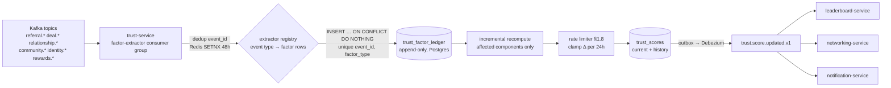
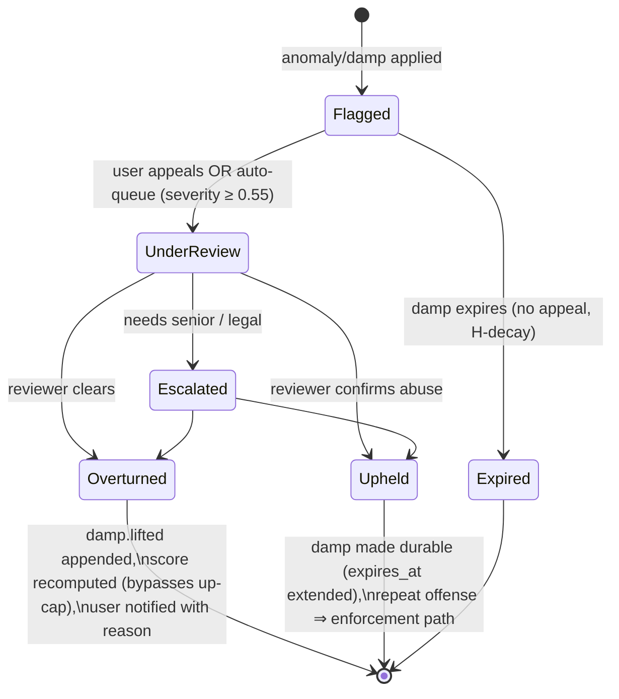
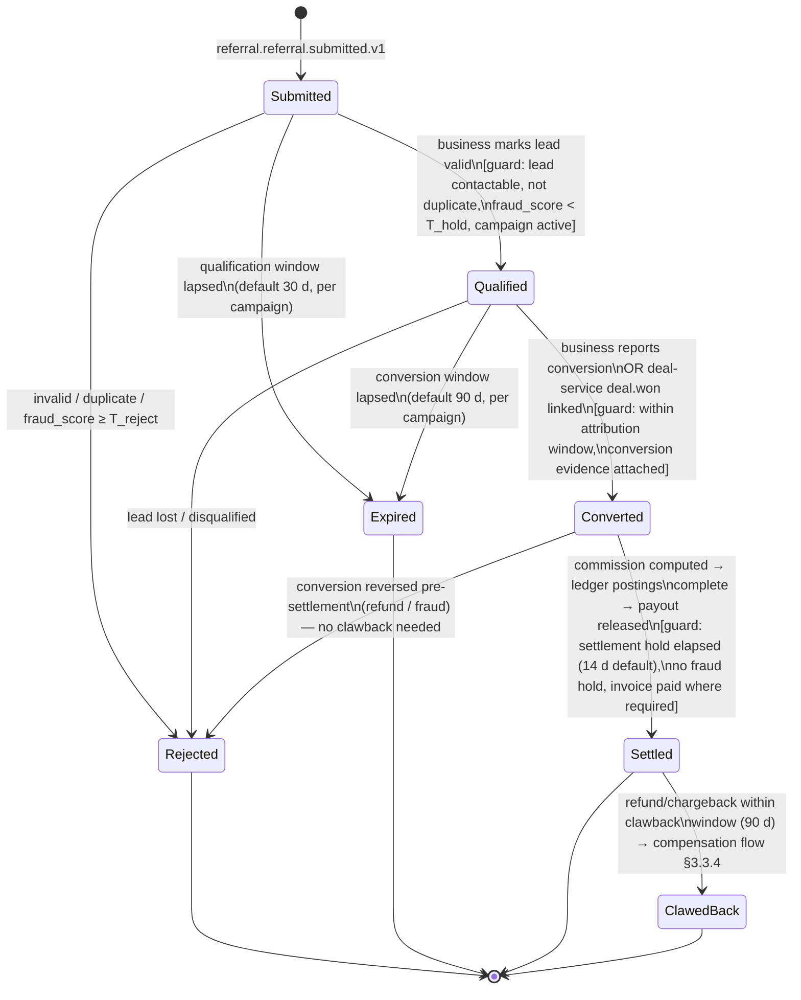
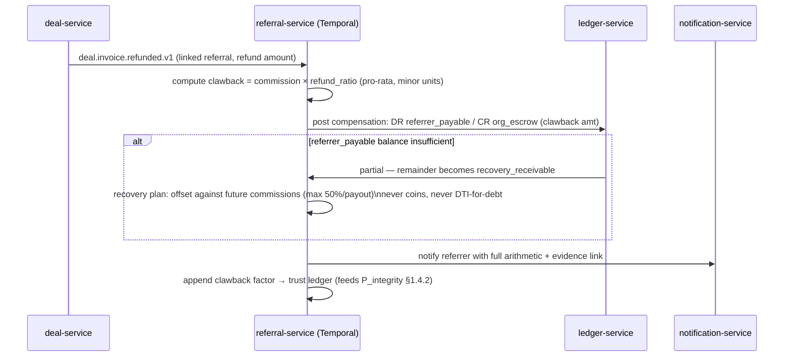

# 06 — Algorithms: Trust, Referral, Recommendation, Leaderboard & Gamification

> **Authors:** Trust/Integrity Engineering · Referral System Architecture · Gamification Design
> **Status:** Design-complete. Conforms to `_shared-context.md` (canonical DTI model §4 is binding; this doc expands it into an implementable specification and never contradicts it).
> **Siblings:** table DDL in `05-data-architecture.md` · model serving/embeddings in `07-ai-architecture.md` · dashboards/alerting infra in `12-devops-platform.md`.

---

## Table of Contents

1. [Digital Trust Index — Full Specification](#1-digital-trust-index--full-specification)
2. [AI Relationship Score (per-relationship)](#2-ai-relationship-score)
3. [Referral Algorithms](#3-referral-algorithms)
4. [Recommendation Algorithms (networking-service)](#4-recommendation-algorithms)
5. [Leaderboard Algorithms](#5-leaderboard-algorithms)
6. [Gamification System](#6-gamification-system)
7. [Algorithm Health: Consolidated Monitoring Matrix](#7-consolidated-monitoring-matrix)

Design stance for the whole document: **every score is a projection over an append-only factor ledger.** No score is ever "edited" — factors are appended (including damping and reversal factors) and scores are recomputed. This single invariant buys us auditability, explainability, replayability, and appeal-ability for free, at the cost of storage (cheap) and recompute discipline (engineered below).

---

## 1. Digital Trust Index — Full Specification

### 1.1 Canonical model (restated, binding)

`DTI ∈ [0, 1000]`, per user, `DTI = 1000 × Σ wᵢ · sᵢ`, each `sᵢ ∈ [0, 1]`:

| # | Component `i` | Weight `wᵢ` | Max DTI points | Decays? |
|---|---|---|---|---|
| 1 | Identity & verification depth | 0.15 | 150 | No (revocation, not decay) |
| 2 | Referral performance | 0.20 | 200 | Yes (H=180 d) |
| 3 | Transaction & deal history | 0.15 | 150 | Yes (H=180 d) |
| 4 | Relationship quality | 0.15 | 150 | Yes (H=180 d) |
| 5 | Community contribution | 0.10 | 100 | Yes (H=180 d) |
| 6 | Consistency & longevity | 0.10 | 100 | Partially (see §1.4.6) |
| 7 | Knowledge contribution | 0.05 | 50 | Yes (H=180 d) |
| 8 | Peer vouches | 0.05 | 50 | Yes (H=180 d) |
| 9 | AI confidence / anomaly | 0.05 | 50 | Anomaly evidence decays (H=90 d) |

Trust bands (canonical): **Starter 0–249 · Bronze 250–449 · Silver 450–649 · Gold 650–849 · Platinum 850–1000.**

Everything below defines: the sub-signal math per component, decay, normalization, the streaming pipeline, reconciliation, cold start, rate limiting, anti-gaming, explainability, and governance.

### 1.2 Time-decay math (exact)

Behavioral components decay with **half-life H = 180 days**:

```
λ = ln(2) / H = 0.693147 / 180 = 3.8508 × 10⁻³ per day
decay(Δt) = e^(−λ·Δt) = 2^(−Δt/180)
```

Reference values: `decay(30d) = 0.891`, `decay(90d) = 0.707`, `decay(180d) = 0.500`, `decay(365d) = 0.245`, `decay(730d) = 0.060`.

**Where decay is applied — this matters.** Decay is applied **at read/recompute time to each factor's raw magnitude**, never by mutating the ledger:

```
m_eff(t) = m_raw × e^(−λ · (t − t_occurred))
```

- `trust_factor_ledger` rows are immutable; `m_raw` and `occurred_at` are stored once (schema in `05-data-architecture.md`).
- The incremental recompute (§1.5) and the nightly reconciliation (§1.6) both evaluate `m_eff` fresh. Between full recomputes, a user's score drifts slightly stale (worst case: 24 h of pure decay ≈ 0.38% shrink on behavioral mass); the nightly job trues this up, and any incoming event triggers an exact recompute of affected components.
- Anomaly-evidence factors use **H = 90 d** (`λ = 7.7016 × 10⁻³/day`): manipulation evidence should sting sharply and then fade if behavior stays clean — permanent scarlet letters create no incentive to reform, and the appeal workflow (§1.9.6) handles the truly innocent.
- Identity factors do **not** decay: a verified GST number is verified until revoked/expired, at which point a *negative* factor (`identity.revoked`) is appended.

*Alternative considered:* decaying the stored magnitudes via a daily batch multiply. Rejected: mutates the ledger (kills auditability), accumulates float error, and makes replay non-deterministic.

### 1.3 Normalization of unbounded signals

Raw signals (revenue, referral counts, post counts) are unbounded; components must land in `[0,1]`. Two squashers, chosen per signal:

**Log squash** — for count-like signals where "10× more" should read as "somewhat better, not 10× better":

```
squash_log(x; x_ref) = min(1, ln(1 + x) / ln(1 + x_ref))
```

`x_ref` is the **population p95** of that signal among *active, verified* users, refreshed **weekly** from ClickHouse and stored in the versioned scoring config (§1.11). Pinning to p95 rather than max keeps one whale from compressing everyone else, and versioning it keeps recomputes reproducible.

**Percentile squash** — for value-like signals (verified revenue) where the population distribution is heavy-tailed and we want rank semantics:

```
squash_pct(x) = clip(F̂(x), 0, 0.99) / 0.99
```

`F̂` is the empirical CDF approximated by a t-digest maintained in ClickHouse (`quantileTDigest`), snapshotted weekly into config. The 0.99 clip + renorm means the top 1% all saturate at 1.0 — deliberate: beyond p99 the marginal trust information of more revenue is nil, and it removes the incentive to wash-trade revenue for score.

**Wilson lower bound** — for any ratio estimated from few trials (conversion rates, promise-keeping). With `n` trials, observed proportion `p̂`, `z = 1.96` (95%):

```
wilson_lb(p̂, n) = ( p̂ + z²/2n − z·√( p̂(1−p̂)/n + z²/4n² ) ) / ( 1 + z²/n )
```

Examples: 1/1 converted → `wilson_lb = 0.206` (not 1.0); 8/10 → `0.490`; 80/100 → `0.713`; 800/1000 → `0.774`. This is the canonical small-sample smoothing invariant: **nobody buys a high conversion rate with three referrals to their cousin.**

*Alternative considered:* Laplace smoothing `(x+1)/(n+2)`. Rejected: no confidence semantics — 1/1 smooths to 0.67, still far too generous.

### 1.4 Per-component sub-signal formulas

Notation: all counts/sums below are **decay-weighted** (`Σ m_eff`) unless marked ⊘ (no decay). All sub-scores clip to `[0,1]`.

#### 1.4.1 Identity & verification depth (`s₁`, w=0.15)

Additive point schedule, capped at 1.0 ⊘:

| Signal | Points | Notes |
|---|---|---|
| Email + phone verified | 0.10 | Baseline; required at signup |
| Government KYC (tier 1: doc; tier 2: doc + liveness) | 0.20 / 0.30 | identity-service KYC tiers |
| Business verification: GST / company registry | 0.25 | Org-linked; propagates to org admins at 0.15 |
| Domain verification (DNS TXT) | 0.10 | |
| Social verification (LinkedIn OAuth w/ ≥ 1 y account age) | 0.10 | Age check kills fresh-sock accounts |
| Trusted device ≥ 30 d + biometric enrolled | 0.05 | `identity.device.trusted.v1` |
| Payout account verified (penny-drop / bank KYC) | 0.10 | Prerequisite for commissions anyway |

`s₁ = min(1, Σ points)`. Revocation (GST cancelled, KYC expired, social unlink) appends a negative factor of the same magnitude. Identity is the only purely additive component: it measures *costly, externally-verified facts*, not behavior — there is nothing to decay and nothing to game except by committing document fraud, which is a KYC-vendor problem plus the anomaly component's job.

#### 1.4.2 Referral performance (`s₂`, w=0.20 — the heaviest behavioral component)

```
s₂ = wilson_lb(conv̂, n_q)^0.7 × squash_log(V_dec; V_ref) × R_ewma × P_integrity
```

- `conv̂ = n_converted / n_qualified` (lifetime, decay-weighted numerator & denominator; using *qualified* as denominator so spray-and-pray submissions that never qualify don't dilute — they instead feed the anomaly component if extreme). `n_q` = decayed qualified count.
- Exponent 0.7 softens the Wilson penalty for mid-volume users (design choice: conversion *quality* should dominate but not brutally gate newcomers who have 5 good referrals).
- `V_dec = Σ decay(Δt)` over **converted-and-settled** referrals; `V_ref` = weekly p95 (≈ 25 at launch prior). Only settled conversions count volume — conversion claimed but never settled through `ledger-service` is worth zero (anti-cheat invariant shared with leaderboards §5.7).
- `R_ewma` — recency: exponentially-weighted "has referred recently" activity with half-life 90 d:
  `R_ewma = min(1, Σ_{referrals} 2^(−Δt_j/90) / 3)` — i.e. three recent referrals saturate recency. A great referrer from 2024 who stopped drifts down via both this and global decay.
- `P_integrity = clip(1 − 2·clawback_rate − 5·fraud_confirmed_rate, 0, 1)` — clawbacks (refunded deals, §3.3) cost double their rate; confirmed referral fraud costs 5×. One confirmed fraud in 20 referrals ⇒ ×0.75 on the entire component.

Feeder: the **Referrer Quality Score** (§3.5) is the same computation exposed to referral-service for marketplace matching — single implementation, two consumers.

#### 1.4.3 Transaction & deal history (`s₃`, w=0.15)

```
s₃ = 0.55 × squash_pct(GMV_dec) × D_penalty
   + 0.25 × squash_log(n_deals_won_dec; 20)
   + 0.20 × diversity_counterparty
```

- `GMV_dec` = decay-weighted sum of **ledger-verified** deal value (invoice paid events `deal.invoice.paid.v1` reconciled against `ledger.entry.posted.v1`); self-reported deal values contribute **zero**. Currency-normalized to INR minor units at posting-date rates via ledger-service (see money invariant, `_shared-context.md` §1).
- `D_penalty = clip(1 − 3·dispute_rate, 0.2, 1)` where `dispute_rate` = disputed invoices / paid invoices (decayed, Wilson-smoothed if n < 20). Floor 0.2, not 0: disputes damage but identity of having transacted retains some signal.
- `diversity_counterparty = 1 − HHI` where `HHI = Σ_k (GMV_k / GMV_total)²` over counterparties `k`. One counterparty ⇒ HHI = 1 ⇒ diversity 0. Ten equal counterparties ⇒ 0.9. This is the primary structural defense against **wash trading**: two accounts ping-ponging invoices max out concentration and earn almost nothing (and light up the collusion detector, §1.9.2).

#### 1.4.4 Relationship quality (`s₄`, w=0.15) — explicitly *not* raw contact count

```
s₄ = 0.35·reciprocity + 0.30·depth + 0.20·diversity + 0.15·liveness
```

Over the user's relationship edges from relationship-service (each edge carries the AI Relationship Score `RS ∈ [0,100]`, §2):

- `reciprocity` = mean over *active* edges of `min(out_j, in_j) / max(out_j, in_j)` where `out/in` are decayed initiated-interaction counts per direction. Broadcast-only "networkers" (1000 sent, 12 replies) score near 0.
- `depth` = `mean(top_25 RS) / 100` — the strength of your strongest 25 relationships, not the size of your address book. If fewer than 25 edges, missing slots count as RS = 0 (soft volume incentive, hard quality dominance).
- `diversity` = normalized Shannon entropy over edge buckets (industry × city of counterpart):
  `diversity = −Σ p_b ln p_b / ln B_ref`, `B_ref = 12`. Rewards bridging structural holes; a network of 40 people all in one WhatsApp-group monoculture scores low here (Burt would approve; so does fraud prevention — rings are monocultures).
- `liveness` = share of edges with any interaction in last 90 d, log-squashed against 0.4 (having 40% of your network warm is excellent; 100% is either superhuman or a bot).

#### 1.4.5 Community contribution (`s₅`, w=0.10) — the *only* gamification-fed component

```
s₅ = min(1, 0.70 × s₅_organic + 0.30 × s₅_gamified)      ← hard 30% internal cap, see §6.7
s₅_organic  = 0.35·squash_log(helpful_dec; 40) + 0.25·squash_log(events_attended_dec; 15)
            + 0.25·squash_log(events_hosted_dec; 6) + 0.15·endorse_ratio − mod_penalty
s₅_gamified = squash_log(XP_community_dec; XP_ref_wk×26)
```

- `helpful_dec`: posts/answers that received "helpful" marks from **≥ 2 distinct non-connected members** (dedup by vouch-graph distance ≥ 2 kills mutual-admiration pairs).
- `endorse_ratio` = wilson_lb(helpful-marked posts / total posts, n_posts) — posting volume without endorsement is worth nothing (and slightly negative via dilution).
- `mod_penalty` = 0.1 per upheld moderation strike (decayed, H=180 d), max 0.5.
- `s₅_gamified` is the **firewall'd** gamification input (§6.7): community-scoped XP only, capped so that gamified grinding can move DTI by at most `1000 × 0.10 × 0.30 = 30 points`. Full rationale in §6.7.

#### 1.4.6 Consistency & longevity (`s₆`, w=0.10)

```
s₆ = 0.30·tenure + 0.40·regularity + 0.30·promise_keeping
tenure     = 1 − e^(−days_since_registration/365)          ⊘ (no decay; it *is* time)
regularity = EWMA_{H=56d}(weekly_active_indicator)          (active week = ≥1 meaningful action)
promise    = wilson_lb(kept / committed, n_committed)
```

- `tenure`: 6 mo → 0.40, 1 y → 0.63, 2 y → 0.86, 3 y → 0.95. Saturating, so tenure alone never dominates.
- `regularity` EWMA over weekly booleans with 8-week half-life (`α = 1 − 2^(−1/8) = 0.0830` per week): steady weekly use → ~1.0; bursty quarterly binges → ~0.3. Measures the *habit*, not the volume — volume is already priced in other components, and pricing it twice would double-reward grinders.
- `promise_keeping`: `kept` = meetings attended (both parties confirmed / calendar-verified) + deadlines met on deals; `committed` = meetings scheduled + deadlines set. No-shows are the single most legible trust signal humans track; we track it too.

#### 1.4.7 Knowledge contribution (`s₇`, w=0.05)

```
s₇ = squash_log( Σ_items quality_item × consumption_item ; K_ref )
quality_item     = wilson_lb(endorsements / unique_consumers, unique_consumers)
consumption_item = ln(1 + unique_consumers_dec)
```

Consumption-weighted *and* endorsement-gated: publishing 50 unread templates ⇒ ~0; one SOP used by 300 people with 40% endorsement ⇒ substantial. `K_ref` = weekly p95 (launch prior 30). Consumers who are graph-adjacent to the author (distance 1) are excluded from `unique_consumers` — no self-cheering-squad.

#### 1.4.8 Peer vouches (`s₈`, w=0.05, transitively damped)

Vouches live in Neo4j as `(:User)-[:VOUCHES {weight, created_at}]->(:User)`. Raw inbound vouch value for user `i`:

```
V_i = Σ_j  (DTI_j / 1000)^1.5 × (1/√outdeg_j) × recip_damp_ij × ring_damp_j × decay(Δt_ij)

s₈ = squash_log(V_i ; 6.0)
```

- `(DTI_j/1000)^1.5` — a vouch is worth the *voucher's* trust, superlinearly: Platinum vouch (0.9^1.5=0.854) ≫ Starter vouch (0.2^1.5=0.089). This makes vouch-farming with fresh accounts nearly worthless.
- `1/√outdeg_j` — vouch dilution: someone who vouches for 100 people spends 1/10 the weight per vouch of someone who vouches for 1. Vouching is a budget, not a broadcast.
- `recip_damp_ij = 0.5` if `j` and `i` vouch for each other (reciprocal pairs are half-weight — mutual back-scratching is the atomic unit of vouch fraud), else 1.0.
- `ring_damp_j ∈ [0.1, 1.0]` from the ring-detection pipeline (§1.9.1), applied to *all outbound vouches* of a flagged cluster member.
- Users may hold at most **10 active outbound vouches** (revocable; revocation appends the negative factor). Scarcity is the point.

*Alternative considered:* full personalized-PageRank trust propagation (à la EigenTrust). Rejected for v1: O(graph) recompute per update, hard to explain to users ("your score moved because of someone three hops away"), and the damped-one-hop model plus ring detection captures ~90% of the defense at 5% of the complexity. Revisit post-launch; the ledger makes migration replayable.

#### 1.4.9 AI confidence / anomaly (`s₉`, w=0.05, inverts)

```
s₉ = 1 − A_i,   A_i = clip( 0.5·A_rules + 0.5·A_model , 0, 1 )
```

- `A_rules`: max of triggered hard-rule severities (velocity breaches §1.9.3, device-sharing hits §1.9.2, ring membership §1.9.1) — each rule contributes a calibrated severity in [0,1], decaying with H = 90 d.
- `A_model`: isolation-forest + GBDT ensemble over behavioral feature vectors (feature list & training in `07-ai-architecture.md`), recalibrated monthly, output isotonic-calibrated to [0,1].
- Note the double action of anomalies: they zero out `s₉` (−50 pts max) **and** damp the specific gamed component via appended damping factors (§1.9.4). `s₉` is the "smoke detector"; damping is the "sprinkler."

### 1.5 Streaming update pipeline



**Idempotency, twice.** (1) Redis `SETNX trust:dedup:{event_id}` (TTL 48 h) short-circuits hot replays cheaply. (2) The ledger's unique constraint `(source_event_id, factor_type)` is the real guarantee — Redis is an optimization, Postgres is the law. At-least-once delivery therefore appends each factor exactly once.

```python
# trust-service/application/streaming.py  (pseudocode, structure per Clean Architecture)

HALF_LIFE_D = 180.0
LAMBDA = math.log(2) / HALF_LIFE_D

EXTRACTORS: dict[str, FactorExtractor] = {
    "referral.referral.converted.v1":   ReferralConvertedExtractor(),   # +referral factors
    "referral.commission.settled.v1":   ReferralSettledExtractor(),     # volume counts only now
    "deal.invoice.paid.v1":             DealValueExtractor(),           # ledger-verified GMV
    "relationship.score.updated.v1":    RelationshipEdgeExtractor(),
    "community.post.created.v1":        CommunityPostExtractor(),
    "identity.business.verified.v1":    IdentityFactorExtractor(),
    "rewards.xp.awarded.v1":            GamifiedCommunityExtractor(),   # firewall: community scope only
    "trust.anomaly.detected.v1":        AnomalyFactorExtractor(),       # negative / damping factors
    # ... full registry in code; unknown events are ignored (forward compatible)
}

async def handle_event(evt: CloudEvent) -> None:
    if not await redis.set(f"trust:dedup:{evt.id}", 1, nx=True, ex=48 * 3600):
        return                                            # fast-path replay drop
    extractor = EXTRACTORS.get(evt.type)
    if extractor is None:
        return
    factors = extractor.extract(evt)                      # list[FactorRow], may be []
    async with uow() as tx:                               # one Postgres tx
        inserted = await tx.factor_ledger.append_all(factors)   # ON CONFLICT DO NOTHING
        if not inserted:
            return                                        # true idempotent replay
        components = {f.component for f in inserted}
        user_id = evt.subject
        new_subscores = await recompute_components(tx, user_id, components)
        await apply_and_publish(tx, user_id, new_subscores, cause=inserted)

async def recompute_components(tx, user_id, components) -> dict[str, float]:
    """Exact recompute of only the touched components, reading the ledger.
    Each component's factor set is small (bounded by decay: factors older than
    ~4 half-lives contribute <6% and are excluded by occurred_at > now-720d)."""
    out = {}
    for comp in components:
        rows = await tx.factor_ledger.load(user_id, comp, since=now() - timedelta(days=720))
        out[comp] = COMPONENT_FORMULAS[comp](rows, config=active_scoring_config())
    return out

async def apply_and_publish(tx, user_id, subscores, cause):
    cur = await tx.scores.get_for_update(user_id)          # SELECT ... FOR UPDATE
    s = dict(cur.subscores) | subscores
    raw = round(1000 * sum(W[c] * s[c] for c in W))        # W = versioned weights, §1.11
    limited, clamped = rate_limit(cur, raw)                # §1.8
    if limited == cur.score and s == cur.subscores:
        return
    await tx.scores.save(user_id, score=limited, subscores=s,
                         raw_unclamped=raw, config_version=active_scoring_config().version)
    await tx.outbox.emit("trust.score.updated.v1", {
        "userId": public_id(user_id), "score": limited, "previousScore": cur.score,
        "band": band(limited), "previousBand": band(cur.score),
        "topFactorDeltas": attribution_deltas(cur, s, cause, k=5),   # §1.10
        "rateLimited": clamped, "configVersion": active_scoring_config().version,
    })
```

Consumer group is partitioned by `user_id` (Kafka partition key per shared-context §3), so per-user updates are serialized — no lost-update races between concurrent events for the same user; `FOR UPDATE` is belt-and-braces for the reconciler.

**Factor-row shape** (logical; DDL in `05-data-architecture.md`):

```
trust_factor_ledger (
  factor_id        uuid v7 PK,
  user_id          uuid NOT NULL,
  component        text NOT NULL,        -- 'referral' | 'transaction' | ... | 'damp'
  factor_type      text NOT NULL,        -- 'referral.converted', 'vouch.received',
                                         -- 'damp.applied', 'damp.lifted', 'identity.revoked'...
  magnitude        numeric NOT NULL,     -- m_raw; negative for reversals/revocations
  metadata         jsonb NOT NULL,       -- counterparty ids, amounts, damp multiplier,
                                         -- evidence_ref, quarantined flag, expires_at
  source_event_id  uuid NOT NULL,        -- CloudEvents id — idempotency anchor
  occurred_at      timestamptz NOT NULL, -- decay clock uses THIS, not ingestion time
  recorded_at      timestamptz NOT NULL DEFAULT now(),
  UNIQUE (source_event_id, factor_type)
)
-- index: (user_id, component, occurred_at DESC)  — the recompute read path
```

`occurred_at` vs `recorded_at` distinction is load-bearing: late-arriving events (channel webhook retries, contact-import backfills) decay from when the behavior *happened*, so replays and backfills converge to identical scores — determinism is what makes shadow scoring (§1.11) and backtests trustworthy.

#### 1.5.1 Worked example — one event, end to end

User `usr_9f…` (current: DTI 604, Silver; referral subscore `s₂ = 0.281` from 14 qualified / 9 converted-settled lifetime referrals). Event: `referral.commission.settled.v1` for a new conversion (₹80,000 deal, settled after hold).

1. Dedup: `SETNX trust:dedup:{evt_id}` → fresh.
2. Extract: `ReferralSettledExtractor` → one factor row `(component=referral, factor_type=referral.settled, magnitude=1.0, occurred_at=conversion_time)`.
3. Recompute `s₂` only. New decayed tallies: `n_q = 12.8`, `n_conv = 9.6` (older ones decayed), `conv̂ = 0.75`:
   - `wilson_lb(0.75, 12.8) = (0.75 + 1.9208/25.6 − 1.96·√(0.1875/12.8 + 3.8416/655)) / (1 + 3.8416/12.8)`
     `= (0.75 + 0.0750 − 1.96·√(0.02051)) / 1.3001 = (0.8250 − 0.2807) / 1.3001 = 0.4187`; `^0.7 → 0.5437`
   - `V_dec = 8.9` settled-decayed, `V_ref = 25` ⇒ `squash_log = ln(9.9)/ln(26) = 2.293/3.258 = 0.7038`
   - `R_ewma`: three referrals in last 60 d ⇒ `min(1, (0.87+0.79+0.63)/3) = 0.763`
   - `P_integrity = 1` (no clawbacks) ⇒ `s₂ = 0.5437 × 0.7038 × 0.763 × 1 = 0.292` (up from 0.281 — Wilson bound loosened by the extra settled conversion, volume and recency both ticked up).
4. New raw DTI = old + `1000 × 0.20 × (0.292 − 0.281) = +2.2` → 606 (well inside +15/day room).
5. Persist + outbox: `topFactorDeltas = [{referralPerformance: +2, cause: referral.settled, …}]`.

(The arithmetic above is the actual spec-level check developers should reproduce in the golden-file test suite: **golden users with hand-computed scores are part of trust-service's CI**, guarding against silent formula drift.)

**Throughput budget:** at 100 M users generating ~2 factor-events/user/day avg ⇒ ~2,300 events/s mean, ~15 k/s peak. Recompute touches ≤ 1 component's ledger slice (median < 200 rows, indexed by `(user_id, component, occurred_at)`); comfortably inside a 30-pod consumer deployment per region. Numbers and autoscaling in `12-devops-platform.md`.

### 1.6 Nightly full reconciliation

Temporal cron workflow `trust-reconcile` (per region, 02:00 local cell time, sharded 256 ways by `user_id` hash):

1. For each user active in last 720 d **or** whose score > cold-start prior: recompute **all 9 components** from the ledger with the current config version.
2. Compare with stored score. If `|Δ| ≤ 1` (rounding noise): touch `reconciled_at` only. If `|Δ| > 1`: apply through the same rate limiter and publish `trust.score.updated.v1` with `"cause": "reconciliation"`.
3. Emit reconciliation metrics: drift histogram, count of users clamped, per-component drift. **Alert if p99 drift > 5 points** — that means the incremental path has a bug (drift should be ≈ pure decay, which is < 4 pts/day even for a 1000-score user).
4. Pure-decay users (no events) drift down naturally here — this is the *only* place inactive users' scores fall, which also bounds reconciliation write volume: a fully-idle Silver user loses ~1–2 pts/night early on, decelerating exponentially.

Reconciliation doubles as **migration executor**: a new config version (§1.11) is activated by letting the nightly job recompute everyone under it (rate-limiter widened to ±60 for migration nights, announced in-app).

### 1.7 Cold-start priors

New users start with meaningful-but-humble scores, not zero (zero makes the first week feel punitive and makes Starter-band gates useless):

```
DTI₀ = 1000 × Σ wᵢ · priorᵢ
```

| Component | Prior sᵢ | Rationale |
|---|---|---|
| Identity | actual (0.10+ at signup) | Identity is verifiable on day 0 |
| Referral | 0.15 | Population ~p25 — "unknown, mildly hopeful" |
| Transaction | 0.10 | |
| Relationship | 0.20 if contacts imported ≥ 50 w/ dedup-verified overlap, else 0.10 | Imported graph is weak evidence of a real human with a real network |
| Community | 0.10 | |
| Consistency | 0.05 | Tenure genuinely is ~0 |
| Knowledge | 0.05 | |
| Vouches | 0.00 | Strictly earned |
| AI confidence | 0.80 | Innocent until anomalous; not 1.0 — brand-new accounts are objectively higher-risk |

⇒ `DTI₀ ≈ 1000 × (0.15×0.10 + 0.20×0.15 + 0.15×0.10 + 0.15×0.10 + 0.10×0.10 + 0.10×0.05 + 0.05×0.05 + 0 + 0.05×0.80) ≈ 143` — solidly **Starter**, reaching Bronze (250) requires roughly: finish KYC + first verified referral conversion or a few weeks of real relationship activity. Deliberate: the Starter→Bronze climb is the activation loop, and Bronze is the gate for public marketplace actions (referring in paid campaigns, listing services — enforcement in respective services).

Priors are Bayesian in spirit and implementation: each behavioral component computes `s = (n_prior·prior + n_evidence·s_evidence) / (n_prior + n_evidence)` with `n_prior = 5` pseudo-observations, so real evidence smoothly overtakes the prior instead of a cliff at "first event."

### 1.8 Score-change rate limiting

```
Upward:   max +15 per rolling 24 h
Downward: max −40 per rolling 24 h  (normal causes)
Bypass:   enforcement actions (confirmed fraud, KYC revocation, legal) apply immediately, no clamp
```

```python
def rate_limit(cur: ScoreRow, raw: int) -> tuple[int, bool]:
    if enforcement_override_active(cur.user_id):
        return raw, False
    delta_24h = cur.score - score_at(cur.user_id, now() - timedelta(hours=24))
    up_room, down_room = max(0, +15 - delta_24h), max(0, 40 + delta_24h)
    delta = raw - cur.score
    clamped = clip(delta, -down_room, +up_room)
    return cur.score + clamped, clamped != delta
```

Unapplied residual is *not* lost — the stored `raw_unclamped` means tomorrow's recompute naturally continues converging toward truth.

**Why asymmetric, and why at all.**
- *Upward cap (+15/d)*: any burst-gaming strategy (buy 50 vouches, wash-trade a weekend of deals) now needs to survive **weeks** of exposure to the anomaly detectors before paying off — it converts "gaming" from a sprint into a marathon through a minefield. Also protects downstream consumers (marketplace gates, leaderboards) from score whiplash.
- *Downward cap (−40/d)*: genuine bad signals should bite fast (−40 can drop a band in ~5 days), but a single disputed invoice shouldn't vaporize a Gold user overnight before a human can look — trust that falls too fast trains users to hide problems rather than resolve them.
- *No clamp for enforcement*: fraud crash must be instantaneous or the fraudster spends their remaining runway extracting value.

### 1.9 Anti-gaming, in depth

Threat model (ranked by expected loss): (T1) reciprocal-vouch rings, (T2) referral collusion / self-dealing, (T3) wash-traded deal GMV, (T4) engagement farming of community/knowledge components, (T5) velocity burst attacks, (T6) Sybil swarms feeding all of the above. Defenses are layered: **structural** (formulas that make gaming unprofitable, §1.4), **detective** (below), **corrective** (damping §1.9.4), **procedural** (appeals §1.9.6).

#### 1.9.1 Reciprocal-vouch ring detection (Neo4j GDS)

Nightly per-region job (`trust-service` batch, graph projected fresh):

```cypher
// 1) Project the recent vouch graph (undirected view for Louvain; keep direction as property)
CALL gds.graph.project.cypher(
  'vouch_graph',
  'MATCH (u:User) WHERE u.dti_score IS NOT NULL RETURN id(u) AS id',
  'MATCH (a:User)-[v:VOUCHES]->(b:User)
   WHERE v.created_at > datetime() - duration({days: 365})
   RETURN id(a) AS source, id(b) AS target, 1.0 AS weight'
);

// 2) Louvain community detection
CALL gds.louvain.stream('vouch_graph', { maxLevels: 5, tolerance: 0.0001 })
YIELD nodeId, communityId
WITH gds.util.asNode(nodeId) AS u, communityId
SET u.vouch_cluster = communityId;

// 3) Per-cluster suspicion features: size, edge density, reciprocity ratio,
//    device overlap, account-age homogeneity
MATCH (a:User)-[v:VOUCHES]->(b:User)
WHERE a.vouch_cluster = b.vouch_cluster AND a.vouch_cluster IS NOT NULL
WITH a.vouch_cluster AS cluster,
     count(v) AS intra_edges,
     count(DISTINCT a) + count(DISTINCT b) AS approx_nodes,
     sum(CASE WHEN exists((b)-[:VOUCHES]->(a)) THEN 1 ELSE 0 END) AS reciprocal_edges
WITH cluster, intra_edges, reciprocal_edges,
     toFloat(reciprocal_edges) / intra_edges AS reciprocity_ratio
MATCH (m:User {vouch_cluster: cluster})
WITH cluster, intra_edges, reciprocity_ratio, collect(m) AS members,
     count(m) AS n
WHERE 3 <= n <= 60
WITH cluster, members, n, reciprocity_ratio,
     toFloat(intra_edges) / (n * (n - 1)) AS density,        // directed density
     reduce(s = 0.0, m IN members |
       s + duration.between(m.registered_at, datetime()).days) / n AS avg_age_days
RETURN cluster, n, density, reciprocity_ratio, avg_age_days,
       (0.45 * reciprocity_ratio + 0.35 * density
        + 0.20 * CASE WHEN avg_age_days < 90 THEN 1.0 ELSE 90.0/avg_age_days END)
       AS ring_suspicion
ORDER BY ring_suspicion DESC;
```

Decision thresholds (versioned config): `ring_suspicion ≥ 0.75` → auto-damp (`ring_damp = 0.25`) + case opened; `0.55–0.75` → damp `0.6` + queue for review; `< 0.55` → observe. Legitimate dense clusters exist (a real BNI chapter *is* a dense reciprocal cluster!) — which is why device/payment overlap and age homogeneity are in the suspicion score, why damping is graduated rather than binary, and why the appeal path (§1.9.6) is first-class.

A genuine chapter also shows high *external* connectivity; rings don't — members of a vouch-farm exist *for* the ring, so their non-ring graph is thin. The **external-edge ratio** is the strongest single discriminator and is computed per flagged cluster before any damp is applied:

```cypher
// External-edge ratio: relationship edges (not vouches) from cluster members
// to non-members, normalized per member. Real communities: high. Rings: near zero.
MATCH (m:User {vouch_cluster: $cluster})
OPTIONAL MATCH (m)-[r:RELATES]->(x:User)
WHERE x.vouch_cluster IS NULL OR x.vouch_cluster <> $cluster
WITH count(DISTINCT m) AS n, count(r) AS external_edges,
     count(DISTINCT CASE WHEN r.rs >= 40 THEN x END) AS strong_external_partners
RETURN toFloat(external_edges) / n            AS ext_edges_per_member,
       toFloat(strong_external_partners) / n  AS strong_ext_per_member;
-- decision modifier: strong_ext_per_member >= 5  ⇒ suspicion × 0.5 (looks like a
-- real chapter); < 1 ⇒ suspicion × 1.3 (isolated clique — classic farm)
```

Cadence & scale: the projection covers only vouch-active users (vouches are scarce by design — ≤ 10 outbound each), so even at 100 M users the vouch graph is ~10⁷ edges; Louvain on GDS completes in minutes on one graph-analytics replica. Runs nightly; damp factors it emits go through the standard ledger path (§1.9.4), so a user's morning score already reflects last night's detection — inside the burst window the +15/day up-cap (§1.8) is the holding defense.

#### 1.9.2 Referral collusion / self-dealing detection

Colluders create leads that "convert" to farm commission + referral trust. Detection joins the referral graph with **identity fingerprints**:

```sql
-- Nightly: referrals where referrer and referred lead share hard identifiers.
-- fingerprints table (05-data-architecture.md): device_hash, payment_hash (HMAC'd
-- instrument fingerprint from PSP), ip_asn, contact_hash (normalized phone/email HMAC)
SELECT r.referral_id, r.referrer_user_id, r.lead_user_id,
       BOOL_OR(f1.device_hash  = f2.device_hash)   AS shared_device,
       BOOL_OR(f1.payment_hash = f2.payment_hash)  AS shared_payment,
       COUNT(DISTINCT f2.device_hash) FILTER (
         WHERE f2.device_hash IN (
           SELECT device_hash FROM identity_fingerprints
           GROUP BY device_hash HAVING COUNT(DISTINCT user_id) >= 3
         ))                                        AS lead_on_crowded_devices
FROM referrals r
JOIN identity_fingerprints f1 ON f1.user_id = r.referrer_user_id
JOIN identity_fingerprints f2 ON f2.user_id = r.lead_user_id
WHERE r.state IN ('qualified','converted') AND r.updated_at > now() - interval '2 days'
GROUP BY 1, 2, 3;
```

Plus the **self-dealing graph** in Neo4j: `(referrer)-[:REFERRED]->(lead)` edges overlaid with `SAME_DEVICE` / `SAME_PAYMENT` / `CONTACT_OF` edges; a referral whose endpoints are connected by any hard-identifier edge, or which sits inside a small cycle (`A refers B's leads, B refers A's leads`) is scored by the fraud model (§3.4). `shared_payment = true` is a hard rule: **auto-hold settlement** (money never moves — cheaper than clawback) and a −severity 0.8 anomaly factor.

#### 1.9.3 Velocity anomalies

Per-user, per-signal rolling rates vs. self-baseline and population:

```
z_self(x) = (rate_1d − μ_self_28d) / max(σ_self_28d, σ_floor)
z_pop(x)  = (rate_1d − μ_pop_band) / σ_pop_band
trigger:  z_self > 6  AND  z_pop > 4      (both, to avoid punishing genuinely big days)
```

Tracked signals: vouches received/day, referrals submitted/day, helpful-marks received/day, deal-value posted/day, new-edge creation/day. Trigger appends anomaly factor (severity ∝ min(1, z_pop/10)) and — for vouches and referrals — flips that signal into **quarantine mode**: new factors accrue in the ledger with `quarantined = true` and contribute 0 until either 7 d pass without further triggers (auto-release, factors then count with normal decay from their true `occurred_at`) or review resolves. Quarantine-not-reject means false positives cost latency, not value — important for the "big conference weekend" legitimate burst.

```python
# trust-service velocity detector — runs in the streaming consumer per relevant event
SIGMA_FLOOR = {"vouches_in": 0.5, "referrals_out": 1.0, "helpful_in": 1.5,
               "deal_value": None,  # value signals use robust MAD, not σ
               "new_edges": 3.0}

def check_velocity(user_id: UUID, signal: str, ts: datetime) -> Anomaly | None:
    r1d  = rolling_rate(user_id, signal, window="1d")          # Redis sliding counter
    base = baseline(user_id, signal, window="28d")             # μ, σ from ClickHouse mat view
    pop  = population_baseline(signal, band=dti_band(user_id)) # per-band, weekly refresh
    z_self = (r1d - base.mu) / max(base.sigma, SIGMA_FLOOR[signal])
    z_pop  = (r1d - pop.mu) / pop.sigma
    if z_self > 6 and z_pop > 4:
        sev = min(1.0, z_pop / 10)
        quarantine(user_id, signal, days=7) if signal in {"vouches_in", "referrals_out"} else None
        return Anomaly(user_id, rule=f"velocity.{signal}", severity=sev,
                       evidence={"r1d": r1d, "z_self": z_self, "z_pop": z_pop})
    return None
```

The dual-threshold (self **and** population) is the key false-positive control: a power user's normal Tuesday is another user's 10σ day; requiring both means we only trigger on behavior abnormal *for this person* **and** abnormal *for anyone like them*.

#### 1.9.4 How damping is applied (corrective layer)

Damping is **appended, never in-place**: a `trust.anomaly.detected.v1` event yields ledger rows of `factor_type = 'damp'` carrying `{target_component, multiplier, evidence_ref, expires_at}`. Component formulas fold damps in as: `s_comp_final = s_comp × Π active_multipliers` (multiplicative, floored at 0.1). Because damps are ledger rows: they appear in the user's factor attribution (§1.10) as "score reduced pending review — case #…", they decay/expire, they replay deterministically, and lifting one (appeal upheld) is another append (`damp.lifted`), preserving full history.

#### 1.9.5 Sybil pressure (cross-cutting)

Sybils are throttled upstream (identity-service: KYC for payouts, Turnstile + device attestation at signup, phone dedup) — but scoring assumes leakage anyway: everything valuable requires *verified counterparties* (settled money, KYC'd vouchers with their own DTI at stake, non-adjacent endorsers). The design goal is that a Sybil army's marginal DTI yield per account-week is below its identity-verification cost; the quantities that matter (`(DTI_j)^1.5` vouch weight, ledger-settled-only GMV/referrals) are exactly the ones a Sybil can't fake without spending real money — at which point it's revenue, not fraud.

#### 1.9.6 Appeal & human-review workflow



Operational rules: appeal button lives directly on the score-explanation screen (§1.10); SLA 72 h (Temporal workflow with escalation timer); reviewers see the **evidence bundle** (triggering factors, graph snapshot, fingerprint hits) but PII-minimized per `05-data-architecture.md` privacy rules; reviewer decisions are themselves logged and sampled for QA (10% double-review, disagreement rate is a tracked metric); an overturned damp **bypasses the +15/day up-cap** for the restoration delta (users must be made whole immediately). Repeat upheld offenses (≥ 3 in 365 d) escalate to enforcement: score floor removal, payout freeze, ban — policy in trust-safety runbook.

### 1.10 Explainability — factor attribution API

Users must see *why* the score moved. Every `trust.score.updated.v1` carries `topFactorDeltas`; the API serves the full breakdown:

`GET /v1/trust/me/score` →

```json
{
  "score": 612,
  "band": "silver",
  "bandProgress": { "current": 612, "nextBand": "gold", "nextBandAt": 650 },
  "configVersion": "dti-2026.07.1",
  "asOf": "2026-07-07T04:10:22Z",
  "components": [
    { "key": "referralPerformance", "weight": 0.20, "subscore": 0.71, "points": 142, "maxPoints": 200,
      "trend30d": +11 },
    { "key": "identityVerification", "weight": 0.15, "subscore": 0.80, "points": 120, "maxPoints": 150,
      "trend30d": 0,
      "improveHints": ["Verify your business GST to add up to 37 points"] }
    // ... 7 more
  ],
  "recentChanges": [
    { "at": "2026-07-06T14:02:11Z", "delta": +6, "cause": "referral.converted",
      "explanation": "Your referral to Meera Kapoor converted (₹1,20,000 deal, settled)",
      "componentDeltas": { "referralPerformance": +5, "consistencyLongevity": +1 } },
    { "at": "2026-07-04T09:15:40Z", "delta": -3, "cause": "decay",
      "explanation": "No referral activity in 60 days — older results count less over time" },
    { "at": "2026-07-01T18:30:00Z", "delta": -8, "cause": "anomaly.damp",
      "explanation": "Some recent vouches are under review (case TS-88213). You can appeal.",
      "appealUrl": "/v1/trust/appeals/TS-88213" }
  ]
}
```

Attribution math: for each update, `componentDeltas[c] = 1000·w_c·(s_c_new − s_c_old)` rounded; `topFactorDeltas` = top-k by |delta| with human templates rendered from `cause` + factor metadata (template registry in trust-service, localized). Decay-only changes are aggregated into one nightly "decay" line — nobody wants nine rows of −0.4. **Everything shown derives from ledger rows**, so support, reviewers, and the user all see the same truth.

### 1.11 Governance of weights & config

- All constants in this section — weights `wᵢ`, half-lives, squash references, thresholds, priors, rate limits — live in a **versioned scoring config** (`dti-YYYY.MM.N`), stored in Postgres, immutable once activated, referenced by every score row and event.
- Change pipeline: proposal (with hypothesis) → **backtest**: replay 90 d of ledger under new config in ClickHouse, report score-distribution shift per band/country, band-migration matrix, correlation with downstream outcomes (referral conversion, dispute rates) → **shadow scoring**: new config computed in parallel for 100% of users for ≥ 14 d, dashboards compare live vs. shadow, gaming-canary accounts (red-team maintained) verified to not improve → **staged activation**: 1% cohort → 10% → 100% via nightly reconciliation, flag-gated (OpenFeature), each stage with abort criteria.
- Weight changes are product-governance events: sign-off from trust engineering + product + policy; changelog published to users ("How your Trust Index is calculated" page shows current version and a diff summary). Trust in the trust score is the meta-invariant.

### 1.12 DTI failure modes, abuse vectors, monitoring

| Failure / abuse | Detection metric | Alert threshold | Response |
|---|---|---|---|
| Incremental/reconcile divergence (bug) | nightly p99 |drift| | > 5 pts | Page; freeze config; reconcile authoritative |
| Consumer lag → stale scores | Kafka lag on trust group | > 5 min | Autoscale; degrade to "score updating…" badge |
| Vouch-ring FP storm (real communities damped) | appeal rate, overturn rate | overturn > 25% weekly | Loosen thresholds via config; retrain |
| Score inflation (macro) | band population shares vs. targets | Platinum > 3% or Gold+Platinum > 15% | Governance review; squash refs auto-tighten weekly |
| Wash-trading GMV | GMV-vs-counterparty-HHI outliers; damp volume | novel pattern | Red-team replay; new rule shipped as config |
| Rate-limiter masking fraud crash | count of enforcement bypasses; clamped-down users | trend break | Review enforcement path latency |
| Explainability drift (UI lies) | sampled recompute-vs-shown diff | any mismatch | Sev-2; ledger is truth, regenerate |

Dashboards ("DTI Health", Grafana, infra in `12-devops-platform.md`): score distribution by band/country/tenure cohort, daily Δ histogram, clamp rates, anomaly trigger rates by rule, appeal funnel (opened→resolved→overturned), pipeline lag, reconciliation drift.

---

## 2. AI Relationship Score

**Per-relationship** (one score per edge `(user_a, user_b)` — actually two, see directionality note), `RS ∈ [0, 100]`, owned by relationship-service, distinct from DTI: DTI answers "how trustworthy is this person globally?"; RS answers "how strong is *this specific* relationship right now?". RS feeds: DTI's relationship-quality component (§1.4.4), networking-service ranking features (§4.2), attribution's "trusted touch" definition (§3.2), and automation-service triggers.

**Directionality:** RS is computed per *directed* edge — `RS(a→b)` is a's relationship strength toward b. Reciprocity is a feature *inside* the score, but the scores can legitimately differ (b may be a's key client; a is one of b's fifty vendors). UI shows your outbound score; DTI uses outbound edges.

### 2.1 Feature definitions

All from `relationship.interaction.recorded.v1` events (calls, messages, meetings, deals, intros, event co-attendance — channel adapters normalize in contact/relationship services). Interaction `j` has channel `c_j`, direction, timestamp `t_j`, and depth attributes.

| Feature | Formula | Range |
|---|---|---|
| **Recency** `f_rec` | `2^(−days_since_last_interaction / 30)` (30 d half-life) | [0,1] |
| **Frequency** `f_freq` | `min(1, EWMA_{H=8w}(interactions/week) / cadence_ref)`; `cadence_ref` = edge-personal baseline `max(0.5, median cadence of this edge over its life)` — measures *keeping up your own rhythm*, so a quarterly-cadence mentor edge isn't punished vs a daily-chat colleague | [0,1] |
| **Depth** `f_dep` | `squash_log(Σ_j depth_pts_j × 2^(−Δt_j/180); 60)` where depth_pts: meeting 5 (in-person 8), call 3, meaningful message 1 (≥ 120 chars or reply-chain ≥ 3), intro made for them 8, deal together 13 | [0,1] |
| **Reciprocity** `f_rcp` | `min(init_out, init_in) / max(init_out, init_in)` over decayed initiation counts; 0 if either side is 0 | [0,1] |
| **Sentiment** `f_sen` | `(mean_sentiment + 1) / 2` where per-interaction sentiment ∈ [−1,1] from claude-haiku-4-5 classification (consented content only; metadata-only edges get neutral 0.5 — never a penalty for privacy). EWMA H=90 d | [0,1] |
| **Channel diversity** `f_div` | `H(p_c) / ln(4)` — Shannon entropy over channel mix (message/call/meeting/business), capped at 4 effective channels | [0,1] |

### 2.2 Score & decay

```
RS = 100 × ( 0.25·f_rec + 0.20·f_freq + 0.20·f_dep + 0.15·f_rcp + 0.10·f_sen + 0.10·f_div )
```

Weights versioned in the same governance pipeline as DTI (§1.11, config family `rs-*`). Recomputed incrementally on each interaction event; time-based drift (recency/frequency shrinking) is materialized by a **weekly sweep** per edge (cheap: pure function of last state + Δt) plus on-read freshness for edges older than 7 d since materialization.

Decay is built into the features (recency half-life 30 d, depth half-life 180 d), so a dormant strong relationship glides: e.g. an edge at RS 82 with no contact decays to ≈ 61 after 60 d, ≈ 45 after 120 d — matching the intuition that six quiet months turn a strong tie into a warm-but-fading one.

```python
# relationship-service — weekly sweep (Temporal cron, sharded by user_id hash)
# Pure function of (last materialized state, Δt): no ledger scan needed for drift.
def sweep_edge(e: EdgeState, now: datetime) -> EdgeState:
    dt_d = (now - e.last_interaction_at).days
    f_rec  = 2 ** (-dt_d / 30)
    f_freq = min(1.0, e.freq_ewma * 2 ** (-(now - e.freq_asof).days / 56) / e.cadence_ref)
    f_dep  = e.depth_mass * 2 ** (-(now - e.depth_asof).days / 180)      # mass pre-squash
    rs = 100 * (0.25 * f_rec + 0.20 * f_freq + 0.20 * squash_log(f_dep, 60)
                + 0.15 * e.f_rcp + 0.10 * e.f_sen + 0.10 * e.f_div)
    new = replace(e, rs=round(rs), swept_at=now)
    if risk_conditions(e, new):                       # §2.3 predicate
        emit("relationship.risk.detected.v1", edge=e.id, tier=risk_tier(e, new))
    if abs(new.rs - e.rs) >= 3:                        # publish threshold: cut event noise 10×
        emit("relationship.score.updated.v1", edge=e.id, rs=new.rs, previous=e.rs)
    return new
```

The ≥ 3-point publish threshold matters at scale: 100 M users × ~150 edges = 1.5 × 10¹⁰ edges; weekly sweeps that emitted every ±1 drift would flood Kafka with ~2 × 10⁹ no-information events. Downstream consumers (DTI's §1.4.4, networking features) tolerate 3-point staleness by design. Sweep cost is bounded by materializing only *active-ish* edges (any interaction in 365 d); archived edges get recomputed on-touch.

### 2.3 "Relationship at risk" detection → automation triggers

Fired by the weekly sweep as `relationship.risk.detected.v1` (extends canonical taxonomy) when **all** hold:

```
peak_RS_180d ≥ 55                         # was a real relationship, not an acquaintance
RS_now ≤ peak_RS_180d − 20                # meaningful decline
f_rec < 0.35   (≈ 46+ days silent)        # driven by silence, not sentiment noise
no_scheduled_future_interaction           # nothing already on the calendar
user_not_snoozed(edge)                    # respects "let it fade" choice
```

Severity tiers: **watch** (Δ ≥ 20), **at-risk** (Δ ≥ 30 or 90 d silent on a peak ≥ 70 edge), **critical** (top-25 edge gone 120 d silent). automation-service subscribes and runs the user's configured playbook (default: at-risk → AI Copilot drafts a re-engagement message referencing last context, waits for user approval; never auto-sends — relationship automation without consent is exactly the dark pattern §6.6 bans). Feedback: if the user re-engages within 14 d of a nudge, `ai.feedback.recorded.v1` labels the nudge helpful — this trains nudge targeting (see `07-ai-architecture.md`).

### 2.4 Failure modes & monitoring

| Risk | Mitigation / metric |
|---|---|
| Sentiment model over-reads sarcasm/short texts | Sentiment weight only 0.10; neutral prior; monitor sentiment-vs-user-label agreement on sampled consented data |
| Users spam pings to inflate RS before asking for intros | Depth requires meaningful interactions; reciprocity gates one-way spam; RS feeds DTI only through top-25 mean |
| Nudge fatigue | Per-user weekly nudge cap (3), digest mode default; monitor nudge dismiss rate (> 60% ⇒ back off cohort) |
| Metadata-only privacy edges scored unfairly | Neutral sentiment, depth from event types only; monitored via score parity dashboard consented-vs-not |

---

## 3. Referral Algorithms

### 3.1 Referral lifecycle state machine

Owned by referral-service; every transition emits its canonical event and appends to the referral's event history (event-sourced aggregate — this is the money path, we want full replay).



Transition guards are pure functions over (referral, campaign, fraud score, ledger state) — enforced in the domain layer; illegal transitions are impossible by construction (`referral.state` has a DB CHECK + the aggregate rejects invalid commands). Timeouts (`Expired`, settlement hold) are Temporal timers on the referral workflow, not cron scans — 100 M-scale cron scans of "what expired today" are how you get thundering herds.

**Why `Settled` is a distinct state from `Converted`:** money movement is asynchronous, hold-gated, and reversible in ways conversion is not. Collapsing them (as naive designs do) makes clawback semantics incoherent and lets fraud extract cash at conversion speed. The 14-day settlement hold exists specifically so most fraud is caught while the money is still ours (§1.9.2 auto-hold).

### 3.2 Multi-touch attribution

**Default: Last-Trusted-Touch (LTT).** The referral credit goes to the **most recent touch within the attribution window (default 30 d) from a referrer who (a) has DTI ≥ Bronze (250) and (b) has RS ≥ 30 with the referred lead *or* an otherwise verifiable channel touch (tracked link + confirmed lead identity).**

Justification (this is where trust-platform ≠ ad-platform):
- Pure last-touch is trivially sniped: bots and link-spammers blanket every channel and steal credit from the human who actually made the warm intro. Requiring a trust floor + an actual relationship with the lead makes the *touch* itself costly to fake — you can't LTT-snipe without first having a real relationship or a real trusted account.
- Pure first-touch rewards cold spray; time-decayed multi-touch (Shapley-ish) is fairer in theory but unexplainable to a commission recipient ("you earned 23.7% of this commission" starts fights; BNI-style networks run on *legible* credit).
- LTT is legible: "Priya's intro was the last trusted touch — Priya gets it."

**Option: Position-Based 40/20/40** (per-campaign opt-in): 40% first trusted touch, 40% last trusted touch, 20% split evenly across middle trusted touches. Offered because B2B campaigns with long cycles genuinely have distinct opener/closer roles and campaign owners asked ad-platforms for this for a decade. Commission splits are computed in minor units with **largest-remainder rounding** (Σ splits ≡ total, always — ledger-service rejects unbalanced postings anyway).

```python
# referral-service/domain/attribution.py

def eligible_touches(touches: list[Touch], lead: Lead, cfg: CampaignAttribution) -> list[Touch]:
    win_start = lead.converted_at - cfg.window          # default 30 d
    out = []
    for t in sorted(touches, key=lambda t: t.at):
        if not (win_start <= t.at <= lead.converted_at):        continue
        if t.referrer.dti < 250:                                continue  # ≥ Bronze
        trusted = (relationship_score(t.referrer.id, lead.user_id) >= 30
                   or t.kind == "tracked_link_verified")
        if trusted:
            out.append(t)
    return out

def attribute(touches: list[Touch], lead, cfg) -> list[CreditSplit]:
    elig = eligible_touches(touches, lead, cfg)
    if not elig:
        return []                                       # unattributed — org keeps commission
    if cfg.model == "last_trusted_touch":
        winner = max(elig, key=lambda t: (t.at, t.referrer.dti, -uuid_time(t.referral_id)))
        return [CreditSplit(winner.referrer.id, bps=10_000)]
    if cfg.model == "position_40_20_40":
        if len(elig) == 1:  return [CreditSplit(elig[0].referrer.id, bps=10_000)]
        if len(elig) == 2:  return [CreditSplit(elig[0].referrer.id, 5_000),
                                    CreditSplit(elig[-1].referrer.id, 5_000)]
        mid = elig[1:-1]
        splits = ([CreditSplit(elig[0].referrer.id, 4_000)]
                  + largest_remainder([m.referrer.id for m in mid], total_bps=2_000)
                  + [CreditSplit(elig[-1].referrer.id, 4_000)])
        return merge_same_referrer(splits)              # one referrer in 2 positions gets summed

def largest_remainder(ids: list[UUID], total_bps: int) -> list[CreditSplit]:
    base, rem = divmod(total_bps, len(ids))
    out = [CreditSplit(i, base) for i in ids]
    for i in range(rem):                                # deterministic: earliest touch first
        out[i].bps += 1
    return out
```

Amount conversion happens once, at commission computation: `amount_i = (commission_minor × bps_i) // 10_000` with the final largest-remainder pass on the *minor units* so that `Σ amount_i ≡ commission_minor` exactly.

Tie-breaks: identical-timestamp touches (rare; ms precision) → higher-DTI referrer wins; still tied → earlier `referral_id` (UUIDv7 = time-ordered, deterministic).

Disputes: attribution decisions carry the full touch evidence in the referral aggregate; the losing referrer sees "another referrer had a later trusted touch (details withheld for privacy)" and can dispute → human review queue (same tooling as §1.9.6).

### 3.3 Commission calculation engine

#### 3.3.1 Plan types

Campaign config (`referral_campaigns.commission_plan`, JSONB, versioned per campaign — a plan change never retro-applies to referrals already `Converted`):

| Plan | Definition | Example |
|---|---|---|
| `flat` | fixed minor units per settled conversion | ₹2,000 per converted signup |
| `percent` | basis points of attributed deal value | 500 bps (5%) of first-invoice value |
| `tiered` | **marginal** bps by cumulative referred value per period (like tax brackets — no cliff regression where one more rupee of volume lowers total payout) | 0–1L: 300 bps; 1L–10L: 500 bps; 10L+: 700 bps |
| `milestone` | staged flat amounts on lifecycle milestones | ₹500 at qualified + ₹3,000 at converted + ₹1,500 if customer active at 90 d |

```python
def commission_minor_units(plan: Plan, deal_value: Money, period_cum: Money) -> Money:
    match plan.kind:
        case "flat":
            return Money(plan.amount_minor, plan.currency)
        case "percent":
            return Money((deal_value.minor * plan.bps) // 10_000, deal_value.currency)
        case "tiered":                                   # marginal brackets
            total, remaining, lower = 0, deal_value.minor, period_cum.minor
            for b in plan.brackets:                      # sorted by threshold
                span = max(0, min(lower + remaining, b.upper_minor) - max(lower, b.lower_minor))
                total += (span * b.bps) // 10_000
            return Money(total, deal_value.currency)
        case "milestone":
            return Money(plan.stage_amounts[current_milestone].minor, plan.currency)
```

Integer arithmetic throughout (floor at final division only); currency = deal currency for `percent/tiered`, plan currency for `flat/milestone`.

#### 3.3.2 Currency handling

All value movement through `ledger-service` (shared-context §1): commissions post in **deal currency**; payout conversion to the referrer's payout currency happens at payout time at the ledger's rate table, with the FX spread posted as an explicit ledger line (never hidden in rounding). Cross-currency tiered plans evaluate brackets in the **campaign's base currency** using posting-date rates — snapshot rate stored on the referral so recomputation is deterministic.

#### 3.3.3 Settlement (happy path, Temporal workflow)

```
Converted → compute commission → post ledger entries:
  DR  org_escrow:{campaign}          amount
  CR  referrer_payable:{user}        amount
→ hold timer (14 d, campaign-configurable ≥ 7 d) → fraud re-check (§3.4 re-scored at release)
→ release: DR referrer_payable / CR referrer_payout_batch → referral.commission.settled.v1
```

Campaign escrow is pre-funded (org tops up escrow before campaign publishes; campaign auto-pauses when escrow < projected 7-day burn) — referrers are never exposed to org credit risk, which is itself a trust feature of the marketplace.

#### 3.3.4 Clawback on refund (compensation flow)

Refund/chargeback within the clawback window (90 d post-settlement, disclosed in campaign terms) triggers the **compensation saga** — never a mutation or a negative balance surprise:



Design choices: pro-rata on partial refunds; recovery is capped at 50% garnishment of future commissions (a referrer who owes ₹3,000 shouldn't earn ₹0 for months — that just makes them churn and never repay); repeated clawbacks feed `P_integrity` and the fraud model rather than manual bans.

### 3.4 Referral fraud scoring (hybrid: rules + model)

Scored at **submission**, re-scored at **conversion** and at **settlement release** (features mature over the lifecycle; the expensive decision — money — gets the best information).

```
F = clip( max(F_hard_rules, 0.4·F_soft_rules + 0.6·F_model), 0, 1 )
T_reject = 0.90 (auto-reject, appealable)   T_hold = 0.60 (hold + review)   T_watch = 0.35
```

- **Hard rules** (each sets F ≥ 0.9 alone): shared payment instrument referrer↔lead; lead identity matches referrer KYC identity (self-referral); campaign owner ∈ referral chain of own campaign; device fingerprint on ≥ 3 lead accounts of same referrer.
- **Soft rules** (weighted sum → `F_soft_rules`): disposable/alias email (+0.3), lead phone country ≠ campaign geo (+0.2), submission < 60 s after lead account creation (+0.3), referrer velocity z-score breach (+0.2 · min(1, z/8)), name similarity referrer↔lead Jaro-Winkler > 0.92 (+0.25), lead device is emulator/rooted (+0.3).
- **Model** `F_model`: GBDT (LightGBM) trained on labeled outcomes (confirmed fraud, clawbacks, upheld rejections vs. clean settled referrals). ~40 features: fingerprint-overlap counts, referrer RQS & DTI band, RS(referrer→lead), graph distance referrer↔lead (2–3 hops is the *legitimate* sweet spot — distance 1 is often self-dealing, distance ∞ is often bought lists), lead profile completeness entropy, campaign category base rates, referrer's historical qualified→converted ratio, time-of-day/burst patterns. Calibrated (isotonic); retrained monthly; challenger/champion eval — details in `07-ai-architecture.md`.
- Why hybrid: rules are instant, explainable, and cover adversarial certainties; the model catches combinatorial patterns rules miss; `max()` for hard rules means the model can never *rescue* a payment-instrument match.

### 3.5 Referrer Quality Score (RQS) → DTI

`RQS ∈ [0,1]` **is** the DTI referral component `s₂` (§1.4.2) — one implementation in trust-service, exposed to referral-service via gRPC (`GetReferrerQuality`). It is *not* recomputed independently (no duplicated logic, per brief). referral-service uses it for: marketplace matching (§3.6), campaign eligibility floors (campaign may require RQS ≥ 0.4 or DTI ≥ Silver), and fraud-model feature. Publishing high-RQS referrers on campaign pages ("median referrer quality") is a marketplace-liquidity trust signal for businesses.

### 3.6 Marketplace matching: campaigns → likely referrers

Goal: for a published campaign, rank users who have **the audience and the trust** to refer successfully. Score per (user `u`, campaign `c`):

```
match(u,c) = gate(u,c) × [ 0.35·audience(u,c) + 0.25·category_perf(u,c)
                          + 0.20·reach(u,c) + 0.20·propensity(u,c) ]

gate:            DTI_u ≥ campaign floor AND u opted into referral offers AND geo eligible
audience(u,c):   fraction of u's active edges (RS ≥ 40) matching campaign ICP filters
                 (industry × city × company-size), from Neo4j edge attributes
category_perf:   wilson_lb(conversions_cat / qualified_cat, n_cat) blended with
                 overall RQS when n_cat < 5 (Bayesian back-off: category → parent
                 category → global RQS)
reach(u,c):      squash_log(count of ICP-matching edges; 50)
propensity(u,c): GBDT p(u submits ≥1 referral | shown) — trained on impression logs
```

Served as ranked candidate lists (batch nightly + streaming refresh on campaign publish), consumed by notification-service (respecting contact-frequency budgets) and the in-app "campaigns for you" feed. Anti-spam invariant: matching **pulls** likely referrers; campaigns can never buy pushes to users below the gate — money doesn't buy access to the network's attention, trust does.

### 3.7 Referral failure modes & monitoring

| Failure / abuse | Metric | Alert | Response |
|---|---|---|---|
| Fraud leakage to payout | clawback rate on settled; fraud-confirmed post-settlement | > 1.5% of settled value | Raise T_hold, extend hold window per campaign category |
| Over-blocking (FP) | rejection appeal overturn rate | > 20% | Threshold review; rule attribution audit |
| Attribution sniping | share of conversions where LTT ≠ first touch AND LTT account age < 30 d | trend break | Tighten trusted-touch floor |
| Escrow shortfall | campaigns auto-paused for funding | > 5%/wk | Product: escrow projection UX for orgs |
| Settlement latency | p95 Converted→Settled (excl. hold) | > 48 h | Temporal queue depth; ledger backpressure |
| Commission arithmetic drift | daily ledger-vs-recompute sample audit | any mismatch | Sev-1: money math must reproduce exactly |

Dashboards: funnel (submitted→qualified→converted→settled) by campaign/category/geo, fraud-score distributions per stage, hold-queue age, clawback recovery aging, RQS distribution of active referrers.

---

## 4. Recommendation Algorithms (networking-service)

Purpose: recommend **who should meet/collaborate/partner/hire/mentor/invest** — and be judged on *meetings that happened*, not clicks. Pipeline: candidate generation (cheap, broad) → feature hydration → ranking (GBDT) → reciprocity gate → diversity re-rank (MMR) → serve.

### 4.1 Candidate generation (target: ~500 candidates/user, refreshed daily + on intent change)

Union of four generators, each tagged with its source (source is itself a ranking feature):

**G1 — Triadic closure (Neo4j).** Friends-of-strong-friends, the highest-precision social generator:

```cypher
MATCH (me:User {id: $uid})-[r1:RELATES]->(mid:User)-[r2:RELATES]->(cand:User)
WHERE r1.rs >= 50 AND r2.rs >= 50
  AND cand.id <> $uid
  AND NOT (me)-[:RELATES]->(cand)
  AND NOT (me)-[:SUPPRESSED]->(cand)            // dismissed/blocked/already-introduced
WITH cand,
     count(DISTINCT mid)                          AS mutuals,
     sum(r1.rs * r2.rs) / 10000.0                 AS path_strength,
     collect(DISTINCT mid.id)[..3]                AS via      // for explainability
RETURN cand.id, mutuals, path_strength, via
ORDER BY path_strength DESC LIMIT 200;
```

**G2 — Shared-context graph:** same communities (weighted by both members' activity there), same industry × city, co-attended events (`community.event.attended.v1` edges) — one Cypher union, LIMIT 150.

**G3 — Embedding similarity (Qdrant).** Profile embeddings (bio + skills + offerings) and **needs embeddings** (declared intents: "looking for a manufacturing partner in Pune"), collections per region (see `07-ai-architecture.md` for embedding model & refresh cadence). Two directed searches — `my_needs × their_offerings` and `their_needs × my_offerings` — because the best matches are *complementary*, not similar: two identical CAs don't need each other; a CA and a founder do. Top 100 each.

**G4 — Graph arrival / cold-start feeder:** new users in my city+industry, new members of my communities. Top 50. Keeps liquidity for people the other generators can't see yet.

*Alternative considered:* two-tower retrieval model replacing G1–G4. Rejected for v1: needs training data we don't have yet, loses the per-source explainability ("You both know Rahul + you both attended…"), and heuristic generators are individually monitorable. Two-tower is the roadmap once outcome labels accumulate.

### 4.2 Ranking model — GBDT baseline

**Model:** LightGBM LambdaRank. **Why not a deep model first:** (1) label scarcity — the objective label (meeting held) will number in the thousands/month at launch; GBDTs are sample-efficient where deep rankers overfit; (2) p50 inference < 5 ms on CPU for 500 candidates — no GPU serving path needed in the hot loop; (3) native feature attribution (SHAP) feeds the "why this match" UI, which is a product requirement, not nice-to-have; (4) tabular features dominate this problem — embedding similarity enters as *scalar features*, capturing most of the deep model's value at none of its cost. Revisit criterion: > 100 k labeled outcomes and offline NDCG plateau.

**Feature vector (32 features, grouped):**

| Group | Features |
|---|---|
| Graph | mutuals count, path_strength, same-community count, co-attendance count, graph distance, source-generator one-hots |
| Semantic | needs→offerings cosine (both directions), profile–profile cosine, industry complement score (learned matrix, e.g. CA×founder high) |
| Trust | candidate DTI band, DTI delta (|mine − theirs| — large gaps reduce acceptance), candidate promise-keeping subscore (§1.4.6 — no-show risk!) |
| Intent | declared-intent match flags (hire/mentor/invest/partner × their counterparty intents), intent recency |
| Activity | candidate 7 d/30 d active, historical intro-acceptance rate (Wilson-smoothed), response latency median |
| Context | same city, distance bucket, timezone overlap hours, language overlap |
| History | my past acceptance rate for this source/industry, dismiss patterns (negative feedback embedding into per-user bias features) |

### 4.3 Objective & labels

Label hierarchy (graded relevance for LambdaRank): `meeting held (from networking.meeting.scheduled.v1 + attendance confirmation) = 3 · intro accepted by both = 2 · intro requested = 1 · shown & ignored = 0 · dismissed = −1 (used as 0 with sample weight 2)`. **Optimizing accepted-intro-that-led-to-meeting, not clicks**: clicks select for curiosity and pretty profiles; meetings select for real utility, and meetings are what the platform monetizes downstream (deals, referrals). Delayed labels (meetings lag suggestions by days–weeks) are handled by training on a 45-day matured window.

### 4.4 Reciprocity gate — *before* surfacing

A match is surfaced to user A only if the model, scored **in both directions**, gives `p(B accepts intro from A) ≥ 0.15` as well as A's own high score. One-sided matches (A would love to meet B; B gets nothing from A) burn B's goodwill and train high-value users to ignore intros — the classic marketplace death spiral of dating apps. Implementation: candidates surviving A's ranking get a reverse-direction score from the same model (features are direction-parameterized); fail → drop (logged, monitored — the gate drop rate by DTI band is a key liquidity metric).

### 4.5 Diversity / serendipity re-ranking (MMR)

Top-N from the ranker is greedily re-selected via Maximal Marginal Relevance:

```
next = argmax_{d ∈ R∖S} [ 0.75 × rank_score(d) − 0.25 × max_{s ∈ S} sim(d, s) ]
```

`sim` = cosine of profile embeddings, plus +0.15 penalty if same industry×city bucket as an already-picked `s`. Guarantees a daily batch (default 5 suggestions) isn't "five insurance agents from Andheri". One **serendipity slot** per batch: the highest-ranked candidate from a generator/industry the user has *never* accepted from, ε = 20% of batches — this is the exploration arm that keeps the feedback loop from collapsing into a filter bubble (and supplies off-policy training data).

```python
# networking-service/application/serve.py — daily batch assembly
def build_batch(user: User, k: int = 5) -> list[Suggestion]:
    cands = candidate_union(user)                     # G1..G4, ~500, suppressions applied
    feats = hydrate(user, cands)                      # Neo4j + Redis profile cache + Qdrant sims
    fwd   = ranker.score(user, feats)                 # my utility
    kept  = [c for c in top(fwd, 60)
             if ranker.score_reverse(c, user) >= RECIPROCITY_P_MIN]   # §4.4 gate
    picked: list[Cand] = []
    while kept and len(picked) < k - 1:               # k-1 slots via MMR
        nxt = max(kept, key=lambda d: 0.75 * fwd[d]
                  - 0.25 * max((cos(emb[d], emb[s]) + bucket_pen(d, s)) for s in picked)
                  if picked else 0.75 * fwd[d])
        picked.append(nxt); kept.remove(nxt)
    if random() < 0.20:                               # serendipity slot, logged as exploration
        picked.append(best_from_unseen_segment(user, kept))
    else:
        picked.append(kept[0] if kept else None)
    return [to_suggestion(user, c, why=explain(c)) for c in picked if c]
    # explain(): top SHAP features rendered to human copy —
    # "3 mutual strong connections via Rahul · she's looking for a CFO-advisor, you offer it"
```

### 4.6 Cold-start ladder

New user (or new market) descends until a rung yields candidates:

1. **Declared intent** (onboarding asks: "what are you looking for?") → G3 needs-matching works from minute one with zero graph.
2. **Industry × city priors** → G4 + popularity-with-reciprocity-gate (accepting, active users in segment).
3. **Graph arrival** → as imports/dedup land (contact-service), G1/G2 activate; suggestions visibly improve — onboarding UI says exactly that ("import contacts to unlock warm intros"), making the data ask legible.

Ranker cold-start: per-segment priors as base scores; model features include "candidate is cold" so the GBDT learns appropriate caution rather than us hand-tuning it.

### 4.7 Feedback loop & evaluation

- Every impression/accept/dismiss/meeting logged (`networking.match.suggested.v1` … `networking.meeting.scheduled.v1`) → ClickHouse → weekly training snapshots.
- **Offline:** replay eval on matured window — NDCG@5, recall@500 of eventual meetings vs. candidate sets (measures generators separately from ranker).
- **Online:** A/B with user-level assignment. **North-star: meetings held per 100 suggestions** (launch baseline target ≥ 2, mature target ≥ 6). Guardrails: intro-acceptance rate (both sides), dismiss rate, high-DTI-user weekly intro burden (cap: a Platinum user should see ≤ 10 inbound intro requests/week — enforced at serving, monitored as p95).
- Degenerate-loop defenses: position bias corrected via randomized top-2 interleaving on 5% traffic; dismissals expire after 180 d (people change).

### 4.8 Failure modes & monitoring

| Failure | Metric | Response |
|---|---|---|
| Popularity collapse (everyone shown the same 1k "great" users) | Gini of impression distribution; inbound-burden p95 | MMR weight up; per-candidate daily impression caps |
| Reciprocity gate starves new users | gate drop-rate by tenure cohort | Lower gate threshold for cold candidates (they accept more) |
| Meetings metric gamed by fake confirmations | meeting confirmations require both parties + calendar/attendance heuristics; anomalous confirm-rate flag → anomaly component §1.4.9 |
| Embedding drift after model upgrade | offline recall@500 pre/post; dual-write collections during migration (`07-ai-architecture.md`) |
| Stale candidates (moved cities, churned) | candidate freshness age p95; churned users filtered at hydration |

---

## 5. Leaderboard Algorithms

Business League leaderboards: **period** (daily/weekly/monthly/quarterly/annual) × **scope** (global/country/city/industry/community/company). leaderboard-service owns Redis ZSETs + Postgres snapshots; it is a pure projection of events — it holds no source-of-truth value.

### 5.1 Score sources: weighted business value, not raw activity

Business-league points per user per period:

```
BV = 10·ln(1 + revenue_verified_inr / 10_000)      # ledger-verified GMV only (₹, minor→₹)
   + 25·referrals_settled                           # settled, not merely converted
   + 15·meetings_held                               # both-party-confirmed
   + 8·intros_accepted
   + 6·deals_won
   + 3·helpful_posts_capped                         # ≤ 10/week counted
   + 2·knowledge_items_endorsed                     # ≤ 5/week counted
```

Log on revenue: a ₹50 L deal (~62 pts) beats a ₹1 L deal (~23 pts) but not by 50× — otherwise every board is just "largest invoice this month" and 99.9% of users disengage. Raw-activity signals (posts, logins, messages sent) are worth **zero** on business leagues by design — they're XP's job (§6.1); a leaderboard that pays for activity manufactures spam at 100 M-user scale, guaranteed. Community boards may use community-scoped formulas (community admins pick from vetted formula presets — never arbitrary custom math, which would be an inflation/abuse hole).

### 5.2 Redis ZSET key scheme & sharding

```
lb:{<league>:<scope_type>:<scope_id>:<period_type>:<period_key>}:s<shard>

examples:
  lb:{biz:global:all:weekly:2026-W28}:s017          # global weekly, shard 17 of 128
  lb:{biz:country:IN:daily:2026-07-07}:s003         # India daily, shard 3 of 16
  lb:{biz:community:cmt_0h2f...:monthly:2026-07}:s000  # community board, 1 shard
```

- Braces = Redis Cluster hash tag ⇒ all shards of one board can be addressed predictably; different boards spread across the cluster.
- **Shard count by expected cardinality:** global 128, country 16 (IN/US 64), city/industry 4, community/company 1. `shard = crc32(user_id) % n_shards`. Rationale: one 100 M-member ZSET is a ~10 GB+ single key (hot, unfailover-friendly, O(log N) but cache-hostile); 128 shards ⇒ ~800 k members/shard, rebalanced-friendly, parallel scans.
- Writes: consumer of BV-relevant events does `ZINCRBY` on **every scope the user belongs to** for the open periods (≤ ~30 ZINCRBYs per event, pipelined; idempotency via event_id dedup set, same pattern as §1.5).
- **Top-K read:** fan-out `ZREVRANGE 0 K-1 WITHSCORES` to all shards → merge-heap → top K; cached 30 s (leaderboard staleness of 30 s is invisible; the cache absorbs the fan-out cost).
- **My rank:** `Σ_shards ZCOUNT(shard, my_score, +inf)` (approximate ties handling below) — but see §5.6: we *display* percentile bands for the long tail, so exact global rank is only computed for top 10 k (cached) and on explicit request.

### 5.3 Period rollover & snapshots

Temporal cron per (period_type, tz-group): at period end + 5 min grace (late events within grace still count; later ones fall into the next period — documented, deterministic):

1. Freeze: writes redirect to the new period's keys the moment the new period key becomes current (writers compute period_key from event `occurred_at`, so there's no "flip" race — an event from 23:59 landing at 00:01 still increments the *old* key, which remains writable through grace).
2. Snapshot: `ZSCAN` all shards → bulk insert `leaderboard_snapshots` (Postgres; schema in `05-data-architecture.md`) with final rank, score, percentile.
3. Rewards: emit `leaderboard.period.closed.v1` (extends taxonomy) → rewards-service grants period awards (XP/badges/coins per published schedule — never DTI).
4. Retention: Redis keys `EXPIRE` 7 d after close (dispute window reads Redis; history reads Postgres).

### 5.4 Timezones across 100 countries

- **Daily/weekly boards are per-country in that country's canonical civil timezone** (India: Asia/Kolkata; countries spanning zones use capital's zone — pragmatic, documented). Period key derives from event `occurred_at` converted to the board's zone. A "daily" board that resets at UTC midnight is 5:30 AM chai-time noise in India and mid-afternoon in California — per-country reset makes "today" mean today.
- **Global boards use UTC** (they need one clock; global daily is a novelty board anyway — weekly+ is where global competition is real).
- City/industry/community boards inherit their country's zone (multi-country industries/communities: UTC).
- User's *contributions* route by scope membership, not user TZ — TZ only determines board reset time, never event eligibility (else TZ-shopping becomes a cheat).

### 5.5 Tie-breaking

Earlier achiever wins ties (standard sports convention; also anti-sniping). Encoded directly in the ZSET score as a composite:

```
zscore = BV_int × 2²³ + (2²³ − 1 − t_res)
t_res  = seconds since period start, capped at 2²³−1 (≈ 97 d > any period)
```

Bounds: `BV_int ≤ 2²² (~4.19 M points — unreachable: >40 k settled referrals)` ⇒ `zscore < 2⁴⁵`, exactly representable in Redis's float64 (53-bit mantissa) — **no precision loss, verified by construction.** `t_res` is the time the user *reached* their current score (updated on each ZINCRBY-replacing-ZADD; implemented as small Lua script doing read-modify-write atomically per shard). Display score = `zscore >> 23`.

*Alternative considered:* plain scores + tie-break at render via secondary hash lookup. Rejected: rank queries (`ZCOUNT`) would misorder ties, and paginated boards would jitter.

```lua
-- lb_incr.lua — atomic composite-score increment (EVALSHA per shard)
-- KEYS[1] = zset shard    ARGV[1] = member  ARGV[2] = bv_delta (int)
-- ARGV[3] = t_res now (seconds since period start, int)
local SHIFT = 8388608                       -- 2^23
local cur = redis.call('ZSCORE', KEYS[1], ARGV[1])
local bv = 0
if cur then bv = math.floor(cur / SHIFT) end
bv = bv + tonumber(ARGV[2])
if bv < 0 then bv = 0 end                   -- clawback floor: never negative display
local composite = bv * SHIFT + (SHIFT - 1 - tonumber(ARGV[3]))
redis.call('ZADD', KEYS[1], composite, ARGV[1])
return bv
```

Note the semantics: `t_res` is refreshed on every score change, so "earlier achiever wins" means *earlier to reach the tied score* — a user who hits 500 pts on Tuesday outranks one who climbs to 500 on Friday, even though both were active all week. Clawbacks (negative `bv_delta`) also refresh `t_res`, which is correct: losing points and re-earning them is a later achievement.

### 5.6 Long-tail UX: percentile bands, never "#4,000,000"

Rank display rules:
- Top 100 of any board: exact rank + movement arrow.
- 101 – 10,000: exact rank, refreshed at cache cadence.
- Beyond: **percentile band + neighborhood**: "Top 18% · Business League India" plus a ±5 window of nearest-score users ("you're 40 pts behind Anika") — the *local race* is motivating; the global abyss is not. Percentiles from per-shard `ZCOUNT` sums, cached 5 min, displayed rounded to whole percent (false precision invites obsession).
- Empty-state honesty: below minimum activity (BV < 10), show "get on the board" call-to-action, not "bottom 62%". Nobody should open the app to be told they're losing at networking.

### 5.7 Anti-cheat

- **Only ledger-verified value counts** toward business boards (revenue = `deal.invoice.paid.v1` reconciled in ledger; referrals = `Settled` state; meetings = dual-confirmed). Self-reported anything scores zero. This single rule removes ~all cheap cheating: to fake leaderboard points you must move real money through escrow + survive fraud holds — at which point see §1.9.5 ("that's revenue").
- Capped signals (posts/knowledge) have weekly caps enforced at scoring time.
- Users under active fraud hold (§3.4) or trust quarantine (§1.9.3) are **masked** from boards (not deleted — restored with full score if cleared; masking is a flag on read, not a data change).
- Retroactive discipline: a clawback emits a negative BV delta into the *current* period (past snapshots are immutable history; the correction lands where it can still hurt).
- Prize-bearing boards (if a community attaches prizes) additionally require KYC-verified identity — anonymous accounts can compete but not collect.

### 5.8 Decay leagues — promotion/relegation divisions

Weekly competitive layer (chess/Duolingo-style), separate from the open boards:

- **7 divisions:** Quartz → Amber → Topaz → Sapphire → Ruby → Emerald → Diamond (names deliberately disjoint from trust bands — a Duolingo-style league position must never be confusable with trustworthiness).
- **Cohorts of 30**: each Monday (user's country TZ), active users are grouped into division-mates of 30 (matched by division, then by trailing-4-week BV band to keep cohorts competitive — pure random cohorts put a whale in with minnows and demotivate 29 people).
- Week's BV (same formula §5.1) ranks the cohort. Sunday close: **top 5 promote, bottom 5 relegate**, ranks 6–25 stay. Diamond top 5 instead enter the weekly **Diamond Final** board (global, exact ranks, seasonal trophies).
- **Decay/inactivity:** zero-BV week ⇒ automatic relegation one division (the "decay" in decay leagues); 4 consecutive inactive weeks ⇒ removed from leagues until next activity (re-enter one division below their last).
- Rewards: promotion grants coins + XP per published schedule (§6.1); Diamond grants a seasonal badge. **League standing never touches DTI** (firewall §6.7).
- Cohort assignment is server-side and final for the week (no re-rolls — re-roll shopping is the classic league exploit); cohorts are region-sharded Redis ZSETs of 30 (`lb:{league:division:ruby:weekly:2026-W28:cohort:9f3a}:s000`), trivially cheap.

### 5.9 Leaderboard failure modes & monitoring

| Failure / abuse | Metric | Response |
|---|---|---|
| Redis shard loss → board gap | ZSET cardinality vs. expected; rebuild job replays period events from Kafka/ClickHouse (boards are projections — full rebuild < 30 min per board) |
| Double-count on redelivery | dedup-set hit rate; daily sample audit ZSET vs. ClickHouse recompute | mismatch ⇒ rebuild board |
| Whale demotivation (top static) | week-over-week top-100 churn < 10% | tune log dampening; feature seasonal resets |
| League sandbagging (deliberate relegation to farm promotion rewards) | promotion-reward per user velocity; repeated relegate-promote cycles flagged, rewards withheld |
| Rollover snapshot failure | Temporal workflow alerts; Redis retained 7 d so snapshot is retryable with zero loss |
| Cross-scope drift (country boards ≠ sum of city boards) | invariant sampling job | investigate consumer routing |

---

## 6. Gamification System

Owned by rewards-service; coins move through ledger-service (double-entry — a virtual currency without a real ledger becomes an un-auditable liability the day it's worth anything). Design goal: gamification motivates the **inputs** of relationship-building; it must never counterfeit the **outputs** (trust, reputation) — hence the DTI firewall (§6.7).

### 6.1 Dual-currency economy

| | **XP** | **Coins** |
|---|---|---|
| Nature | Non-spendable progression (levels) | Spendable utility currency |
| Backing | rewards-service counters (event-sourced) | ledger-service accounts (double-entry) |
| Transferable | Never | Never user↔user (P2P coin transfer = instant black market + fraud rail) |
| Purchasable | Never | **Never** (earn-only; purchasable coins turn every sink into pay-to-win and invite regulatory scrutiny as stored value) |
| Expiry | Never | 12-month rolling expiry (breakage disclosed; prevents decade-scale liability accretion) |
| Sinks | None (levels are the sink) | Feature sinks below |

**Earning table (versioned config `eco-*`, same governance as §1.11):**

| Action (verified how) | XP | Coins | Caps |
|---|---|---|---|
| Daily meaningful action (any of: interaction logged, post, referral step) | 10 | — | 1/day (streak driver) |
| Complete profile section / verification step | 50 | 25 | once each |
| Contact import ≥ 50 deduped | 100 | 50 | once |
| Meeting held (dual-confirmed) | 40 | 15 | 5/day |
| Intro accepted (as introducer) | 60 | 20 | 10/wk |
| Referral qualified / converted / settled | 30 / 150 / 100 | 10 / 75 / 50 | uncapped (real value) |
| Deal won (ledger-verified) | 200 | 100 | uncapped |
| Helpful-marked post (non-adjacent markers, §1.4.5) | 25 | 8 | 10/wk |
| Knowledge item reaches 25 unique consumers | 120 | 60 | 5/mo |
| Community event hosted (≥ 10 attendees) | 250 | 120 | 4/mo |
| League promotion (§5.8) | 150 | 75 | 1/wk |
| Streak milestones 7/30/100/365 d | 50/250/1000/5000 | 25/100/400/2000 | — |

**Sink table (prices are the inflation dial — repriced quarterly against emission telemetry):**

| Sink | Coins |
|---|---|
| Streak freeze (beyond 2 free/mo) | 200 |
| Profile spotlight in own communities, 24 h | 300 |
| Campaign-boost credit for **own org's referral campaign escrow** (coins→escrow top-up at fixed ratio, one-way) | 1,000+ |
| Priority AI Copilot generations beyond free tier | 50/batch |
| Community creation slot beyond free allowance | 2,500 |
| Event ticket discounts (org-sponsored, org reimbursed from marketing escrow) | varies |
| Cosmetics: profile themes, badge display frames | 100–500 |
| Donate to community prize pool | any |

Note what is **absent** from sinks: visibility in *other people's* feeds, ranking on trust/leaderboards, intro priority, relationship features. Coins buy convenience and cosmetics, never standing (§6.6).

### 6.2 Inflation controls

- **Weekly emission cap:** 2,500 coins/user/week from capped sources (uncapped real-value actions — settled referrals, won deals — bypass the cap because they're backed by real economic activity; you can't inflate a currency with actions that cost more than the coins are worth).
- **Emission telemetry:** ledger gives exact aggregate coin supply, emission/burn rates, holdings distribution — dashboards track **sink ratio = burned/emitted** (healthy band 0.55–0.85). Below 0.55 for 4 wks ⇒ new sinks or price rises via config; above 0.85 ⇒ coins feel worthless-scarce, add earning or cut prices.
- **Emission budget:** total weekly emission is budgeted per active user (target ≈ 700 median); config changes to earning tables run through backtest projection of supply impact before activation.
- 12-month expiry (FIFO lots in ledger) caps the long-tail liability integral.

### 6.3 Level curve

Cumulative XP required to *reach* level `L` (levels 1–100):

```
XP_total(L) = round₅₀( 400 × (L − 1)^1.35 )        round₅₀ = nearest 50
```

| L | XP_total | Δ from previous | ~time at 150 XP/day engaged-median |
|---|---|---|---|
| 2 | 400 | 400 | ~3 days |
| 5 | 2,600 | ~950 | ~2.5 wks |
| 10 | 7,750 | ~1,450 | ~7 wks |
| 20 | 21,300 | ~2,000 | ~5 mo |
| 50 | 75,600 | ~2,900 | ~1.5 y |
| 100 | 197,500 | ~3,750 | ~4 y |

Exponent 1.35 (sub-quadratic): early levels land in the first sessions (activation dopamine where it matters), late levels stay attainable-but-meaningful — a 2.0 exponent makes level 60+ a decade-scale grind that only bots complete. Level-up grants coins (`25 × L`) and is announced via `rewards.level.up.v1`. Levels gate nothing economic — they are pure status + small coin drip (levels that gate features become a second trust system, which is exactly the confusion §6.7 exists to prevent).

### 6.4 Badge taxonomy

Four families × four tiers (Bronze/Silver/Gold/Platinum tier thresholds per badge, all criteria auto-verified from events — no manually granted badges except one `Founder` cohort badge):

| Family | Examples (criterion at Bronze → Platinum) |
|---|---|
| **Identity** (who you are, verified) | *Verified Pro* (KYC → full stack: KYC+GST+domain+social); *Early Believer* (tenure 1 → 5 y); *Globalist* (edges in 2 → 15 countries) |
| **Contribution** (what you give) | *Connector* (5 → 500 accepted intros); *Sage* (knowledge items: 1 → 50 endorsed); *Torchbearer* (events hosted 1 → 50); *First Responder* (helpful answers 10 → 1,000) |
| **Business** (what you close) | *Rainmaker* (settled referral value ₹10 k → ₹1 Cr); *Dealmaker* (deals won 1 → 100); *Trusted Referrer* (RQS ≥ 0.4 → 0.85 sustained 90 d) |
| **Community** (where you belong) | *Pillar* (top-10% contributor in a community 1 → 12 months); *Founder's Circle* (created a community reaching 50 → 5,000 members); *League Diamond* (reach Diamond 1 → 10 seasons) |

Rules: badge criteria published and exact (mystery criteria breed conspiracy theories); tier upgrades re-emit `rewards.badge.unlocked.v1`; badges display on profile (user-curated top 3 + full cabinet); **badges carry zero DTI weight** — but *the behaviors that earn business-family badges are the same behaviors DTI already measures*, which is the correct relationship: correlation through shared cause, no causal link to game.

### 6.5 Streaks

- **Streak unit:** consecutive days with ≥ 1 *meaningful* action (the 10-XP action of §6.1 — logging in does not count; we count relationship behavior, not app-opening, because an opens-streak is engagement-farming ourselves).
- **Freezes:** 2 free per rolling 30 d (auto-applied, notify after), additional purchasable at 200 coins, max 2 banked. Freezes exist because life exists; punishing a hospital visit with a 200-day streak loss is how you convert loyal users into ex-users.
- **Repair:** a broken streak may be repaired within 48 h by a freeze + completing today's action (grace, once per 60 d).
- Streak rewards are the milestone XP/coin grants (§6.1); streak length shows on profile as flair. Streaks never touch DTI (not even via community XP: streak XP is tagged `scope=personal` and excluded from `XP_community` in §1.4.5).
- **Ethical cap:** streak-loss notifications max 1/day, none between 21:00–08:00 user-local, and the copy never uses loss-shame ("your streak misses you" is banned copy; "freeze available" states the mechanic). Quiet, factual, opt-out-able.

### 6.6 Variable rewards & dark-pattern guardrails (binding product policy)

Variable rewards are permitted **only** as celebration bonuses on already-completed genuine actions (e.g. settled referral occasionally grants 1.5–3× coin multiplier, disclosed odds, seeded server-side) — never as a gate to try again ("spin to see if you may send an intro" is architecturally impossible: no random gates exist in any action path).

Hard guardrails (enforced in design review + config validation — the config schema literally cannot express these):

1. **No pay-to-boost-trust.** No purchase — coins or fiat — may move DTI, any DTI input, badges of the Business family, or league standing. (Config validator rejects any sink whose effect targets trust/leaderboard/badge domains.)
2. **No artificial scarcity on relationship features.** Messaging, intros, viewing your own relationship data, exporting your contacts: never coin-gated, never level-gated, never time-drip-gated. Scarcity sinks may touch *convenience and cosmetics only*.
3. **No loss-framed countdown pressure** on purchases or referral offers ("only 2 h left to keep your bonus!"). Time limits exist only where an external reality imposes them (campaign end dates), and are stated flatly.
4. **No engagement-bait notifications** — every push must reference a concrete event or a user-configured automation; "you have unclaimed rewards 👀" pings are banned as a category.
5. **Odds disclosure** for any variable reward (long-press shows exact distribution).
6. **Session-respect:** no infinite-scroll reward feeds; daily gamification surface is a bounded checklist.
7. **Exit dignity:** streak/league data deletable; opting out of gamification entirely (settings toggle) hides all XP/coins/leagues UI and stops all related notifications — with zero effect on DTI (which opt-outed users keep, because it isn't a game).

Rationale worth stating once: TrustOS sells *trust*. A single credible story of "I bought my way to Platinum" or "it guilt-tripped my grandmother with streak shame" costs more than every engagement point gamification will ever earn. The guardrails are not ethics theater; they are moat defense.

### 6.7 The gamification → DTI firewall

Formal statement of the invariant threaded through this document:

```
Gamification signals may enter DTI ONLY through component 5 (community contribution,
w = 0.10), ONLY via the s₅_gamified term, which is internally capped at 30% of s₅.

⇒ max DTI attributable to gamified activity = 1000 × 0.10 × 0.30 = 30 points.
⇒ XP feeding s₅_gamified is community-scoped XP only (tag scope=community on
  rewards.xp.awarded.v1); personal XP (streaks, profile, levels) carries scope=personal
  and is excluded by the extractor (§1.5 GamifiedCommunityExtractor).
⇒ Coins, badges, levels, streaks, league standing: zero DTI pathways. Enforced by
  the extractor registry (no extractor exists for those events targeting any other
  component) + config validator + a CI test that greps the extractor registry for
  forbidden (event, component) pairs.
```

Why 30 points and not zero: community XP is earned by helpful posts, event attendance, real contribution — it carries *some* genuine signal, and pricing it at zero would push us to re-measure the same behaviors through a parallel pipeline (duplicated logic, banned by the brief). Why capped: XP is designed to be earnable by enthusiasm; trust must be earnable only by being trustworthy. 30 points cannot cross a band boundary alone — a grinder can polish, never plate.

### 6.8 Gamification failure modes & monitoring

| Failure / abuse | Metric | Response |
|---|---|---|
| Coin inflation / worthless coins | sink ratio (burned/emitted) outside 0.55–0.85; median balance drift | Reprice sinks via config; emission budget review |
| XP farming via low-value action loops | per-action XP emission distribution; cap-hit rates; z-score outliers → anomaly feed | Tighten caps; action devaluation in config |
| Streak-driven anxiety (support signal) | opt-out rate, freeze usage, support tickets tagged streak | Soften mechanics; copy audit |
| Badge criteria gamed (e.g. event hosting w/ fake attendees) | attendance verification rate; badge-unlock velocity anomalies | Criterion hardening; retro-revoke with notice (badges revocable on fraud, published policy) |
| League sandbagging | §5.9 |
| Reward-config error emits 10⁶ coins | ledger anomaly alarm on emission rate (> 5× budget/hour halts emission via circuit breaker); ledger makes exact retro-accounting possible |
| Engagement metric worship creeping into roadmap | north-star reviews: gamification KPIs are *retention of contribution behaviors* (meetings held, referrals settled per WAU), never session length |

---

## 7. Consolidated Monitoring Matrix

Per-algorithm detail lives in §1.12, §2.4, §3.7, §4.8, §5.9, §6.8. The cross-cutting health board ("Algorithms Overview" in Grafana; provisioning in `12-devops-platform.md`):

| Domain | North metric | Guardrail metrics | Page-worthy alert |
|---|---|---|---|
| DTI | reconciliation p99 drift ≤ 5 | band distribution vs. targets; appeal overturn < 25%; pipeline lag < 5 min | drift breach; lag > 15 min; overturn > 40% |
| Relationship Score | nudge-helpful rate ≥ 25% | nudge dismiss < 60%; sweep completion | sweep failure 2 nights |
| Referral | clawback < 1.5% of settled value | funnel conversion stability; hold-queue age p95 < 72 h; commission audit = 0 mismatches | any commission mismatch (Sev-1); fraud leakage trend break |
| Recommendations | meetings held / 100 suggestions | acceptance both-sides; impression Gini; inbound burden p95 ≤ 10/wk | north metric −30% w/w |
| Leaderboards | board-vs-ClickHouse audit = 0 drift | rollover success; top-100 churn ≥ 10%/wk | snapshot failure; audit drift |
| Gamification | contribution-behavior retention | sink ratio 0.55–0.85; emission vs. budget | emission circuit breaker trip |

Shared invariant checks (nightly, alert on any failure): (1) every displayed score reproduces from its ledger; (2) Σ component points ≡ DTI within rounding; (3) no (gamification event → non-community component) extractor exists; (4) coin supply ≡ ledger aggregate; (5) leaderboard totals ≡ event-stream recompute on sampled boards.

---

*End of 06-algorithms.md. Extends `_shared-context.md` §4 without contradiction: weights, bands, component names, anti-gaming invariants (decay H=180 d, Wilson smoothing, GDS collusion damping, velocity limits, append-only `trust_factor_ledger`) are implemented exactly as canonically defined. New events introduced here (`relationship.risk.detected.v1`, `leaderboard.period.closed.v1`) extend the taxonomy per its "documents may extend" clause.*


