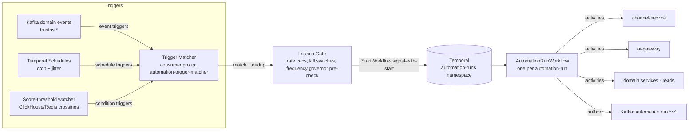

# 08 — Automation Engine (`automation-service`)

> Conforms to `_shared-context.md` (binding). Service #19: `automation-service` — PostgreSQL + Temporal. Consumes triggers from Kafka, ML score thresholds (`06-algorithms.md`), and agent/copilot suggestions (`07-ai-architecture.md` §3, §6.3). All sends execute via `channel-service`; all AI content via `ai-gateway`. Copilot endpoints for creating/managing automations: `04-api-design.md`.

The automation engine is where TrustOS's intelligence becomes action at scale — and therefore where a bug becomes 40 million wrong messages. The design bias throughout: **the engine, not the automation author (human or agent), owns compliance and safety.** An automation definition expresses intent; the engine decides whether, when, and how a message may actually leave.

---

## 1. Architecture

### 1.1 Trigger model — three trigger classes, one entry point



1. **Event triggers** — the matcher is a Kafka consumer group subscribed to the domain topics an active automation references (subscription set recomputed on automation activate/deactivate). Matching is a two-stage filter: a compiled in-memory index `event_type → candidate automation_ids` (broadcast-refreshed from Postgres on change), then per-candidate condition pre-evaluation on the event payload alone (conditions needing service reads defer to the workflow). Consumer is idempotent via `event_id` dedup in Redis per the platform standard.
2. **Schedule triggers** — Temporal Schedules (not legacy cron workflows): one Schedule per scheduled automation for org-level automations; for per-contact date automations (birthdays, anniversaries, festival greetings) a **daily materializer** pattern is used instead of millions of Schedules — see §5.3.
3. **Condition triggers (score thresholds)** — the ML batch scorers (`07-ai-architecture.md` §6) and `trust-service`/`relationship-service` emit crossing events when a monitored value passes a registered threshold (e.g. relationship at-risk hazard percentile crosses 85, DTI drops a band, referral-likelihood > 0.7 on campaign publish). Crossings are themselves published as events (`automation.threshold.crossed.v1`, extends the taxonomy) so condition triggers reduce to event triggers with hysteresis handled at the emitter (a value oscillating around the threshold triggers once per direction per cool-down window, default 7 d).

**Alternative considered:** evaluating conditions by polling service APIs on a timer. Rejected: O(automations × contacts) polling load, seconds-to-hours of trigger latency, and it inverts ownership — services already know when their numbers change; they should say so once, on the bus.

### 1.2 Automation definition — the JSON DSL

An automation is `trigger → conditions → steps`, where steps are a small typed set: `action`, `delay`, `branch`, `exit`. Definitions are stored in Postgres (`automation` / `automation_version` — versioning semantics in §2.3), validated against the schema below at create/update time, and compiled to an execution plan the workflow interprets.

#### 1.2.1 JSON Schema (draft 2020-12)

```json
{
  "$schema": "https://json-schema.org/draft/2020-12/schema",
  "$id": "https://schemas.trustos.dev/automation/definition/1-0.json",
  "title": "AutomationDefinition",
  "type": "object",
  "required": ["name", "trigger", "steps"],
  "additionalProperties": false,
  "properties": {
    "name": {"type": "string", "minLength": 1, "maxLength": 120},
    "description": {"type": "string", "maxLength": 500},
    "trigger": {
      "oneOf": [
        {
          "type": "object", "additionalProperties": false,
          "required": ["kind", "eventType"],
          "properties": {
            "kind": {"const": "event"},
            "eventType": {"type": "string",
              "pattern": "^[a-z]+\\.[a-z_]+\\.[a-z_]+\\.v[0-9]+$"},
            "eventFilter": {"$ref": "#/$defs/conditionGroup"}
          }
        },
        {
          "type": "object", "additionalProperties": false,
          "required": ["kind", "schedule"],
          "properties": {
            "kind": {"const": "schedule"},
            "schedule": {
              "type": "object", "additionalProperties": false,
              "required": ["cron"],
              "properties": {
                "cron": {"type": "string"},
                "timezoneMode": {"enum": ["recipient", "owner", "fixed"], "default": "recipient"},
                "fixedTimezone": {"type": "string"},
                "audienceQuery": {"$ref": "#/$defs/audienceQuery"}
              }
            }
          }
        },
        {
          "type": "object", "additionalProperties": false,
          "required": ["kind", "metric", "operator", "threshold"],
          "properties": {
            "kind": {"const": "condition"},
            "metric": {"enum": [
              "relationship.at_risk_percentile", "relationship.score",
              "trust.band", "referral.likelihood", "clv.predicted",
              "deal.days_in_stage", "contact.days_since_interaction"]},
            "operator": {"enum": ["crosses_above", "crosses_below", "changes_to"]},
            "threshold": {"type": ["number", "string"]},
            "cooldownDays": {"type": "integer", "minimum": 1, "default": 7}
          }
        }
      ]
    },
    "conditions": {"$ref": "#/$defs/conditionGroup"},
    "steps": {
      "type": "array", "minItems": 1, "maxItems": 50,
      "items": {"$ref": "#/$defs/step"}
    },
    "exitRules": {
      "type": "array",
      "items": {
        "type": "object", "additionalProperties": false,
        "required": ["on"],
        "properties": {
          "on": {"enum": ["reply_received", "goal_event", "contact_unsubscribed",
                           "contact_archived", "manual"]},
          "goalEventType": {"type": "string"},
          "markOutcome": {"enum": ["converted", "responded", "opted_out", "stopped"],
                           "default": "stopped"}
        }
      }
    },
    "settings": {
      "type": "object", "additionalProperties": false,
      "properties": {
        "maxRunsPerContact": {"type": "integer", "minimum": 1, "default": 1},
        "reEntryCooldownDays": {"type": "integer", "minimum": 0, "default": 30},
        "priority": {"enum": ["low", "normal", "high"], "default": "normal"},
        "dryRun": {"type": "boolean", "default": false}
      }
    }
  },
  "$defs": {
    "conditionGroup": {
      "type": "object", "additionalProperties": false,
      "required": ["all"],
      "properties": {
        "all": {"type": "array", "items": {"oneOf": [
          {"$ref": "#/$defs/condition"}, {"$ref": "#/$defs/anyGroup"}]}}
      }
    },
    "anyGroup": {
      "type": "object", "additionalProperties": false,
      "required": ["any"],
      "properties": {"any": {"type": "array", "items": {"$ref": "#/$defs/condition"}}}
    },
    "condition": {
      "type": "object", "additionalProperties": false,
      "required": ["field", "op"],
      "properties": {
        "field": {"type": "string",
          "description": "dotted path into trigger payload or a registered lookup, e.g. 'contact.tags', 'lookup:relationship.score'"},
        "op": {"enum": ["eq", "neq", "gt", "gte", "lt", "lte", "in", "not_in",
                         "contains", "exists", "within_days"]},
        "value": {}
      }
    },
    "audienceQuery": {
      "type": "object", "additionalProperties": false,
      "properties": {
        "segment": {"enum": ["all_contacts", "tagged", "list", "smart"]},
        "tags": {"type": "array", "items": {"type": "string"}},
        "listId": {"type": "string"},
        "smartFilter": {"$ref": "#/$defs/conditionGroup"},
        "dateField": {"enum": ["birthday", "anniversary", "custom_date"], 
          "description": "for date-materialized schedules (see runbook §5.3)"}
      }
    },
    "step": {
      "oneOf": [
        {
          "type": "object", "additionalProperties": false,
          "required": ["id", "type", "action"],
          "properties": {
            "id": {"type": "string", "pattern": "^[a-z0-9_]{1,40}$"},
            "type": {"const": "action"},
            "action": {
              "type": "object", "additionalProperties": false,
              "required": ["kind"],
              "properties": {
                "kind": {"enum": ["send_message", "send_notification", "create_task",
                                   "add_tag", "remove_tag", "update_field",
                                   "enroll_automation", "webhook", "award_xp"]},
                "channel": {"enum": ["whatsapp", "email", "sms", "telegram", "linkedin",
                                      "push", "in_app"]},
                "channelFallback": {"type": "array",
                  "items": {"enum": ["whatsapp", "email", "sms", "push", "in_app"]}},
                "content": {
                  "type": "object", "additionalProperties": false,
                  "properties": {
                    "mode": {"enum": ["static", "ai_generated", "channel_template"]},
                    "staticBody": {"type": "string", "maxLength": 4000},
                    "promptRef": {"type": "object",
                      "required": ["promptId"],
                      "properties": {
                        "promptId": {"type": "string"},
                        "channel": {"enum": ["prod", "canary"], "default": "prod"},
                        "variables": {"type": "object"}}},
                    "channelTemplateId": {"type": "string",
                      "description": "pre-approved template id (WhatsApp HSM etc.)"},
                    "requireApprovalIfAi": {"type": "boolean", "default": false}
                  }
                },
                "params": {"type": "object"}
              }
            }
          }
        },
        {
          "type": "object", "additionalProperties": false,
          "required": ["id", "type", "delay"],
          "properties": {
            "id": {"type": "string", "pattern": "^[a-z0-9_]{1,40}$"},
            "type": {"const": "delay"},
            "delay": {
              "type": "object", "additionalProperties": false,
              "properties": {
                "duration": {"type": "string",
                  "pattern": "^P(?!$)(\\d+D)?(T(\\d+H)?(\\d+M)?)?$",
                  "description": "ISO 8601, e.g. P3D, PT4H"},
                "until": {"enum": ["next_business_day", "specific_time"]},
                "specificTime": {"type": "string", "pattern": "^([01]\\d|2[0-3]):[0-5]\\d$"},
                "timezoneMode": {"enum": ["recipient", "owner"], "default": "recipient"}
              }
            }
          }
        },
        {
          "type": "object", "additionalProperties": false,
          "required": ["id", "type", "branch"],
          "properties": {
            "id": {"type": "string", "pattern": "^[a-z0-9_]{1,40}$"},
            "type": {"const": "branch"},
            "branch": {
              "type": "object", "additionalProperties": false,
              "required": ["if", "then"],
              "properties": {
                "if": {"$ref": "#/$defs/conditionGroup"},
                "then": {"type": "array", "items": {"$ref": "#/$defs/step"}},
                "else": {"type": "array", "items": {"$ref": "#/$defs/step"}}
              }
            }
          }
        },
        {
          "type": "object", "additionalProperties": false,
          "required": ["id", "type"],
          "properties": {
            "id": {"type": "string", "pattern": "^[a-z0-9_]{1,40}$"},
            "type": {"const": "exit"},
            "markOutcome": {"enum": ["completed", "converted", "not_eligible", "stopped"],
                             "default": "completed"}
          }
        }
      ]
    }
  }
}
```

Design notes: step `id`s are stable across edits (versioning anchor, §2.3); `maxItems: 50` and no loop construct — cyclic journeys are expressed as `enroll_automation` into another definition, which keeps every workflow's history finite and makes runaway loops impossible by construction (enrollment chain depth is capped at 3 by the launch gate); conditions are declarative lookups, never user-supplied code.

#### 1.2.2 Example 1 — Birthday greeting (system template, user-customized)

```json
{
  "name": "Birthday greetings — warm, my voice",
  "trigger": {
    "kind": "schedule",
    "schedule": {
      "cron": "0 9 * * *",
      "timezoneMode": "recipient",
      "audienceQuery": {"segment": "all_contacts", "dateField": "birthday"}
    }
  },
  "conditions": {"all": [
    {"field": "contact.has_channel_consent", "op": "eq", "value": true},
    {"field": "lookup:relationship.score", "op": "gte", "value": 20}
  ]},
  "steps": [
    {"id": "greet", "type": "action", "action": {
      "kind": "send_message",
      "channel": "whatsapp",
      "channelFallback": ["sms", "email"],
      "content": {
        "mode": "ai_generated",
        "promptRef": {
          "promptId": "automation.birthday_greeting",
          "variables": {"formality": "warm_informal", "include_festival_check": true}
        }
      }
    }}
  ],
  "exitRules": [{"on": "contact_unsubscribed", "markOutcome": "opted_out"}],
  "settings": {"maxRunsPerContact": 1, "reEntryCooldownDays": 300, "priority": "low"}
}
```

#### 1.2.3 Example 2 — Lead follow-up drip (the reference automation; code in §2.2)

```json
{
  "name": "New lead follow-up — 3 touches over 10 days",
  "trigger": {
    "kind": "event",
    "eventType": "relationship.interaction.recorded.v1",
    "eventFilter": {"all": [
      {"field": "interaction.kind", "op": "eq", "value": "first_meeting"},
      {"field": "interaction.tags", "op": "contains", "value": "lead"}
    ]}
  },
  "conditions": {"all": [
    {"field": "lookup:deal.open_deal_exists", "op": "eq", "value": false},
    {"field": "contact.has_channel_consent", "op": "eq", "value": true}
  ]},
  "steps": [
    {"id": "thanks_same_day", "type": "action", "action": {
      "kind": "send_message", "channel": "whatsapp",
      "channelFallback": ["email"],
      "content": {"mode": "ai_generated",
        "promptRef": {"promptId": "automation.lead_followup_touch",
          "variables": {"touch_number": 1, "intent": "thank_and_recap"}},
        "requireApprovalIfAi": true}
    }},
    {"id": "wait_3d", "type": "delay",
     "delay": {"duration": "P3D", "until": "specific_time",
               "specificTime": "10:30", "timezoneMode": "recipient"}},
    {"id": "check_engaged", "type": "branch", "branch": {
      "if": {"all": [{"field": "lookup:contact.replied_since_run_start", "op": "eq", "value": false}]},
      "then": [
        {"id": "value_touch", "type": "action", "action": {
          "kind": "send_message", "channel": "whatsapp", "channelFallback": ["email"],
          "content": {"mode": "ai_generated",
            "promptRef": {"promptId": "automation.lead_followup_touch",
              "variables": {"touch_number": 2, "intent": "share_relevant_value"}}}
        }},
        {"id": "wait_7d", "type": "delay",
         "delay": {"duration": "P7D", "until": "specific_time",
                   "specificTime": "10:30", "timezoneMode": "recipient"}},
        {"id": "final_touch", "type": "action", "action": {
          "kind": "send_message", "channel": "email",
          "content": {"mode": "ai_generated",
            "promptRef": {"promptId": "automation.lead_followup_touch",
              "variables": {"touch_number": 3, "intent": "soft_close_door_open"}}}
        }},
        {"id": "task_owner", "type": "action", "action": {
          "kind": "create_task",
          "params": {"title": "Lead went quiet after 3 touches — decide: park or call",
                      "dueInDays": 2}
        }}
      ],
      "else": [{"id": "exit_engaged", "type": "exit", "markOutcome": "responded"}]
    }}
  ],
  "exitRules": [
    {"on": "reply_received", "markOutcome": "responded"},
    {"on": "goal_event", "goalEventType": "deal.deal.created.v1", "markOutcome": "converted"},
    {"on": "contact_unsubscribed", "markOutcome": "opted_out"}
  ],
  "settings": {"maxRunsPerContact": 1, "reEntryCooldownDays": 60, "priority": "normal"}
}
```

#### 1.2.4 Example 3 — Referral reminder

```json
{
  "name": "Referral nudge — accepted but not submitted",
  "trigger": {
    "kind": "event",
    "eventType": "referral.campaign.published.v1",
    "eventFilter": {"all": [
      {"field": "participant.status", "op": "eq", "value": "accepted"}
    ]}
  },
  "conditions": {"all": [
    {"field": "lookup:referral.likelihood", "op": "gte", "value": 0.4}
  ]},
  "steps": [
    {"id": "wait_5d", "type": "delay", "delay": {"duration": "P5D"}},
    {"id": "still_nothing", "type": "branch", "branch": {
      "if": {"all": [
        {"field": "lookup:referral.submitted_for_campaign", "op": "eq", "value": false}
      ]},
      "then": [
        {"id": "nudge", "type": "action", "action": {
          "kind": "send_notification", "channel": "push",
          "content": {"mode": "ai_generated",
            "promptRef": {"promptId": "automation.referral_reminder",
              "variables": {"tone": "helpful_not_pushy"}}}
        }},
        {"id": "wait_7d", "type": "delay", "delay": {"duration": "P7D"}},
        {"id": "second_check", "type": "branch", "branch": {
          "if": {"all": [
            {"field": "lookup:referral.submitted_for_campaign", "op": "eq", "value": false},
            {"field": "lookup:referral.likelihood", "op": "gte", "value": 0.6}
          ]},
          "then": [{"id": "last_nudge", "type": "action", "action": {
            "kind": "send_message", "channel": "whatsapp",
            "content": {"mode": "channel_template",
                         "channelTemplateId": "referral_reminder_hsm_v3"}}}],
          "else": [{"id": "give_up", "type": "exit", "markOutcome": "completed"}]
        }}
      ],
      "else": [{"id": "done", "type": "exit", "markOutcome": "converted"}]
    }}
  ],
  "exitRules": [
    {"on": "goal_event", "goalEventType": "referral.referral.submitted.v1",
     "markOutcome": "converted"},
    {"on": "contact_unsubscribed", "markOutcome": "opted_out"}
  ],
  "settings": {"maxRunsPerContact": 1, "reEntryCooldownDays": 45}
}
```

#### 1.2.5 Example 4 — Relationship-at-risk re-engagement (condition trigger)

```json
{
  "name": "Re-engage cooling relationships",
  "trigger": {
    "kind": "condition",
    "metric": "relationship.at_risk_percentile",
    "operator": "crosses_above",
    "threshold": 85,
    "cooldownDays": 30
  },
  "conditions": {"all": [
    {"field": "lookup:relationship.score", "op": "gte", "value": 40},
    {"field": "lookup:contact.days_since_interaction", "op": "gte", "value": 45},
    {"any": [
      {"field": "lookup:relationship.past_referrals", "op": "gte", "value": 1},
      {"field": "lookup:clv.predicted", "op": "gte", "value": 50000}
    ]}
  ]},
  "steps": [
    {"id": "insight_first", "type": "action", "action": {
      "kind": "send_notification", "channel": "in_app",
      "content": {"mode": "ai_generated",
        "promptRef": {"promptId": "copilot.relationship_insight",
          "variables": {"framing": "reconnection_opening"}}}
    }},
    {"id": "wait_2d", "type": "delay", "delay": {"duration": "P2D"}},
    {"id": "if_user_did_nothing", "type": "branch", "branch": {
      "if": {"all": [
        {"field": "lookup:contact.owner_contacted_since_run_start", "op": "eq", "value": false}
      ]},
      "then": [{"id": "draft_ready", "type": "action", "action": {
        "kind": "create_task",
        "params": {"title": "Reconnect draft ready — review and send",
                    "attachDraftPromptId": "automation.reconnect_message",
                    "dueInDays": 3}
      }}],
      "else": [{"id": "user_acted", "type": "exit", "markOutcome": "completed"}]
    }}
  ],
  "exitRules": [
    {"on": "goal_event", "goalEventType": "relationship.interaction.recorded.v1",
     "markOutcome": "converted"}
  ],
  "settings": {"maxRunsPerContact": 1, "reEntryCooldownDays": 90, "priority": "low"}
}
```

Note the shape: this automation **nudges the owner** rather than messaging the cooling contact directly — an unprompted "we haven't talked in a while!" from a bot is exactly the anti-pattern TrustOS exists to prevent. The AI drafts; the human reconnects. (Tier T1 per `07-ai-architecture.md` §4.6.)

---

## 2. Execution — Temporal

### 2.1 Topology

- Namespace `automation-runs` per regional cell (residency: a run executes in the contact owner's home cell).
- **One workflow execution per automation-run**: workflow ID = `run:{automation_id}:{version}:{subject_id}:{dedup_epoch}` — Temporal's ID-uniqueness (policy: reject-duplicate) is the first idempotency wall: the same trigger event replayed cannot start a second run.
- Workers: Python SDK (`temporalio`), Clean Architecture: workflows are pure orchestration (deterministic, no I/O); all effects live in activities.

### 2.2 Real workflow + activities — lead follow-up drip (definition §1.2.3)

```python
# automation_service/workflows/automation_run.py
from __future__ import annotations
from dataclasses import dataclass
from datetime import timedelta
from temporalio import workflow
from temporalio.common import RetryPolicy

with workflow.unsafe.imports_passed_through():
    from automation_service.domain.plan import (
        ExecutionPlan, ActionStep, DelayStep, BranchStep, ExitStep, RunContext,
    )

STD_RETRY = RetryPolicy(
    initial_interval=timedelta(seconds=2),
    backoff_coefficient=2.0,
    maximum_interval=timedelta(minutes=5),
    maximum_attempts=8,
    non_retryable_error_types=[
        "ContactOptedOut", "AutomationDeactivated", "ComplianceBlocked",
        "FrequencyGovernorPermanentBlock",
    ],
)

@dataclass
class RunInput:
    automation_id: str
    definition_version: int        # pinned at launch — a run executes ONE version (§2.3)
    subject_contact_id: str        # cnt_... the contact this run is about
    owner_actor: dict              # {actor_type, actor_id} — the user/org owning the automation
    trigger_event: dict            # CloudEvents envelope that launched us
    dry_run: bool = False


@workflow.defn
class AutomationRunWorkflow:
    """One execution per automation-run. Interprets a compiled ExecutionPlan.
    Deterministic: every effect is an activity; every wait is a Temporal timer."""

    def __init__(self) -> None:
        self._exited: bool = False
        self._exit_outcome: str | None = None
        self._reply_received: bool = False
        self._goal_event: dict | None = None

    # ---- signals: how the outside world ends or informs a run -----------------
    @workflow.signal
    def contact_replied(self, payload: dict) -> None:
        # channel-service webhook consumer signals us on campaign.message.replied.v1
        self._reply_received = True
        self._request_exit("responded")

    @workflow.signal
    def goal_event_received(self, event: dict) -> None:
        self._goal_event = event
        self._request_exit("converted")

    @workflow.signal
    def cancel_run(self, reason: str) -> None:
        # kill switch / unsubscribe / automation deactivated
        self._request_exit("stopped" if reason != "opted_out" else "opted_out")

    @workflow.query
    def status(self) -> dict:
        return {"exited": self._exited, "outcome": self._exit_outcome,
                "reply_received": self._reply_received}

    def _request_exit(self, outcome: str) -> None:
        if not self._exited:
            self._exited = True
            self._exit_outcome = outcome

    # ---- main -----------------------------------------------------------------
    @workflow.run
    async def run(self, inp: RunInput) -> dict:
        plan: ExecutionPlan = await workflow.execute_activity(
            "load_execution_plan",
            args=[inp.automation_id, inp.definition_version],
            start_to_close_timeout=timedelta(seconds=10),
            retry_policy=STD_RETRY,
        )
        ctx = RunContext(input=inp, run_id=workflow.info().workflow_id)

        await workflow.execute_activity(
            "record_run_started",   # → outbox → automation.run.started.v1
            args=[ctx.run_id, inp.automation_id, inp.subject_contact_id, inp.dry_run],
            start_to_close_timeout=timedelta(seconds=10),
            retry_policy=STD_RETRY,
        )

        # entry-gate re-check at execution time (trigger-time state may be stale)
        eligible: bool = await workflow.execute_activity(
            "evaluate_conditions",
            args=[plan.entry_conditions, ctx.snapshot()],
            start_to_close_timeout=timedelta(seconds=30),
            retry_policy=STD_RETRY,
        )
        if not eligible:
            return await self._finish(ctx, "not_eligible")

        try:
            await self._run_steps(plan.steps, ctx)
        except workflow.ContinueAsNewError:
            raise
        outcome = self._exit_outcome or "completed"
        return await self._finish(ctx, outcome)

    async def _run_steps(self, steps: list, ctx: RunContext) -> None:
        for step in steps:
            if self._exited:
                return

            if isinstance(step, DelayStep):
                deadline = await workflow.execute_activity(
                    "resolve_delay_deadline",   # recipient-TZ math lives OUTSIDE the workflow
                    args=[step.spec, ctx.input.subject_contact_id],
                    start_to_close_timeout=timedelta(seconds=10),
                    retry_policy=STD_RETRY,
                )
                # interruptible wait: a reply/goal/cancel signal ends the sleep early
                await workflow.wait_condition(
                    lambda: self._exited,
                    timeout=deadline - workflow.now(),
                )
                continue

            if isinstance(step, BranchStep):
                took = await workflow.execute_activity(
                    "evaluate_conditions",      # fresh lookups: replied? deal created? score now?
                    args=[step.condition, ctx.snapshot()],
                    start_to_close_timeout=timedelta(seconds=30),
                    retry_policy=STD_RETRY,
                )
                await self._run_steps(step.then_steps if took else step.else_steps, ctx)
                continue

            if isinstance(step, ExitStep):
                self._request_exit(step.outcome)
                return

            if isinstance(step, ActionStep) and step.kind == "send_message":
                await self._send_message_step(step, ctx)
                continue

            if isinstance(step, ActionStep):     # tasks, tags, notifications, xp, webhooks
                await workflow.execute_activity(
                    "execute_side_action",
                    args=[step.spec, ctx.snapshot(), ctx.input.dry_run],
                    start_to_close_timeout=timedelta(minutes=1),
                    retry_policy=STD_RETRY,
                )

    async def _send_message_step(self, step: ActionStep, ctx: RunContext) -> None:
        # 1) governor + compliance reservation (atomic; returns a hold or a defer-until)
        gate = await workflow.execute_activity(
            "reserve_send_slot",                 # §4.2 frequency governor + §3.3 compliance
            args=[ctx.input.subject_contact_id, ctx.input.owner_actor,
                  step.channel, step.channel_fallback, ctx.run_id, step.step_id],
            start_to_close_timeout=timedelta(seconds=30),
            retry_policy=STD_RETRY,
        )
        if gate["decision"] == "defer":
            # quiet hours / frequency window / WhatsApp session state → sleep, then re-reserve
            await workflow.wait_condition(
                lambda: self._exited,
                timeout=gate["retry_after"],
            )
            if self._exited:
                return
            return await self._send_message_step(step, ctx)
        if gate["decision"] == "block":
            await workflow.execute_activity(
                "record_step_skipped",
                args=[ctx.run_id, step.step_id, gate["reason"]],
                start_to_close_timeout=timedelta(seconds=10), retry_policy=STD_RETRY)
            return

        # 2) content: AI-generated via ai-gateway (07-ai-architecture.md), or template
        content = await workflow.execute_activity(
            "render_message_content",
            args=[step.content_spec, ctx.snapshot(), gate["resolved_channel"]],
            start_to_close_timeout=timedelta(minutes=2),
            retry_policy=STD_RETRY,              # AI_SCHEMA_FAILURE is retryable here
        )

        if step.requires_approval:
            approved = await workflow.execute_activity(
                "request_owner_approval",        # push to owner; returns immediately
                args=[ctx.run_id, step.step_id, content],
                start_to_close_timeout=timedelta(seconds=30), retry_policy=STD_RETRY)
            ok = await workflow.wait_condition(
                lambda: self._exited or ctx.approval_state(step.step_id) is not None,
                timeout=timedelta(hours=24),
            )
            if self._exited or ctx.approval_state(step.step_id) != "approved":
                await workflow.execute_activity(
                    "release_send_slot", args=[gate["hold_id"], "not_approved"],
                    start_to_close_timeout=timedelta(seconds=10), retry_policy=STD_RETRY)
                return

        # 3) the send — idempotency key = run + step (+ version): retries can't double-send
        await workflow.execute_activity(
            "send_via_channel_service",
            args=[{
                "idempotency_key": f"{ctx.run_id}:{step.step_id}",
                "hold_id": gate["hold_id"],
                "contact_id": ctx.input.subject_contact_id,
                "actor": ctx.input.owner_actor,
                "channel": gate["resolved_channel"],
                "content": content,
                "dry_run": ctx.input.dry_run,
            }],
            start_to_close_timeout=timedelta(minutes=2),
            retry_policy=STD_RETRY,
        )

    async def _finish(self, ctx: RunContext, outcome: str) -> dict:
        await workflow.execute_activity(
            "record_run_completed",   # → outbox → automation.run.completed.v1 (+ outcome)
            args=[ctx.run_id, outcome, ctx.metrics()],
            start_to_close_timeout=timedelta(seconds=10),
            retry_policy=STD_RETRY,
        )
        return {"outcome": outcome}
```

```python
# automation_service/activities/send.py  (activities: all I/O, all idempotent)
from datetime import datetime, timedelta
from temporalio import activity
from automation_service.infrastructure import (
    channel_client, ai_client, contact_client, governor, plans, outbox, approvals,
)

@activity.defn
async def load_execution_plan(automation_id: str, version: int) -> dict:
    # compiled plan cached in Redis; falls back to Postgres automation_version row
    return await plans.load(automation_id, version)

@activity.defn
async def evaluate_conditions(condition_group: dict, ctx_snapshot: dict) -> bool:
    # resolves 'lookup:*' fields via read-only gRPC to owning services
    # (relationship.score, deal.open_deal_exists, referral.likelihood, ...)
    return await plans.evaluate(condition_group, ctx_snapshot)

@activity.defn
async def resolve_delay_deadline(delay_spec: dict, contact_id: str) -> datetime:
    tz = await contact_client.get_timezone(contact_id)          # profile TZ, per shared-context
    return plans.compute_deadline(delay_spec, tz, now=datetime.utcnow())

@activity.defn
async def reserve_send_slot(contact_id: str, actor: dict, channel: str,
                            fallbacks: list[str], run_id: str, step_id: str) -> dict:
    """Atomic gate: frequency governor (§4.2) + compliance (§3.3) + channel resolution.
    Returns {decision: allow|defer|block, hold_id?, resolved_channel?, retry_after?, reason?}."""
    return await governor.reserve(
        contact_id=contact_id, actor=actor,
        preferred_channel=channel, fallbacks=fallbacks,
        source=f"{run_id}:{step_id}",
    )

@activity.defn
async def render_message_content(content_spec: dict, ctx_snapshot: dict,
                                 resolved_channel: str) -> dict:
    if content_spec["mode"] == "static":
        return {"body": plans.substitute_merge_fields(content_spec["staticBody"], ctx_snapshot)}
    if content_spec["mode"] == "channel_template":
        return {"template_id": content_spec["channelTemplateId"],
                "template_params": plans.template_params(ctx_snapshot)}
    # ai_generated → ai-gateway with registry prompt; channel shapes length/format vars
    resp = await ai_client.generate(
        prompt_ref=content_spec["promptRef"],
        feature="automation.message",
        actor=ctx_snapshot["owner_actor"],
        variables={**content_spec["promptRef"].get("variables", {}),
                   **plans.contact_variables(ctx_snapshot),
                   "channel": resolved_channel},
        request_id=f"{ctx_snapshot['run_id']}:{content_spec['step_id']}",  # idempotent at gateway
    )
    return {"body": resp.json["variants"][0]["text"], "generation_id": resp.generation_id}

@activity.defn
async def send_via_channel_service(req: dict) -> dict:
    if req["dry_run"]:
        await outbox.emit("automation.step.simulated.v1", req)   # §4.4 simulation
        return {"status": "simulated"}
    # channel-service enforces its own idempotency on our key AND consumes the governor hold,
    # so even a duplicate activity attempt after a worker crash cannot double-send.
    return await channel_client.send(req)

@activity.defn
async def request_owner_approval(run_id: str, step_id: str, content: dict) -> None:
    await approvals.request(run_id, step_id, content)   # → notification-service; approval
                                                        # webhook signals the workflow

@activity.defn
async def record_run_started(run_id: str, automation_id: str,
                             contact_id: str, dry_run: bool) -> None:
    await outbox.emit("automation.run.started.v1", {
        "run_id": run_id, "automation_id": automation_id,
        "contact_id": contact_id, "dry_run": dry_run})

@activity.defn
async def record_run_completed(run_id: str, outcome: str, metrics: dict) -> None:
    await outbox.emit("automation.run.completed.v1",
                      {"run_id": run_id, "outcome": outcome, **metrics})
```

**Exit-on-reply wiring:** a lightweight `run-signal-router` consumer subscribes to `campaign.message.replied.v1`, `campaign.message.failed.v1`, unsubscribe events, and each automation's declared `goalEventType`s; it maps `(contact_id, owner)` → active run IDs (Postgres `automation_run` index) and delivers the corresponding signal. Signals interrupt delay timers immediately (`wait_condition` above) — a lead who replies on day 2 never receives the day-3 touch.

**Idempotency ledger (three walls):** (1) workflow-ID uniqueness kills duplicate starts; (2) activity idempotency keys (`run_id:step_id`) kill duplicate effects on retry; (3) channel-service's own idempotency store kills duplicates across the service boundary. All three exist because at-least-once delivery is the platform contract.

### 2.3 Versioning running workflows on mid-flight edits

The problem: a user edits a 10-day drip while 50k runs are mid-sleep inside version 3.

Policy — **pin, don't patch**:

1. Every activation writes an immutable `automation_version` row (the compiled plan). A run pins `definition_version` at launch and executes that version to completion. New triggers launch the new version. This is why `load_execution_plan` takes an explicit version — a run never observes an edit.
2. Exceptions the user can choose at save time (UI presents exactly three options):
   - **"Apply to new runs only"** (default, always safe) — as above.
   - **"Stop in-flight runs"** — service signals `cancel_run("superseded")` to all active runs (batched signal fan-out); contacts mid-drip simply stop receiving.
   - **"Migrate in-flight runs"** — allowed only when the edit is *migration-safe*: the diff engine checks that all step `id`s already executed by any active run still exist with identical semantics in the new version (this is why step ids are stable, §1.2.1). Safe edits (changing copy of a future step, extending a future delay) migrate by cancel-and-restart: signal each run to checkpoint its `completed_step_ids` + governor state, terminate, and start a new-version workflow that fast-forwards past completed steps (deterministic because the plan is a tree and completed ids identify the position). Unsafe diffs grey the option out.
3. Temporal-level code changes (our worker code, not user definitions) use the standard `workflow.patched()` mechanism — orthogonal to user-definition versioning.

**Alternative considered:** hot-reloading the definition inside the running workflow each step. Rejected: non-deterministic replay hazards, and the product semantics are wrong — a user editing copy for a *new* campaign does not intend to alter journeys already in flight; making that explicit at save time beats guessing.

---

## 3. System vs User Automations, Templates, Compliance

### 3.1 System vs user automations

| | System automations | User automations |
|---|---|---|
| Examples | KYC-nudge journey, payout-status updates, digest assembly, trust-band-change notification | Birthday greetings, drips, referral reminders, re-engagement |
| Defined by | Platform teams, in-repo (YAML → same DSL), reviewed like code | Users/orgs via app builder or agent suggestion (T2 approval — `07-ai-architecture.md` §4.6) |
| Runs as | Platform actor, separate Temporal task queues + worker pools | `owner_actor` (user/org), subject to their plan quotas and send caps |
| Compliance | Same engine, same governor — **no bypass**; transactional-message classes get a distinct governor category (§4.2) not an exemption | Full governor + compliance |
| Kill switch scope | Per-automation flag, platform on-call | User pause, org admin pause, platform kill (§4.3) |

### 3.2 Templates gallery

~40 curated templates (the four in §1.2 among them), stored as parameterized definitions with locale-pack variants (greeting norms, festival sets per country). Instantiation = copy-on-write: the user gets an editable private definition pinned to the template's `template_slug + template_version` for provenance; template upgrades are offered, never forced. Agents suggest templates by slug (`suggest_automation` tool) — the suggestion deep-links into the gallery flow with pre-filled parameters, keeping activation a human act.

### 3.3 Per-channel compliance — baked into the engine

Compliance is enforced in `reserve_send_slot` (engine side) **and** re-validated by `channel-service` (send side) — two independent implementations of the deny rules, because this is the layer where bugs become regulatory incidents.

| Channel | Rules enforced |
|---|---|
| **WhatsApp** | 24-h customer-service window tracked per `(business_number, contact)` from last inbound (Redis key, TTL 24 h, refreshed by webhook consumer). Inside window → free-form allowed. Outside window → **only** pre-approved template messages (`channelTemplateId`); automations whose content mode is `ai_generated` outside the window are auto-resolved to a fallback channel or deferred until the contact re-opens a session — never silently converted to a template with AI text stuffed into variables beyond the template's approved parameter slots. Per-number quality-rating and messaging-tier limits (channel-service tracks Meta tier: 1k/10k/100k/unlimited per 24 h) count as hard caps in the governor. |
| **Email** | CAN-SPAM / GDPR ePrivacy: working unsubscribe link injected by channel-service into every non-transactional email (`List-Unsubscribe` + one-click RFC 8058); physical-address footer per sending org (required org-profile field before email automations can activate); suppression list checked at reserve time; marketing emails require prior consent flag for EU/UK/CA (consent ledger in contact-service). |
| **SMS** | Country DND registries: India NCPR/DND category scrub (via SMS provider's principal-entity DLT registration — template + header pre-registration enforced: SMS content mode is effectively `channel_template`-only in India), US TCPA quiet hours + opt-in proof, per-country sender-ID rules. |
| **LinkedIn / Telegram** | Conservative: user-approved drafts only (T1) on LinkedIn (platform ToS — no automated outbound); Telegram bot-API rate limits + must-have prior conversation. |
| **All channels** | **Quiet hours by recipient timezone**: default send window 09:00–20:00 recipient-local (org-configurable within 08:00–21:00; stricter statutory windows override, e.g. TCPA 8–9). `reserve_send_slot` returns `defer` with `retry_after` = next window opening. **Festival calendars per country**: a platform-maintained calendar service (country → dates: national mourning days block all marketing sends; major festivals shift default greeting times and feed birthday/greeting templates). Greeting automations may *target* festivals; marketing automations are *blocked or deferred* on blackout dates. |

### 3.4 Consent as a precondition

No automation can enroll a contact without `has_channel_consent` for at least one channel in its action set — enforced at trigger match, at entry-condition re-check, and at reserve time (revocation mid-run → `block` + run exit `opted_out`). Unsubscribe events fan out to all active runs for that `(contact, owner)` pair via the signal router within seconds.

---

## 4. Safety Rails

### 4.1 Send caps

Layered token buckets (Redis, atomic Lua), all checked inside `reserve_send_slot`:

| Scope | Default cap | Notes |
|---|---|---|
| Per user (owner) / day | 200 automated messages (plan-tiered: 50 / 200 / 1,000) | Human-sent messages don't count; drafts don't count until sent |
| Per org / day | 5,000 (plan-tiered) | Pooled across members acting as org |
| Per contact (recipient) / day | 2 automated messages from a given owner; 5 platform-wide across all owners | The recipient-side cap is the one that protects the network's health |
| Per automation / day | Configurable, default 1,000 | Catches a mis-scoped audience |
| Per channel per number/domain | Provider tier limits (WhatsApp tiers, SES sending quota) | Synced from channel-service |

Caps exhausted → `defer` to next day (priority-ordered: `high` automations drain first) or `block` with owner notification when deferral would exceed the step's staleness bound (a birthday greeting deferred 2 days is dropped, not sent late — steps carry `max_staleness`, default = delay-until steps: 6 h; immediate steps: 24 h).

### 4.2 Frequency governor — dedup across overlapping automations

The invariant: **a contact never receives two automated messages from the same owner within `min_gap` (default 48 h), regardless of how many automations they're enrolled in** — and never two messages about the same automation category within its category window.

Design — a per-recipient reservation ledger, not per-automation counters:

```
Key:   governor:{owner_id}:{contact_id}          (Redis hash + sorted set of holds)
Entry: {hold_id, source_run:step, channel, category, reserved_at, expires_at, state}
```

- `reserve_send_slot` runs a single Lua script: check active/recent holds within `min_gap` → check category windows (e.g. `greeting`: 7 d, `nudge`: 72 h, `drip`: 48 h, `transactional`: exempt from `min_gap` but capped 3/day) → check all §4.1 buckets → on pass, write a **hold** (TTL 30 min) and return `hold_id`. The send consumes the hold and converts it to a `sent` record (retained `min_gap` + 7 d).
- Contention between two automations firing simultaneously resolves by priority then FIFO: the loser gets `defer` with `retry_after = winner_send_time + min_gap`, and its workflow simply sleeps — the deferred message re-renders at send time (content freshness) and re-checks conditions (the branch re-check pattern in §2.2 means a deferred touch that's no longer relevant exits instead of sending).
- Cross-owner protection is the platform-wide recipient cap (§4.1), deliberately looser — different owners are genuinely different senders — but a recipient-level "automation fatigue" score (replies↓, blocks↑ → tighten that contact's platform cap) closes the loop.
- Governor state is per-cell (contact's home region), so the ledger is single-Redis-cluster atomic — no cross-region races.

**Alternative considered:** dedup at channel-service (last-hop). Kept as backstop, but rejected as primary: by the last hop the content is generated (wasted AI spend) and the automation has advanced (wrong state); the governor must gate *before* generation.

### 4.3 Kill switches

Four scopes, all effective ≤ 5 s (flag poll + signal fan-out):

1. **Run** — cancel one run (user or support).
2. **Automation** — deactivate + optionally cancel in-flight (owner or platform).
3. **Owner/org** — pause all their automations (abuse response; auto-triggered by spam-report rate or `trust.anomaly.detected.v1` severity ≥ high).
4. **Platform** — per-channel or global send freeze (OpenFeature flag checked inside `reserve_send_slot` — the choke point again): incident response for provider outages, compliance events, or a bad model rollout upstream. Freezing sends does **not** kill workflows; runs pile up in `defer` and drain when unfrozen, respecting staleness bounds.

### 4.4 Simulation / dry-run mode

`settings.dryRun: true` (and mandatory first-run simulation for any user automation with projected audience > 500): the full workflow executes — triggers, conditions, delays (time-compressed: simulation clamps delays to seconds via a plan-compile flag), AI generation (canary prompt channel, metered to owner), governor checks — but `send_via_channel_service` emits `automation.step.simulated.v1` instead of sending. The simulation report shows: who would have received what, when, on which channel, what the governor would have blocked/deferred, and total projected cost. Activation UI requires viewing the report for large audiences (T2 approval evidence).

### 4.5 Observability

Per-automation dashboards (ClickHouse over `automation.run.*` + `campaign.message.*` + `automation.step.simulated.v1`): enrollments, step funnel, exit outcomes, governor block/defer reasons, reply/conversion rates. Platform SLOs: trigger→launch p99 < 5 s; scheduled-send accuracy p99 < 2 min of resolved local time; alerting on governor defer-queue depth and run-age outliers (a run sleeping past its plan horizon is a bug).

---

## 5. Scale — 100M Users × N Automations

### 5.1 Load envelope (planning numbers)

- 100M users, 40M MAU; assume 25% of MAU have ≥1 active automation, avg 3 → **30M active automations**.
- In-flight runs: drips average 10-day span → steady-state ≈ 45M open workflow executions, overwhelmingly asleep in timers (Temporal handles parked workflows cheaply — they cost DB rows, not CPU).
- Run starts: ~25M/day ≈ 290/s average, with the birthday/greeting morning ridge as the peak driver (§5.3).
- Actions: ~2 sends per run → ~50M send-gate evaluations/day ≈ 580/s average, peak ~15k/s during morning ridges.

### 5.2 Temporal cluster sizing (per primary cell; `ap-south-1` carries ~55% of users)

- **Persistence:** Temporal's bottleneck is history-shard write throughput. Target 26M run-starts/day in the primary cell with ~40 history events per run → ~1.04B history events/day ≈ 12k events/s sustained, 60k/s peak. Provision **8,192 history shards** (fixed at cluster creation — sized for 10× headroom deliberately, reshard requires migration) over a Cassandra persistence cluster (chosen over Postgres persistence at this scale: linear write scaling; Postgres persistence is fine for the smaller cells) — 18 nodes (i4i.2xlarge class, RF3) at ~55% steady utilization.
- **Temporal server pods:** frontend ×6, history ×24, matching ×8, worker(internal) ×4 — HPA on shard-lock contention and task-queue latency, not CPU.
- **Worker pools** (our Python workers, separate task queues so noisy load can't starve critical load):
  - `q-runs-user` — user automation workflows: 120 pods × 500 concurrent workflow tasks.
  - `q-runs-system` — system automations: 30 pods (isolation: a user-automation storm cannot delay KYC nudges).
  - `q-activities-send` — send/governor activities: 80 pods, concurrency tuned to channel-service capacity (backpressure: activity worker slots *are* the send-rate limiter of last resort).
  - `q-activities-ai` — AI-content activities: 40 pods, concurrency matched to ai-gateway batch budget for `automation.message` (long-poll workers make queue depth the natural buffer against gateway latency).
  - `q-materializer` — daily fan-out jobs (§5.3): burst-scaled 0→60 pods on schedule.
- **Namespaces:** `automation-runs` (user), `automation-system`, `automation-simulation` — separate rate configs and archival policies (completed run histories archived to S3 after 7 d, per data-retention policy).

### 5.3 Schedule-storm avoidance — "birthday at 9 am local" for millions

Naive design — one Temporal Schedule per contact-birthday — is 100M+ schedules and a thundering herd at each hour boundary. Instead, **materialize-and-jitter**:

1. **Daily materializer** (one Temporal workflow per cell per day, `q-materializer`): at 00:10 cell-local, query Postgres for all date-triggered automation enrollments due in the next 26 h (birthdays, anniversaries, festival greetings — indexed on `(month, day)` + timezone), producing a **send manifest** partitioned by recipient timezone bucket (~38 buckets worldwide).
2. **Per-timezone-bucket fan-out workflows** start `T-30min` before the bucket's target local time and launch child runs in paced batches: `continue-as-new` every 2,000 starts, pacing capped at the cell's configured start rate (default 1,500 starts/s), with **per-run jitter** drawn uniformly from `[0, +45 min]` past the nominal 9:00 — nobody can tell their birthday greeting arrived at 9:23 rather than 9:00, and the platform never sees a step function. Jitter is deterministic per `(contact_id, date)` (hash-based) so retries and reruns land on the same instant (idempotent with wall #1, §2.2).
3. **Governor as the natural shock absorber:** even within the jitter window, `reserve_send_slot`'s bucket checks pace the actual egress to what channel providers accept (WhatsApp tier limits are per business number — the fleet of org numbers shards this naturally; SES sending rate is a cell-level bucket).
4. India concentration is the worst case: one timezone (IST), ~55% of users. At 100M users: ~150k birthday-greeting sends/day in IST → spread over the 45-min jitter window ≈ 56/s — trivial. The design headroom matters for compound mornings (major festival + Monday digest + birthdays): festival greetings get a wider jitter window (±2 h around culturally appropriate times) and `low` priority in the governor, so they yield to time-sensitive sends. Diwali-scale (say 30M greetings in IST) over a 4-h window ≈ 2,100/s — within the `q-activities-send` pool and provider budgets, verified yearly by a load-test replaying the previous year's festival manifest ×2.
5. **Cron user automations** (org-defined recurring, e.g. "weekly pipeline review every Monday 9:00") *do* use native Temporal Schedules (they're org-scale, ~1M total, well within Schedule limits) — but creation applies an automatic per-org jitter offset (hash of org id, ±7 min) so "Monday 9:00" is a plateau, not a spike.

**Alternative considered:** Kafka-delayed messages / DB-poller for date triggers. Rejected: reinvents Temporal's durable timers with weaker semantics (visibility, cancellation of a single contact's pending greeting on unsubscribe is a signal, not a scan-and-delete).

### 5.4 Cost & capacity governance

Automation AI content rides the batch/cheap path by construction (`automation.message` is non-interactive: haiku-first with sonnet upgrade only for `high`-priority relationship messages — routing table in `07-ai-architecture.md` §1.3, cost model §7). Per-org automation quotas are plan features; the metering pipeline (`ai.generation.completed.v1` + `automation.run.completed.v1` joined in ClickHouse) gives per-automation unit economics — surfaced to org admins as "this drip costs ₹0.4/enrollment and converts at 3.1%", which is the honest feedback loop that keeps the network from drowning in automations nobody answers.

---

*Cross-references: agent suggestion → automation activation flow in `07-ai-architecture.md` §3; score-threshold emitters in `06-algorithms.md`; automation CRUD + simulation-report endpoints in `04-api-design.md`.*
