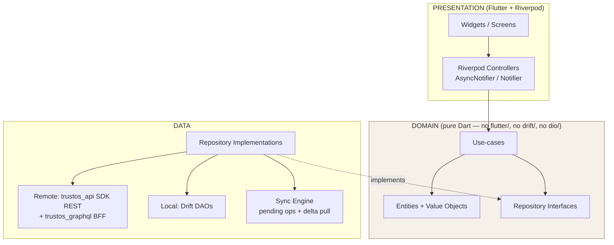
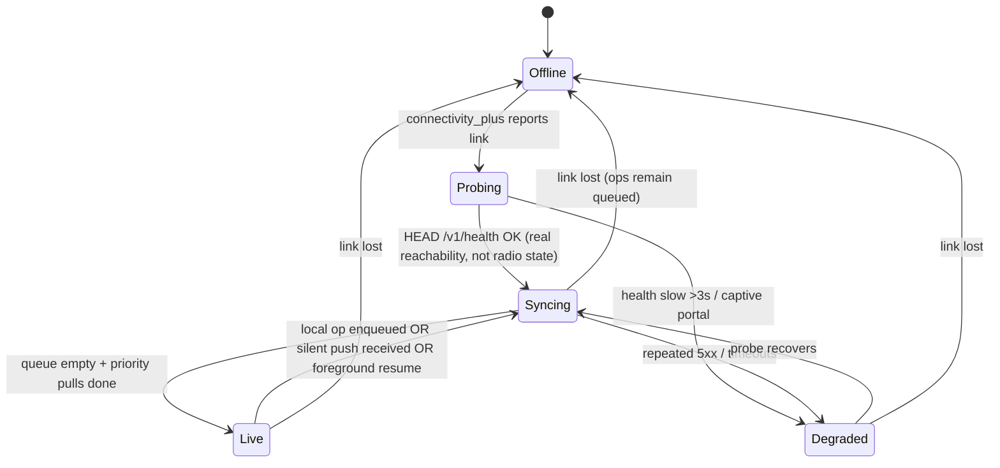
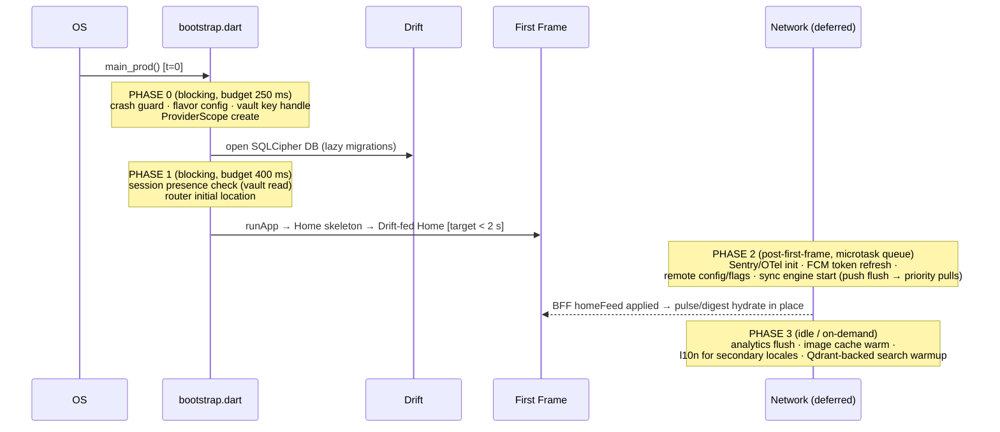

# 09 — Mobile Architecture (Flutter)

> Conforms to `_shared-context.md` (binding). Flutter + Riverpod + Drift offline-first; REST via generated Dart SDK, GraphQL BFF (`bff-mobile`) for aggregate reads. Cross-references: `04-api-design.md` (SDK/BFF contracts, sync endpoints), `06-algorithms.md` (DTI semantics), `10-ux-design.md` (surfaces this architecture must serve).

---

## 1. Architecture Overview

Feature-first **Clean Architecture**. Each feature is a vertical slice with three layers; dependencies point strictly inward (presentation → domain ← data). The domain layer has **zero** Flutter, Drift, or network imports — it is pure Dart, which is what makes it unit-testable at the speed we need for 16 feature modules.



**The dependency rule, enforced:**

| Layer | May import | Must never import | Enforced by |
|---|---|---|---|
| `presentation/` | domain, core/design_system | data, drift, dio | `dart_code_linter` custom rule + `import_lint` config in CI |
| `domain/` | nothing outside `dart:core` + `equatable` | flutter, drift, dio, riverpod | same |
| `data/` | domain, core/networking, core/storage | presentation | same |

**Why this shape (alternatives rejected):**
- *Layer-first (`lib/presentation`, `lib/domain`, `lib/data` at root)* — rejected: at 16 modules, feature cohesion beats layer cohesion; teams own features end-to-end and ship independently.
- *MVVM without domain layer* — rejected: sync/conflict logic and DTI display rules are real business logic; burying them in controllers makes them untestable and duplicated.
- *Bloc* — already rejected in `_shared-context.md` (Riverpod chosen).

**Two read paths, one write path:**
1. **Aggregate reads** (Home feed, dashboards, copilot digest) → GraphQL BFF, cached into Drift projection tables.
2. **Entity reads** (a referral, a contact) → Drift first, refreshed via cursor-delta sync (§4).
3. **All writes** → REST SDK with `Idempotency-Key`, through the pending-operations queue when offline (or always, for money-class ops — §4.4).

The GraphQL client runs with **its normalized cache disabled** — Drift is the *only* local store. Two caches with two invalidation models is how offline apps get haunted. (Rejected: ferry/graphql normalized cache as source of truth — no queryable SQL, no partial indexes, no transactional writes with the op queue.)

---

## 2. Repo & Folder Structure

The `mobile` repo (per `_shared-context.md` §5, polyrepo-lite) is a **melos workspace**: one app package + shared packages that must be versioned/tested independently.

```
mobile/
├── melos.yaml                          # workspace scripts: bootstrap, gen, test, format
├── pubspec.yaml                        # workspace root (Dart 3 pub workspaces)
├── .github/workflows/                  # see §9
├── packages/
│   ├── trustos_api/                    # GENERATED dart-dio SDK from platform OpenAPI 3.1
│   │   ├── lib/src/api/                #   one *_api.dart per service surface
│   │   ├── lib/src/model/              #   DTOs (never leak past data layer)
│   │   └── README.md                   #   "do not hand-edit" — regenerated in CI from contract tag
│   ├── trustos_graphql/                # GENERATED typed operations for bff-mobile
│   │   ├── lib/schema.graphql
│   │   └── lib/src/operations/         #   home_feed.graphql, dashboard.graphql, …
│   ├── design_system/                  # "Ember" design system (tokens from 10-ux-design.md §4)
│   │   ├── lib/src/tokens/             #   colors.dart, typography.dart, spacing.dart, motion.dart, haptics.dart
│   │   ├── lib/src/components/         #   TrustRing, TrustBandChip, ScoreDelta, EmberButton,
│   │   │                               #   EmberCard, SkeletonBox, OfflineBanner, EmptyState…
│   │   ├── lib/src/foundations/        #   theme builder light/dark, dynamic type, reduced motion
│   │   └── gallery/                    #   widgetbook app for design review + goldens
│   └── sync_engine/                    # feature-agnostic sync runtime (§4) — pure Dart + drift
│       ├── lib/src/queue/              #   pending_operations, push loop, backoff
│       ├── lib/src/delta/              #   cursor pull, entity registry
│       ├── lib/src/conflict/           #   policies: ServerWins, LwwFieldMerge, QueueAndConfirm
│       └── lib/src/connectivity/       #   connectivity state machine
└── apps/trustos/
    ├── android/                        # flavors: dev / stage / prod (applicationIdSuffix)
    ├── ios/                            # xcconfigs per flavor; ShareExtension + NotificationService targets
    ├── shorebird.yaml
    ├── lib/
    │   ├── main_dev.dart               # entrypoints per flavor → bootstrap(Flavor.dev)
    │   ├── main_stage.dart
    │   ├── main_prod.dart
    │   ├── app/
    │   │   ├── bootstrap.dart          # phased startup (§6.3): crash guard, DI, runApp
    │   │   ├── app.dart                # MaterialApp.router, theme, locale resolution
    │   │   ├── flavors.dart            # Flavor enum + per-flavor config (API host, Sentry DSN, pins)
    │   │   ├── di/providers.dart       # composition root: overrides wiring data → domain
    │   │   └── router/
    │   │       ├── router.dart         # GoRouter, auth redirect, tab shell (StatefulShellRoute)
    │   │       ├── routes.dart         # typed route table (§5.1)
    │   │       └── deep_links.dart     # trustos:// + https universal-link mapping
    │   ├── core/
    │   │   ├── networking/             # dio builder, auth interceptor (JWT refresh, DPoP-style
    │   │   │                           #   device binding), cert pinning (§5.4), RFC 9457 error mapper,
    │   │   │                           #   RateLimit-* header backoff
    │   │   ├── storage/                # drift database (SQLCipher), migrations/, secure_vault.dart (§5.3)
    │   │   ├── sync/                   # app-side registration of entities into sync_engine;
    │   │   │                           #   background dispatcher (workmanager / BGTaskScheduler)
    │   │   ├── analytics/              # typed event API → analytics-service; pseudonymous user_id
    │   │   ├── l10n/                   # arb/, l10n.yaml, generated AppLocalizations (§7)
    │   │   ├── errors/                 # AppException taxonomy, Sentry hooks, retryability tags
    │   │   ├── notifications/          # FCM/APNs token lifecycle, taxonomy → deep-link mapping (§5.1)
    │   │   └── session/                # auth state, actor context (act-as-org), biometric gate
    │   └── features/
    │       ├── onboarding/             # splash, value carousel, signup, verification ladder
    │       ├── identity/               # KYC tiers, business verification (GST/domain), devices, MFA
    │       ├── contacts/               # import wizard, dedup review, contact list/detail
    │       ├── relationships/          # timeline, relationship score, graph explorer
    │       ├── trust/                  # DTI profile, factor explainability, vouches
    │       ├── networking/             # match cards, intro requests, meeting scheduling
    │       ├── referrals/              # ★ exemplar — expanded below
    │       ├── deals/                  # pipeline board, deal detail, invoices
    │       ├── campaigns/              # composer, channel preview, scheduling, analytics
    │       ├── communities/            # home, feed, events, community leaderboard, referral board
    │       ├── marketplace/            # listings, search, offers, orders
    │       ├── knowledge/              # hub, reader, prompt library, saved items
    │       ├── rewards/                # coins/XP/levels/badges, streaks
    │       ├── leaderboards/           # period × scope boards, percentile band UI
    │       ├── copilot/                # chat surface, digest cards, action confirmations
    │       ├── home/                   # composition surface: pulse + digest (BFF-fed)
    │       └── settings/               # profile, privacy controls, notification prefs, data export
    ├── test/                           # mirrors lib/ (unit + widget)
    ├── test_goldens/                   # golden tests, per-locale/per-scale variants
    └── integration_test/               # patrol E2E suites (§8)
```

### 2.1 `features/referrals/` — file-by-file exemplar

Every feature follows exactly this shape; reviewers can navigate any module blind.

```
features/referrals/
├── domain/
│   ├── entities/
│   │   ├── referral.dart               # Referral entity + ReferralStatus lifecycle enum
│   │   ├── referral_campaign.dart      # campaign terms, reward (Money value object), eligibility
│   │   └── money.dart                  # int minorUnits + ISO 4217 code (shared-context: never floats)
│   ├── repositories/
│   │   └── referral_repository.dart    # abstract interface (watch, refresh, submit)
│   ├── usecases/
│   │   ├── watch_campaign_referrals.dart
│   │   ├── submit_referral.dart        # validation + eligibility rules live HERE, not in the controller
│   │   └── get_campaign_detail.dart
│   └── failures.dart                   # ReferralFailure sealed class (network/validation/conflict/rejected)
├── data/
│   ├── models/
│   │   ├── referral_row_mapper.dart    # Drift row ↔ entity
│   │   └── referral_dto_mapper.dart    # SDK DTO ↔ entity (DTOs never cross this line)
│   ├── local/
│   │   ├── referral_table.dart         # Drift table defs (ReferralRows, ReferralCampaignRows)
│   │   └── referral_dao.dart           # watch/upsert/markSynced, dirty-aware merge
│   ├── remote/
│   │   └── referral_remote_source.dart # wraps trustos_api ReferralsApi; maps RFC 9457 → failures
│   ├── sync/
│   │   └── referral_sync_adapter.dart  # registers entity type with sync_engine: delta apply +
│   │                                   #   op serializer + conflict policy (QueueAndConfirm)
│   └── referral_repository_impl.dart
├── presentation/
│   ├── controllers/
│   │   ├── referral_list_controller.dart
│   │   ├── submit_referral_controller.dart
│   │   └── campaign_detail_controller.dart
│   ├── screens/
│   │   ├── campaign_detail_screen.dart
│   │   ├── submit_referral_screen.dart
│   │   └── my_referrals_screen.dart
│   └── widgets/
│       ├── referral_status_chip.dart   # incl. "Pending sync" state (offline UX, 10-ux-design §7)
│       ├── reward_summary_card.dart
│       └── referral_list_tile.dart
└── referrals_module.dart               # feature manifest: routes, sync adapters, DI registrations
```

---

## 3. State Management — One Real Vertical Slice

Riverpod 2.x with codegen (`@riverpod`). Controllers are thin: they translate UI intent into use-case calls and expose `AsyncValue` state. All business rules live in use-cases; all persistence in repositories.

### 3.1 Domain — entity, interface, use-case

```dart
// features/referrals/domain/entities/referral.dart
import 'package:equatable/equatable.dart';

enum ReferralStatus {
  pendingSync,   // exists locally, not yet accepted by referral-service
  submitted,     // server-acknowledged (ref_ id confirmed)
  qualified,     // referral.referral.qualified.v1 received
  converted,     // referral.referral.converted.v1 — reward now ledger-backed
  rejected,
  expired,
}

class Referral extends Equatable {
  const Referral({
    required this.id,            // 'ref_' + UUIDv7 (client-generated, server-honored — see 04-api-design.md)
    required this.campaignId,    // 'cmp_…'
    required this.prospectName,
    required this.prospectPhone, // E.164; PII — field-encrypted at rest (§4.6)
    required this.note,
    required this.status,
    required this.updatedAt,
    this.rewardEstimate,         // Money? — display only; authoritative value comes from ledger-service
  });

  final String id;
  final String campaignId;
  final String prospectName;
  final String prospectPhone;
  final String note;
  final ReferralStatus status;
  final DateTime updatedAt;     // UTC always (shared-context §1)
  final Money? rewardEstimate;

  bool get isSettledLocally => status != ReferralStatus.pendingSync;

  Referral copyWith({ReferralStatus? status, DateTime? updatedAt, Money? rewardEstimate}) =>
      Referral(
        id: id, campaignId: campaignId, prospectName: prospectName,
        prospectPhone: prospectPhone, note: note,
        status: status ?? this.status,
        updatedAt: updatedAt ?? this.updatedAt,
        rewardEstimate: rewardEstimate ?? this.rewardEstimate,
      );

  @override
  List<Object?> get props => [id, campaignId, status, updatedAt, rewardEstimate];
}
```

```dart
// features/referrals/domain/repositories/referral_repository.dart
abstract interface class ReferralRepository {
  /// Reactive read: emits from Drift immediately, again after every sync apply.
  Stream<List<Referral>> watchByCampaign(String campaignId);

  /// Pull-to-refresh: force a delta pull for the referral entity type.
  Future<void> refresh(String campaignId);

  /// Queue-and-confirm submit (money-class op — never optimistic on reward).
  /// Returns the locally persisted pendingSync referral.
  Future<Referral> submit(SubmitReferralDraft draft);
}

class SubmitReferralDraft {
  const SubmitReferralDraft({
    required this.campaignId,
    required this.prospectName,
    required this.prospectPhone,
    required this.note,
    required this.consentConfirmed, // prospect consent checkbox — hard requirement
  });
  final String campaignId;
  final String prospectName;
  final String prospectPhone;
  final String note;
  final bool consentConfirmed;
}
```

```dart
// features/referrals/domain/usecases/submit_referral.dart
class SubmitReferral {
  const SubmitReferral(this._repo);
  final ReferralRepository _repo;

  Future<Referral> call(SubmitReferralDraft draft) async {
    if (!draft.consentConfirmed) {
      throw const ReferralFailure.validation('consent_required');
    }
    if (draft.prospectName.trim().length < 2) {
      throw const ReferralFailure.validation('prospect_name_too_short');
    }
    final phone = E164.tryParse(draft.prospectPhone);
    if (phone == null) {
      throw const ReferralFailure.validation('invalid_phone');
    }
    // Eligibility (campaign open, user not self-referring) is re-validated
    // server-side; client validates for immediate feedback only.
    return _repo.submit(draft);
  }
}
```

### 3.2 Data — Drift table + DAO

```dart
// features/referrals/data/local/referral_table.dart
import 'package:drift/drift.dart';

enum SyncState { synced, dirty, pendingCreate, conflict }

class ReferralRows extends Table {
  TextColumn get id => text()();                       // ref_… UUIDv7
  TextColumn get campaignId => text()();
  TextColumn get prospectName => text()();
  TextColumn get prospectPhone => text()();            // whole DB is SQLCipher-encrypted (§4.6)
  TextColumn get note => text().withDefault(const Constant(''))();
  TextColumn get status => textEnum<ReferralStatus>()();
  IntColumn get rewardMinorUnits => integer().nullable()();
  TextColumn get rewardCurrency => text().nullable()();  // ISO 4217
  DateTimeColumn get updatedAt => dateTime()();          // server timestamp when synced
  DateTimeColumn get syncedAt => dateTime().nullable()();
  TextColumn get syncState => textEnum<SyncState>()();
  IntColumn get serverVersion => integer().withDefault(const Constant(0))(); // per-row version from delta feed

  @override
  Set<Column> get primaryKey => {id};
}

@TableIndex(name: 'idx_referral_campaign', columns: {#campaignId, #updatedAt})
class ReferralCampaignRows extends Table {
  TextColumn get id => text()();                        // cmp_…
  TextColumn get title => text()();
  TextColumn get orgId => text()();
  TextColumn get termsJson => text()();                 // reward tiers, eligibility — parsed lazily
  DateTimeColumn get expiresAt => dateTime().nullable()();
  DateTimeColumn get updatedAt => dateTime()();
  IntColumn get serverVersion => integer().withDefault(const Constant(0))();
  @override
  Set<Column> get primaryKey => {id};
}
```

```dart
// features/referrals/data/local/referral_dao.dart
@DriftAccessor(tables: [ReferralRows])
class ReferralDao extends DatabaseAccessor<AppDatabase> with _$ReferralDaoMixin {
  ReferralDao(super.db);

  Stream<List<ReferralRow>> watchByCampaign(String campaignId) =>
      (select(referralRows)
            ..where((t) => t.campaignId.equals(campaignId))
            ..orderBy([(t) => OrderingTerm.desc(t.updatedAt)]))
          .watch();

  Future<void> insertPendingCreate(ReferralRowsCompanion row) =>
      into(referralRows).insert(row);

  /// Delta-apply from server. Dirty-aware: a locally-pending row is never
  /// clobbered by an older server version (QueueAndConfirm policy, §4.4).
  Future<void> upsertFromRemote(List<ReferralRowsCompanion> rows) =>
      transaction(() async {
        for (final row in rows) {
          final existing = await (select(referralRows)
                ..where((t) => t.id.equals(row.id.value)))
              .getSingleOrNull();
          final localIsPending = existing != null &&
              existing.syncState == SyncState.pendingCreate;
          final serverIsNewer = existing == null ||
              row.serverVersion.value > existing.serverVersion;
          if (serverIsNewer && !localIsPending) {
            await into(referralRows).insertOnConflictUpdate(row);
          } else if (serverIsNewer && localIsPending) {
            // Server confirmed our create: promote pending row to synced truth.
            await into(referralRows).insertOnConflictUpdate(
              row.copyWith(syncState: const Value(SyncState.synced)),
            );
          }
        }
      });

  Future<void> markRejected(String id, String reason) =>
      (update(referralRows)..where((t) => t.id.equals(id))).write(
        ReferralRowsCompanion(
          status: const Value(ReferralStatus.rejected),
          syncState: const Value(SyncState.synced),
        ),
      );

  Future<void> deleteRow(String id) =>
      (delete(referralRows)..where((t) => t.id.equals(id))).go();
}
```

### 3.3 Data — repository implementation (offline-first read-through)

```dart
// features/referrals/data/referral_repository_impl.dart
class ReferralRepositoryImpl implements ReferralRepository {
  ReferralRepositoryImpl(this._dao, this._remote, this._syncEngine, this._clock);

  final ReferralDao _dao;
  final ReferralRemoteSource _remote;
  final SyncEngine _syncEngine;
  final Clock _clock;

  @override
  Stream<List<Referral>> watchByCampaign(String campaignId) async* {
    // 1. Emit local immediately (cold start renders in one frame from Drift).
    // 2. Kick a background delta pull; new data re-emits via the watch().
    unawaited(_syncEngine.requestPull(EntityType.referral, scope: campaignId));
    yield* _dao
        .watchByCampaign(campaignId)
        .map((rows) => rows.map(ReferralRowMapper.toEntity).toList());
  }

  @override
  Future<void> refresh(String campaignId) =>
      _syncEngine.pullNow(EntityType.referral, scope: campaignId);

  @override
  Future<Referral> submit(SubmitReferralDraft draft) async {
    final id = TrustosId.generate('ref');            // client UUIDv7 → server honors it
    final now = _clock.nowUtc();
    final referral = Referral(
      id: id,
      campaignId: draft.campaignId,
      prospectName: draft.prospectName.trim(),
      prospectPhone: draft.prospectPhone,
      note: draft.note,
      status: ReferralStatus.pendingSync,
      updatedAt: now,
    );

    // Single transaction: local row + queued operation. Either both exist or neither.
    await _syncEngine.enqueueWithLocalWrite(
      operation: PendingOperation(
        id: id,                                       // op id == entity id for creates
        entityType: EntityType.referral,
        opType: OpType.create,
        idempotencyKey: id,                           // replay-safe on retries (shared-context §5)
        payloadJson: jsonEncode(ReferralDtoMapper.toCreateRequest(referral, draft)),
        conflictPolicy: ConflictPolicy.queueAndConfirm,
      ),
      localWrite: (txn) => _dao.insertPendingCreate(
        ReferralRowMapper.toPendingCompanion(referral),
      ),
    );
    return referral;
  }
}
```

### 3.4 Presentation — providers + AsyncNotifier with rollback

```dart
// features/referrals/presentation/controllers/referral_list_controller.dart
@riverpod
Stream<List<Referral>> referralList(Ref ref, String campaignId) {
  final watch = ref.watch(watchCampaignReferralsProvider); // use-case via DI
  return watch(campaignId);
}
```

```dart
// features/referrals/presentation/controllers/submit_referral_controller.dart
@riverpod
class SubmitReferralController extends _$SubmitReferralController {
  @override
  FutureOr<SubmitState> build(String campaignId) => const SubmitState.idle();

  Future<void> submit(SubmitReferralDraft draft) async {
    final submitReferral = ref.read(submitReferralProvider);

    state = const AsyncValue.loading();
    try {
      final referral = await submitReferral(draft);
      // Optimistic *UI*: the pendingSync row already flows into referralList
      // via the Drift watch — the list shows it instantly with a "Pending"
      // chip. The REWARD is never shown as earned until `converted` (server
      // truth). This is queue-and-confirm, not optimistic money.
      state = AsyncValue.data(SubmitState.queued(referral.id));
      ref.read(hapticsProvider).success(); // haptics map: 10-ux-design.md §4.5
    } on ReferralFailure catch (f, st) {
      state = AsyncValue.error(f, st);     // validation failed → nothing was written
    }
  }
}
```

**Rollback path** (server rejects a queued create): the sync engine invokes the feature's sync adapter, which owns compensation — the UI never sees a silent disappearance:

```dart
// features/referrals/data/sync/referral_sync_adapter.dart
class ReferralSyncAdapter implements SyncAdapter {
  ReferralSyncAdapter(this._dao, this._remote, this._notifier);

  @override
  EntityType get entityType => EntityType.referral;
  @override
  ConflictPolicy get policy => ConflictPolicy.queueAndConfirm;

  @override
  Future<PushResult> push(PendingOperation op) async {
    try {
      final dto = await _remote.submit(
        jsonDecode(op.payloadJson) as Map<String, dynamic>,
        idempotencyKey: op.idempotencyKey,
      );
      await _dao.upsertFromRemote([ReferralDtoMapper.toCompanion(dto)]);
      return PushResult.applied;
    } on ApiProblem catch (p) {
      if (p.isTerminal) {
        // 422 ineligible / 409 duplicate / campaign closed → ROLLBACK:
        await _dao.markRejected(op.entityId, p.type);
        await _notifier.showLocal(
          NotificationKind.referralRejected,
          deepLink: Routes.referralDetail(op.entityId),
          bodyKey: 'referral.rejected.${p.type}',   // explanation-first, l10n key
        );
        return PushResult.terminalFailure;           // op removed from queue
      }
      return PushResult.retryLater(p.retryAfter);    // 429/5xx → backoff, op stays
    }
  }

  @override
  Future<void> applyDelta(List<DeltaRecord> records) =>
      _dao.upsertFromRemote(records.map(ReferralDtoMapper.fromDelta).toList());
}
```

```dart
// features/referrals/presentation/screens/my_referrals_screen.dart (essentials)
class MyReferralsScreen extends ConsumerWidget {
  const MyReferralsScreen({required this.campaignId, super.key});
  final String campaignId;

  @override
  Widget build(BuildContext context, WidgetRef ref) {
    final referrals = ref.watch(referralListProvider(campaignId));
    return referrals.when(
      loading: () => const ReferralListSkeleton(),           // skeleton policy: 10-ux-design §7
      error: (e, _) => EmberErrorState.from(e, onRetry: () =>
          ref.read(referralRepositoryProvider).refresh(campaignId)),
      data: (items) => items.isEmpty
          ? const EmberEmptyState.referrals()
          : ListView.builder(
              itemExtent: 88,                                // fixed extent: §6 scrolling budget
              itemCount: items.length,
              itemBuilder: (_, i) => ReferralListTile(items[i]),
            ),
    );
  }
}
```

---

## 4. Offline-First Sync Engine

The `sync_engine` package is feature-agnostic: features register a `SyncAdapter` (entity type + serializers + conflict policy). One queue, one scheduler, one connectivity model — no per-feature snowflake sync.

### 4.1 Drift schema — sync tables

```dart
// packages/sync_engine/lib/src/queue/tables.dart
enum OpState { pending, inFlight, failed, deadLetter }
enum OpType { create, update, delete, action }   // action = non-CRUD verb (e.g. accept_intro)

class PendingOperations extends Table {
  TextColumn get id => text()();                          // UUIDv7 — doubles as ordering
  TextColumn get entityType => text()();
  TextColumn get entityId => text()();
  TextColumn get opType => textEnum<OpType>()();
  TextColumn get payloadJson => text()();
  TextColumn get idempotencyKey => text()();              // sent as Idempotency-Key header
  TextColumn get actorType => text()();                   // 'user' | 'org' — actor model (shared-context §1)
  TextColumn get actorId => text()();
  IntColumn get attempt => integer().withDefault(const Constant(0))();
  DateTimeColumn get createdAt => dateTime()();
  DateTimeColumn get nextAttemptAt => dateTime()();
  TextColumn get state => textEnum<OpState>()();
  TextColumn get lastErrorType => text().nullable()();    // RFC 9457 problem `type`
  TextColumn get baseVersionJson => text().nullable()();  // snapshot for LWW field-merge (§4.4)

  @override
  Set<Column> get primaryKey => {id};
}

class SyncCursors extends Table {
  TextColumn get entityType => text()();
  TextColumn get scope => text().withDefault(const Constant('*'))(); // e.g. campaignId, communityId
  TextColumn get cursor => text()();                      // opaque base64 (shared-context §5)
  DateTimeColumn get lastSyncedAt => dateTime()();
  @override
  Set<Column> get primaryKey => {entityType, scope};
}

class CacheMeta extends Table {
  TextColumn get entityType => text()();
  TextColumn get entityId => text()();
  DateTimeColumn get expiresAt => dateTime()();           // TTL sweeper target (§4.6)
  BoolColumn get containsForeignPii => boolean()();       // true → aggressive TTL, purged on logout
  @override
  Set<Column> get primaryKey => {entityType, entityId};
}
```

Equivalent SQL (what Drift emits, for review with the backend team):

```sql
CREATE TABLE pending_operations (
  id TEXT PRIMARY KEY,                 -- UUIDv7: lexicographic == chronological
  entity_type TEXT NOT NULL,
  entity_id TEXT NOT NULL,
  op_type TEXT NOT NULL CHECK (op_type IN ('create','update','delete','action')),
  payload_json TEXT NOT NULL,
  idempotency_key TEXT NOT NULL,
  actor_type TEXT NOT NULL, actor_id TEXT NOT NULL,
  attempt INTEGER NOT NULL DEFAULT 0,
  created_at INTEGER NOT NULL, next_attempt_at INTEGER NOT NULL,
  state TEXT NOT NULL DEFAULT 'pending',
  last_error_type TEXT, base_version_json TEXT
);
CREATE INDEX idx_pending_ops_dispatch ON pending_operations (state, next_attempt_at);
CREATE TABLE sync_cursors (
  entity_type TEXT NOT NULL, scope TEXT NOT NULL DEFAULT '*',
  cursor TEXT NOT NULL, last_synced_at INTEGER NOT NULL,
  PRIMARY KEY (entity_type, scope)
);
```

### 4.2 Pull — cursor-based delta sync

`GET /v1/sync/delta?entity={type}&scope={scope}&cursor={cursor}&limit=200` (contract in `04-api-design.md`). The server materializes per-user change feeds from the Kafka outbox (`trustos.<domain>.<aggregate>` topics) into a per-cell delta store, so the mobile cursor is a position in *that user's* visible change stream — permission changes appear as synthetic `tombstone` records (losing access to a community ⇒ its rows are tombstoned client-side).

```dart
// packages/sync_engine/lib/src/delta/delta_puller.dart
class DeltaPuller {
  Future<void> pull(EntityType type, {String scope = '*'}) async {
    var cursor = await _cursors.get(type, scope);
    while (true) {
      final page = await _api.getDelta(
        entity: type.wire, scope: scope, cursor: cursor, limit: 200,
      );
      await _db.transaction(() async {
        final adapter = _registry.adapterFor(type);
        await adapter.applyDelta(page.records);          // upserts + tombstone deletes
        await _cursors.put(type, scope, page.nextCursor);
      });
      cursor = page.nextCursor;
      if (!page.hasMore) break;
    }
  }
}
```

Ordering & priority of pull (foreground sync): `session/profile → trust(self) → home projection → referrals/deals (open items) → contacts delta → communities → knowledge/marketplace (lazy, on-surface-entry only)`.

### 4.3 Push — operation queue

- FIFO per `(entityType, entityId)` — a later update to the same entity never overtakes an earlier one; independent entities push concurrently (max 4 in flight).
- Every request carries `Idempotency-Key` (stored 24 h server-side in Redis per shared-context §5) — retries after a lost response are exact replays, not duplicates.
- Backoff: `min(2^attempt × 5 s + jitter, 15 min)`; honors `Retry-After`/`RateLimit-*` headers.
- After **10 attempts or 48 h**, op → `deadLetter`: surfaced in Settings → "Pending changes" with per-item retry/discard; a Sentry breadcrumb fires. Silent data loss is prohibited.
- Push always precedes pull in a sync cycle (flush our intent, then read merged truth).

### 4.4 Conflict resolution — policy per entity class

| Entity class | Examples | Policy | Rationale |
|---|---|---|---|
| **Computed/authoritative** | DTI, relationship scores, leaderboards, rewards balances | **Server-wins, always.** Local rows are pure cache; no local edits exist. | Scores come from `trust-service`/`06-algorithms.md`; a client can never be right. |
| **User-authored content** | contact notes, profile fields, draft campaigns, knowledge bookmarks | **LWW with field-level merge.** Op carries `baseVersionJson`; engine three-way merges: non-overlapping field edits both survive; overlapping field → latest server `updated_at` wins, losing value preserved in a local "edit history" row and surfaced as an inline "your edit was superseded" affordance. | Two devices editing different fields of one contact must not clobber each other. |
| **Money / irreversible actions** | submit referral, accept intro, place marketplace order, invoice actions, coin spend | **Queue-and-confirm. NEVER optimistic.** Local row is explicitly `pendingSync`; rewards/balances render only from server-confirmed state; terminal rejection triggers compensating local write + user notification (§3.4). | Value movement goes through `ledger-service` double-entry; a phantom "reward earned" that vanishes destroys the product's entire trust premise. |
| **Append-only streams** | interaction timeline, community feed, notifications | **Server-wins with client-side gap detection** (contiguous cursor ranges; a gap forces a range re-pull). | No merge semantics needed; only completeness. |

### 4.5 Connectivity state machine + background sync



UI binding: `Offline` → persistent slim banner; `Degraded` → banner variant "Slow connection — changes will sync"; `pendingSync` chips on affected rows regardless of state (see `10-ux-design.md` §7).

**Background execution:**
- **Android**: `workmanager` periodic task (15 min floor, constraints: network + battery-not-low) runs push-flush + priority pulls in a headless isolate.
- **iOS**: `BGAppRefreshTask` (registered id `com.trustos.sync.refresh`) — treated as opportunistic *only*; iOS grants are unreliable by design.
- **Primary channel on both**: **silent push** (FCM data message / APNs `content-available: 1`) emitted by `notification-service` when server-side state relevant to the user changes — sync is push-triggered, polling is the fallback. Budget: background cycle ≤ 25 s, ≤ 300 KB transfer.

### 4.6 What is NEVER cached (or aggressively bounded)

| Data | Policy |
|---|---|
| Other users' PII (phone/email beyond own contacts) | TTL **24 h** in `cache_meta`, `containsForeignPii = true`; purged by TTL sweeper, on logout, and on `identity.device.trusted` revocation |
| Full trust factor details of **other** users | Never stored. Fetched on demand, memory-only; only band + headline score cached (TTL 24 h) |
| Own KYC documents / verification artifacts | Never on device post-upload; upload streams to `media-service`, local temp file deleted |
| Ledger history, payout details | Last 20 entries cached; full history is online-only |
| Auth material | Never in Drift — secure vault only (§5.3) |
| Copilot conversation older than 30 days | Purged locally; server retains per retention policy |

Whole database is **SQLCipher-encrypted** (key in hardware keystore via the vault); PII columns thus get encryption-at-rest without per-field crypto on device. Right-to-erasure: local wipe = delete DB file + vault keys (crypto-shredding parity with server, shared-context §5).

---

## 5. Platform Integration

### 5.1 Push notifications + deep links (go_router)

Notification taxonomy mirrors `notification-service` categories; every push carries `category`, `deep_link`, `collapse_key`. Links use `trustos://` (custom scheme) + `https://app.trustos.com/…` (universal links / app links — verified via AASA + assetlinks.json).

| Category | Example event source | Deep link route | Channel importance |
|---|---|---|---|
| `trust.score_changed` | `trust.score.updated.v1` | `/you/trust?highlight=delta` | default (never heads-up: no score anxiety pings) |
| `networking.intro_request` | `networking.intro.requested.v1` | `/network/intros/:introId` | high |
| `networking.match_digest` | daily batch | `/network/matches` | low (digest) |
| `referral.status` | `referral.referral.qualified.v1` etc. | `/referrals/:referralId` | high |
| `referral.reward_settled` | `referral.commission.settled.v1` | `/you/rewards?celebrate=:refId` | high |
| `deal.stage_changed` | `deal.stage.changed.v1` | `/deals/:dealId` | default |
| `campaign.performance` | daily batch | `/campaigns/:campaignId/analytics` | low |
| `community.activity` | posts/events | `/communities/:cmtId/feed` | low, user-tunable per community |
| `community.event_reminder` | automation-service | `/communities/:cmtId/events/:evtId` | high |
| `copilot.digest` | morning digest | `/home?sheet=digest` | default |
| `system.security` | new device login | `/settings/security/devices` | max |
| *(silent)* `sync.wake` | server state change | — (triggers sync engine) | data-only |

```dart
// app/router/routes.dart (excerpt — typed route table)
abstract final class Routes {
  static const home = '/home';
  static const network = '/network';
  static String introDetail(String id) => '/network/intros/$id';
  static const actionHub = '/act';                       // center tab: modal hub
  static const communities = '/communities';
  static String communityFeed(String id) => '/communities/$id/feed';
  static const you = '/you';
  static const trustProfile = '/you/trust';
  static String referralDetail(String id) => '/referrals/$id';
  static String campaignDetail(String id) => '/referrals/campaigns/$id';
  static String submitReferral(String cmpId) => '/referrals/campaigns/$cmpId/submit';
  static String dealDetail(String id) => '/deals/$id';
  static const copilot = '/copilot';
}
```

Router: `StatefulShellRoute.indexedStack` for the 5 tabs (each tab keeps its own navigator stack), auth guard redirect (`/onboarding/**` when unauthenticated; biometric re-lock overlay route on resume-after-5-min), and a cold-start deep-link queue (links received before bootstrap completes are replayed after first frame).

### 5.2 Contact import permission flows (iOS vs Android)

| | iOS | Android |
|---|---|---|
| Permission | `NSContactsUsageDescription`; iOS 18 **limited-access picker** must be handled (user selects subset) | `READ_CONTACTS` runtime permission; "Don't ask again" state detection |
| Pre-prompt | **Always our own explainer screen first** (why + what we do/don't do) → only then system dialog. One shot at the system prompt — never waste it | Same explainer; on permanent denial, deep-link to app settings |
| Degraded path | Limited selection honored as-is; CSV/Google OAuth import offered as alternative | Google account import (People API OAuth) as first-class alternative |
| Upload | Hash-prefix dedup check first (contact-service), then batch upload over TLS as a **Temporal-tracked import job** — progress via `contact.import.completed.v1` → push | same |

Consent copy is explicit: *contacts are uploaded to build your private relationship graph; they are never shown to other users and never used to build shadow profiles* — this is a product invariant, restated in `10-ux-design.md` §6.

### 5.3 Biometric unlock + token vault

```
flutter_secure_storage (Keychain / Android Keystore, StrongBox where available)
 ├── refresh_token          → keychain access: .whenUnlockedThisDeviceOnly / Keystore key with
 │                            setUserAuthenticationRequired(true), 30 s auth validity window
 ├── device_binding_key     → P-256 keypair, hardware-backed, non-exportable — signs DPoP-style
 │                            proof on every token refresh (shared-context AuthN)
 └── drift_db_key           → SQLCipher key, hardware-wrapped
```

- `local_auth` (FaceID/TouchID/BiometricPrompt class 3) gates **key usage**, not just a UI overlay: on Android the refresh-token Keystore key literally cannot be used without a fresh biometric; on iOS the Keychain item uses `.biometryCurrentSet` (re-enrolling biometrics invalidates it → full re-auth).
- Access JWT (15 min) lives in memory only. App lock triggers: cold start, >5 min backgrounded, or account setting "always".
- Fallback: device PIN (`deviceCredentialAllowed`) then password re-auth. Biometric hardware absent → session PIN.

### 5.4 Certificate pinning

- Dedicated mobile hostname `api.trustos.app` (Cloudflare custom certificate, fixed issuing CA).
- Pin **SPKI SHA-256 of the issuing CA + one backup CA** (not leaf — leaf rotation would brick clients). Pins baked per flavor in `flavors.dart`; dev/stage unpinned against local envs.
- Implemented in the dio adapter: verify chain contains a pinned SPKI, else hard-fail with `PinningException` (reported to Sentry, user sees "secure connection failed").
- **Emergency rotation**: pin-set refresh via signed remote-config document (Ed25519-signed, key baked in app) — pinning failure must never require a store release to fix. Shorebird (§9) is the second escape hatch.

### 5.5 Share extensions

- **Into TrustOS** (iOS Share Extension target + Android `ACTION_SEND` intent-filter): share a vCard/contact → "Add to contacts + create relationship"; share a URL → "Save to Knowledge hub" or "Attach to relationship note". Extension writes to an app-group container inbox; main app drains it via the op queue (no network in the iOS extension — memory limits).
- **Out of TrustOS**: share a marketplace listing / campaign / community invite as `https://app.trustos.com/…` universal links with server-rendered OG previews; branch-style deferred deep linking is **rejected** (privacy posture + fingerprinting risk) — we accept losing attribution on fresh installs and use invite codes instead.

---

## 6. Performance Budgets

Reference device: **mid-range Android** (Redmi Note 12 class — 4 GB RAM, Snapdragon 685). All budgets measured on this class, p90, in CI device farm (§9).

| Metric | Budget | How |
|---|---|---|
| Cold start → first meaningful frame (Home from Drift) | **< 2.0 s p90** | phased bootstrap below; no network on critical path |
| Cold start → fresh data | < 4.5 s p90 | BFF `homeFeed` single query, ≤ 60 KB gzipped |
| Warm start | < 700 ms | |
| List scroll | 60 fps sustained, 0 frames > 32 ms per 1k-item scroll | Impeller (mandatory, both platforms); `itemExtent`/`prototypeItem` on all long lists; const widgets; no opacity animations in tiles; `RepaintBoundary` around TrustRing |
| Images | `cached_network_image`: memory cache 50 MB, disk 200 MB LRU 14 d; CDN (Cloudflare) resizing — request exact device-px size; blurhash placeholders shipped in every media DTO | |
| Android download size | ≤ 30 MB (app bundle, arm64 split) | deferred-loading for ML/graph-viz heavy libs; audit in CI, fail on +5 % |
| iOS download size | ≤ 60 MB | |
| Memory | < 250 MB RSS steady state | leak tracker in integration tests |
| Battery | background sync ≤ 1 %/day | push-triggered sync, no polling loops |
| Hero images | none above the fold on Home; avatars 3-tier (initials → blurhash → image), each layer paints instantly | |

### 6.1 Startup sequence — what blocks first frame



Anything not needed to *paint Home from local data* is Phase ≥ 2, enforced by a `StartupPhase` guard that asserts (debug) when a Phase-2 provider is touched during Phase 0/1.

---

## 7. Localization & Accessibility (100 countries)

**l10n pipeline**
- `flutter gen-l10n` with ARB files (`core/l10n/arb/app_en.arb` as source of truth); keys namespaced `feature.screen.element`. TMS (Crowdin) round-trips ARB via CI; missing-key check fails the build; pseudo-locale (`en-XA`, +40 % length, accents) golden-tested to catch truncation.
- Launch locales: en, hi, ta, te, bn, mr, gu, kn, ar, id, pt-BR, es-419 — Indic + RTL day one (India is the primary cell).
- ICU plurals/genders everywhere; **no runtime string concatenation**. Numbers/dates/currency via `intl` with the *user's* locale but the *entity's* currency (Money renders ₹/R$/… from ISO 4217 code, never converts client-side).

**RTL & scripts**
- Logical properties only (`EdgeInsetsDirectional`, `AlignmentDirectional`); CI golden suite runs every key screen in ar (RTL) + hi/ta (tall Indic scripts — line-height tokens accommodate stacked matras; min lineHeight 1.4 for Indic).
- Directional icons (back arrows, progress chevrons) auto-mirror; charts/graphs do **not** mirror (data orientation is kept LTR — established convention), but their captions do.

**Accessibility**
- Dynamic type: full support to 200 % (`MediaQuery.textScaler` clamped 0.85–2.0); layouts reflow, never ellipsize critical numbers (DTI, money). Golden tests at 1.0/1.3/2.0.
- Custom widgets get real semantics:

```dart
// design_system: TrustRing semantics
Semantics(
  label: l10n.trustRingLabel,                     // "Digital Trust Index"
  value: l10n.trustRingValue(score, band.label),  // "712 out of 1000, Gold band"
  hint: l10n.trustRingHint,                       // "Double tap to see what makes up your score"
  increasedValue: null, // not adjustable — it's informational
  child: CustomPaint(painter: TrustRingPainter(…)),
)
```

- Relationship graph: an accessible **list alternative** is always one tap away (screen-reader users get "strongest 10 relationships" list, not a silent canvas).
- Contrast: all token pairs ≥ 4.5:1 (checked in design_system unit tests); trust bands never rely on color alone (§10-ux-design §4.2).
- Reduced motion (`MediaQuery.disableAnimations` + platform setting): celebrations become static + haptic, count-ups render final value, parallax off.
- Touch targets ≥ 48×48 dp; TalkBack/VoiceOver traversal order audited per screen in patrol a11y suite.

---

## 8. Testing Strategy

| Layer | Tool | What & gate |
|---|---|---|
| Domain unit | `test` + `mocktail` | use-cases, Money/E164 value objects, conflict merge functions. Sync engine tested with `fake_async` + fake clock: backoff schedules, FIFO-per-entity, dead-lettering, cursor resume after crash. **≥ 90 % coverage on domain + sync_engine (hard gate)** |
| Data | `drift` in-memory (NativeDatabase.memory) | DAO merge semantics (dirty-aware upsert!), migrations tested via `drift_dev` schema snapshots — every migration N→N+1 has a data-preservation test |
| SDK boundary | contract tests | `trustos_api` mocked with recorded fixtures generated from the OpenAPI examples (`04-api-design.md`); a fixture-drift check fails CI when the contract tag changes |
| Widget | `flutter_test` + Riverpod overrides | every screen: loading/empty/error/data states; controllers overridden at provider level, never mock widgets |
| Golden | `alchemist` | design_system components + 15 key screens × {light, dark} × {en, ar, hi} × {1.0, 2.0 text scale}; blessed via `melos run goldens:update`, diffs reviewed like code |
| Integration/E2E | **patrol** | real device farm: activation journey (import → 3 insights), offline round-trip (airplane mode → submit referral → reconnect → confirmed), biometric gate (patrol native automation), push deep-link routing. Nightly on 6-device matrix incl. reference mid-ranger |
| Performance | `integration_test` + `flutter_driver` timelines | cold-start trace + scroll jank on reference device; budget regressions fail nightly, not PRs |

Mocking rule: **mock at the repository interface for presentation tests; mock at the SDK/HTTP layer for data tests.** Never mock Drift (in-memory is fast and real).

---

## 9. CI/CD & Release

**melos scripts — yes** (workspace of 5 packages; per-package selective runs keep PR CI < 10 min):

```yaml
# melos.yaml (excerpt)
scripts:
  gen: melos exec --depends-on=build_runner -- dart run build_runner build -d
  gen:api: dart run tool/generate_sdk.dart --contract-tag $OPENAPI_TAG
  analyze: melos exec -- dart analyze --fatal-infos
  test: melos exec --dir-exists=test -- flutter test --coverage
  goldens: melos exec --scope=design_system,trustos -- flutter test test_goldens
  build:android: flutter build appbundle --flavor prod -t lib/main_prod.dart
```

**Pipelines (GitHub Actions, per shared-context CI/CD):**
- PR: format → analyze (incl. import-boundary lint) → affected-package tests → goldens → dev-flavor build smoke.
- `main` nightly: full matrix + patrol device farm + perf budgets + size audit.
- Release: tag → stage builds → automated patrol smoke on stage → store lanes (fastlane): Play staged rollout 5 % → 25 % → 100 % gated on Sentry crash-free ≥ 99.8 %; TestFlight → phased App Store release.

**Shorebird code-push — ACCEPT, tightly scoped.** Justification: at 100M users a P0 (pin rotation edge case, sync-loop bug, money-display bug) cannot wait 24–72 h of store review + rollout; Shorebird patches Dart code only, which both stores' policies permit (no native code, no behavior outside review scope).
Guardrails: patches allowed **only** for defect fixes (never features — features ride trains, behind OpenFeature flags anyway); every patch goes through the same PR/test gates; patch rollout is itself staged 1 % → 100 %; patch trains reconciled into the next store release; `shorebird patch` requires a signed-off incident or release-manager approval.

**Release trains:** 2-week cadence, cut Monday, freeze Wednesday, submit Friday. Feature flags (OpenFeature/flagd, per shared-context) decouple merge from release — the train never waits for a feature.

---

*Sibling docs: `04-api-design.md` (REST/GraphQL/sync contracts consumed here), `06-algorithms.md` (DTI/relationship-score semantics rendered here), `10-ux-design.md` (the experience this architecture exists to make instant, calm, and trustworthy).*
