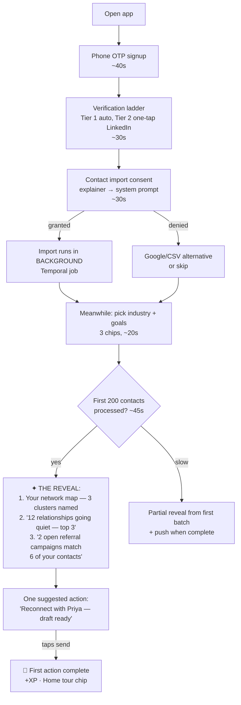
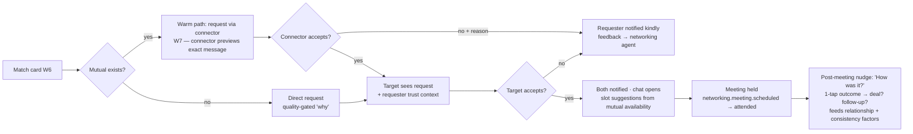
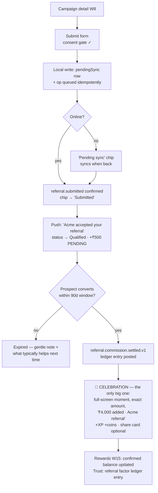

# 10 — UX Design: Information Architecture & Wireframes

> Conforms to `_shared-context.md` (binding). Companion to `09-mobile-architecture.md` (the Flutter architecture that renders these surfaces), `06-algorithms.md` (DTI semantics — bands, factors, anti-gaming), `04-api-design.md` (BFF queries feeding aggregate screens). Design system codename: **Ember**.

---

## 1. Design Principles for TrustOS

1. **Trust must be FELT, not claimed.** Calm surfaces, verified marks, human faces and names, explanations before numbers. No slot-machine mechanics: no infinite confetti, no red badges screaming, no dark-pattern streaks. Rewards exist (coins/XP/levels) but are framed as *recognition of real business behavior*, never as the reason to act. A casino aesthetic would be self-refuting for a trust product.
2. **Explanation-first numbers.** Every score (DTI, relationship score, match %) is one tap from "why" — powered by the append-only `trust_factor_ledger` (shared-context §4). A number the user can't interrogate is a number they won't trust.
3. **One-handed reach.** Primary actions live in the bottom 60 % of the screen. Top area = identity/context (read), bottom = action (write). The center Action Hub tab puts the app's most valuable verbs under the thumb.
4. **Progressive disclosure of complexity.** Graphs, factor breakdowns, pipelines are layered: headline → summary card → full explorer. Default views survive a 3-second glance; depth is opt-in, never forced.
5. **Offline is a state, not an error.** Cached truth renders instantly with honest freshness cues ("Pending sync", "Updated 2 h ago"); the app never blocks on the network for anything it already knows (see §7).
6. **Serious about money.** Anything touching commissions, coins, payouts uses the most conservative visual language in the app: confirmed vs pending is typographically unmistakable; money is never animated speculatively (mirrors `09-mobile-architecture.md` §4.4 queue-and-confirm).
7. **Globally legible.** Every layout survives ar (RTL), hi/ta (tall scripts), 200 % text, and colorblind simulation before it ships (goldens enforce this — `09-mobile-architecture.md` §7).

---

## 2. Information Architecture

### 2.1 Navigation decision — 5 tabs

**Home · Network · ➕ Act · Communities · You**

Rationale:
- **Home** = the daily loop (pulse + copilot digest + what needs attention). Retention surface.
- **Network** = people: contacts, relationships, matches, intros. The graph lives where the people live.
- **➕ Act** (center, raised) = the write verbs: submit referral, request intro, compose campaign, log deal, add contact, ask copilot. One muscle-memory location for "do business now" — the tab that makes money.
- **Communities** = the belonging loop: feeds, events, community leaderboards, referral boards. Kept whole because communities bundle their own sub-surfaces (per brief: each community has events/leaderboard/knowledge/marketplace).
- **You** = identity, trust profile, rewards, deals *you* own, settings. Self-inspection in one place builds score literacy.

Rejected alternatives:
- *4 tabs + FAB* — a FAB carries one verb; TrustOS has six first-class verbs. A hub beats a fab.
- *Per-module tabs (Referrals/Marketplace/Knowledge as tabs)* — 15 modules can't be 15 tabs; modules are **destinations inside** the five mental spaces, not spaces themselves.
- *Hamburger/drawer* — kills discoverability of the modules that monetize; rejected outright.
- *Copilot as a tab* — considered seriously; rejected because copilot is an *overlay capability* (reachable from Home digest, Act hub, and long-press anywhere), not a place you go. A tab would ghettoize it.

### 2.2 Sitemap

```mermaid
flowchart TD
    ROOT((TrustOS)) --> OB[Onboarding<br/>signup · verification ladder · contact import]
    ROOT --> T1[🏠 Home]
    ROOT --> T2[👥 Network]
    ROOT --> T3[➕ Act]
    ROOT --> T4[🫂 Communities]
    ROOT --> T5[🧑 You]

    T1 --> H1[Relationship Pulse]
    T1 --> H2[Copilot Digest]
    T1 --> H3[Attention Queue<br/>follow-ups · intro requests · expiring campaigns]
    T1 --> H4[Notifications Inbox]

    T2 --> N1[Contacts<br/>list · detail · import · dedup review]
    T2 --> N2[Relationships<br/>detail: timeline+score+insights · graph explorer]
    T2 --> N3[Matches<br/>recommendations · why-this-match]
    T2 --> N4[Intros<br/>inbox · request flow · status]

    T3 --> A1[Submit Referral]
    T3 --> A2[Request Intro]
    T3 --> A3[Compose Campaign]
    T3 --> A4[Log Deal / Update Stage]
    T3 --> A5[Add Contact / Note]
    T3 --> A6[Ask Copilot]

    T4 --> C1[My Communities]
    C1 --> C2[Community Home<br/>tabs: Feed · Events · Leaderboard · More]
    C2 --> C3[Referral Board]
    C2 --> C4[Knowledge Hub - community]
    C2 --> C5[Community Marketplace]
    T4 --> C6[Discover Communities]

    T5 --> Y1[Trust Profile<br/>DTI ring · factors · history · vouches]
    T5 --> Y2[Rewards<br/>coins · XP · level · badges]
    T5 --> Y3[My Deals Pipeline]
    T5 --> Y4[My Campaigns + analytics]
    T5 --> Y5[Leaderboards<br/>period × scope]
    T5 --> Y6[Settings<br/>privacy controls · notifications · security/devices · pending changes]

    GLOB[Global: 🔍 Search · Copilot overlay · Marketplace · Knowledge Platform] -.reachable from Home & Search.- ROOT
```



### 2.3 Module → surface map

| Brief module | Primary surface | Secondary surfaces |
|---|---|---|
| Identity Platform | Onboarding + You→Settings→Security | Verification ladder prompts everywhere |
| Relationship Intelligence | Network (contacts, relationship detail, graph) | Home pulse |
| Trust Graph (DTI) | You → Trust Profile | Band chip on every avatar; others' profiles |
| Networking Engine | Network → Matches, Intros | Home attention queue |
| Referral Marketplace | Act → Submit Referral; campaign browse via Home/Communities referral boards | You → rewards |
| Campaign Engine | Act → Compose; You → My Campaigns | — |
| Communities | Communities tab | — |
| Business Marketplace | Search + Communities → marketplace; global destination | share-ins |
| Knowledge Platform | Search + Communities → knowledge; global destination | copilot citations |
| Rewards | You → Rewards | settle moments (celebration overlays) |
| Business League | You → Leaderboards; Communities → Leaderboard tab | — |
| Deal Engine | You → My Deals; Act → Log Deal | relationship detail (deals with this person) |
| AI Copilot | Overlay (Home digest, Act, long-press) | full-screen chat route |
| Analytics | You → My Campaigns/Deals dashboards | org mode dashboards |
| Automation Engine | You → Settings → Automations | composer "schedule" step |

### 2.4 Secondary navigation patterns

- **Top app bar segmented tabs** for peer sub-surfaces (Community Home: Feed/Events/Leaderboard/More).
- **Bottom sheets** for verbs on an entity (long-press contact → note / refer / intro / campaign). Sheets, not new screens, whenever the task takes < 30 s.
- **Hub-and-detail** (never nested tabs > 1 level deep). Back always means "up one level", predictable in RTL too.
- **Global search** (top of Home & Network) spans people, communities, listings, knowledge — result type chips, powered by `search-service`.
- **Copilot overlay** — draggable sheet over any screen, seeded with screen context ("Ask about Priya", "Improve this campaign").

---

## 3. Screen Inventory & Wireframes

### 3.1 Inventory (~32 screens)

| # | Screen | Purpose | Key components |
|---|---|---|---|
| 1 | Splash/bootstrap | brand + phased startup | logo, no spinner > 800 ms |
| 2 | Value carousel | 3-card promise | skip always visible |
| 3 | Signup/login | OIDC, phone-first | OTP, social, org toggle |
| 4 | **Verification ladder** ★W1 | tiered identity depth | tier cards, progress |
| 5 | **Contact import** ★W3 | consent + source pick | explainer, source cards, progress |
| 6 | Dedup review | merge suggestions | diff cards, batch accept |
| 7 | **Home** ★W2 | daily loop | pulse, digest, attention queue |
| 8 | Notifications inbox | history + prefs | category filters |
| 9 | Contact list | browse/search | az index, freshness dots |
| 10 | **Relationship detail** ★W4 | one human, whole story | timeline, score, insights, verbs |
| 11 | Graph explorer | visual network | canvas + a11y list view |
| 12 | **Trust profile (own)** ★W5 | DTI literacy | ring, factors, history, vouches |
| 13 | Trust profile (other) | evaluate a person | band, verified marks, mutuals |
| 14 | **Match recommendations** ★W6 | who to meet | match cards, why, actions |
| 15 | **Intro request flow** ★W7 | double-opt-in intro | context composer, preview |
| 16 | Intro inbox | requests to me/via me | accept/decline with reasons |
| 17 | Campaign browse | referral opportunities | filter by industry/reward |
| 18 | **Referral campaign detail + submit** ★W8 | earn by referring | terms, reward, submit form |
| 19 | My referrals | status tracking | status chips incl. pending-sync |
| 20 | **Deal pipeline** ★W9 | business tracking | kanban-ish stages, totals |
| 21 | Deal detail | one deal | stage stepper, invoices, people |
| 22 | **Campaign composer** ★W10 | AI-assisted outreach | audience, AI draft, channel preview |
| 23 | Campaign analytics | performance | delivery/read/reply funnels |
| 24 | **Community home** ★W11 | belonging loop | feed/events/leaderboard tabs |
| 25 | Community event detail | RSVP + attendance | calendar add, attendees |
| 26 | **Leaderboard** ★W12 | standing without shame | percentile bands, scopes |
| 27 | **Knowledge hub** ★W13 | learn + reuse | collections, prompt library |
| 28 | Knowledge reader | consume | progress, save, share-in |
| 29 | **Copilot chat** ★W14 | conversational AI | context chips, action cards |
| 30 | **Rewards / level** ★W15 | recognition | coins (ledger-true), XP, badges |
| 31 | Marketplace browse/listing | commerce | search, listing detail, offer |
| 32 | Settings + privacy controls | control center | graph visibility, devices, pending changes |

★W# = wireframed below. Width ≈ 390 pt logical; `⋯` = overflow menu; `◉/○` = selected/unselected; annotations ①…⑨ explained under each frame.

---

### W1 — Onboarding: Verification Ladder

```
┌──────────────────────────────────────────────┐
│  ✕                                    2 / 3  │
│                                              │
│   Build your trust foundation                │
│   Each step raises your Digital Trust        │
│   Index and unlocks more of TrustOS. ①       │
│                                              │
│  ┌────────────────────────────────────────┐  │
│  │ ✅ TIER 1 · Phone verified             │  │
│  │    +40 DTI · done at signup            │  │
│  └────────────────────────────────────────┘  │
│  ┌────────────────────────────────────────┐  │
│  │ ✅ TIER 2 · Email + LinkedIn           │  │
│  │    +60 DTI                             │  │
│  └────────────────────────────────────────┘  │
│  ┌────────────────────────────────────────┐  │
│  │ ▶ TIER 3 · Business verification  ②    │  │
│  │   GST / company no. / domain           │  │
│  │   +120 DTI · unlocks referral          │  │
│  │   campaigns & marketplace selling      │  │
│  │   ~3 min · [ Verify my business ]      │  │
│  └────────────────────────────────────────┘  │
│  ┌────────────────────────────────────────┐  │
│  │ 🔒 TIER 4 · KYC (ID document)          │  │
│  │   +140 DTI · required for payouts ③    │  │
│  │   Do this later — before first payout  │  │
│  └────────────────────────────────────────┘  │
│                                              │
│   Your current DTI    ▓▓▓░░░░░░░  118  ④     │
│   Starter band                               │
│                                              │
│  ┌────────────────────────────────────────┐  │
│  │        Continue to contact import   ⑤  │  │
│  └────────────────────────────────────────┘  │
│          Skip for now (do it in You) ⑥       │
└──────────────────────────────────────────────┘
```
① Value framed as *trust foundation*, never "complete your profile" nag. DTI gains quoted from `identity & verification depth` weight (`06-algorithms.md`).
② Only the next actionable tier is expanded — progressive disclosure; completed tiers collapse, locked tiers state their unlock reason.
③ KYC is deferred-by-design to the moment of economic need (first payout) — reduces onboarding abandonment; ladder is re-surfaced contextually.
④ Live DTI bar updates *during* onboarding — the first "score moves when I act" lesson.
⑤ Primary CTA always bottom, thumb zone. ⑥ Skip is honest and visible: trust products don't trap.

---

### W2 — Home (Relationship Pulse + Copilot Digest)

```
┌──────────────────────────────────────────────┐
│  Good morning, Arjun      🔍   🔔(2)   ◎712 ①│
│──────────────────────────────────────────────│
│  ⚠ Offline — showing saved data · retrying ②│
│                                              │
│  RELATIONSHIP PULSE                          │
│  ┌────────────────────────────────────────┐  │
│  │  ● 3 going quiet   ● 2 birthdays       │  │
│  │  ┌──────┐ ┌──────┐ ┌──────┐  ‹swipe›   │  │
│  │  │ 👤PS │ │ 👤MK │ │ 👤RD │           ③ │  │
│  │  │Priya │ │Manoj │ │Rahul │            │  │
│  │  │42d 🔻│ │b'day │ │38d 🔻│            │  │
│  │  │[Msg] │ │[Wish]│ │[Call]│            │  │
│  │  └──────┘ └──────┘ └──────┘            │  │
│  └────────────────────────────────────────┘  │
│                                              │
│  ✦ COPILOT DIGEST · today            ⋯  ④   │
│  ┌────────────────────────────────────────┐  │
│  │ "Meera replied to your intro — she's   │  │
│  │  free Thu. Two referral campaigns in   │  │
│  │  Fintech match 6 of your contacts."    │  │
│  │  [ Schedule Thu ]  [ See campaigns ]  ⑤│  │
│  └────────────────────────────────────────┘  │
│                                              │
│  NEEDS YOUR ATTENTION (3)                    │
│  ┌────────────────────────────────────────┐  │
│  │ ↔ Intro request from Kavya      2h  ›  │  │
│  │ ⏳ Referral for Acme — add note     ›  │  │
│  │ 📅 Campaign "Diwali" ends in 2 days ›  │  │
│  └────────────────────────────────────────┘  │
│                                              │
│  YOUR WEEK          ▓▓▓▓▓░░ 5 interactions ⑥ │
│──────────────────────────────────────────────│
│  🏠 Home   👥 Network   ➕   🫂 Comm.   🧑 You │
└──────────────────────────────────────────────┘
```
① Persistent mini DTI chip (score + band color ring) — one tap to Trust Profile; it changes rarely, so no per-session animation.
② Offline banner standard (§7): slim, amber, informative, never modal.
③ Pulse cards: face, name, signal ("42 days quiet", 🔻 relationship-score drift from `relationship-service`), and a one-tap verb. Whole card ≥ 48 dp targets.
④ Digest is *rendered summary*, not a chat bubble — tap opens copilot with this context loaded.
⑤ Digest action buttons are real intents (deep links into flows) — the "aha" engine.
⑥ Gentle weekly momentum bar — progress framing, no streak-loss shaming.

---

### W3 — Contact Import (consent-first)

```
┌──────────────────────────────────────────────┐
│  ←                              Step 3 of 3  │
│                                              │
│   Bring your network with you                │
│                                              │
│   TrustOS reads contacts to map YOUR         │
│   relationships. We never message anyone,    │
│   never show your contacts to others, and    │
│   never build profiles of non-members. ①     │
│   [ How we protect contacts › ]              │
│                                              │
│  CHOOSE SOURCES                              │
│  ┌────────────────────────────────────────┐  │
│  │ ◉ 📱 Phone contacts        ~740 found  │  │
│  ├────────────────────────────────────────┤  │
│  │ ◉ 🟢 Google account      arjun@…com ②  │  │
│  ├────────────────────────────────────────┤  │
│  │ ○ 🔷 Outlook / Microsoft 365           │  │
│  ├────────────────────────────────────────┤  │
│  │ ○ 📄 CSV / CRM export (HubSpot, Zoho)  │  │
│  └────────────────────────────────────────┘  │
│                                              │
│   After import, AI finds duplicates and      │
│   asks you before merging anything. ③        │
│                                              │
│  ┌────────────────────────────────────────┐  │
│  │        Import 740 contacts          ④  │  │
│  └────────────────────────────────────────┘  │
│        Not now — start with 0 contacts       │
│                                              │
│  ── after tap: system permission (iOS 18     │
│     limited-picker handled), then: ──        │
│  ┌────────────────────────────────────────┐  │
│  │ Importing…  ▓▓▓▓▓▓▓░░░  512/740        │  │
│  │ You can keep using TrustOS —        ⑤  │  │
│  │ we'll ping you with first insights.    │  │
│  └────────────────────────────────────────┘  │
└──────────────────────────────────────────────┘
```
① The privacy promise **before** the system prompt (one shot at iOS permission — `09-mobile-architecture.md` §5.2). Plain language, legally reviewed, restated in settings.
② Multi-source in one pass; sources dedupe server-side (contact-service, Temporal import workflow).
③ Sets expectation for the dedup-review screen — user stays in control of merges.
④ CTA states the real number — informed consent, not "Allow".
⑤ Import is backgrounded (Temporal job + push on completion) — never a blocking spinner; first-session activation continues meanwhile (§5.1 journey).

---

### W4 — Relationship Detail

```
┌──────────────────────────────────────────────┐
│  ←            Priya Sharma              ⋯ ①  │
│  ┌──────┐  Founder, Meridian Design          │
│  │ 👤PS │  Mumbai · Gold ◉ 723        ②      │
│  └──────┘  Met via: Rohan → BNI Mumbai       │
│                                              │
│  RELATIONSHIP STRENGTH                       │
│  ┌────────────────────────────────────────┐  │
│  │  ▂▃▅▆▅▄▃▂▂  72/100  🔻-6 this month ③  │  │
│  │  Why: no interaction in 42 days;       │  │
│  │  reciprocity remains strong.  [More ›] │  │
│  └────────────────────────────────────────┘  │
│                                              │
│  ✦ AI INSIGHTS                               │
│  ┌────────────────────────────────────────┐  │
│  │ • She posted about hiring designers —  │  │
│  │   your contact Dev is job-hunting. ④   │  │
│  │   [ Suggest intro ]                    │  │
│  │ • Best re-engagement: congratulate     │  │
│  │   Meridian's award (news, 3d ago)      │  │
│  │   [ Draft message ]                    │  │
│  └────────────────────────────────────────┘  │
│                                              │
│  TIMELINE                        [filter ▾]  │
│  │ 12 May  ☕ Meeting — "Q3 collab"         │
│  │ 28 Apr  ↔ You introduced her to Manoj   │
│  │ 15 Apr  💬 WhatsApp thread (campaign) ⑤  │
│  │  2 Apr  💰 Deal won together ₹2,40,000   │
│  │ 20 Mar  🫂 Both joined BNI Mumbai        │
│  │          ‹ load earlier ›                │
│                                              │
│  ┌─────────┬─────────┬─────────┬─────────┐   │
│  │ 💬 Msg  │ ↔ Intro │ 🎁 Refer│ 📝 Note │ ⑥ │
│  └─────────┴─────────┴─────────┴─────────┘   │
└──────────────────────────────────────────────┘
```
① Overflow: edit, merge, share contact, block/report (§6).
② Her public trust: band + score only — factor details of **others** are never shown (privacy + `09-mobile-architecture.md` §4.6). Provenance line ("Met via") makes the graph tangible.
③ Sparkline + score + delta **with its reason inline** — explanation-first rule even for dips.
④ Insight cards are actionable (verbs), cite their evidence, and are rate-limited to 3/day per relationship — no AI noise.
⑤ Timeline merges interactions from relationship-service (`relationship.interaction.recorded.v1`), deals, intros, community co-membership.
⑥ Verb bar pinned to thumb zone; identical verbs across contact/relationship surfaces.

---

### W5 — Trust Profile (own) — DTI Ring + Explainability

```
┌──────────────────────────────────────────────┐
│  ←              Your Trust               ⋯   │
│                                              │
│              ╭────────────╮                  │
│            ╱   ▓▓▓▓▓▓▓▓    ╲                 │
│           │   ▓        ▓    │                │
│           │  ▓   712    ▓   │  ①             │
│           │   ▓  GOLD  ▓    │                │
│            ╲   ▓▓▓░░░░    ╱                  │
│              ╰────────────╯                  │
│         ▲ +14 this month  [Why? ›] ②         │
│         138 to Platinum ░░▓▓▓▓▓▓▓            │
│                                              │
│  WHAT BUILDS YOUR SCORE              ③       │
│  ┌────────────────────────────────────────┐  │
│  │ Referral performance   ▓▓▓▓▓▓▓░ 168/200│  │
│  │ Identity & verification▓▓▓▓▓▓░░ 118/150│  │
│  │   ↳ Finish KYC to add up to +32  [Go ›]│  │
│  │ Deals & transactions   ▓▓▓▓▓░░░ 96/150 │  │
│  │ Relationship quality   ▓▓▓▓▓▓░░ 112/150│  │
│  │ Community contribution ▓▓▓░░░░░ 58/100 │  │
│  │ Consistency & longevity▓▓▓▓░░░░ 61/100 │  │
│  │ ‹ 3 more factors ›                     │  │
│  └────────────────────────────────────────┘  │
│                                              │
│  RECENT CHANGES                    ④         │
│  │ +9  Referral to Acme converted  ·  2d    │
│  │ +5  Hosted community event      ·  5d    │
│  │ −3  Two referrals expired unattended ·1w │
│  │     [ What can I do about this? ]        │
│                                              │
│  VOUCHES (12)   👤👤👤👤 +8    [Manage ›] ⑤   │
│                                              │
│  🔒 Who can see this?  Band+score: everyone. │
│     Factor details: only you.  [Change ›] ⑥  │
└──────────────────────────────────────────────┘
```
① The **TrustRing**: 0–1000 arc, band-colored segment + band label *inside* the ring (never color-only). Semantics per `09-mobile-architecture.md` §7.
② Delta with "Why?" opens the factor ledger diff — score changes are always traceable (append-only `trust_factor_ledger`).
③ Factor bars use *weighted point capacity* (weight × 1000) so "168/200" is honest math from shared-context §4; the biggest *addressable* gap gets an inline next-step nudge.
④ Ledger entries in plain language, positive and negative, each with recourse — score drops are teachable, never punitive (§6).
⑤ Vouches shown with faces (transitively damped per anti-gaming — collusion-damped vouches display as "reduced weight" on tap).
⑥ Privacy disclosure inline on the surface itself, linking to controls.

---

### W6 — Networking Recommendations (Match Cards)

```
┌──────────────────────────────────────────────┐
│  Matches            [For: Meet ▾]  [⚙ tune] ①│
│──────────────────────────────────────────────│
│  ┌────────────────────────────────────────┐  │
│  │  👤 Vikram Rao          Platinum ◉ 881 │  │
│  │  CTO, Nexa Logistics · Bengaluru       │  │
│  │                                        │  │
│  │  WHY THIS MATCH                    ②   │  │
│  │  • You both serve D2C brands           │  │
│  │  • 2 mutuals: Rohan, Kavya  👤👤       │  │
│  │  • He asked for supply-chain SaaS      │  │
│  │    intros in Fintech Circle (3d ago)   │  │
│  │                                        │  │
│  │  Est. fit  ▓▓▓▓▓▓▓▓░░  Strong      ③   │  │
│  │                                        │  │
│  │ ┌───────────────┐ ┌─────────────────┐  │  │
│  │ │ ↔ Request     │ │ Ask Rohan for   │  │  │
│  │ │   intro       │ │ warm intro   ④  │  │  │
│  │ └───────────────┘ └─────────────────┘  │  │
│  │        ✕ Not relevant  [why? ▾]  ⑤     │  │
│  └────────────────────────────────────────┘  │
│  ┌────────────────────────────────────────┐  │
│  │  👤 Ananya Iyer            Gold ◉ 702  │  │
│  │  Angel investor · Chennai              │  │
│  │  WHY: your deal history in SaaS +      │  │
│  │  her thesis; 1 mutual  …               │  │
│  └────────────────────────────────────────┘  │
│              ‹ 4 more this week ›       ⑥    │
└──────────────────────────────────────────────┘
```
① Intent selector maps to networking-service edge types (meet/collab/partner/hire/mentor/invest); "tune" opens preference elicitation.
② "Why this match" is mandatory content, not tooltip — each bullet cites a real signal (shared graph, community post, deal vector match via Qdrant). No unexplained matches, ever.
③ Fit shown as a **band + bar**, not a fake-precise percentage — calibrated language ("Strong/Good/Exploratory").
④ Warm path preferred: if a mutual exists, routing through them is offered *before* cold intro — mirrors real networking etiquette and feeds the intro double-opt-in flow (W7).
⑤ Rejection with optional reason = feedback loop to the Networking agent (`ai.feedback.recorded.v1`).
⑥ Deliberately scarce: max ~6/week. Scarcity = perceived quality; also caps agent cost.

---

### W7 — Intro Request Flow (double opt-in)

```
┌──────────────────────────────────────────────┐
│  ✕        Request intro to Vikram      1/2   │
│                                              │
│   Via Rohan Mehta  👤  (your mutual)   ①     │
│   ○ Direct request instead                   │
│                                              │
│  WHY DO YOU WANT TO MEET?              ②     │
│  ┌────────────────────────────────────────┐  │
│  │ Exploring a logistics-SaaS partnership │  │
│  │ for my D2C clients; want 20 min to     │  │
│  │ compare notes on onboarding.        ✎  │  │
│  └────────────────────────────────────────┘  │
│  ✦ [ Improve with copilot ]  suggestions:    │
│    "add what Vikram gets out of it"    ③     │
│                                              │
│  WHAT ROHAN WILL SEND (preview)        ④     │
│  ┌────────────────────────────────────────┐  │
│  │ "Vikram — Arjun (Gold, 712) runs a     │  │
│  │  D2C growth studio, 3 yrs, 14 closed   │  │
│  │  deals on TrustOS. He'd like 20 min    │  │
│  │  on logistics-SaaS onboarding. OK to   │  │
│  │  connect you two?"    [Yes] [No]       │  │
│  └────────────────────────────────────────┘  │
│                                              │
│  ⓘ Vikram sees your request only if Rohan    │
│    agrees. Nobody is auto-connected.   ⑤     │
│                                              │
│  ┌────────────────────────────────────────┐  │
│  │            Send to Rohan               │  │
│  └────────────────────────────────────────┘  │
│  ── step 2/2 after both accept: ──           │
│  ✅ Intro made! Suggested slots (both free): │
│  [ Thu 4pm ] [ Fri 11am ] [ propose other ]⑥ │
└──────────────────────────────────────────────┘
```
① Warm path default when a mutual exists (from W6 ④); connector's social capital is the product's currency — they approve the exact message.
② Structured "why" is required — quality gate; empty intros are the death of intro products.
③ Copilot assists but never auto-sends; suggestions are edits the user accepts.
④ **Preview of the actual message** including the requester's trust credentials — no surprise framing; the connector risks reputation, so they see exactly what's sent.
⑤ Double-opt-in stated plainly; maps to `networking.intro.requested/accepted.v1`.
⑥ Success state immediately converts to scheduling (meeting = the real KPI; `networking.meeting.scheduled.v1`).

---

### W8 — Referral Campaign Detail + Submit

```
┌──────────────────────────────────────────────┐
│  ←     Acme Payroll — Referral Campaign  ⋯   │
│  🏢 Acme HR Tech · Verified business ✓  ①    │
│     Org trust: Gold ◉ 764 · 96% payout rate  │
│                                              │
│  REWARD                                      │
│  ┌────────────────────────────────────────┐  │
│  │  ₹4,000 per converted referral      ②  │  │
│  │  + ₹500 when qualified                 │  │
│  │  Paid via TrustOS ledger · escrow ✓    │  │
│  └────────────────────────────────────────┘  │
│  WHO CONVERTS BEST                     ③     │
│  • 20–200 employee companies, India          │
│  • Pain: manual payroll compliance           │
│  ✦ 6 of your contacts match  [ See them › ]  │
│                                              │
│  TERMS  (plain-language summary)       ④     │
│  • Qualified = demo attended within 30d      │
│  • Converted = paid subscription             │
│  • Attribution window: 90 days               │
│  [ Full terms › ]                            │
│                                              │
│  ── SUBMIT A REFERRAL ──                     │
│  Prospect   ┌──────────────────────────┐     │
│             │ 👤 Dev Patel   (contact) │ ⑤   │
│  Phone      │ +91 98…                  │     │
│  Context    │ "Dev runs a 40-person    │     │
│  (why fit)  │  agency, complained about│     │
│             │  payroll last month"  ✎  │     │
│  ☑ Dev knows I'm referring them &      ⑥     │
│    agreed to be contacted                    │
│  ┌────────────────────────────────────────┐  │
│  │           Submit referral              │  │
│  └────────────────────────────────────────┘  │
│  ── after submit (offline-safe): ──          │
│  ┌────────────────────────────────────────┐  │
│  │ ⏳ Dev Patel — Pending sync         ⑦  │  │
│  │ Reward shows here once Acme confirms.  │  │
│  └────────────────────────────────────────┘  │
└──────────────────────────────────────────────┘
```
① Campaign trust context up top: verified badge, org DTI band, **historical payout rate** — the marketplace polices itself through transparency.
② Money in the app's most conservative style: exact amounts, currency symbol from ISO code, escrow status. No "earn up to!" superlatives.
③ AI match assist: contacts who fit the ICP — turns browsing into action ("6 of your contacts").
④ Plain-language terms summary is mandatory for publishers; legalese one tap deeper.
⑤ Prospect picker prefers existing contacts (better attribution + dedup).
⑥ Consent checkbox is a hard gate (maps to `consentConfirmed` in `SubmitReferral` use-case) — anti-spam is trust-protective.
⑦ Queue-and-confirm made visible: "Pending sync" chip; reward never rendered as earned until `referral.referral.converted.v1` (see `09-mobile-architecture.md` §4.4).

---

### W9 — Deal Pipeline

```
┌──────────────────────────────────────────────┐
│  My Deals        [You ▾/Org]   [+ Log deal]  │
│  Pipeline value: ₹18,40,000 · 9 open    ①    │
│──────────────────────────────────────────────│
│  ‹ INTRO (2) │ MEETING (3) │ PROPOSAL(2) │…② │
│  ────────────┴─────────────────────────      │
│  MEETING — ₹7,20,000                         │
│  ┌────────────────────────────────────────┐  │
│  │ Meridian Design · rebrand project      │  │
│  │ ₹2,40,000 · with 👤Priya               │  │
│  │ next: proposal due Fri ⏰           ③   │  │
│  │ src: intro via Rohan  🔁 40d in stage  │  │
│  └────────────────────────────────────────┘  │
│  ┌────────────────────────────────────────┐  │
│  │ Nexa Logistics · SaaS onboarding       │  │
│  │ ₹4,80,000 · with 👤Vikram              │  │
│  │ ⚠ stale 21d — copilot: "send the       │  │
│  │   case study Vikram asked about" ④     │  │
│  │ [ ✦ Draft it ]  [ → Move stage ]       │  │
│  └────────────────────────────────────────┘  │
│                                              │
│  WON THIS QUARTER            ₹6,10,000  ⑤    │
│  ▓▓▓▓▓▓▓░░░ 61% of ₹10L goal                 │
│  via referrals: ₹3,2L · via intros: ₹1,8L    │
│                                              │
│  ⓘ Verified deals (invoice paid) raise       │
│    your Trust Index.  [ How › ]  ⑥           │
└──────────────────────────────────────────────┘
```
① Actor switcher (act-as-org — shared-context actor model). Totals in minor-unit-safe formatting.
② Horizontally scrollable stage segments (intro→meeting→proposal→closure per deal-service) — chosen over a true kanban board: dragging between columns is miserable one-handed; "Move stage" is an explicit verb instead.
③ Each card: value, human (linked to relationship detail), next action, provenance (which intro/referral created it — the network-effect made visible).
④ Staleness surfaced with a *specific* copilot next step, not a red alarm.
⑤ Goal progress + source attribution — teaches which behaviors (referrals, intros) generate revenue.
⑥ The deal→DTI link stated where it's earned (transaction history factor, weight 0.15).

---

### W10 — Campaign Composer (AI-assisted)

```
┌──────────────────────────────────────────────┐
│  ✕   New campaign          step 2 of 4  ①    │
│  [Audience ✓]→[Message]→[Schedule]→[Review]  │
│                                              │
│  AUDIENCE: 43 contacts · "D2C founders,      │
│  Mumbai, relationship ≥ 60"    [edit ▾]      │
│                                              │
│  ✦ DRAFT (Diwali greeting + offer)     ②     │
│  ┌────────────────────────────────────────┐  │
│  │ Hi {first_name} 🪔 Wishing you and     │  │
│  │ family a bright Diwali! Small note —   │  │
│  │ we're opening 3 growth-audit slots     │  │
│  │ for {company} type brands this month…  │  │
│  │                            [ ✎ edit ]  │  │
│  └────────────────────────────────────────┘  │
│  tone: [warm ◉] [formal ○] [brief ○]   ③     │
│  [ ↻ Regenerate ] [ ✦ Personalize per       │
│    recipient (uses relationship notes) ] ④   │
│                                              │
│  CHANNEL PREVIEW                       ⑤     │
│  ┌ WhatsApp ─┐┌ Email ──┐┌ SMS ──┐┌ LI ─┐    │
│  │ ◉ 41 ok   ││ ○ 43 ok ││ ○ 160c││ ○ 38│    │
│  └───────────┘└─────────┘└───────┘└─────┘    │
│  ┌────────────────────────────────────────┐  │
│  │ ⬤ WhatsApp bubble preview              │  │
│  │ │Hi Priya 🪔 Wishing you and family…│  │  │
│  │ template: greeting_offer_v2 ✓approved ⑥│  │
│  └────────────────────────────────────────┘  │
│  ⚠ 2 contacts opted out of promos —          │
│    auto-excluded.                     ⑦      │
│  ┌────────────────────────────────────────┐  │
│  │        Continue to schedule            │  │
│  └────────────────────────────────────────┘  │
└──────────────────────────────────────────────┘
```
① Linear stepper — campaign creation is a wizard, resumable as a local draft (LWW-merge entity class).
② AI draft appears *already written* from campaign intent + audience; editing is inline, `{tokens}` are typed chips (can't be malformed).
③ Tone controls = constrained regeneration (prompt registry in ai-gateway, `04-api-design.md`).
④ Per-recipient personalization is explicit opt-in and disclosed ("uses relationship notes") — no silent data use.
⑤ Per-channel fitness: WhatsApp template compliance, SMS length counter, LinkedIn char limits — channel-service constraints surfaced at compose time, not at send failure.
⑥ WhatsApp requires pre-approved templates; the approved template badge prevents the #1 send-failure class.
⑦ Preference-center suppression is automatic and *visible* — respect shown, not hidden.

---

### W11 — Community Home

```
┌──────────────────────────────────────────────┐
│  ←   Fintech Circle 🫂            [Joined ✓] │
│  1,240 members · Gold community ◉ ·          │
│  your standing: Top 18%  ①                   │
│──────────────────────────────────────────────│
│  │ FEED ◉ │ EVENTS │ LEADERBOARD │ MORE ▾│ ② │
│──────────────────────────────────────────────│
│  📌 REFERRAL BOARD (3 open)             ③    │
│  ┌────────────────────────────────────────┐  │
│  │ "Need: CA for startup audits, Pune"    │  │
│  │  posted by 👤Kavya · 2 responses    ›  │  │
│  └────────────────────────────────────────┘  │
│                                              │
│  👤 Manoj Kulkarni · Gold ◉ · 3h             │
│  ┌────────────────────────────────────────┐  │
│  │ How we cut payment failures 40% —      │  │
│  │ full breakdown 🧵 (7 steps)            │  │
│  │ 💬 24   ⤴ share   🔖 save   ★ helpful  ④│  │
│  └────────────────────────────────────────┘  │
│                                              │
│  📅 NEXT EVENT                               │
│  ┌────────────────────────────────────────┐  │
│  │ Thu 7pm · "RBI compliance AMA"         │  │
│  │ 👤👤👤 38 going · [ RSVP ]         ⑤   │  │
│  └────────────────────────────────────────┘  │
│                                              │
│  👤 Sneha Rao · Silver ◉ · 6h                │
│  ┌────────────────────────────────────────┐  │
│  │ Looking for a co-working recco in HSR… │  │
│  └────────────────────────────────────────┘  │
│                                              │
│                              ┌──────────┐    │
│                              │ ✎ Post   │ ⑥  │
│                              └──────────┘    │
└──────────────────────────────────────────────┘
```
① Header carries community trust context + *your* standing as a percentile (not rank #847 — see W12 philosophy).
② Segmented tabs = the community's own sub-surfaces (per brief: events/leaderboard/knowledge/marketplace under MORE ▾ with referral board pinned in feed).
③ Referral board pinned at top — the economic heartbeat of a business community outranks chatter.
④ "★ helpful" is the community-contribution trust signal (weight 0.10) — labeled honestly, rate-limited, and collusion-damped (`06-algorithms.md`).
⑤ Events RSVP inline; attendance (`community.event.attended.v1`) feeds consistency factor — kept promises matter.
⑥ Post composer as corner affordance within the tab, not the global Act hub (community posts are contextual speech, not business verbs).

---

### W12 — Leaderboard (percentile-band UX)

```
┌──────────────────────────────────────────────┐
│  Business League                             │
│  [This month ▾]  [City: Mumbai ▾]       ①    │
│──────────────────────────────────────────────│
│  YOUR STANDING                               │
│  ┌────────────────────────────────────────┐  │
│  │   TOP 12%  of 8,412 in Mumbai      ②   │  │
│  │   ░░▓▓▓▓▓▓▓▓▓▓▓▓▓▓▓▓▓▓▓█────           │  │
│  │        you ▲                           │  │
│  │   +3 percentile pts vs last month      │  │
│  │   Next band (Top 10%) ≈ 2 converted    │  │
│  │   referrals away              [How ›] ③│  │
│  └────────────────────────────────────────┘  │
│                                              │
│  TOP OF THE LEAGUE                     ④     │
│  ┌────────────────────────────────────────┐  │
│  │ 🥇 👤 Kavya N.    Platinum ◉  2,140 pts│  │
│  │ 🥈 👤 Rohan M.    Gold ◉      1,988    │  │
│  │ 🥉 👤 Sneha R.    Gold ◉      1,875    │  │
│  └────────────────────────────────────────┘  │
│  AROUND YOU (Top 12–13%)               ⑤     │
│  ┌────────────────────────────────────────┐  │
│  │ 👤 Amit D.        986 pts   ▲ moved up │  │
│  │ 👤 YOU            974 pts             │  │
│  │ 👤 Farah K.       961 pts             │  │
│  └────────────────────────────────────────┘  │
│                                              │
│  POINTS THIS PERIOD = referrals converted    │
│  ×10 · intros→meetings ×5 · helpful posts    │
│  ×2 · deals won ×8    [ full rules › ] ⑥    │
│                                              │
│  ⓘ Leaderboards refresh live. Scores are     │
│    anti-gamed: bought/looped activity        │
│    doesn't count.  ⑦                         │
└──────────────────────────────────────────────┘
```
① Scope selectors: period (daily→annual) × scope (global/country/city/industry/community/company) per brief; defaults to the most *winnable* scope for the user.
② **Percentile band is the headline, not absolute rank** — "Top 12%" motivates at position 1,009; "#1,009" humiliates. Absolute rank appears only in "around you". Distribution strip shows where you sit.
③ Prescriptive gap: what concretely moves you up — leaderboard as coach, not judge.
④ Top-3 only for the podium (aspiration), then jump-cut to…
⑤ …the local neighborhood — the only competitively meaningful comparison set (rivals within reach).
⑥ Scoring formula published in full — opaque leaderboards breed conspiracy theories; transparent ones breed strategy.
⑦ Anti-gaming stance stated on-surface (velocity limits, collusion damping — `06-algorithms.md`).

---

### W13 — Knowledge Hub

```
┌──────────────────────────────────────────────┐
│  Knowledge                       🔍  🔖 ①    │
│──────────────────────────────────────────────│
│  │ ALL ◉ │ PLAYBOOKS │ TEMPLATES │ PROMPTS │ │
│──────────────────────────────────────────────│
│  ✦ FOR YOU — because you run referral        │
│    campaigns in HR-tech                ②     │
│  ┌────────────────────────────────────────┐  │
│  │ 📘 PLAYBOOK · 12 min                   │  │
│  │ The Warm Referral Script that          │  │
│  │ converts 3× (with examples)            │  │
│  │ 👤 by Kavya N. Platinum◉ · ★ 482    ③  │  │
│  └────────────────────────────────────────┘  │
│  ┌───────────────────┐┌───────────────────┐  │
│  │ 📄 TEMPLATE       ││ 🤖 PROMPT         │  │
│  │ Partnership MoU   ││ "Meeting summary  │  │
│  │ (India, reviewed) ││  → CRM note"      │  │
│  │ ⬇ use · ★ 210     ││ [▶ run in copilot]│④ │
│  └───────────────────┘└───────────────────┘  │
│                                              │
│  CONTINUE LEARNING                           │
│  ┌────────────────────────────────────────┐  │
│  │ 🎬 Pricing consulting retainers        │  │
│  │ ▓▓▓▓▓▓░░░░ 12 min left · resume ▶      │  │
│  └────────────────────────────────────────┘  │
│                                              │
│  FROM YOUR COMMUNITIES                 ⑤     │
│  │ 📋 SOP: BNI Mumbai visitor-day  ›        │
│  │ 📊 Case study: 0→₹1Cr via referrals ›    │
│                                              │
│  ✎ Share what you know — published guides    │
│    build your Trust Index (+Knowledge) ⑥     │
│  [ Create: guide · template · prompt ]       │
└──────────────────────────────────────────────┘
```
① Saved items (🔖) sync offline for flights — knowledge is the most cacheable module.
② Recommendation *with stated reason* — same explainability rule as matches.
③ Author credibility attached to content (band + helpful count) — knowledge quality rides the trust graph.
④ Prompts are executable: "run in copilot" injects the template with user context — the prompt library is alive, not a text museum.
⑤ Community knowledge federated into personal hub (communities each have hubs, per brief).
⑥ Contribution CTA states its trust payoff honestly (knowledge factor, weight 0.05).

---

### W14 — Copilot Chat

```
┌──────────────────────────────────────────────┐
│  ✦ Copilot                    [history ▾] ✕  │
│  context: 👤 Priya Sharma  [× clear]   ①     │
│──────────────────────────────────────────────│
│                                              │
│  ┌────────────────────────────────────────┐  │
│  │ You: what should I do about priya      │  │
│  │ going quiet?                           │  │
│  └────────────────────────────────────────┘  │
│  ┌────────────────────────────────────────┐  │
│  │ ✦ Your last touch was 42 days ago —    │  │
│  │ a congrats works better than a         │  │
│  │ check-in: Meridian won a design        │  │
│  │ award on 3 Jun.¹                       │  │
│  │                                        │  │
│  │ Draft:                                 │  │
│  │ ┌────────────────────────────────┐     │  │
│  │ │"Priya! Saw the D&AD award —    │     │  │
│  │ │ hugely deserved. Coffee when   │     │  │
│  │ │ you're celebrating? ☕"        │     │  │
│  │ └────────────────────────────────┘     │  │
│  │ [ ✎ Edit ] [ 📤 Send WhatsApp ] ②      │  │
│  │ [ 📅 remind me if no reply in 5d ] ③   │  │
│  │ ¹ sources: timeline · news        ④    │  │
│  │                          👍 👎    ⑤    │  │
│  └────────────────────────────────────────┘  │
│                                              │
│  suggested: [ summarize our history ]        │
│  [ who else went quiet? ] [ draft intro ] ⑥  │
│                                              │
│  ┌────────────────────────────────────┐ 🎙   │
│  │ Ask anything…                      │  ⑦   │
│  └────────────────────────────────────┘      │
│  ✦ Copilot drafts; only YOU send. It never   │
│    messages anyone by itself.  ⑧             │
└──────────────────────────────────────────────┘
```
① Context chip: copilot opened from a relationship carries that entity; clearing it is explicit (user always knows what the AI can see).
② **Action cards, not walls of text**: every useful answer terminates in executable verbs. Send routes through the normal channel flow (preview → confirm).
③ One-tap automation creation (automation-service Temporal workflow) from conversation.
④ Citations on every factual claim (timeline events, news) — RAG sources are inspectable.
⑤ Thumbs feed `ai.feedback.recorded.v1` → agent eval loop.
⑥ Suggested follow-ups from screen + history context — teaches capability without a manual.
⑦ Voice input first-class (large market segments prefer speech, esp. non-English).
⑧ The autonomy contract, printed where it matters: copilot proposes, human disposes. Non-negotiable product law.

---

### W15 — Rewards / Level

```
┌──────────────────────────────────────────────┐
│  ←              Rewards                  ⋯   │
│                                              │
│   LEVEL 7 · Connector            ①           │
│   ▓▓▓▓▓▓▓▓░░░░  2,340 / 3,000 XP             │
│   Next: Level 8 · Rainmaker                  │
│                                              │
│  ┌────────────────────────────────────────┐  │
│  │  🪙 Coins        4,250        [Use ▾]  │  │
│  │  confirmed · ledger-backed         ②   │  │
│  │  ⏳ +800 pending (2 referrals in       │  │
│  │     settlement — est. 5 days)      ③   │  │
│  └────────────────────────────────────────┘  │
│                                              │
│  BADGES (9/24)                         ④     │
│  ┌──────┐ ┌──────┐ ┌──────┐ ┌──────┐         │
│  │ 🤝   │ │ 🎯   │ │ 🏛   │ │ 🔒░░ │         │
│  │First │ │10 ref│ │Event │ │ ???  │         │
│  │Intro │ │conv. │ │Host  │ │hint ›│         │
│  └──────┘ └──────┘ └──────┘ └──────┘         │
│                                              │
│  HOW YOU EARN                          ⑤     │
│  │ Converted referral     +500 🪙 +80 XP     │
│  │ Intro → meeting held   +100 🪙 +40 XP     │
│  │ Helpful post (★≥5)      +20 🪙 +10 XP     │
│  │ Deal won (verified)    +300 🪙 +60 XP     │
│                                              │
│  RECENT                                      │
│  │ +500 🪙 Acme referral converted · 2d      │
│  │ +40 XP  Meeting with Vikram held · 4d     │
│                                              │
│  ⓘ Coins are earned by real business         │
│    outcomes — levels never expire, and       │
│    there is nothing to "lose" by resting. ⑥  │
└──────────────────────────────────────────────┘
```
① Levels have *identity names* (Connector, Rainmaker) tied to business behavior, not gamer ranks.
② Coin balance renders **only ledger-confirmed** value (`ledger-service` double-entry; `09-mobile-architecture.md` §4.4).
③ Pending value is typographically distinct (⏳, muted color, estimate) — never co-mingled with confirmed.
④ Locked badges show *hints* (goal-gradient) but no countdown timers or FOMO mechanics.
⑤ Earning table is public and exact — same transparency doctrine as the leaderboard.
⑥ The anti-casino statement: no decay, no loss-aversion traps. Calm by design (principle 1).

---

## 4. Design System — "Ember"

### 4.1 Tokens

| Token | Light | Dark | Use |
|---|---|---|---|
| `surface.base` | #FAF8F5 | #121417 | app background (warm off-white — calm, not clinical) |
| `surface.raised` | #FFFFFF | #1C1F24 | cards |
| `surface.sunken` | #F1EDE7 | #0C0E11 | wells, input fills |
| `text.primary` | #1A1D21 | #F2F0EC | body/headline |
| `text.secondary` | #5C6470 | #A8AEB8 | metadata (4.6:1 on base) |
| `brand.primary` | #1E5AE8 | #6C9BFF | CTAs, links, selection |
| `brand.ink` | #0E2A6B | #B9CFFF | brand headings |
| `positive` | #1B7F4D | #4CC38A | confirmed money, success |
| `caution` | #9A6700 | #E2B93B | pending, offline, expiring |
| `critical` | #B3261E | #F2705D | destructive, errors (never for score drops — §6) |
| `info` | #0B6E7F | #57C2D4 | tips, sync states |

**Type scale** (Inter + Noto family per script; numerics tabular for money/scores):
`display 32/38 · headline 24/30 · title 18/24 · body 16/24 · secondary 14/20 · caption 12/16 · scoreXL 44/48 (tabular, semibold)`

**Spacing**: 4-pt grid — `4 / 8 / 12 / 16 / 24 / 32 / 48`; screen gutter 16; card padding 16.
**Radii**: chip 8 · card 16 · sheet 24 (top) · buttons 12 · avatar circle.
**Elevation**: 3 levels only — flat (0), raised card (y2 blur8 @8%), overlay/sheet (y8 blur24 @16%). Dark mode swaps shadow for `surface.raised` tonal lift.

### 4.2 Trust-band semantics (colorblind-safe)

Bands per shared-context §4. **Rule: band is always encoded 3 ways — color + label + ring-segment count.** Never color alone.

| Band | Range | Color (lt/dk) | Ring segments | Chip |
|---|---|---|---|---|
| Starter | 0–249 | slate #64748B / #94A3B8 | ◔ 1 of 5 | `Starter ◉` |
| Bronze | 250–449 | copper #9C6644 / #C68B5E | ◑ 2 | `Bronze ◉` |
| Silver | 450–649 | steel #6E7B8B / #9FB1C1 | ◕ 3 | `Silver ◉` |
| Gold | 650–849 | amber #B08900 / #E3B341 | ● 4 | `Gold ◉` |
| Platinum | 850–1000 | violet #6D5BD0 / #9D8DF1 | ●+glow 5 | `Platinum ◉` |

Palette avoids red↔green axes entirely (deuteranopia-safe); verified in tokens unit tests with a CVD simulation matrix. Score **movement** uses ▲/▼ glyph + signed number, never color-only.

### 4.3 Motion language

| Class | Duration | Curve | Used for |
|---|---|---|---|
| Instant | 100 ms | linear | chip toggles, checkbox |
| Standard | 200 ms | easeOutCubic | sheet open, tab crossfade, list insert |
| Emphasized | 320 ms | easeInOutCubicEmphasized | hero transitions (card → detail), TrustRing draw-in |
| Celebration | 800 ms, once | spring (damped, no bounce > 1) | referral converted, badge unlock, level-up |

Micro-interaction placement (exhaustive — everywhere else is static):
- **Score change**: count-up over 600 ms *only on the Trust Profile after a "Why?"-visible change*; passive surfaces (home chip) never animate scores.
- **Badge unlock / reward settled**: single full-screen moment (confetti ≤ 1.5 s, warm palette, plays once, respects reduced-motion → static card + success haptic).
- **Pull-to-refresh**: ember-spark spinner, 200 ms settle.
- **Pending→confirmed** transition: chip crossfade + subtle glow, 320 ms.
Reduced motion: all above degrade to fades ≤ 120 ms or static (per `09-mobile-architecture.md` §7).

### 4.4 Haptics map

| Event | iOS | Android |
|---|---|---|
| Primary action success (submit queued) | `.success` notification | CONFIRM |
| Reward settled / badge (with celebration) | `.success` + `.rigid` accent | CONFIRM + tick |
| Score decreased (viewing explanation) | none — never punish through the body | none |
| Destructive confirm (block, delete) | `.warning` | LONG_PRESS |
| Pull-to-refresh trigger | `.light` impact | CLOCK_TICK |
| Tab switch / picker detent | `.selection` | TEXT_HANDLE_MOVE |
| Error (terminal failure) | `.error` | REJECT |

---

## 5. Journey-Level Flows

### 5.1 First-session activation — "aha" in < 3 minutes

Aha = **three personal insights from your own network** before the session ends.



Budget: reveal must land ≤ 3 min from open; import pipeline prioritizes the user's most-contacted 200 (frecency from device metadata) so insights are about people who matter.

### 5.2 Intro → meeting



### 5.3 Referral submit → reward celebration



Celebration fires **only on settled money** (ledger truth) — never on submission. One big moment at the right time beats ten small dopamine leaks.

---

## 6. Trust & Safety UX

**Score drops — explanation-first, always.**
- A drop is never a naked red number. The user sees a neutral-toned card: *"Your Trust Index changed: 712 → 704. Main reason: two referrals expired without follow-up. What helps: respond to referral status requests within 7 days."* — cause → recourse → path back.
- Passive surfaces (home chip) show the new value without fanfare; the ▼ appears only alongside its explanation on the Trust Profile.
- Color: score-drop UI uses `caution`/neutral, **never `critical` red** — red is for errors and destructive acts, not for people.
- Drops from anomaly/anti-gaming detection get a distinct flow: "Some recent activity didn't count toward your score" + appeal path (human review SLA stated). Accusation is never implied; the ledger entry says what was discounted, not "you cheated".

**Verification nudges** — contextual, not naggy: KYC prompt appears at first payout attempt; business verification at first campaign creation; each nudge states the concrete unlock + DTI gain (W1 ③). Global cap: one verification nudge per week outside blocking moments.

**Block / report** — on every person surface (⋯ menu) and every message thread: block (mutual invisibility, graph edges hidden, no notification to the blocked), report (category picker → evidence attach → SLA promise → outcome notification). Reports feed `trust.anomaly.detected.v1`. Blocked users can't appear in matches, intros, or leaderboard "around you".

**Privacy controls surface** (Settings → Privacy, one screen, plain toggles):

```
Who can see…
  My trust band + score      [Everyone ▾]  (Everyone / Communities / Nobody)
  My factor breakdown        [Only me]     (fixed — never shareable)
  My relationship graph      [Only me ▾]   (Only me / Mutuals see shared edges)
  That we share contacts     [Mutuals ▾]
  My deals & revenue         [Only me]     (fixed)
  My community memberships   [Members ▾]
Discovery
  Appear in match suggestions        (on)
  Appear on leaderboards             (on)   ← opting out hides you, keeps your view
Data
  Download my data · Delete account (crypto-shred, 30d)
```

Defaults are conservative (graph private, deals private); anything visible to others says so *on the surface where it's shown* (W5 ⑥ pattern).

---

## 7. State Standards — Empty / Loading / Error / Offline

**Loading & skeleton policy**
- < 300 ms expected: render nothing (no flash-of-skeleton).
- 300 ms–2 s: **skeletons** shaped exactly like the real layout (list tiles, pulse cards, ring placeholder), shimmer 1.2 s cycle, disabled under reduced motion. One skeleton pattern per component, shipped in `design_system` (SkeletonBox) — screens never hand-roll.
- > 2 s or background job (import, campaign send): progress with numbers ("512/740") + "you can leave" affordance. Never an indeterminate spinner for > 3 s anywhere in the app.
- Offline-first means skeletons are rare: most screens paint from Drift instantly; skeletons appear only on true first-visit surfaces.

**Empty states** — every list has a designed empty state with (a) one-line honest explanation, (b) illustration from the Ember set (calm, not clip-art), (c) **one primary next action**: e.g. My Referrals empty → "Referrals you submit appear here — 2 campaigns match your contacts \[Browse campaigns\]". Empty-because-filtered ≠ empty-because-new: filtered shows "No results for these filters \[Clear\]".

**Errors**
- Terminal vs retryable distinguished (RFC 9457 `type` → `AppException` taxonomy, `09-mobile-architecture.md` core/errors).
- Retryable: inline card with \[Retry\], auto-retry with backoff where safe; content already cached stays visible — an error banner over stale data always beats a blank error screen.
- Terminal: plain-language reason + what to do; error codes shown small ("ref: TR-4022") for support.
- Never: raw exception text, "Something went wrong ¯\\_(ツ)_/¯" without recourse, or error modals that trap.

**Offline UX indicators (system-wide contract)**
1. Slim persistent banner under app bar when `Offline`/`Degraded` (connectivity machine, `09-mobile-architecture.md` §4.5): "Offline — showing saved data". Amber `caution`, never red.
2. **Row-level truth**: any entity with a queued op shows a `⏳ Pending sync` chip (W8 ⑦); confirmed state swaps in with the 320 ms crossfade.
3. Freshness metadata on aggregate surfaces: "Updated 2 h ago" caption when cache age > 30 min.
4. Write affordances stay ENABLED offline for queueable ops (notes, referrals, posts) and are disabled-with-reason for online-only ops (payouts, KYC): "Needs a connection — we'll keep this ready."
5. Reconnect: banner flips to "Back online — syncing…" for the sync cycle, then disappears. No toast spam.
6. Settings → "Pending changes" lists the op queue with per-item retry/discard (dead-letter surface — silent data loss is prohibited).

---

*Sibling docs: `09-mobile-architecture.md` (implements every surface here), `06-algorithms.md` (DTI factors this UX must explain), `04-api-design.md` (BFF queries per screen).*
