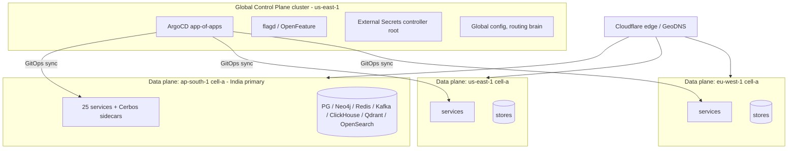
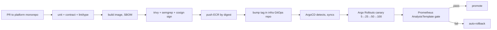

# 12 — DevOps & Platform Engineering

> Conforms to `_shared-context.md` (BINDING). Extends `_brief.md` mandated stack.
> Deliverables: DevOps Architecture · Deployment Strategy · Scaling Strategy · Cost Optimization Strategy.
> Sibling refs: `02-system-architecture.md` (cells, degradation matrix), `06-algorithms.md` (DTI recompute),
> `11-security-architecture.md` (zero-trust mesh, SPIFFE, admission, secrets), `13-testing-performance.md` (SLOs, load),
> `14-roadmap.md` (scale milestones by phase).

**Platform thesis.** TrustOS runs as **cells** (`_shared-context §1`): each region hosts one or more independent
cells (a full stack + data plane) so failures, deploys, and noisy tenants are blast-radius-bounded, and data residency
(GDPR/EU, DPDP/India) is structural. A **global control plane** cluster runs org-wide concerns (GitOps, identity of
platform operators, global config, cross-region routing brain), but **never holds regional user data**. Everything is
GitOps: the cluster state is a pull from git, not a push from a laptop.

---

## 1. EKS Topology

### 1.1 Cluster layout (multi-cluster)



- **Per-region data-plane clusters** carry all 25 services (`_shared-context §2`) + stateful stores + Cerbos sidecars (`11 §3`). A region can hold multiple cells once a single cell saturates (§6 scaling).
- **Global control-plane cluster** (in `us-east-1`, replicated config) runs ArgoCD, flagd, the External Secrets root, and the cross-region routing brain. It has **no user PII** — only operational metadata.
- Cloudflare GeoDNS + edge routes users to their **home-region** cell (`11 §8.1` residency).

### 1.2 Node groups (per data-plane cluster)

| Node group | Instance family (Graviton-first) | Workloads | Scaling |
|---|---|---|---|
| `general` | `m7g` (Graviton3) | Stateless API services, BFF, gateway, Cerbos sidecars | Karpenter, spot+on-demand mix |
| `memory` | `r7g` | Redis-adjacent caches, ClickHouse query nodes, Kafka Connect | Karpenter, on-demand (stateful) |
| `graph` | `r7g` / `x2gd` (high mem) | Neo4j causal cluster, Neo4j GDS jobs | On-demand, pinned, anti-affinity |
| `workers-spot` | `c7g` / `m7g` **spot** | Kafka consumers, Temporal workers, import/campaign batch, analytics ETL | Karpenter spot, KEDA-driven |
| `gpu-optional` | `g5` / `g6` (only if self-hosting models) | On-device model fine-tune, embeddings batch (else via `ai-gateway` to Anthropic) | Karpenter, scale-to-zero |

**Karpenter** provisions right-sized nodes just-in-time (consolidation on, spot-to-spot + spot-to-on-demand
fallback). Rationale over Cluster Autoscaler: bin-packs better, faster, flexible instance types → direct cost win (§7).

### 1.3 Pod topology, PDBs, namespaces
- **Namespace-per-service** (`ns/identity`, `ns/trust`, …) — clean NetworkPolicy + Cerbos + quota boundaries (`11 §5`).
- **Topology spread:** every stateless Deployment sets `topologySpreadConstraints` across ≥3 AZs (`maxSkew: 1`, `whenUnsatisfiable: DoNotSchedule` for tier-1, `ScheduleAnyway` for tier-3) + soft anti-affinity per node.
- **PodDisruptionBudgets:** tier-1 services `minAvailable: 90%`; stateful (Neo4j/Kafka) `maxUnavailable: 1`. Prevents voluntary disruptions (node drain, upgrade) from taking quorum.

```yaml
# base/topology-spread.yaml (kustomize base, patched per service)
apiVersion: apps/v1
kind: Deployment
metadata: { name: trust-service, namespace: trust }
spec:
  replicas: 6
  template:
    spec:
      topologySpreadConstraints:
        - maxSkew: 1
          topologyKey: topology.kubernetes.io/zone
          whenUnsatisfiable: DoNotSchedule
          labelSelector: { matchLabels: { app: trust-service } }
      affinity:
        podAntiAffinity:
          preferredDuringSchedulingIgnoredDuringExecution:
            - weight: 100
              podAffinityTerm:
                topologyKey: kubernetes.io/hostname
                labelSelector: { matchLabels: { app: trust-service } }
      containers:
        - name: app
          resources:
            requests: { cpu: "500m", memory: "512Mi" }
            limits:   { memory: "1Gi" }      # no CPU limit (avoid throttling); memory limited to prevent OOM neighbors
          securityContext:                    # 11 §5 admission requirements
            runAsNonRoot: true
            readOnlyRootFilesystem: true
            allowPrivilegeEscalation: false
            capabilities: { drop: ["ALL"] }
---
apiVersion: policy/v1
kind: PodDisruptionBudget
metadata: { name: trust-service-pdb, namespace: trust }
spec:
  minAvailable: 90%
  selector: { matchLabels: { app: trust-service } }
```

---

## 2. CI/CD

### 2.1 Pipeline shape
`GitHub Actions` (per-service, path-filtered in the `platform` monorepo — `_shared-context §5`) → build/scan/push to
**ECR** → **update the GitOps repo** (`infra`) image tag → **ArgoCD** syncs → **Argo Rollouts** canary on EKS.
Developers never `kubectl apply` to prod; git is the only way in (`11 §8.1` change mgmt / SOC2 CC8).



### 2.2 GitHub Actions workflow (real)

```yaml
# .github/workflows/service-ci.yml  (reused via workflow_call per service)
name: service-ci
on:
  push: { branches: [main], paths: ["services/${{ inputs.service }}/**"] }
  pull_request: { paths: ["services/${{ inputs.service }}/**"] }
  workflow_call:
    inputs:
      service: { required: true, type: string }

concurrency:
  group: ci-${{ inputs.service }}-${{ github.ref }}
  cancel-in-progress: true

permissions:
  contents: read
  id-token: write          # OIDC to AWS — no static keys (11 §4.3)
  packages: write

env:
  AWS_REGION: us-east-1
  ECR: 111122223333.dkr.ecr.us-east-1.amazonaws.com
  SERVICE: ${{ inputs.service }}

jobs:
  test:
    runs-on: ubuntu-latest
    services:
      postgres: { image: postgres:16, env: { POSTGRES_PASSWORD: test }, ports: ["5432:5432"] }
    steps:
      - uses: actions/checkout@v4
      - uses: astral-sh/setup-uv@v3
      - run: uv sync --frozen
        working-directory: services/${{ env.SERVICE }}
      - name: Lint + type (ruff, mypy strict)
        run: uv run ruff check . && uv run mypy --strict .
        working-directory: services/${{ env.SERVICE }}
      - name: Unit + integration (testcontainers)
        run: uv run pytest -q --cov=domain --cov-fail-under=90   # domain gate, not vanity total (13 §1)
        working-directory: services/${{ env.SERVICE }}
      - name: Contract tests (Pact verify)
        run: uv run pytest tests/contract -q
        working-directory: services/${{ env.SERVICE }}
      - name: Cerbos policy tests
        run: cerbos compile --tests infra/cerbos/policies

  build-scan-push:
    needs: test
    if: github.ref == 'refs/heads/main'
    runs-on: ubuntu-latest
    steps:
      - uses: actions/checkout@v4
      - name: Semgrep SAST
        uses: returntocorp/semgrep-action@v1
        with: { config: "p/ci p/python p/owasp-top-ten" }
      - uses: aws-actions/configure-aws-credentials@v4
        with: { role-to-assume: arn:aws:iam::111122223333:role/gha-ecr-push, aws-region: ${{ env.AWS_REGION }} }
      - uses: aws-actions/amazon-ecr-login@v2
      - name: Build (Graviton multi-arch) + SBOM
        run: |
          docker buildx build --platform linux/arm64 \
            -t $ECR/$SERVICE:${{ github.sha }} \
            --provenance=true --sbom=true --push \
            services/$SERVICE
      - name: Trivy image scan (fail on HIGH/CRITICAL)
        uses: aquasecurity/trivy-action@0.24.0
        with:
          image-ref: ${{ env.ECR }}/${{ env.SERVICE }}:${{ github.sha }}
          severity: "HIGH,CRITICAL"
          exit-code: "1"
          ignore-unfixed: true
      - name: Cosign sign by digest (admission requires signed — 11 §5)
        run: cosign sign --yes $ECR/$SERVICE@$(crane digest $ECR/$SERVICE:${{ github.sha }})

  gitops-bump:
    needs: build-scan-push
    runs-on: ubuntu-latest
    steps:
      - uses: actions/checkout@v4
        with: { repository: trustos/infra, token: ${{ secrets.INFRA_PAT }} }
      - name: Bump image tag (staging overlay first)
        run: |
          yq -i '.images[] |= select(.name=="'$SERVICE'").newTag = "${{ github.sha }}"' \
            clusters/staging/${SERVICE}/kustomization.yaml
      - name: Commit (ArgoCD picks up)
        run: |
          git config user.name trustos-ci && git config user.email ci@trustos.dev
          git commit -am "chore($SERVICE): staging ${{ github.sha }}" && git push
```

Promotion staging→prod is a **separate, approval-gated** PR in `infra` (env promotion), so prod change requires human
review (SOC2 CC8, `11 §8.1`).

### 2.3 ArgoCD app-of-apps
Root `Application` points at `infra/clusters/<cluster>/apps/` which contains a child `Application` per service; each
child renders that service's kustomize overlay. Adding a service = adding one child manifest (self-service, reviewed).
Sync waves order dependencies (CRDs/policies wave 0, stateful wave 1, services wave 2). Auto-sync + self-heal on;
prune guarded.

```yaml
# infra/clusters/ap-south-1/root-app.yaml
apiVersion: argoproj.io/v1alpha1
kind: Application
metadata: { name: ap-south-1-root, namespace: argocd }
spec:
  project: trustos
  source:
    repoURL: https://github.com/trustos/infra
    path: clusters/ap-south-1/apps
    targetRevision: main
    directory: { recurse: true }
  destination: { server: https://ap-south-1.eks.internal, namespace: argocd }
  syncPolicy:
    automated: { prune: true, selfHeal: true }
    syncOptions: ["ApplyOutOfSyncOnly=true", "PruneLast=true"]
```

### 2.4 Argo Rollouts — canary (real)
Default deploy strategy for stateless services: canary **5% → 25% → 50% → 100%**, each step gated by a Prometheus
`AnalysisTemplate` on error-rate + p99 latency; auto-abort+rollback on breach.

```yaml
# services/referral-service — rollout
apiVersion: argoproj.io/v1alpha1
kind: Rollout
metadata: { name: referral-service, namespace: referral }
spec:
  replicas: 8
  strategy:
    canary:
      canaryService: referral-service-canary
      stableService: referral-service-stable
      trafficRouting: { plugins: { argoproj-labs/gatewayAPI: { httpRoute: referral-route, namespace: referral } } }
      steps:
        - setWeight: 5
        - pause: { duration: 5m }
        - analysis: { templates: [{ templateName: error-rate-latency }] }
        - setWeight: 25
        - pause: { duration: 10m }
        - analysis: { templates: [{ templateName: error-rate-latency }] }
        - setWeight: 50
        - pause: { duration: 10m }
        - analysis: { templates: [{ templateName: error-rate-latency }] }
        - setWeight: 100
      abortScaleDownDelaySeconds: 600
  selector: { matchLabels: { app: referral-service } }
  template: { }   # standard pod spec (see §1.3)
---
apiVersion: argoproj.io/v1alpha1
kind: AnalysisTemplate
metadata: { name: error-rate-latency, namespace: referral }
spec:
  metrics:
    - name: error-rate
      interval: 1m
      count: 5
      successCondition: result < 0.01           # < 1% 5xx
      failureLimit: 1
      provider:
        prometheus:
          address: http://prometheus.monitoring:9090
          query: >
            sum(rate(http_requests_total{app="referral-service",canary="true",code=~"5.."}[2m]))
            / sum(rate(http_requests_total{app="referral-service",canary="true"}[2m]))
    - name: p99-latency
      interval: 1m
      count: 5
      successCondition: result < 0.3             # < 300ms p99 in-region (SLO §4)
      failureLimit: 1
      provider:
        prometheus:
          address: http://prometheus.monitoring:9090
          query: >
            histogram_quantile(0.99,
              sum(rate(http_request_duration_seconds_bucket{app="referral-service",canary="true"}[2m])) by (le))
```

### 2.5 When blue-green instead of canary
Canary assumes old+new can serve the *same* traffic simultaneously. Use **blue-green** when they can't:
| Situation | Why blue-green | How |
|---|---|---|
| **Schema-coupled deploy** (breaking DB migration) | Old + new pods can't share the schema mid-migration | Expand/contract migrations (§2.6); if unavoidable-breaking, blue-green cutover with the paired schema |
| **API gateway / Envoy config** | Traffic-splitting the router itself is fragile | Stand up green gateway, flip DNS/route atomically, keep blue warm for rollback |
| **Stateful protocol version bumps** (Kafka/consumer group semantics) | Mixed versions corrupt state | Blue-green consumer groups, cut over at a checkpoint |
| **Neo4j major upgrade** | Causal cluster can't run mixed major | Blue-green cluster + replay/backfill |

### 2.6 Progressive delivery + feature flags + DB migration gating
- **Flags (OpenFeature + flagd, `_shared-context §5`):** deploy ≠ release. Risky code ships dark behind a flag, then progressive-rollout by cohort (region/tier/%), decoupled from the canary. Kill-switch flags on every risky path (`11 §9.3` IR).
- **Migration gating in the pipeline:** DB migrations are **expand/contract** and run as a **pre-sync ArgoCD hook** (`Job`) *before* pod rollout. Rule: every migration is backward-compatible with the currently-running app version (add columns nullable → backfill → deploy reader → deploy writer → drop later). CI fails a PR whose migration isn't backward-compatible (linter + a "migrate then run previous image's tests" check). Never a destructive migration in the same release as the code depending on it.

```yaml
# argo pre-sync migration hook
apiVersion: batch/v1
kind: Job
metadata:
  name: referral-migrate
  annotations:
    argocd.argoproj.io/hook: PreSync
    argocd.argoproj.io/hook-delete-policy: HookSucceeded
spec:
  template:
    spec:
      restartPolicy: Never
      containers:
        - name: migrate
          image: 111122223333.dkr.ecr.us-east-1.amazonaws.com/referral-service:GITSHA
          command: ["alembic", "upgrade", "head"]   # backward-compatible only; gated in CI
```

---

## 3. Environments

| Env | Purpose | Data | Parity notes |
|---|---|---|---|
| **dev** | Fast inner loop | Synthetic seed | Skaffold/Tilt to a personal namespace or local kind; downstream services mocked or shared-dev |
| **staging** | Pre-prod, full integration, load & chaos | Synthetic + anonymized-shape (never real PII) | Same manifests as prod (kustomize overlay differs only in scale/secrets); all Kafka/Temporal real |
| **prod** | Live, cell-based | Real, region-resident | Canary + flags gate every change |

- **Ephemeral PR environments — vcluster (chosen).** Each PR that touches service topology spins a **vcluster** (virtual cluster on shared host nodes) rather than a bare namespace. **Justification:** vcluster gives PR-isolated CRDs, webhooks, RBAC and cluster-scoped resources (which naked namespaces can't isolate) at a fraction of the cost of a real EKS cluster per PR; ArgoCD ApplicationSet with a PR generator creates/destroys them on open/merge. Namespaces alone leak cluster-scoped state and can't test admission/Cerbos policy changes safely.
- **Seed / synthetic data:** a `synthgen` tool fabricates a realistic relationship graph (power-law degree distribution, plausible interaction timelines, referral funnels, DTI distributions) with **zero real PII**. Deterministic seeds for reproducible tests; volume knob to fill staging for load tests (`13-testing-performance.md §4`). Never copy prod data down (residency + privacy, `11 §8`).

---

## 4. Observability

### 4.1 OTel collector pipelines
Per `_shared-context §1`: OpenTelemetry (traces/metrics/logs) → Prometheus + Grafana + Tempo + Loki; Sentry
client+server; trace context in Kafka headers. Collector runs as (a) **agent DaemonSet** (node-local, tail-based)
and (b) **gateway Deployment** (aggregation, tail-sampling, export). Pipeline:

```yaml
# otel-collector gateway (excerpt)
receivers:
  otlp: { protocols: { grpc: {}, http: {} } }
processors:
  batch: {}
  memory_limiter: { check_interval: 1s, limit_percentage: 80 }
  tail_sampling:                       # cost control (§7 lever): keep all errors/slow, sample the rest
    policies:
      - name: errors,   type: status_code, status_code: { status_codes: [ERROR] }
      - name: slow,     type: latency,     latency: { threshold_ms: 500 }
      - name: sample,   type: probabilistic, probabilistic: { sampling_percentage: 5 }
  resourcedetection: { detectors: [eks, ec2] }
exporters:
  prometheusremotewrite: { endpoint: http://mimir:9009/api/v1/push }
  otlp/tempo: { endpoint: tempo:4317 }
  loki: { endpoint: http://loki:3100/loki/api/v1/push }
service:
  pipelines:
    traces:  { receivers: [otlp], processors: [memory_limiter, tail_sampling, batch], exporters: [otlp/tempo] }
    metrics: { receivers: [otlp], processors: [memory_limiter, batch], exporters: [prometheusremotewrite] }
    logs:    { receivers: [otlp], processors: [memory_limiter, batch], exporters: [loki] }
```

### 4.2 Dashboards — RED + USE
- **RED** (Rate, Errors, Duration) per service — request-driven services (gateway, APIs, BFF).
- **USE** (Utilization, Saturation, Errors) per resource — nodes, Kafka (consumer lag, ISR), PG (connections, replication lag), Neo4j (heap, page cache), Redis (memory, evictions), Qdrant, ClickHouse.
- Per-service dashboard is generated from a template (Grafana as code / jsonnet) so all 25 services look identical → faster on-call cognition.

### 4.3 SLO catalog (targets + assumptions)

| # | Service / journey | SLI | Target (SLO) | Window |
|---|---|---|---|---|
| 1 | `api-gateway` availability | successful non-5xx / total | **99.95%** | 30d rolling |
| 2 | API latency (read) in-region | p99 request duration | **< 300 ms** | 30d |
| 3 | API latency (write) in-region | p99 | < 500 ms | 30d |
| 4 | `bff-mobile` feed | p95 aggregate | < 400 ms | 30d |
| 5 | Auth (`identity`) login success | non-error logins / attempts | 99.9% | 30d |
| 6 | **Message delivery success** (`channel`) | delivered / accepted (excl. user-blocked) | **99.0%** | 7d |
| 7 | **Trust-update lag** | event → DTI reflects | **< 60 s** p95 | 1d |
| 8 | **Offline sync lag** (mobile ↔ server) | client change → server ack | < 5 s p95 (online) | 1d |
| 9 | Referral attribution correctness | attributed / convertible | 99.99% (money — tight) | 30d |
| 10 | Ledger posting durability | posted & acked / submitted | 100% (no loss tolerated) | ∞ |
| 11 | Kafka consumer lag (trust/analytics) | max group lag | < 30 s p95 | 1d |
| 12 | Search freshness | publish → indexed | < 10 s p95 | 1d |
| 13 | AI copilot response | p95 gen latency (non-stream) | < 6 s | 7d |
| 14 | Notification push delivery | pushed / requested | 99.5% | 7d |

**Assumptions:** "in-region" means user routed to home-region cell (`11 §8.1`); cross-region reads are rare and
budgeted separately. SLOs 9/10 are money-path and near-perfect by design (double-entry, `11 §9.2`).

### 4.4 Error budgets + multiwindow burn alerts
Each SLO has an error budget (e.g. 99.95% → 0.05% = ~21.9 min/month). **Multiwindow, multi-burn-rate** alerts
(Google SRE style) fire fast on catastrophic burn, slow on chronic:

```yaml
# prometheus rule (gateway availability)
groups:
  - name: slo-gateway-availability
    rules:
      - alert: GatewayErrorBudgetFastBurn
        # 14.4x burn over 1h AND 5m → page (would exhaust 30d budget in ~2 days)
        expr: |
          (slo:gateway_error_ratio:rate1h > (14.4 * 0.0005))
          and (slo:gateway_error_ratio:rate5m > (14.4 * 0.0005))
        for: 2m
        labels: { severity: page }
      - alert: GatewayErrorBudgetSlowBurn
        # 3x burn over 6h AND 30m → ticket
        expr: |
          (slo:gateway_error_ratio:rate6h > (3 * 0.0005))
          and (slo:gateway_error_ratio:rate30m > (3 * 0.0005))
        for: 15m
        labels: { severity: ticket }
```

Policy: budget exhausted → **feature freeze** on that service until reliability work restores it (aligns eng
incentives). **Sentry release health** tracks crash-free users/sessions per mobile & backend release; a release
regressing crash-free rate blocks further rollout (ties to Argo Rollouts §2.4 and `13 §5`).

### 4.5 On-call structure
Follow-the-sun rotation aligned to cell regions (India/US/EU). Two tiers: **service on-call** (squad owns its SLOs) +
**platform on-call** (cluster/mesh/data infra). Sev flow per `11 §9.3`. Every page has a runbook link; unactionable
alerts are deleted (alert hygiene reviewed monthly). Incident tooling: PagerDuty + a `#incident` bridge; blameless
post-mortems feed the threat model (`11`) and this doc's runbooks.

---

## 5. Reliability

### 5.1 DR — backup matrix per store

| Store | Backup method | RPO | RTO | Retention |
|---|---|---|---|---|
| PostgreSQL (per service) | **PITR** — WAL archiving to S3 (+ base backup daily) via CNPG/pgBackRest | ≤ 5 min | ≤ 30 min (tier-1) | 35 d PITR + monthly 1y |
| Neo4j (causal cluster) | Online backup (incremental) to S3 + read-replica in 2nd AZ | ≤ 15 min | ≤ 1 h | 30 d |
| Kafka | **Tiered storage** (hot local + cold S3) + MirrorMaker2 to DR region for tier-1 topics | ≤ 1 min (replicated) | ≤ 15 min | infinite for `ledger.*`, 30d others |
| Redis | AOF everysec + RDB snapshots to S3; caches are rebuildable | ≤ 1 s (durable state) / N/A (pure cache) | ≤ 10 min | 7 d |
| ClickHouse | Replicated (ReplicatedMergeTree) + `BACKUP` to S3 | ≤ 1 h | ≤ 2 h | 90 d hot, then object cold |
| Qdrant | Snapshot to S3 (rebuildable from source + re-embed) | ≤ 6 h | ≤ 4 h (or re-embed) | 14 d |
| OpenSearch | Snapshot to S3 (rebuildable from PG via reindex) | ≤ 1 h | ≤ 2 h | 14 d |
| Temporal | Backed by PG (above) + workflow history is the source of truth | inherits PG | ≤ 30 min | inherits |
| Object (S3/R2) | Versioning + cross-region replication (CRR) | ≈ 0 | ≈ 0 | lifecycle tiered |

**Service tier → RPO/RTO policy**
| Tier | Examples | RPO | RTO |
|---|---|---|---|
| T0 money/auth | `ledger`, `identity` | ≤ 1 min | ≤ 15 min |
| T1 core | `trust`, `relationship`, `referral`, `gateway` | ≤ 5 min | ≤ 30 min |
| T2 engagement | `community`, `campaign`, `marketplace` | ≤ 15 min | ≤ 2 h |
| T3 derived/rebuildable | `search`, `qdrant`, `leaderboard`, `analytics` | rebuildable | ≤ 4 h (rebuild) |

### 5.2 Region-loss game day
Quarterly. Procedure: (1) announce, freeze non-essential deploys; (2) sever a data-plane region (simulate cell loss)
via Cloudflare route withdrawal + mesh egress cut; (3) verify GeoDNS fails users to a healthy region (degraded:
cross-region reads only for that cohort — home-region writes queue); (4) validate DR restore of one T0 store from
backup into a fresh cluster within RTO; (5) MirrorMaker2 lag/consumer-group failover check; (6) measure actual
RPO/RTO vs table; (7) post-mortem, fix gaps. Cell architecture means one region's loss degrades that cohort, not the
platform.

### 5.3 Chaos engineering
Program on **staging continuously + prod steady-state (guarded)**. Tools: LitmusChaos / Chaos Mesh for pod/node/AZ
kills, network latency/partition (also toxiproxy in tests, `13 §2`), Kafka broker loss, PG failover. Hypotheses tie to
SLOs (§4.3): "kill 1 AZ → gateway stays 99.95%". Game-day cadence + automated experiments in a chaos gitops repo;
blast radius always bounded (start staging, then 1 cell, never global).

### 5.4 Load shedding & graceful degradation (mirrors `02-system-architecture.md`)
Under overload/dependency failure, shed lowest-value load first to protect T0/T1. Degradation matrix (mirror of
`02-system-architecture.md`):

| Pressure | Shed / degrade | Preserve |
|---|---|---|
| Gateway overload | Reject T3 (leaderboard refresh, analytics dashboards) with 429 + `Retry-After`; disable non-critical AI copilot | Auth, ledger, referral submit, DMs |
| AI provider slow/down | Serve cached AI results; queue generations; feature-flag off copilot suggestions | Core CRUD, trust, money |
| Trust recompute backlog | Fall back to last-good DTI (stale-but-served); nightly reconcile catches up | Never block money on live recompute |
| Neo4j degraded | Serve cached graph reads; disable heavy GDS jobs; recommendations stale | Direct relationship reads (PG mirror) |
| Kafka lag spike | KEDA scales consumers; prioritize `ledger`/`trust` topics; delay analytics | Ordering & no-loss for money |
| Channel provider throttle | Pace sends, spill to queue, protect WhatsApp quality rating (`11 §1` Surface 5) | Delivery integrity over speed |

Implemented via: circuit breakers (`_brief` principles), priority queues, per-tier rate limits (`11 §7.5`), and
flag-driven kill switches.

---

## 6. Scaling Strategy — the ladder 0 → 1M → 10M → 100M

Guiding rule: **don't pre-shard.** Scale the simplest thing that meets the SLO; introduce complexity only at the
milestone that forces it. Tie-ins to `14-roadmap.md` phases.

| Milestone | Cells | Postgres | Kafka | Neo4j | Redis / leaderboard | Notable changes |
|---|---|---|---|---|---|---|
| **0 → 1M** (Phase 0–1, India, 10 cities) | **1 cell**, `ap-south-1` | Single primary + 2 read replicas **per service DB**; vertical scale (`r7g`) | ~12–30 partitions/topic; 3 brokers | Single causal cluster (3 core) | Shared Redis; leaderboard in-line sorted sets | Monolith-of-services is fine; no sharding; Karpenter handles bursts |
| **1M → 10M** (Phase 2) | 1 cell + read scale; prep 2nd region | Add replicas; **partition hottest tables** (trust_factor_ledger, interactions) by time; move analytics fully to ClickHouse | Expand partitions (100–300 on hot topics); tiered storage on; **KEDA** consumer autoscale | Read replicas per region; GDS on dedicated nodes | **Dedicated Redis cluster for leaderboards** (sorted sets get hot); CDN cache for feeds; connection pooling (pgbouncer) mandatory |
| **10M → 50M** (Phase 3) | **Split into multiple cells per region** + add `eu-west-1`, `us-east-1` | **Shard Postgres** for the largest domains (`contact`, `relationship`, `trust`) by `user_id` hash (Citus or app-level shard router); others stay single | 300–1000 partitions; dedicated clusters for `ledger`/`trust` vs bulk | Neo4j Fabric (sharded graph) per region; GDS jobs off-peak | Redis Cluster (sharded) per region; leaderboard tiered (top-N hot, tail computed) | Home-region routing hard-enforced; cross-cell APIs async only |
| **50M → 100M** (Phase 4) | Many cells; **cell = unit of scale**, split when a cell nears ~5–8M users | Sharded + per-shard PITR; automated shard rebalancing | Multi-cluster Kafka, geo-replicated tier-1; per-tenant quotas | Neo4j Fabric multi-region; graph queries cell-local | Global leaderboards = hierarchical rollups (city→country→global) precomputed; hot path never scans | ClickHouse cluster scale-out; Qdrant sharded per region; AI token budgeting per cohort (§7) |

**When to do each thing (triggers, not calendar):**
- **Shard Postgres** when a single service DB's largest table > ~500 GB *or* write IOPS saturates the biggest sensible instance *or* p99 write SLO at risk despite tuning — start with the graph/contact/trust domains.
- **Expand Kafka partitions** when max consumer lag SLO (§4.3 #11) is chronically at risk and consumers are already CPU-bound at max KEDA scale (partitions cap consumer parallelism).
- **Split a cell** when a cell approaches ~5–8M users or its blast-radius/deploy-risk grows uncomfortable; new users route to a fresh cell, existing stay (no migration unless residency requires).
- **Dedicated leaderboard Redis** when sorted-set ops contend with session/cache traffic (memory pressure or `USE` saturation on shared Redis).

**Autoscaling policies**
| Workload | Scaler | Metric |
|---|---|---|
| Stateless APIs | HPA | **RPS** (custom metric) + CPU fallback; target ~60% |
| BFF / gateway | HPA | RPS + p99 latency headroom |
| Kafka consumers | **KEDA** | consumer group **lag** (scale 0→N; workers on spot §1) |
| Temporal workers | KEDA | task queue depth |
| Import/campaign batch | KEDA | queue depth (scale-to-zero when idle) |
| Nodes | **Karpenter** | pending pods, bin-packing, spot |
| Embeddings/AI batch | KEDA + Karpenter scale-to-zero | queue depth |

```yaml
# KEDA — scale trust consumers on Kafka lag
apiVersion: keda.sh/v1alpha1
kind: ScaledObject
metadata: { name: trust-consumer, namespace: trust }
spec:
  scaleTargetRef: { name: trust-consumer }
  minReplicaCount: 2
  maxReplicaCount: 40
  triggers:
    - type: kafka
      metadata:
        bootstrapServers: kafka.trust:9092
        consumerGroup: trust-updater
        topic: trustos.trust.factor
        lagThreshold: "2000"     # scale up when per-partition lag > 2k
        offsetResetPolicy: latest
```

---

## 7. Cost Optimization Strategy

### 7.1 Cost model (with arithmetic + stated assumptions)

**Assumptions (documented):**
- MAU/registered ≈ 40%; DAU/MAU ≈ 25%. Region mix at 100M: 55% India (low-ARPU, WhatsApp-heavy), 30% US/EU, 15% RoW.
- Avg **5 AI copilot interactions / MAU / month**; avg call ≈ 4k input + 800 output tokens; heavy caching (§7.2) removes ~55% of token spend.
- Model tiering (`_shared-context §1`): ~70% haiku-class (cheap classify), ~27% sonnet-class, ~3% deep/opus.
- Messaging: WhatsApp business-initiated conversations dominate cost; India ≈ ₹0.5–0.9 (~$0.008–0.011) per conversation, US higher (~$0.03+). Assume blended $0.012/conversation, ~3 conversations/MAU/month billable.
- Graviton + spot for stateless/workers; 3-yr Savings Plans for steady baseline; storage tiered.
- ClickHouse self-hosted (not a vendor analytics SaaS) — big lever (§7.2).

**Monthly infra cost (order-of-magnitude, USD):**

| Category | **1M users** (~400k MAU) | **10M** (~4M MAU) | **100M** (~40M MAU) | Notes / arithmetic |
|---|---|---|---|---|
| Compute — stateless APIs (EKS, Graviton, 60% spot) | $22k | $150k | $1.1M | scales sublinearly w/ caching + bin-packing |
| Compute — workers (spot, KEDA scale-to-zero) | $8k | $55k | $420k | Kafka/Temporal/import/campaign |
| PostgreSQL (multi-AZ, replicas; sharded at 10M+) | $18k | $130k | $950k | RDS/CNPG; PITR to S3 |
| Neo4j (causal cluster → Fabric) | $14k | $95k | $700k | high-mem `r7g/x2gd`; graph is pricey |
| Redis (Elasticache; dedicated leaderboard @scale) | $6k | $42k | $300k | sorted sets + sessions |
| Kafka (MSK/self, tiered storage) | $9k | $60k | $430k | partitions + tiered S3 offload |
| ClickHouse (self-hosted vs vendor) | $5k | $32k | $230k | ~4× cheaper than vendor SaaS at scale |
| Qdrant + OpenSearch | $5k | $34k | $250k | vector + search |
| **AI tokens** (Anthropic, tiered + cached) | $12k | $90k | $780k | see below |
| **WhatsApp/SMS/email fees** | $14k | $130k | $1.25M | dominated by WhatsApp convos |
| Observability (self-hosted Mimir/Loki/Tempo + sampling) | $6k | $38k | $270k | tail-sampling §4.1 keeps this sane |
| CDN / edge (Cloudflare) + egress | $4k | $28k | $210k | R2 zero-egress helps |
| Object storage (S3/R2, tiered) | $2k | $16k | $140k | media + backups + tiered cold |
| **Total (rounded)** | **~$125k/mo** | **~$900k/mo** | **~$7.0M/mo** | |
| **Infra cost / MAU** | **~$0.31** | **~$0.225** | **~$0.175** | target curve ↓ with scale |

**AI token arithmetic (100M):** 40M MAU × 5 calls = 200M calls/mo. Blended pre-cache cost ~$0.0085/call
(tiered 70/27/3). Caching removes ~55% → effective ~200M × $0.0085 × 0.45 ≈ **$765k** (+ evals/batch overhead ≈ $780k).

**WhatsApp arithmetic (100M):** 40M MAU × 3 billable convos × $0.012 blended ≈ **$1.44M** gross; suppression/dedup +
free-tier user-initiated windows trim to ~$1.25M net.

### 7.2 The 10 biggest cost levers

| # | Lever | Mechanism | Est. saving |
|---|---|---|---|
| 1 | **Spot for stateless workers** | Kafka/Temporal/import/campaign on Karpenter spot (KEDA scale-to-zero) | 60–80% on that compute |
| 2 | **Graviton everywhere** | ARM64 build (§2.2) for all services | ~20–40% price/perf vs x86 |
| 3 | **AI caching + tiering** | Prompt/response cache + semantic cache; route 70% to haiku-class | ~55% of AI spend |
| 4 | **Kafka tiered storage** | Offload cold segments to S3, small hot local disks | 50–70% Kafka storage |
| 5 | **ClickHouse vs vendor analytics** | Self-host ReplicatedMergeTree instead of Datadog/Snowflake events | 3–4× on analytics |
| 6 | **Observability sampling** | Tail-sampling (keep errors/slow, 5% rest §4.1) + metric cardinality caps + self-host Grafana stack | 60–80% vs vendor APM |
| 7 | **Storage lifecycle tiering** | S3 Intelligent-Tiering + Glacier for backups/cold audit; R2 for public (zero egress) | 40–60% storage/egress |
| 8 | **Savings Plans / RIs on baseline** | 3-yr compute SP for the steady floor; spot for the peak | ~30–50% on baseline compute |
| 9 | **Right-sizing + Karpenter consolidation** | Requests tuned from real usage (VPA recommend), bin-pack, consolidate | 20–35% waste removed |
| 10 | **WhatsApp/channel optimization** | Prefer user-initiated (free) windows, batch, suppression lists, cheaper channel routing by geo | 15–30% messaging |

### 7.3 Unit economics — infra cost per MAU target curve
Target: infra cost/MAU **falls** as scale amortizes fixed platform cost and levers kick in:
`~$0.31 (1M) → ~$0.225 (10M) → ~$0.175 (100M)`, floor ~$0.14 with mature levers. This must sit well under blended
ARPU (referral take-rate + marketplace fees + org subscriptions + rewards economy) for the platform to be
gross-margin healthy; India's low-ARPU cohort is subsidized by US/EU/enterprise (`14-roadmap.md` Phase 3–4). AI and
WhatsApp are the two variable costs to watch — both are metered and cohort-budgeted so a viral cohort can't blow the
model.

---

*End of 12-devops-platform.md. Cross-refs: `02-system-architecture.md`, `06-algorithms.md`,
`11-security-architecture.md`, `13-testing-performance.md`, `14-roadmap.md`.*
