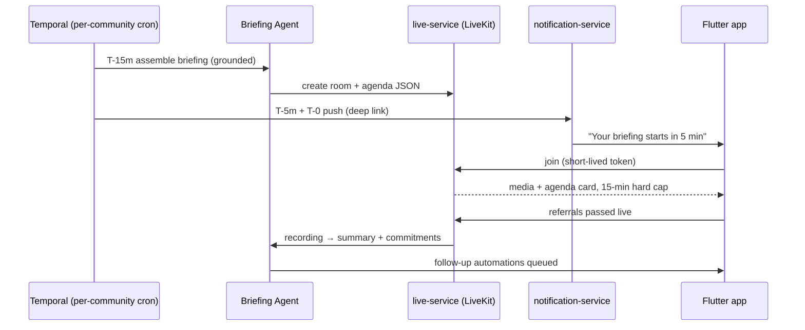
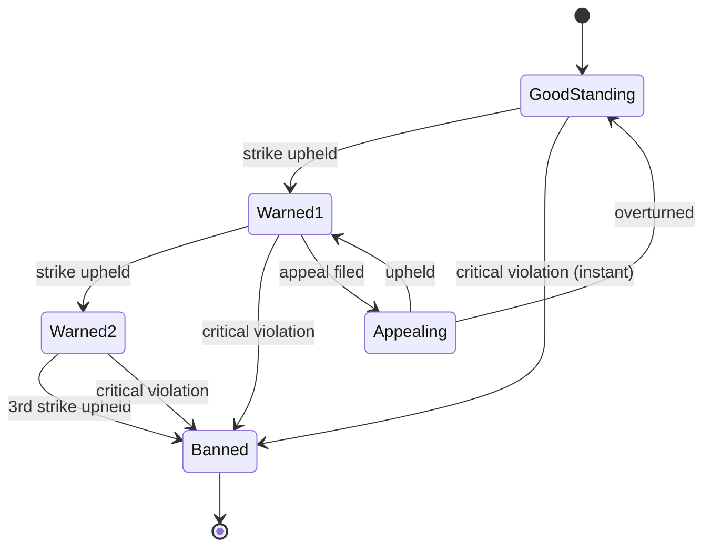
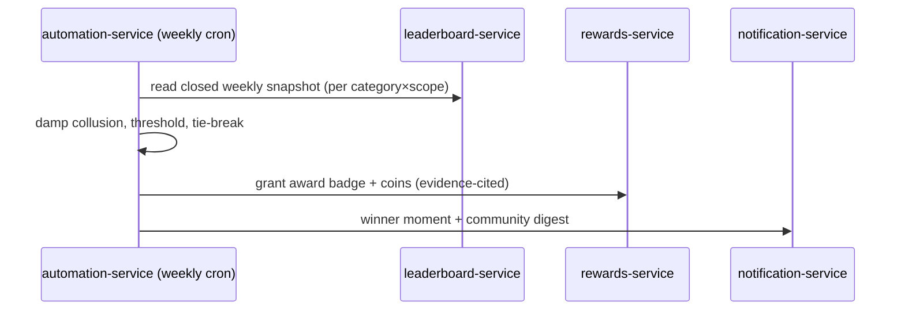

# TrustOS — Daily Briefing Calls, Enforcement (3-Strike), Weekly Awards

> Implementation design for three requested features. Each is specified against the existing service registry ([`_shared-context.md`](_shared-context.md) §2) and event taxonomy — extending, never contradicting. Two of the three needed a design correction before they're safe at 100M/100-country scale; those corrections are called out up front, not buried.

---

## Feature 1 — Daily automated group briefing call (15 min)

### 1.1 The correction first
**A single daily call for all users is impossible and off-thesis.** 100M users across 100 countries have no shared 9:00 AM, and doc 15 deliberately replaced BNI's mandatory weekly meeting with *async-first, meeting-optional* daily moments. So we implement it as: **a per-community, timezone-local, opt-in daily briefing** — the ceremony layer (doc 15 §5) at daily cadence for communities that want the discipline. It operationalizes the **Daily Success Formula** literally: the briefing *is* the Learn → Prepare → Prospect steps, done together.

### 1.2 What it is
Each community may enable a **Daily Briefing**: a scheduled 15-minute call at a fixed local time. Members get a push 5 minutes before and at start, tap to join, and run a tight AI-scripted agenda. It is optional to attend; showing up warm and *participating* (not mere attendance) is what counts.

### 1.3 The 15-minute format (hard-capped by the room)
| Segment | Time | Owner | Content |
|---|---|---|---|
| AI briefing | 0:00–3:00 | Briefing Agent (TTS + on-screen card) | Yesterday's settled outcomes, new members, top 3 open asks, one knowledge nugget, today's challenge |
| Wins | 3:00–5:00 | Human host | 20-sec each: what closed since yesterday (ledger-verified only) |
| Asks & Offers | 5:00–10:00 | Members | "I need / I can give" — the AI pre-collected these overnight and ordered them by match strength |
| Live referral exchange | 10:00–14:00 | Members | Pass referrals on the spot → captured as `referral.referral.submitted.v1` in real time |
| Close | 14:00–15:00 | Host | Commitments recap; AI extracts them into follow-up automations |

### 1.4 Architecture
- **New service: `live-service`** (25→26 in the registry ⊕). Owns call rooms, scheduling, join tokens, recording lifecycle. Stateless API + stateful media handled by the SFU below.
- **Media layer: LiveKit, self-hosted on EKS** (WebRTC SFU). Rationale over managed (Agora/Twilio/Daily): cost at scale (thousands of small concurrent rooms), per-cell deployment for **data residency** (a call among Indian members never leaves ap-south-1), and recording control. Managed provider kept as a documented failover. *Trade-off logged: build-vs-buy on media is the single biggest new operational burden here; start with LiveKit Cloud for the pilot, self-host at Phase 2.*
- **Scheduling: Temporal cron per community.** Computes "09:00 in the community's timezone," and uses the **materialize-and-jitter** pattern from doc 08 §5 (per-community deterministic jitter) so 40,000 communities firing "9 AM IST" don't stampede room creation.
- **Briefing generation: `agent-runtime` Briefing Agent** (a scheduled agent, doc 07 §3). At T-15min it queries community-service + deal-service + referral-service for the last 24h, assembles the agenda via `ai-gateway` (grounded-or-silent — every number cites a ledger/event record), and produces (a) a TTS audio intro and (b) the structured agenda JSON the app renders.
- **Notification: `notification-service`** sends the T-5min and T-0 pushes with a deep link into the room.
- **Post-call: summary + commitments.** live-service records → agent summarizes → commitments extracted become `automation.run.started.v1` follow-ups (doc 08) and any live referrals are already captured. Attendance/participation written back.

### 1.5 Data (community-service) + events
`scheduled_calls(id, community_id, local_time, tz, cadence, enabled, next_fire_at)` · `call_sessions(id, community_id, started_at, ended_at, room_id, recording_ref)` · `call_participation(call_id, user_id, joined_at, left_at, contributed bool)` · `call_summaries(call_id, summary, commitments jsonb)`.
⊕ Events: `community.call.scheduled.v1`, `community.call.started.v1`, `community.call.attended.v1`, `community.call.contributed.v1`, `community.call.ended.v1`, `community.call.summary_ready.v1`.

### 1.6 Trust & scale notes
- **Participation, not attendance, feeds trust** — bringing/taking a referral emits the normal outcome events (which score); merely joining does not (doc 15's "reward value, not activity"). This preserves the anti-gaming stance.
- **Scale math:** 40k communities × one 15-min room/day, staggered by timezone + jitter ≈ a few hundred concurrent rooms at peak per cell, each ≤ ~50 participants on an SFU — comfortably within a modest LiveKit node group. Recording storage: 15 min audio ≈ 7 MB → tiered to object storage, TTL per retention schedule.
- **Cost lever:** audio-first by default (video optional) cuts media egress ~10×.

---

## Feature 2 — Three-strike lifetime ban

### 2.1 The corrections first
A naïve "3 warnings → permanent ban, no nuance" is legally and operationally unsafe. Four fixes make it real:
1. **Severity tiers, not flat strikes.** A late reply ≠ referral fraud. Minor → warning; major → immediate feature restriction + strike; **critical (fraud, invite-selling, trust-manipulation, illegal content) → instant permanent ban, bypassing the count.** The 3-strike ladder governs *accumulated minor/major* violations.
2. **Appeals are mandatory** (IT Rules 2021 + doc 16 §6): every warning and the ban itself carry notice + evidence + a 7-day human-reviewed appeal. A strike counts only once **upheld** (appeal failed or window lapsed).
3. **Ban the person, not the account.** A lifetime ban is only as strong as identity binding — enforce against **KYC identity (PAN/phone at T4), device fingerprints, and payment instruments**, with graph-based ban-evasion detection (Neo4j: a fresh account clustering on a banned identity's device/payment/contacts).
4. **Money already earned is not confiscated by a ban** unless the ban is *for fraud on those very earnings* — settled/escrowed commissions are handled per the Referral Terms, not seized (doc 16). Otherwise you invite consumer-forum claims.

So the honored intent — "3 warnings and you're out, for life" — stands, made defensible: **3 upheld strikes → permanent, identity-bound ban with a final appeal; egregious violations skip straight to it.**

### 2.2 Architecture
- **New bounded context: `moderation-service`** (⊕; may physically start inside identity-service pre-1M per the consolidation plan). Owns the enforcement lifecycle; `trust-service` consumes it; `identity-service` executes bans.
- **Append-only `enforcement_ledger`** (same discipline as `trust_factor_ledger`, doc 05) — every warning/appeal/ban is an immutable, auditable, explainable row. No deletes, ever.
- **Per-user standing state machine:**

- **Strike sources:** Community Agent moderation triage (AI flags → **human decides** on any member-facing penalty, doc 07 guardrail), automated fraud detection (doc 06 §3), and user reports — all converge on a moderator queue.
- **Issuance flow:** violation → moderator/human confirms severity → `enforcement_ledger` row + notice to user (rule, evidence, appeal link) → 7-day window → auto-upheld on lapse or on failed appeal → standing advances → on 3rd/critical: **ban executed** = session revocation fan-out (Redis, doc 11), account lock, identity hashes added to `ban_registry`, pending non-fraud settlements released per terms, trust integrity component zeroed.
- **Ban-evasion:** on new signup, identity-service checks device/payment/phone hashes and runs a Neo4j proximity query against banned clusters; a hit routes to review, not auto-block (avoid false positives on shared devices/family).

### 2.3 Data + events
`enforcement_ledger(id, user_id, kind[warning|restriction|ban], severity, rule_code, evidence_ref, issued_at, status[pending|upheld|overturned], appeal_id)` · `appeals(id, action_id, filed_at, reviewer_id, decided_at, outcome)` · `ban_registry(id_hash, device_hashes, payment_hashes, banned_at, reason_code)` · `user_standing(user_id, state, strike_count, updated_at)`.
⊕ Events: `moderation.warning.issued.v1`, `moderation.appeal.filed.v1`, `moderation.action.upheld.v1`, `moderation.action.overturned.v1`, `identity.user.banned.v1`, `identity.ban_evasion.detected.v1`.

### 2.4 Trust & product surface
Warnings dent the DTI **integrity/AI-confidence component** (doc 06 §1); a ban zeroes trust. The member sees their **Account Standing** in Settings (good standing / N of 3 warnings) with each warning's reason, evidence, and appeal status — explanation-first, mirroring the trust-score UX. Enforcement is the *marketing* too (doc 17 §9): publishing "we removed X accounts; vouches mean something here" is the point.

---

## Feature 3 — Weekly awards for top performers

### 3.1 The one rule that matters
**Award value created, never activity** (doc 15 §11). "Top performer" = top **ledger-verified business value** and its siblings — not most messages, most logins, or most referrals *submitted*. Every award cites the verified metric, so it's credible and un-gameable.

### 3.2 What it is
Every week, at period close, TrustOS names winners across **categories × scopes**:
- Categories: Business Generated (₹ settled), Trust Growth, Opportunities Settled, Community Impact, Knowledge Contribution, Mentorship.
- Scopes: community, city, industry, global.
Winners get a badge (with provenance), a coin grant, a recognition moment, and a feature in the community feed / the "Settlement Nights" event (doc 17 §5).

### 3.3 Architecture (almost entirely existing services)
- **`leaderboard-service`** already computes weekly rankings (Redis ZSETs → Postgres snapshot at rollover, doc 05/06). It already emits `leaderboard.period.closed.v1`.
- **`automation-service`** runs a **weekly Temporal cron** that, on `leaderboard.period.closed.v1`, reads the snapshot per category/scope, applies **collusion damping + minimum-sample thresholds** (doc 06 §5 anti-gaming — a winner can't be a 2-referral fluke or a ring), resolves ties (higher trust, then earlier achievement), and picks winners.
- **`rewards-service`** grants the badge + coins (coins via the closed-loop ledger; never touches trust — the firewall, doc 06 §6).
- **`notification-service`** fires the winner's moment (the only other full-screen celebration besides a settled commission) and the community digest.

### 3.4 Data + events
`awards(id, category, scope, scope_ref, period_start, period_end, winner_user_id, metric_code, metric_value, evidence_ref, granted_at)`.
⊕ Events: `rewards.award.granted.v1`, `community.award.announced.v1` (extending the existing `rewards.badge.unlocked.v1`).

### 3.5 Why it's safe
Only settled/two-party-verified events feed the metric; the same GDS collusion detection that guards trust guards awards; percentile-band context means the long tail sees "top 10% this week," not just an unreachable #1 (doc 06 §5). Awards celebrate the ledger — the one number that can't be faked.

---

## Cross-cutting

All three are **event-driven and reuse existing services**; the only genuinely new pieces are `live-service` + the LiveKit media layer (Feature 1) and the `moderation-service` bounded context (Feature 2, mergeable into identity-service pre-1M). Feature 3 is pure orchestration over services that already exist. Sequencing: Awards (cheapest, ship first) → Enforcement (compliance-gating, needed before scale) → Daily Calls (media infra, Phase 2). All map onto the roadmap (doc 14) without re-phasing.

*Related: 06 §5 (leaderboards/anti-gaming), 07 §3 (agents), 08 (Temporal patterns), 11 (session revocation), 16 (moderation/appeals law), 17 §5/§9 (recognition + enforcement-as-marketing).*
